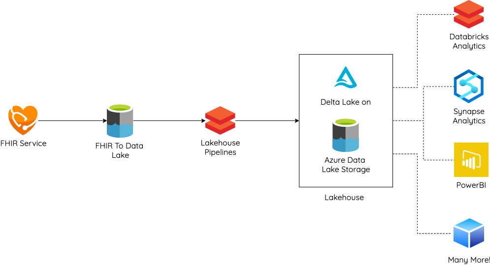
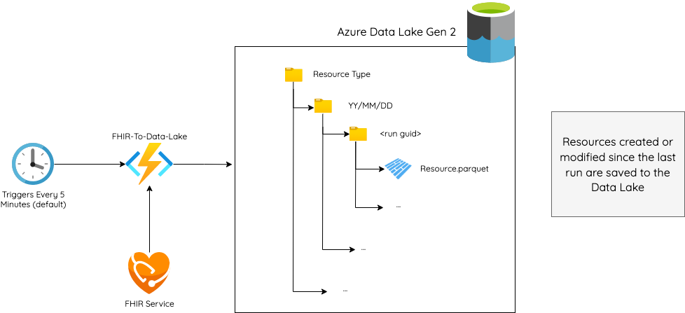
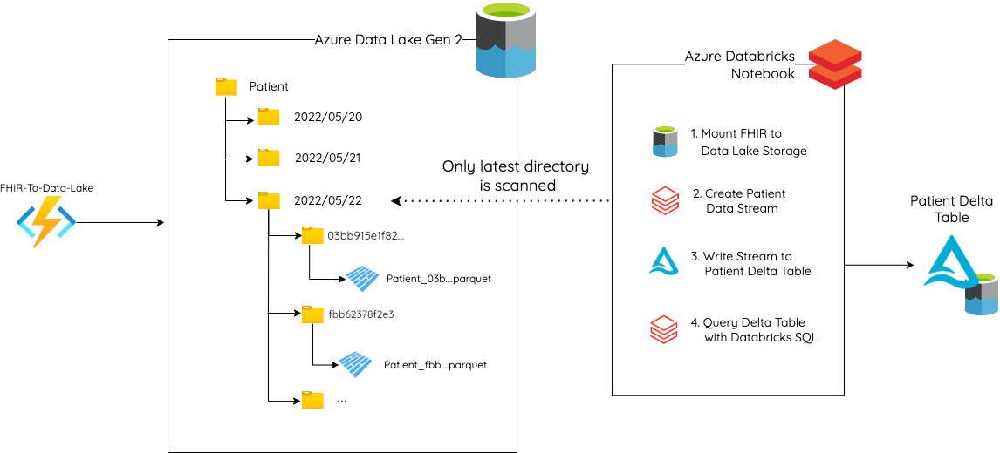
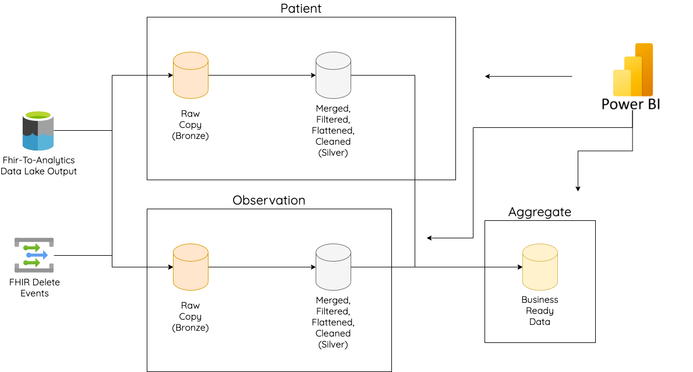
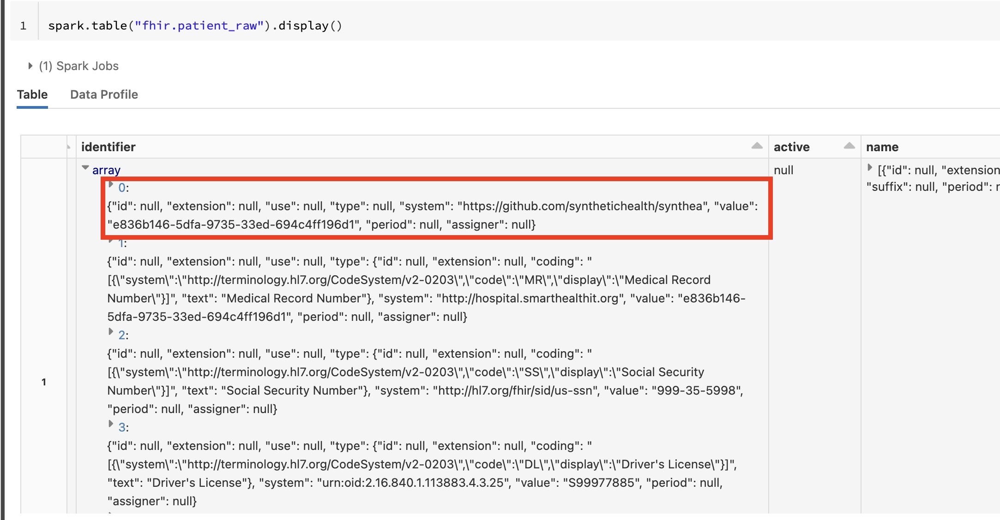

# FHIR Service Databricks Integration with Delta Lake

## Overview

The big data analytics in healthcare market is expected to explode over the next decade, growing 10-20% year over year. Azure Health Data Services mainly targets transactional workloads, so we must acknowledge the growth in the analytics space and make it easy for customers to use the analytical platform of their choice.

Databricks is a popular data analytics platform that runs natively on Azure. To enable analytical workloads, Databricks has shifted focus from data lakes to the ["data lakehouse" paradigm](https://databricks.com/blog/2020/01/30/what-is-a-data-lakehouse.html), which adds features from a traditional data warehouse onto the existing, open data lake model.

Data lakes have been preferred historically for their low cost, flexibility, and openness. However, they often result in data sprawl where reliability, performance, and governance are difficult to achieve. The Data lakehouse approach aims to solve many op these problems by adding a metadata layer on top of the data lake to enable common data warehouse features. The name "lakehouse" itself was taken from data **lake** and data ware**house**.

Delta Lake has emerged as the leading storage framework that enables building a lakehouse architecture on top of existing data lake technologies (like Azure Data Lake Storage or ADLS). It's completely open and runs both on Databricks and Azure Synapse Analytics. It solves common data lake pain points with ACID transactions, unified streaming and batch ingestion, schema and governance, and a unified view for records with a historical view.


## Enabling Delta Lake with FHIR Service

In this proof of concept, we'll be enabling big data analytics from FHIR service using Azure Databricks to setup a lakehouse using Delta Lake on top of Azure Data Lake Storage Gen 2. We'll be leveraging the [FHIR to Data Lake open-source project](https://github.com/microsoft/FHIR-Analytics-Pipelines/tree/main/FhirToDataLake) to continually export data from FHIR service. Then, we'll use Databricks pipelines and other features to easily setup a delta lake lakehouse. This will enable big data analytics by any tool that works with delta lake, like Databricks Analytics, Synapse Analytics and PowerBI.



## Prerequisites

This proof of concept is assuming that you already have the below deployed and available:

- Azure Health Data Services with [FHIR service](https://docs.microsoft.com/azure/healthcare-apis/fhir/get-started-with-fhir).
- Data in your FHIR service and the ability to load more for testing.
  - [Synthea](https://synthetichealth.github.io/synthea/) is a great tool to generate test data.
- [FHIR to Datalake](https://github.com/microsoft/FHIR-Analytics-Pipelines/tree/main/FhirToDataLake) deployed for your FHIR service
- [Azure Databricks Workspace - Premium Tier](https://docs.microsoft.com/azure/databricks/scenarios/quickstart-create-databricks-workspace-portal?tabs=azure-portal)
- Service principal created with read and write access to ADLS.
  - The configuration for this needs to be stored in a Key Vault and linked to your Databricks workspace ([instructions here](https://docs.microsoft.com/azure/databricks/data/data-sources/azure/adls-gen2/azure-datalake-gen2-sp-access)).

## Leveraging FHIR to Data Lake

The open-source FHIR to Data Lake project is an Azure Function that continually exports new and modified FHIR resources in specific time chunks to Azure Data Lake Storage. By default, this function runs every 5 minutes and exports changed data in five minute chunks (or windows). Each export window will only export the latest version of a resource and a single resource will exist in multiple windows as it's changed in the FHIR service. This will result in a data  lake structure that looks like this.



## Testing with a Single Resource

Before setting up our entire lake house, let's first test out delta lake with a single resource type - the Patient. Here we use an interactive Databricks python notebook to mount our input from FHIR to Data Lake, setup a real time transform to a delta table, and finally query the delta lake with SQL.



Please checkout the sample Databricks Notebook linked below to see a step by step process of testing out creating a delta table from FHIR using Auto Loader.

### [Click Here for the Sample Notebook](https://mikaeldevcdn.blob.core.windows.net/public/Creating%20a%20Patient%20Delta%20Table%20with%20Auto%20Loader.html)

## Medallion Architecture

"A medallion architecture is a data design pattern used to logically organize data in a lakehouse, with the goal of incrementally and progressively improving the structure and quality of data as it flows through each layer of the architecture (from Bronze ⇒ Silver ⇒ Gold layer tables). Medallion architectures are sometimes also referred to as "multi-hop" architectures." - [Databricks Glossary](https://databricks.com/glossary/medallion-architecture)


## Creating a Medallion Architecture Lake House with Delta Live Tables

Using the medallion architecture as a guide, we can create an improving quality of tables for data out of FHIR. Most of the work will be in the definition of what constitutes Silver and Gold tables. These will be driven primarily by customer defined needs; a "cleaned" dataset and "business level aggregates" may differ from customer to customer. For example, in FHIR there is an `identifier` array element on a `Patient` resource. A customer may want to extract the element that corresponds to their EMPI (enterprise master patient index) identifier and use that for the main patient identifier for the silver level table. This would require extracting the value from the array where the system matches the EMPI system.



### Silver Logic

For example - the patient identifier is in the below shape in Bronze and will need to be filtered for Silver.



```python
from pyspark.sql import DataFrame, Column
import pyspark.sql.functions as F

system = "https://github.com/synthetichealth/synthea"
patientBronzeDf.withColumn('synthea_patient_identifier', F.filter(F.col('identifier'), lambda x: x['system'] == system)[0]['value'])
```

### Gold Logic

Gold level tables contain enriched business use-case level data, ready for analytics and reporting. This data differs from silver level data as fidelity is often lost in order to achieve these business level aggregates.

### [Click Here for the Sample Notebook](https://mikaeldevcdn.blob.core.windows.net/public/FHIR%20Resources%20Live%20Table%20Pipeline.html)

## Lessons Learned

- Databricks has great tools to make Delta Lake easier
  - Autoloader makes triggering pipelines dead easy
  - Pipeline dependencies are easy to handle
- Hardest parts are transforms of the data
  - Query, Operation on index fields to get common elements

## Opportunities

- Can we templatize some of these notebooks for a "starter pack"
- How do we help customers map data more easily? Samples/common functions in a Python library to extract nested data?

## To-Do

- Modularize code and add a couple tests.
- Test performance of creating Delta from 10,000 records.
- Test performance of streaming to Delta (10,000 records at 50-100 records per second).

## Resources

- [Best Practices for Developing Azure Databricks Notebooks](https://docs.microsoft.com/azure/databricks/notebooks/best-practices)
- [PowerBI and Delta Tables](https://techcommunity.microsoft.com/t5/analytics-on-azure-blog/easier-data-model-management-for-power-bi-using-delta-live/ba-p/3500698)