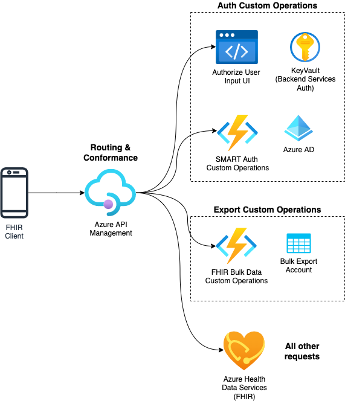

# Azure ONC (g)(10) SMART on FHIR Sample

This sample demonstrates how Azure Health Data Services and Azure Active Directory can be used to pass the Inferno test suite for ONC (g)(10) compliance. While Azure Health Data Services is the core of this sample, some custom behavior is required to fully meet the §170.315(g)(10) Standardized API for patient and population services criteria requirements, mostly around SMART on FHIR authentication. This sample is therefore *not* using only the FHIR Server but other Azure Services with sample code to pass the Inferno tests. You can use this sample as a starting point and reference for building your applications and solutions.

## Sample Deployment

Deployment of this sample requires the creation of supporting Azure services, custom code deployed to Azure Function Apps, and setup in Azure Active Directory. For detailed deployment instructions, check out the [deployment document here](./docs/deployment.md).

This sample is targeted at application developers who are already using Azure Health Data Services or Azure API for FHIR.

You will need an Azure Subscription with Owner privileges and Azure Active Directory Global Administrator privileges.

## Sample Components

The below components are deployed with this sample. At a high level:

- Routing and SMART Conformance is handled with [Azure API Management API Gateway](https://learn.microsoft.com/azure/api-management/api-management-gateways-overview).
- Authorization as defined by the [SMART on FHIR](https://hl7.org/fhir/smart-app-launch/1.0.0/index.html) and [Bulk Data Access](https://hl7.org/fhir/uv/bulkdata/STU1.0.1/authorization/index.html) Implementation Guide are handled by [Azure Active Directory](https://learn.microsoft.com/azure/active-directory/fundamentals/active-directory-whatis) with custom code to enable some specific requirements..
- Bulk Data Export is handled mostly by FHIR Service with some custom code to enable users to access the files they've exported per the Bulk Data Implementation Guide.
  - While FHIR Service supports `$export` operations, Azure does not support accessing the files using the same access token used for FHIR Service.
- All FHIR data operations are handled by [FHIR Service in Azure Health Data Services](https://learn.microsoft.com/azure/healthcare-apis/fhir/overview). Azure API for FHIR would also fit here

For more details of how the pieces work together, check out [the technical guide](./docs/technical-guide.md).

## Sample Support

If you are having issues with the sample, please look at the [troubleshooting document](./docs/troubleshooting.md).

If you have questions about this sample, please submit a Github issue. This sample is custom code you must adapt to your own environment and is not supported outside of Github issues. This sample is targeted towards developers with intermediate Azure experience.