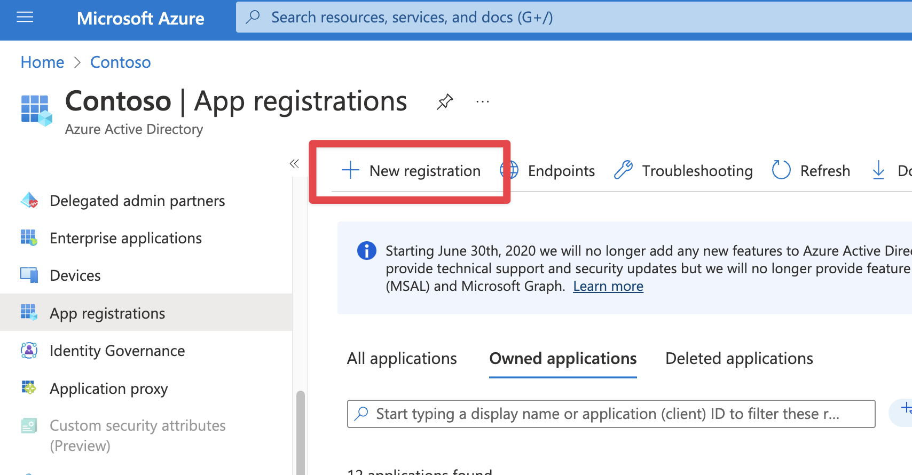
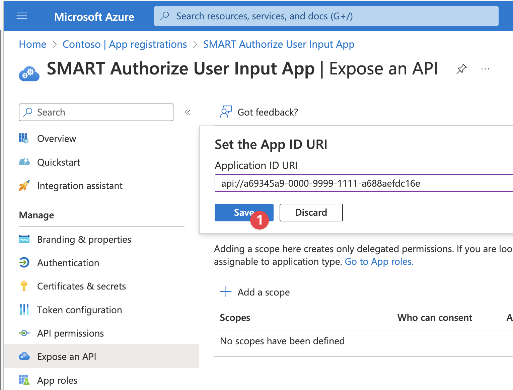

# Auth Context Frontend App Registration

This application registration is used by the Auth Context Frontend Application to enable SMART on FHIR requirements on Azure like session-based scope selection and EHR launch context.

## Deployment (manual)

The Authorize User Input Application is needed to allow users to select which scopes they want to consent to for SMART on FHIR applications. Azure AD does not support session based scoping, so this app handles modifying consent records for the user. We will need to accomplish this in a custom application and this application needs an Application Registration created. As you create this, collect the `Client ID` and `Tenant ID` information which you will need later on.

1. Open Azure Active Directory and create a new Application Registration.
2. Leave the application as a single tenant application. Add a Single-page application (SPA) redirict URI of `http://localhost:3000` (useful for debugging).
3. After registering the application, Under `Token Configuration` add optional claim for Access token type. Select `login_hint` claim and click on Add.
4. Go to `Expose an API` and setup the `user_impersonation` scope on your app.
    * Set the Application ID URI in the default format (`api://<app-id>`). #TODO-FIX THIS. No changes required you just have to save it. Mark down the audience for later/.
      * The URI *has* to be in this format for the sample.
    * Add a new scope with the value `user_impersonation` and click on 'Add Scope'. #TODO fix this.
      * The scope *has* to be called this for the sample.

 

Click to expand and see screenshots.

*Note: In a production scenario, you should create two application registrations here. One for the backend API in Azure API Management and one for the frontend application. See [this documentation for more information](https://learn.microsoft.com/azure/api-management/api-management-howto-protect-backend-with-aad).*