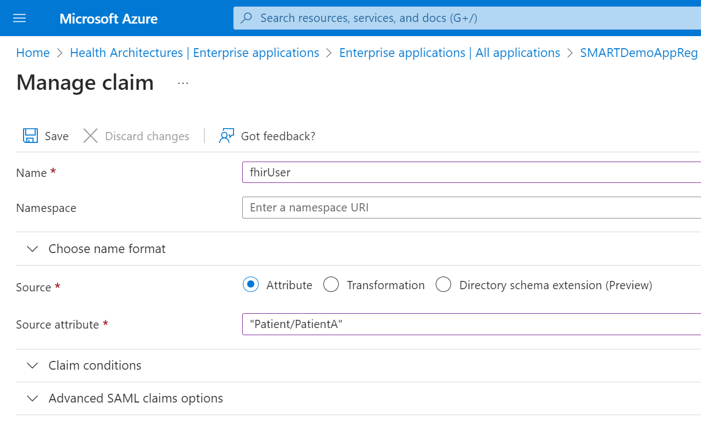

### Patient Standalone Confidential Client Application

The Patient Standalone Launch application is a standard confidential client application which leverages the SMART Scopes exposed by Azure Health Data Services.

- Create a new application in Azure Active Directory. Make sure to select platform (Note : You need one application with platform - Web and SPA respectively) and add the redirect URL for Inferno (`https://inferno.healthit.gov/suites/custom/smart/redirect`).
- In API Permissions for this new application, add the below:
  - Azure Healthcare APIs (Delegated)
    - fhirUser
    - launch
    - patient.AllergyIntolerance.read
    - patient.CarePlan.read
    - patient.CareTeam.read
    - patient.Condition.read
    - patient.Device.read
    - patient.DiagnosticReport.read
    - patient.DocumentReference.read
    - patient.Encounter.read
    - patient.Goal.read
    - patient.Immunization.read
    - patient.Location.read
    - patient.MedicationRequest.read
    - patient.Medication.read
    - patient.Observation.read
    - patient.Organization.read
    - patient.Patient.read
    - patient.Practitioner.read
    - patient.PractitionerRole.read
    - patient.Procedure.read
    - patient.Provenance.read
  - Microsoft Graph (Delegated)
    - openid
    - offline_access

- Generate a secret for this application. Save this and the client id for testing Inferno *1. Standalone Patient App* and *2. Limited Access App*.

 

Click to expand and see screenshots.

### EHR Launch Confidential Client Application

The EHR Launch application is a standard confidential client application which leverages the SMART Scopes exposed by Azure Health Data Services.

- Create a new application in Azure Active Directory. Make sure to select `Web` as the platform and add the redirect URL for Inferno (`https://inferno.healthit.gov/suites/custom/smart/redirect`).
- In API Permissions for this new application, add the below:
  - Azure Healthcare APIs (Delegated)
    - fhirUser
    - launch
    - user.AllergyIntolerance.read
    - user.CarePlan.read
    - user.CareTeam.read
    - user.Condition.read
    - user.Device.read
    - user.DiagnosticReport.read
    - user.DocumentReference.read
    - user.Encounter.read
    - user.Goal.read
    - user.Immunization.read
    - user.Location.read
    - user.MedicationRequest.read
    - user.Medication.read
    - user.Observation.read
    - user.Organization.read
    - user.Patient.read
    - user.Practitioner.read
    - user.PractitionerRole.read
    - user.Procedure.read
    - user.Provenance.read
  - Microsoft Graph (Delegated)
    - openid
    - offline_access

- Generate a secret for this application. Save this and the client id for testing Inferno *3. EHR Practitioner App*.

 

Click to expand and see screenshots.

### SMART fhirUser Custom Claim

> **NOTE:** This example will only create a global fhirUser claim attached to the Confidential Client application registration. For users that reside in Active Directory, you may use [directory extension attributes](https://learn.microsoft.com/en-us/azure/active-directory/develop/active-directory-schema-extensions). If your users do not reside in Active Directory, you can create a [custom claims provider](https://learn.microsoft.com/en-us/azure/active-directory/develop/custom-extension-get-started?tabs=azure-portal) for user-level fhirUser claims.

## Configure Custom Claim

In the Azure Portal under Azure Active Directory, select Enterprise Applications. Search for the Confidential Client application created previously. Next select the **Single Sign-On** option in the left-hand menu and open the **Attributes & Claims** section.

The following steps will assign a static fhirUser custom attribute for the Confidential Client application:

1. In the Azure Portal, on the **Attributes * Claims** section, select **Edit**
2. Click **Add New Claim**
3. Name the claim **fhirUser**
4. Select **Attribute** for Source
5. For Source Attribute, click the dropdown and type in your fhirUser making sure to include the Patient resource prefix. For example: **Patient/PatientA**
6. Click **Save** to add the fhirUser claim

## Modify Application Manifest

For the Application Registration to allow custom claims, the *acceptMappedClaims* value must be set to **true**. To update your application manifest:

1. In the Azure Portal in Azure Active Directory, select **App registrations**
2. Select your App registration from the list
3. Select **Manifest** from the left-hand menu
4. Find *acceptMappedClaims* in the JSON block and change it's value from *null* to **true**, click **Save**

### Backend Service Client Application

Azure Active Directory does not support RSA384 and/or ES384 which is required by the SMART on FHIR implementation guide. In order to provide this capability, custom code is required to validate the JWT assertion and return a bearer token generated for the client with the corresponding client secret in an Azure KeyVault.

1. Create a new application in Azure Active Directory. No platform or redirect URL is needed.
1. Grant this application `FHIR Data Reader` and `FHIR Exporter` role in your FHIR Service. We only support `system/*.read` for now through the `FHIR Data Reader` role.
<!--- In API Permissions for this new application, add the below:
  - Azure Healthcare APIs (Application)
    - system.all.read
1. Grant admin consent for your Application on the API Permission page-->
1. Generate a secret for this application. Save this and the client id.
1. In the resource group that matches your environment, open the KeyVault with the suffix `backkv`.
1. Add a new secret that corresponds to the Application you just generated. 
  - Name: Application ID/Client ID of the application
  - Secret: The secret you generated for the application
  - Tags: Make sure to add the tag `jwks_url` with the backend service JWKS URL. For Inferno testing, this is: https://inferno.healthit.gov/suites/custom/g10_certification/.well-known/jwks.json

1. Save the client id for later testing.

 

Click to expand and see screenshots.

