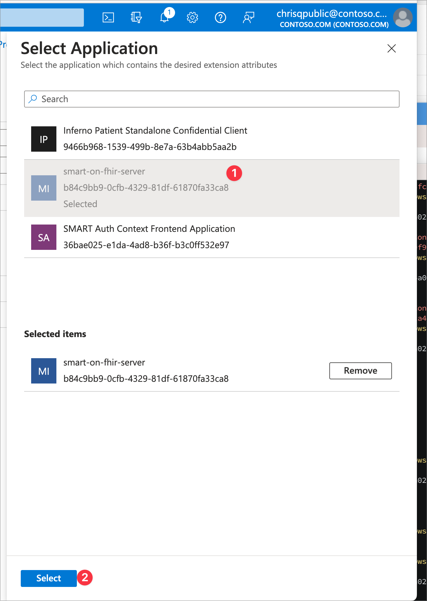
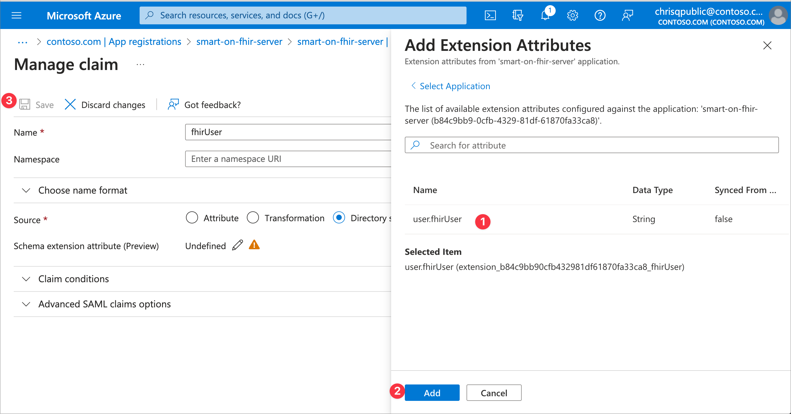
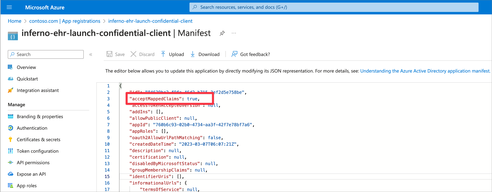

# Set fhirUser Claims Mapping

The fhirUser claim mapping informs the calling application of the user's FHIR id through the identity token and it informs the FHIR Service the user's id through the access token. This claims mapping needs to be setup for the FHIR Resource application *and* each SMART client application that will be getting an identity token and expecting the `fhirUser` claim.

For testing this sample with the Inferno (g)(10) test suite, the `fhirUser` claims mapping needs to be added to:
- FHIR Resource Application
- Inferno Patient Standalone Confidential Client
- Inferno EHR Launch Confidential Client


## Add fhirUser claim to your test users

You will need to add the `fhirUser` claim to each of your test user accounts. For the patient test user, the `fhirUser` needs to be `Patient/PatientA` to collaborate with the sample data. For the practitioner test user, the `fhirUser` needs to be `Practitioner/PractitionerC1`.

Changing an Microsoft Graph directory extensions is done through API requests to Microsoft Graph. You can use the command below to set the `fhirUser` claim via a helper script for your patient test user. You will just need the `object id` of your patient test user. In a production scenario, you would integrate this into your user registration process.

1. Create a Microsoft Graph Directory Extension to hold the `fhirUser` information for users.
    ```bash
    pwsh ./scripts/Add-FhirUserInfoToUser.ps1 -UserObjectId "<Patient Object Id>" -FhirUserValue "Patient/PatientA"
    ```
1. Make sure your test user has the role `FHIR SMART User` assigned to your FHIR Service deployed as part of this sample.
    - This role is what enables the SMART scope logic with your access token scopes in the FHIR Service.


### Configure fhirUser mapping to token

In the Azure Portal under Azure Active Directory, select Enterprise Applications. Search for the target application created previously. You also can find the enterprise application by clicking the `Managed application in local directory` link from the App Registrations page. Once you are in the enterprise application, select the **Single Sign-On** option in the left-hand menu and open the **Attributes & Claims** section.

The following steps will assign a static fhirUser custom attribute for the Confidential Client application:

1. In the Azure Portal, on the **Attributes * Claims** section, select **Edit**
2. Click **Add New Claim**
3. Name the claim **fhirUser**
4. Select **Directory schema extension** for Source
5. Click the edit icon and select your FHIR Resource Application. Choose the `user.fhirUser` attribute.
6. Click **Add** then **Save**.

<br />
<details>
<summary>Click to expand and see screenshots.</summary>
<br />




</details>


### Modify Application Manifest

For the Application Registration to allow custom claims, the *acceptMappedClaims* value must be set to **true**. To update your application manifest:

1. In the Azure Portal in Azure Active Directory, select **App registrations**
2. Select your App registration from the list
3. Select **Manifest** from the left-hand menu
4. Find *acceptMappedClaims* in the JSON block and change it's value from *null* to **true**, click **Save**.

<br />
<details>
<summary>Click to expand and see screenshots.</summary>
<br />

</details>