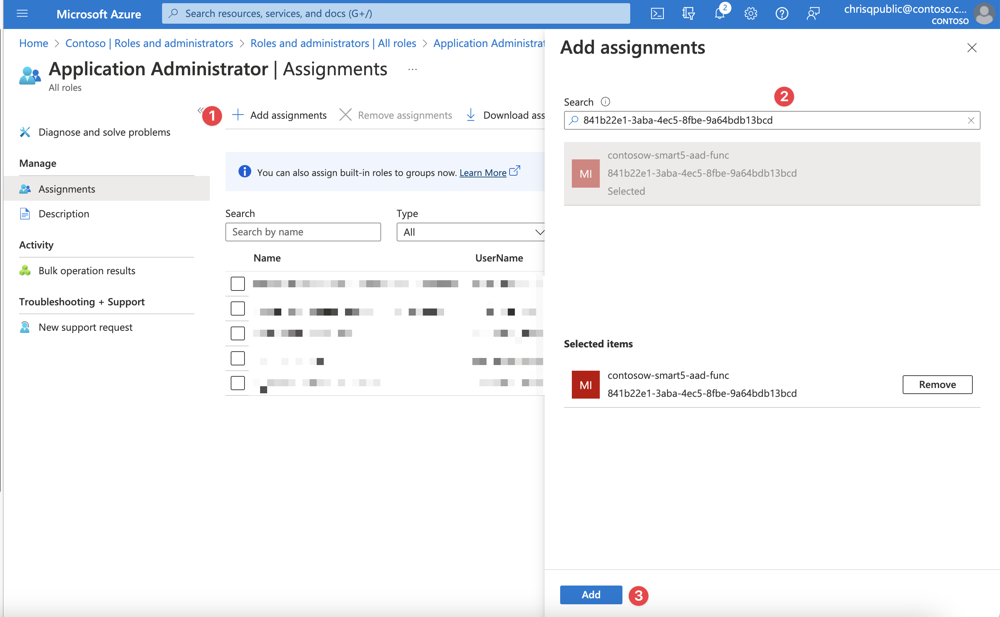
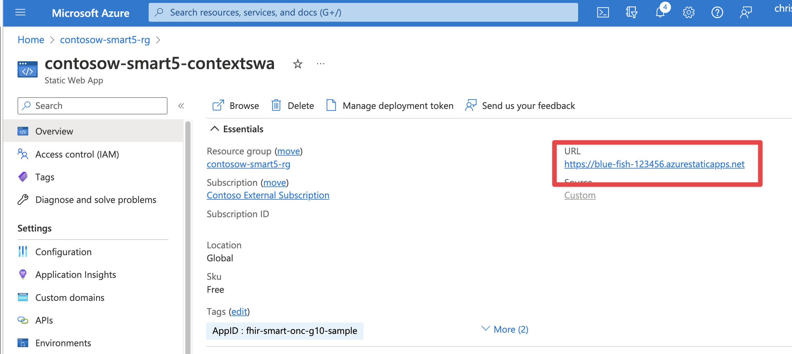
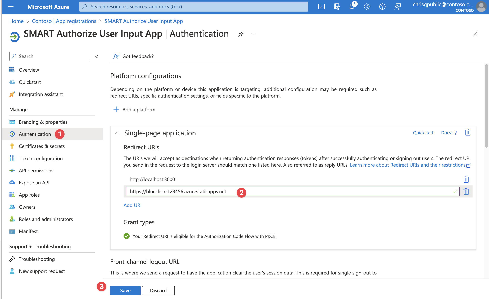

# Sample Deployment: Azure Health Data Services ONC (g)(10) & SMART on FHIR

This document guides you through the steps needed to deploy this sample. This sample deploys Azure components, custom code, and Azure Active Directory configuration.

Note : This sample is not automated and on average will require at least a couple of hours to deploy end to end.

## 1. Prerequisites

In order to deploy this sample, you will need to install some Azure tools, ensure the proper administrator access to an Azure subscription / tenant, and have test user accounts for impersonating the patient and practitioner personas.

Make sure you have the pre-requisites listed below
- **Installation:**
  - [Git](https://git-scm.com/) to access the files in this repository.
  - Azure Developer CLI: Please install this via [the instructions here](https://learn.microsoft.com/azure/developer/azure-developer-cli/install-azd?tabs=baremetal%2Cwindows)
  - [Visual Studio](https://visualstudio.microsoft.com/), [Visual Studio Code](https://code.visualstudio.com/), or another development environment (for changing configuration debugging the sample code).
  - [Node / NPM](https://docs.npmjs.com/downloading-and-installing-node-js-and-npm) for building the frontend application and installing the US Core FHIR Profile.
  - [.NET SDK 6+](https://learn.microsoft.com/dotnet/core/sdk) installed (for building the sample).
  - [PowerShell](https://learn.microsoft.com/powershell/scripting/install/installing-powershell) installed for running scripts (works for Mac and Linux too!)

- **Access:**
  - Access to an Azure Subscription where you can create resources and add role assignments.
  - Elevated access in Azure Active Directory (AD) and Microsoft Graph to create Application Registrations, assign Azure Active Directory roles, and add custom data to user accounts.

- **Test Accounts:**
  - Patient persona test account. Make sure you have the object id of the user.
  - Provider persona test account. Make sure you have the object id of the user.

## 2. Prepare and deploy environment

Next you will need to clone this repository and prepare your environment for deployment by creating two required Azure App Registrations and configuring your environment to use them.

1. Use the terminal or your git client to clone this repo. Open a terminal to the `Patient and Population Services G10` folder.
1. Login with the Azure Developer CLI. Specify the tenant if you have more than one. `azd login` or `azd login --tenant-id <tenant-id>`.
1. Run `azd env new` to create a new deployment environment.
  1. *NOTE:* Environment name will be the prefix for all of your resources.
1. Create the FHIR Resource App Registration. Use the instructions [here](./ad-apps/fhir-resource-app-registration.md). Record the application id and application url for later.
1. Create the Auth Context Frontend App Registration. Use the instructions [here](./ad-apps/auth-context-frontend-app-registration.md). Record the application id and application url for later.
1. Set your deployment environment configuration.
  ```
  azd env set NAME "Your Name"
  azd env set EMAIL "Your Email"
  azd env set FHIR_AUDIENCE "FHIR Resource Application URL (like http://appname.tenant.onmicrosoft.com)"
  azd env set CONTEXT_FRONTEND_APPID "Auth Context Frontend App Application ID"
  ```
1. Finally, deploy your environment by running azd. This command will provision infrastructure and deploy code. It will take about an hour - you can continue the setup below. 
  ```
  azd up
  ```

*NOTE:* This will take about an hour to deploy, mainly for Azure API Management. You can continue with Azure Active Directory setup below.

## 3. Setup Auth Context Frontend Application

### Assign Azure AD Permissions for the Auth Custom Operation API

GRAPH_TOKEN=az account get-access-token --resource-type ms-graph --query accessToken --output tsv

$body = @{
    name = "John Doe"
    email = "johndoe@example.com"
    phone = "555-555-5555"
} | ConvertTo-Json

Invoke-RestMethod -Uri "https://api.example.com/users" -Method Post -Body $body -ContentType "application/json"


As part of the scope selection flow, the Auth Custom Operation Azure Function will modify user permissions for the signed in user. This requires granting the Azure Managed Identity behind Azure Functions Application Administrator (or similar access).

1. Open the Azure Function for the SMART Auth Custom Operations. It will be suffixed by `aad-func`. Copy the Managed Identity for the next steps.
1. Open Azure Active Directory and navigate to `Roles and Administrators`. Open the `Application Administrator` role.
1. Add the Azure Function Managed Identity to this AAD role.

<br />
<details>
<summary>Click to expand and see screenshots.</summary>



</details>

### Set the Auth User Input Redirect URL

1. Open the resource group created by step 3. Find the Azure Static Web App
1. Copy the URL for the static web app.
1. Open your Application Registration for the Auth User Input App from step 2. Add the Static Web App URL as a new redirect URI.

<br />
<details>
<summary>Click to expand and see screenshots.</summary>



</details>

## 4. Create Inferno Test Applications in Azure Active Directory

We will need to create four separate Azure AD Applications to run the Inferno (g)(10) test suite. It's best practice to register an Azure Application for each client application that will need to access your FHIR Service. This will allow for granular control of data access per application for the tenant administrator and the users. For more information about best practices for Azure aD applications, [read this](https://learn.microsoft.com/azure/active-directory/develop/security-best-practices-for-app-registration).

Follow the directions on the [Inferno Test App Registration Page](./ad-apps/inferno-test-app-registration.md) for instructions on registering the needed Azure Applications for the Inferno (g)(10) tests.
- Standalone Patient App (Confidential Client)
- EHR Practitioner App (Confidential Client)
- Backend Service Client
- Standalone Patient App (Public Client)


## 5. Add sample data and US Core resources

To successfully run the Inferno ONC (g)(10) test suite, both the US Core FHIR package and applicable data need to be loaded. 

To quickly load the needed data to your FHIR Service, execute this script:

```bash
pwsh ./scripts/Load-ProfilesData.ps1
```

To learn more about the sample data, read [sample data](./sample-data.md).