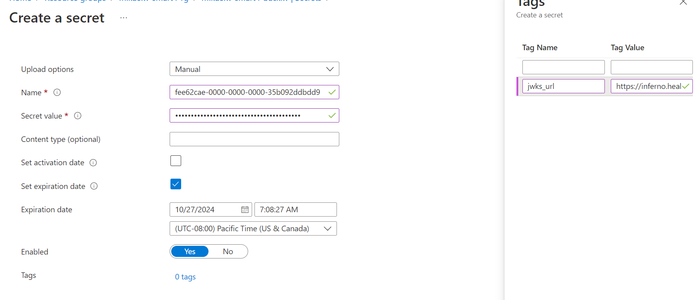

# Sample Deployment: Azure ONC (g)(10) & SMART on FHIR Sample

This document will guide you through the steps needed for deploying this sample. Since this sample is a combination of several Azure components, custom code, and Azure Active Directory configuration, it is not all automated and will require at least a couple of hours.

## 1. Prerequisites

Before deploying this sample, you will need to install some Azure tools **and** ensure you have administrator access to an Azure subscription / tenant.

- Make sure you have the pre-requisites applications installed on your computer.
  - Azure CLI: Please install this via [the instructions here](https://learn.microsoft.com/cli/azure/install-azure-cli)
  - Azure Developer CLI: Please install this via [the instructions here](https://learn.microsoft.com/azure/developer/azure-developer-cli/install-azd?tabs=baremetal%2Cwindows)
  - Visual Studio or Visual Studio Code (for debugging the sample code).
  - NPM (for debugging sample).
- .NET SDK installed (the version specified in [global.json](../../../global.json) (for building the sample).
- Access to an Azure Subscription where you can create resources and add role assignments.
- Elevated access in Azure Active Directory to create Application Registrations and assign Azure Active Directory roles.

## 2. Create Azure AD Application for Scope Selection

The Authorize User Input Application is needed to allow users to select which scopes they want to consent to for SMART on FHIR applications. Azure AD does not support session based scoping, so this app handles modifying consent records for the user. We will need to accomplish this in a custom application and this application needs an Application Registration created. As you create this, collect the `Client ID` and `Tenant ID` information which you will need later on.

1. Open Azure Active Directory and create a new Application Registration.
2. Leave the application as a single tenant application. Add a Single-page application (SPA) redirict URI of `http://localhost:3000` (useful for debugging).
3. After registering the application, Under `Token Configuration` add optional claim for Access token type. Select `login_hint` claim and click on Add.
4. Go to `Expose an API` and setup the `user_impersonation` scope on your app.
    * Set the Application ID URI in the default format (`api://<app-id>`).
      * The URI *has* to be in this format for the sample.
    * Add a new scope with the value `user_impersonation` and click on 'Add Scope'.
      * The scope *has* to be called this for the sample.

<br />
<details>
<summary>Click to expand and see screenshots.</summary>


</details>

*Note: In a production scenario, you should create two application registrations here. One for the backend API in Azure API Management and one for the frontend application. See [this documentation for more information](https://learn.microsoft.com/azure/api-management/api-management-howto-protect-backend-with-aad).*

## 3. Deploy Sample

This sample uses the [Azure Developer CLI](https://learn.microsoft.com/azure/developer/azure-developer-cli/overview) for deployment. This allows for easy deployment of both infrastructure and code at the same time.

Before deployment, lets look at the configuration needed to deploying this sample. All below assumes `samples/Patient and Population Services G10` as the working directory.

- Open `main.pramaters.json` inside of the `infra` folder and fill out the following parameters:
  - `apimPublisherName`: Sample owner name.
  - `apimPublisherEmail`: Sample owner email address.
  - `contextAadApplicationId`: Client ID from step 2.
- Open a terminal to the samples directory (`samples/Patient and Population Services G10`).
- Login with the Azure CLI. Specify the tenant if you have more than one.
  - `az login` or `az login -t <tenant-id>`.
- Run the `azd up` command from this directory. Enter:
  - Environment Name: Prefix for the resource group that will be created to hold all Azure resources ([see more details](https://learn.microsoft.com/azure/developer/azure-developer-cli/faq#what-is-an-environment-name)). Must be all lowercase.
    - You can always create a new environment with `azd env new`.
  - Azure Location: The Azure location where your resources will be deployed.
  - Azure Subscription: The Azure location where your resources will be deployed.

*NOTE:* This will take about an hour to deploy, mainly for Azure API Management. You can continue with Azure Active Directory setup below.

## 4. Setup Auth User Input Application

### Assign Azure AD Permissions for the Auth Custom Operation API

As part of the scope selection flow, the Auth Custom Operation Azure Function will modify user permissions for the signed in user. This requires granting the Azure Managed Identity behind Azure Functions Application Administrator (or similar access).

1. Open the Azure Function for the SMART Auth Custom Operations. It will be suffixed by `aad-func`. Copy the Managed Identity for the next steps.
1. Open Azure Active Directory and navigate to `Roles and Administrators`. Open the `Application Administrator` role.
1. Add the Azure Function Managed Identity to this AAD role.

<br />
<details>
<summary>Click to expand and see screenshots.</summary>


</details>

### Set the Auth User Input Redirect URL

1. Open the resource group created by step 3. Find the Azure Static Web App
1. Copy the URL for the static web app.
1. Open your Application Registration for the Auth User Input App from step 2. Add the Static Web App URL as a new redirect URI.

<br />
<details>
<summary>Click to expand and see screenshots.</summary>


</details>

## 5. Create Inferno Test Applications in Azure Active Directory

It's best practice to register an Application Registration in Azure AD for each client application that will need to access your FHIR Service. This will allow for granular control of data access per application for the tenant administrator and the users.

### Patient Standalone Confidential Client Application

The Patient Standalone Launch application is a standard confidential client application which leverages the SMART Scopes exposed by Azure Health Data Services.

- Create a new application in Azure Active Directory. Make sure to select `Web` as the platform and add the redirect URL for Inferno (`https://inferno.healthit.gov/suites/custom/smart/redirect`).
- In API Permissions for this new application, add the below:
  - Azure Healthcare APIs (Delegated)
    - fhirUser
    - launch
    - patient.AllergyIntolerance.read
    - patient.CarePlan.read
    - patient.CareTeam.read
    - patient.Condition.read
    - patient.Device.read
    - patient.DiagnosticReport.read
    - patient.DocumentReference.read
    - patient.Encounter.read
    - patient.Goal.read
    - patient.Immunization.read
    - patient.Location.read
    - patient.MedicationRequest.read
    - patient.Medication.read
    - patient.Observation.read
    - patient.Organization.read
    - patient.Patient.read
    - patient.Practitioner.read
    - patient.PractitionerRole.read
    - patient.Procedure.read
    - patient.Provenance.read
  - Microsoft Graph (Delegated)
    - openid
    - offline_access

- Generate a secret for this application. Save this and the client id for testing Inferno *1. Standalone Patient App* and *2. Limited Access App*.

<br />
<details>
<summary>Click to expand and see screenshots.</summary>


</details>

### EHR Launch Confidential Client Application

The EHR Launch application is a standard confidential client application which leverages the SMART Scopes exposed by Azure Health Data Services.

- Create a new application in Azure Active Directory. Make sure to select `Web` as the platform and add the redirect URL for Inferno (`https://inferno.healthit.gov/suites/custom/smart/redirect`).
- In API Permissions for this new application, add the below:
  - Azure Healthcare APIs (Delegated)
    - fhirUser
    - launch
    - user.AllergyIntolerance.read
    - user.CarePlan.read
    - user.CareTeam.read
    - user.Condition.read
    - user.Device.read
    - user.DiagnosticReport.read
    - user.DocumentReference.read
    - user.Encounter.read
    - user.Goal.read
    - user.Immunization.read
    - user.Location.read
    - user.MedicationRequest.read
    - user.Medication.read
    - user.Observation.read
    - user.Organization.read
    - user.Patient.read
    - user.Practitioner.read
    - user.PractitionerRole.read
    - user.Procedure.read
    - user.Provenance.read
  - Microsoft Graph (Delegated)
    - openid
    - offline_access

- Generate a secret for this application. Save this and the client id for testing Inferno *3. EHR Practitioner App*.

<br />
<details>
<summary>Click to expand and see screenshots.</summary>


</details>

#### SMART FHIRUser Custom Claim

#### Prerequisites

You must have rights to administer claims policy in your Azure Active Directory Tenant and read/write permissions for user profiles in order to proceed.

- Launch Powershell with Administrator privileges
- [Install Azure Active Directory PowerShell for Graph Preview](https://learn.microsoft.com/en-us/powershell/azure/active-directory/install-adv2?view=azureadps-2.0)
- [Install Microsoft Graph PowerShell SDK](https://learn.microsoft.com/en-us/powershell/microsoftgraph/installation?view=graph-powershell-1.0)
- Create the custom claim fhirUser for the OAuth id_token by using the onPremisesExtensionAttribute to store the mapping. This example will use onPremisesExtensionAttribute extensionAttribute1 to store the FHIR resource Id of the user. Run the `Set-AADClaimsPolicy.ps1` script in the [scripts](./scripts) folder.

```powershell
.\Set-AADClaimsPolicy.ps1 -TenantId xxxxxxxx-xxxx-xxxx-xxxx -ExtensionAttributeName extensionAttribute1

```

- In the PowerShell terminal run `Get-AzureADPolicy -All:$true1` to verify that the new claims policy was  created. Copy the Id of the newly created claims policy.

```powershell
Get-AzADServicePrincipal -DisplayName Name-of-your-app-registration
```

- Get the `ObjectId` of the enterprise application of your Azure App Registration you created in Section 3 above.

- Associate your Custom Claim with an Azure App Registration using the App Registration Principal Id and Claims Policy Object Id.

```powershell
Add-AzureADServicePrincipalPolicy -Id Enterprise Application Object Id -RefObjectId Claims Policy ObjectId
```

- To assign a FHIR patient to an Azure AD User custom claim. Run the following in a PowerShell terminal replacing Your-Tenant-Id with your actual Azure TenantId. The ExtensionAttributeName used (eg: extensionAttribute1), and the fhirID of the patient that this policy will apply to.

```powershell
Import-Module Microsoft.Graph.Users

Select-MgProfile -Name "beta"

$scopes = @(
"User.ReadWrite.All"
"Directory.ReadWrite.All"
)

Connect-MgGraph -TenantId Your-Tenant-Id -ContextScope Process -Scopes $scopes

$params = @{
  OnPremisesExtensionAttributes = @{
    Your-Extension-Attribute-Name = "selected-patient-fhir-id"
  }
}

Update-MgUser -UserId Your-Enterprise-Application-ObjectId -BodyParameter $params
```

### Backend Service Client Application

Azure Active Directory does not support RSA384 and/or ES384 which is required by the SMART on FHIR implementation guide. In order to provide this capability, custom code is required to validate the JWT assertion and return a bearer token generated for the client with the corresponding client secret in an Azure KeyVault.

- Create a new application in Azure Active Directory. No platform or redirect URL is needed.
- Grant this application `FHIR Data Reader` and `FHIR Exporter` role in your FHIR Service. We only support `system/*.read` for now through the `FHIR Data Reader` role.
<!--- In API Permissions for this new application, add the below:
  - Azure Healthcare APIs (Application)
    - system.all.read
- Grant admin consent for your Application on the API Permission page-->
- Generate a secret for this application. Save this and the client id.
- In the resource group that matches your environment, open the KeyVault with the suffix `backkv`.
- Add a new secret that corresponds to the Application you just generated. 
  - Name: Application ID/Client ID of the application
  - Secret: The secret you generated for the application
  - Tags: Make sure to add the tag `jwks_url` with the backend service JWKS URL. For Inferno testing, this is: https://inferno.healthit.gov/suites/custom/g10_certification/.well-known/jwks.json

- Save the client id for later testing.

<br />
<details>
<summary>Click to expand and see screenshots.</summary>





</details>

## 6. Add sample data and profiles

In order to test this sample, you will need to load sample data and profiles. Inferno requires the loading of US Core and some sample data with conforming data. Your FHIR Service will need to have compliant data to pass the compliance test.

For more information on loading profiles, check out the [FHIR Loader Tool for US Core](https://github.com/microsoft/fhir-loader/blob/fhir-loader-cli/src/FhirLoader.Tool/uscore_README.md)

We have created some sample data that can be deployed. Check out [this directory](../../../docs/rest/Inferno/).

Or to quickly load data for testing, you can use [this script](../scripts/Load-ProfilesData.ps1) with some modification.
