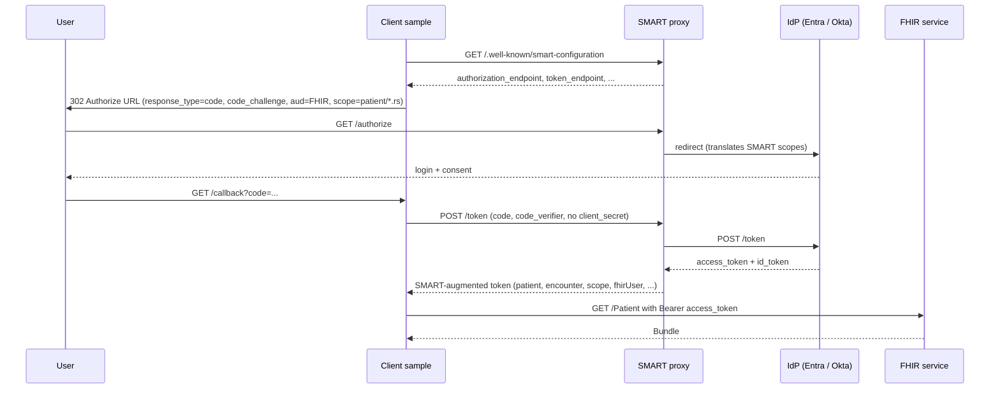
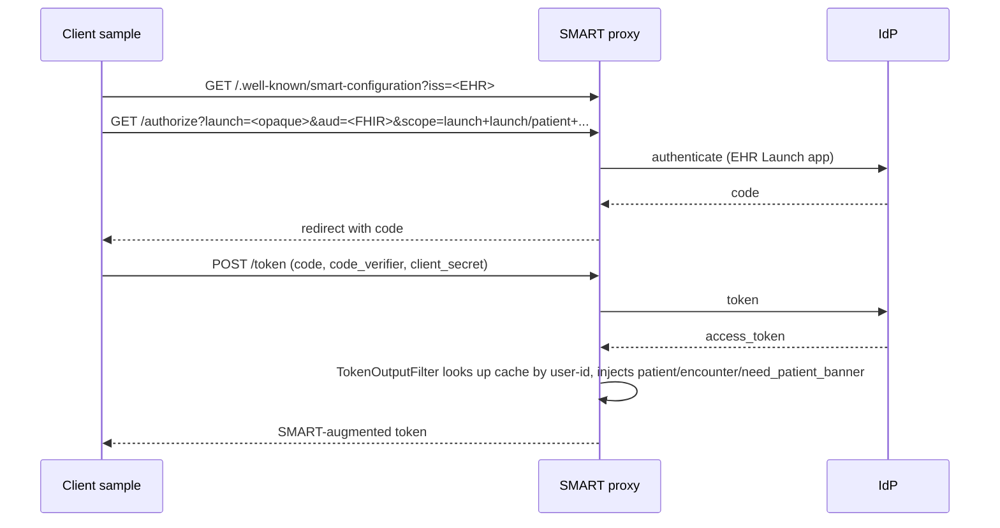
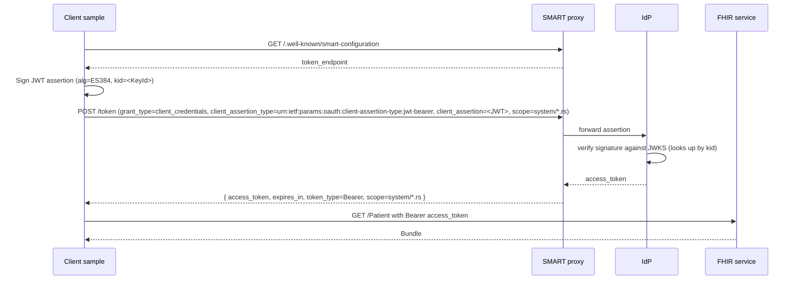

# Flows — what each launch does, end to end

The dashboard at `https://localhost:53361` exposes four SMART on FHIR v2 launches. This page walks through what happens on the wire for each one, what claims you should see in the resulting token, and how to make a first FHIR call.

All four flows discover endpoints from the proxy's `.well-known/smart-configuration` (served at `<SmartOnFhir:FhirBaseUrl>/.well-known/smart-configuration`), so there are no IdP-specific URLs in [`appsettings.json`](../SMART-Native-Standalone-EHR-Launch/appsettings.json) or in the source.

---

## Standalone — Public

PKCE-only authorization-code flow. Suitable for SPAs and other public clients that cannot keep a secret.



Click sequence on the dashboard:

1. Choose **Standalone — Public**.
2. Tick the scopes you want (`patient/Patient.rs`, `patient/Observation.rs`, …).
3. Click **Launch**.
4. Authenticate. After the redirect the dashboard shows the parsed token.
5. Use the **Resource** dropdown to issue your first FHIR call.

Expected token claims (after parsing the access token):

| Claim | Value |
|---|---|
| `aud` | Your FHIR service URL (`SmartOnFhir:FhirAudience`) |
| `scope` | What you requested, possibly narrowed by consent |
| `fhirUser` | URL of the linked Practitioner/Patient resource (if your IdP setup includes the `fhirUser` claim mapping) |
| `sub` (Okta) / `oid` (Entra) | Stable user id |

---

## Standalone — Confidential

Same flow as Public, but the token request includes `client_secret`. The dashboard sends it server-side via [`AuthService.ExchangeCodeForTokenAsync`](../SMART-Native-Standalone-EHR-Launch/Services/AuthService.cs) when `useClientSecret=true` is passed by [`SmartController`](../SMART-Native-Standalone-EHR-Launch/Controllers/SmartController.cs).

Use this when:

- Your client is server-side (not a browser).
- Your IdP enforces client authentication on the token endpoint for the given app type.

Click sequence is identical to Public; the difference is purely in [`appsettings.json`](../SMART-Native-Standalone-EHR-Launch/appsettings.json) (`SmartOnFhir:ClientSecret` is set) and the chosen launch button.

---

## EHR Launch

Two-step flow: **first** the simulator authenticates the EHR user and pushes patient/encounter context to the proxy, **then** the standard SMART EHR-launch is started with an opaque `launch=` token.

### Step 1 — Login as EHR User (`/usercontext/login`)

A plain OIDC `authorization_code` flow against the **User Context** app registration:

- Scope is **only** `openid`.
- No `aud` parameter; this token never reaches the FHIR service.
- After login, the resulting `access_token` (Okta) or `id_token` (Entra) is stashed in session.

### Step 2 — Cache & Launch EHR (`/ehr-context-launch`)

The dashboard form posts:

| Field | Notes |
|---|---|
| `iss` | Pre-filled from `SmartOnFhir:EhrIssDefault`. The FHIR base URL the EHR is announcing. |
| `patientId` | Required. |
| `encounterId` | Optional. |
| `scope` | Selected from the SMART scopes checkbox grid. |

The controller:

1. Reads the user-id claim from the cached User Context token. The claim used depends on `SmartOnFhir:IdpType`:
   - `EntraId` → `oid` from the cached `id_token`
   - `ExternalIdp` → `sub` from the cached `access_token`
2. POSTs `{patient, encounter}` plus the user id to `SmartOnFhir:ContextCacheUrl`. The proxy stores it keyed by user id and returns an opaque `launch` value.
3. Clears the User Context tokens so the next browser leg forces a fresh sign-in (the EHR-launch authentication uses the **EHR Launch** app registration, not the User Context one).
4. 302s the browser to `/login?launchType=ehr&iss=...&launch=...&scope=...`.

From there the flow merges back into the standard SMART authorization-code with PKCE:



Expected SMART-augmented token response on the dashboard:

```json
{
  "access_token": "...",
  "scope": "launch launch/patient patient/Patient.rs ...",
  "patient": "<patientId you posted in step 2>",
  "encounter": "<encounterId>",
  "need_patient_banner": true,
  "smart_style_url": "..."
}
```

> [!IMPORTANT]
> If you see `Could not find launch context for user`, the user-id claim used by the client and the proxy disagree. Check `SmartOnFhir:IdpType` against the matching setting on the proxy. See [troubleshooting.md](troubleshooting.md).

---

## Backend Services (M2M)

No browser, no user. The server signs an ES384 JWT assertion with the private key in `keys/es384_private.pem` and exchanges it for an access token via `client_credentials` + `private_key_jwt`.



Click sequence:

1. Choose **Backend Services**.
2. Click **Launch**. (No login — the request is server-to-server.)
3. The dashboard shows the M2M token response.
4. Use the **Backend Resource** dropdown to fetch system-level FHIR resources.

The token client lives in the [`SmartBackendServices.TokenClient`](../SmartBackendServices.TokenClient/SmartBackendTokenClient.cs) library — `SmartBackendTokenClient.RequestAccessTokenFromPemFileAtEndpointAsync` is the entry point used by [`BackendTokenService`](../SMART-Native-Standalone-EHR-Launch/Services/BackendTokenService.cs). It is IdP-agnostic: you supply the token endpoint discovered from SMART metadata.

For key generation, see [generate-es384-key.md](generate-es384-key.md).

---

## First FHIR call

After any of the four flows produce an access token, the dashboard's **Resource** picker calls the FHIR service via [`FhirService`](../SMART-Native-Standalone-EHR-Launch/Services/FhirService.cs) with `Authorization: Bearer <access_token>`.

Examples (with corresponding scopes):

| Resource | Patient-context scope | System scope |
|---|---|---|
| `GET /Patient` | `patient/Patient.rs` | `system/Patient.rs` |
| `GET /Observation` | `patient/Observation.rs` | `system/Observation.rs` |
| `GET /Condition` | `patient/Condition.rs` | `system/Condition.rs` |
| `GET /CarePlan` | `patient/CarePlan.rs` | `system/CarePlan.rs` |
| `GET /AllergyIntolerance` | `patient/AllergyIntolerance.rs` | `system/AllergyIntolerance.rs` |
| `GET /MedicationRequest` | `patient/MedicationRequest.rs` | `system/MedicationRequest.rs` |
| `GET /Immunization` | `patient/Immunization.rs` | `system/Immunization.rs` |
| `GET /Procedure` | `patient/Procedure.rs` | `system/Procedure.rs` |
| `GET /Encounter` | `patient/Encounter.rs` | `system/Encounter.rs` |
| `GET /DiagnosticReport` | `patient/DiagnosticReport.rs` | `system/DiagnosticReport.rs` |

If a call returns **401**, see [troubleshooting.md](troubleshooting.md).

---

[Back to the main README](../README.md) · [Configuration reference](configuration.md)
