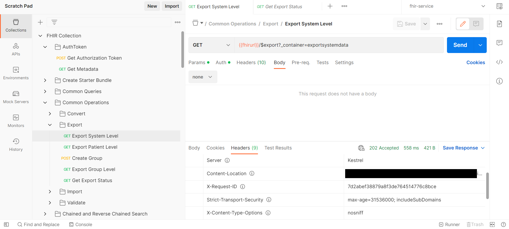
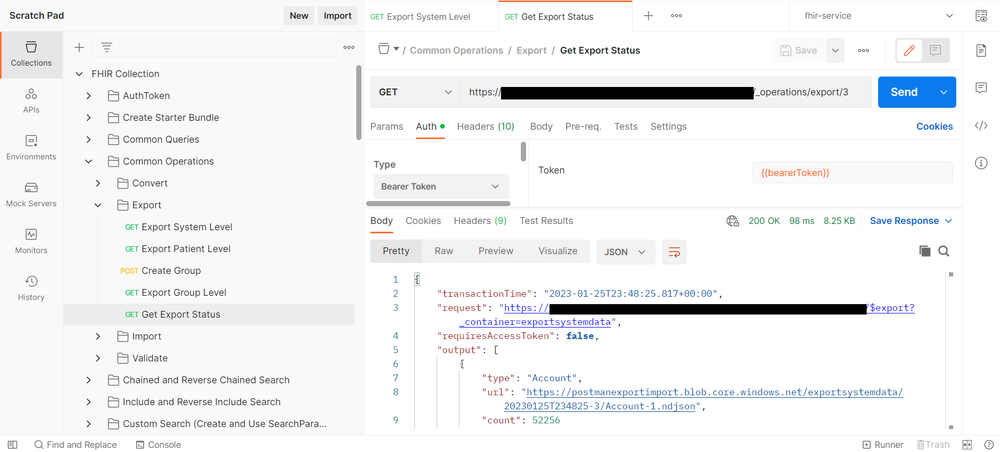
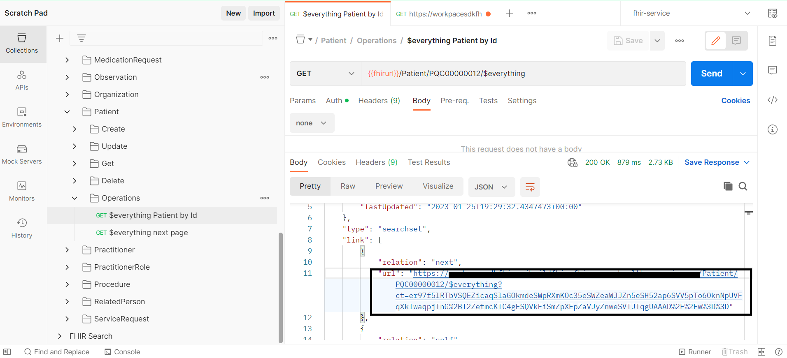
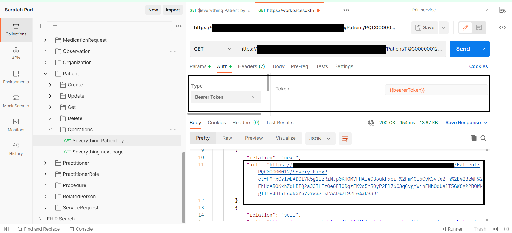

# Postman collection of FHIR queries 

This sample includes postman collection of FHIR queries which would be helpful to build better understanding for querying/accessing FHIR service to perfom CRUD requests for FHIR resources, Operations supported my Microsoft FHIR and various options of seraching resources using postman.

We assume that you already have knowledge of using postman to access FHIR service. If you are new to using postman to access FHIR service, we reccommend that you come back here after following below learning path:
- [Access the Azure Health Data Services FHIR service using Postman | Microsoft Learn](https://learn.microsoft.com/en-us/azure/healthcare-apis/fhir/use-postman)

## Prerequisites
+ **Prerequisites** are same as in the above mentioned learning path, If you have done those setups, you are good to go ahead.


## Collection Details
The queries in this collection are categorised into folders as below:
- `AuthToken` - Request to create an authentication token which is used in all other queries.
- `Create Starter Bundle` -Here we create a multiple resources in one bundle, these resources would be used in queries further.
- `Common Queries` - This folder has set of frequently used queries.
- `Common Operations` - This folder has queries for FHIR operations like convert, valicate, export and import.
- `Chained and Reverse Chained Search` - This folder has queries to use chaining and reverse chaining for fetching resources based on related(referenced) resources, more details about chaining could be found [here](https://learn.microsoft.com/en-us/azure/healthcare-apis/fhir/overview-of-search#chained--reverse-chained-searching).
- `Include and Reverse Include Search` - This folder has queries with _include and _revinclude parameters, We can fetch multiple related resources in result, more details about [here](https://www.hl7.org/fhir/search.html#return).
- `Custom Search (Create and Use custom SearchParameter)`  - This folder has queries related to custom search, here we create new SearchParameter, run reindex and use the newly created SearchParameter. More details about custom search could be found [here](https://learn.microsoft.com/en-us/azure/healthcare-apis/azure-api-for-fhir/how-to-do-custom-search).
- List of alphabetically sorted, resource specific folders for resource specific queries for CRUD operations.


 

## Getting started
To set up Postman for testing FHIR service, we'll walk through these steps:

**Step 1:** Import environment template and collection files into Postman  
**Step 2:** Enter parameter values for the Postman environment  
**Step 3:** Get an authorization token from AAD  
**Step 4:** Test FHIR service with Postman  

## Step 1 - Import environment and collection files into Postman

1. Access the Postman environment template for FHIR service [here](./fhir-service.postman_environment.json). Save the file locally (click on **Raw** and then do a **Save as** from your browser). 

2. In Postman, create a new [Workspace](https://www.postman.com/product/workspaces/) (or select an existing one if already created).

3. Find the **Environments** tab on the left and click the **Import** button next to the workspace name. 


4. Import the ```fhir-service.postman_environment.json``` file that you just saved locally.
    + Add the file to Postman using the **Upload Files** button. Then click **Import**. 


5. Now, access the ```FHIR Collection.postman-collection.json``` file available in this repo [here](./FHIR-Collection.postman_collection.json) and save the file locally. Then import the file into Postman.
    + Add the file to Postman using the **Upload Files** button. Then click **Import**. 


## Step 2 - Configure Postman environment
Now you will configure your Postman environment (`fhir-service`). 

1. For the `fhir-service` Postman environment, you will need to retrieve the following values: 

- `tenantId` - AAD tenant ID (go to **AAD** -> **Overview** -> **Tenant ID**)
- `clientId` - Application (client) ID for Postman service client app (go to **AAD** -> **App registrations** -> `<postman-service-client-name>` -> **Overview** -> **Application (client) ID**) 
- `clientSecret` - Client secret stored for Postman (see Step 1 #7 above) 
- `fhirurl` - FHIR service endpoint - e.g. `https://<workspace-name>-<fhir-service-name>.fhir.azurehealthcareapis.com` (go to **Resource Group** -> **Overview** -> `<fhir-service-name>` -> **FHIR metadata endpoint** and copy *without* "/metadata" on the end)
- `resource` - FHIR service endpoint - (**same as `fhirurl`**) e.g. `https://<workspace-name>-<fhir-service-name>.fhir.azurehealthcareapis.com` 

Populate the above parameter values in your `fhir-service` Postman environment as shown below. Input the values in the **CURRENT VALUE** column. Leave `bearerToken` blank. Make sure to click **Save** to retain the `fhir-service` environment values.  


## Step 3 - Get an access token from AAD
To obtain an access token from AAD via Postman, you can send a ```POST Get Authorization Token``` request. The ```POST Get Authorization Token``` call comes pre-configured as part of the `FHIR Collection` collection that you imported earlier. 

In Postman, click on **Collections** on the left, select the `FHIR Collection` collection, and then select `POST Get Authorization Token`. Press **Send** on the right.

__IMPORTANT:__ Be sure to make the `fhir-service` environment active by selecting from the dropdown menu above the **Send** button. In the image below, `fhir-service` is shown as the active environment.


On clicking **Send**, you should receive a response in the **Body** tab like shown below. The `access_token` value is automatically saved to the ```bearerToken``` variable in the Postman environment. 

```
{
    "token_type": "Bearer",
    "expires_in": "3599",
    "ext_expires_in": "3599",
    "expires_on": "XXXXXXXXXX",
    "not_before": "XXXXXXXXXX",
    "resource": "XXXXXXX-XXXX-XXXX-XXXX-XXXXXXXXXXXX",
    "access_token": "XXXXXXXXXXXX..."
}
```

You now have a valid access token in your Postman environment and can use the token in subsequent API calls to your FHIR service. For more information about access tokens in AAD, see [Microsoft identity platform access tokens](https://docs.microsoft.com/en-us/azure/active-directory/develop/access-tokens).

__Note:__ Access tokens expire after 60 minutes. To obtain a token refresh, simply make another ```POST Get Authorization Token``` call and you will receive a new token valid for another 60 minutes.

## Step 4 - Query FHIR service with Postman 

1. Try `GET List All Patients` under `Common Queries` folder in the `FHIR Collection` collection and press **Send**. If the response is as shown below, this means you successfully obtained a list of all `Patient` resources stored in the FHIR service database. This means your setup is functional.


2. Now we will create a bunch of resources by posting a bundle to FHIR service. Click on "POST Create Resources Bundle (Multiple resources)" in `FHIR Collection` and press **Send**. If The response is as shown below, this means you successfully created multiple resources included in a bundle.
This bundle contains `Patient`, `Practitioner`, `Organization`, `Location`, `PractitionerRole`, `Encounter`, `Observation`, `Condition`, `Procedure`, `Group`, `Device`, `RelatedPerson` and `ServiceRequest`. These resources would be used as references for creating other resources which depend on them. The environment variables for Ids of these resources will be updates.


3. In `FHIR Collection`, folder `Chained and Reverse Chained Search` Contains queries which search resources using chained and reverse chained search. More details are available [here](https://learn.microsoft.com/en-us/azure/healthcare-apis/fhir/overview-of-search#chained--reverse-chained-searching).

4. In `FHIR Collection`, folder `Include and Reverse Include Search` Contains queries which search resources using include and reverse include. More details are available [here](https://learn.microsoft.com/en-us/azure/healthcare-apis/fhir/overview-of-search#search-parameters) and in section `3.1.1.5.4 Including other resources in result` [here](https://www.hl7.org/fhir/search.html).

5. In `FHIR Collection`, folder `Common Operations` Contains folders for queries of operations as detailed below:  
- [validate](https://learn.microsoft.com/en-us/azure/healthcare-apis/fhir/validation-against-profiles), Make sure the profiles are loaded into fhir service for validation, more details [here](https://learn.microsoft.com/en-us/azure/healthcare-apis/fhir/store-profiles-in-fhir)
    - In collection, we have samples for posting and fetching the posted structure definition and samples for validating resource.
- [convert](https://learn.microsoft.com/en-us/azure/healthcare-apis/fhir/convert-data)
    - In collection, we have samples for coverting HL7, Json and C-CDA data formats to FHIR
- [import](https://learn.microsoft.com/en-us/azure/healthcare-apis/fhir/import-data), Please make sure that  the cofiguration settings for import are done before running import, more details for configurations are available [here](https://learn.microsoft.com/en-us/azure/healthcare-apis/fhir/configure-import-data)
- [export](https://learn.microsoft.com/en-us/azure/healthcare-apis/fhir/export-data), Please make sure that  the cofiguration settings for export are done before running export, more details for configurations are available [here](https://learn.microsoft.com/en-us/azure/healthcare-apis/fhir/configure-export-data)
Below is the sample response from export, In response headers we receive 'Content-Location' header with a url value, this url is used to get status of export job.
    - Export

    - Expoer Status

 

6. In `FHIR Collection`, folder `Custom Search (Create and Use SearchParameter)` Contains queries to create create and use custom search parameter. More details are available [here](https://learn.microsoft.com/en-us/azure/healthcare-apis/fhir/overview-of-search#chained--reverse-chained-searching).
- Once you create new search parameter, reindexing should be done to be able to use new search parameter.
- To perform reindexing, use `POST Reindex` request, once you run reindex, it takes some time to finish, `POST Reindex` request returns reindex task Id which is used to check status of reindex task.


- Keep checking the status of reindex task with `GET Get Status on Reindex Job` request.


- Once reindex is completed, new search parameter is ready to use.


7. `Everything` operation for patient
- $everything operation for patient returns patient and related resources, Please check for more details [here](https://learn.microsoft.com/en-us/azure/healthcare-apis/fhir/patient-everything) and details about response order are available [here](https://learn.microsoft.com/en-us/azure/healthcare-apis/fhir/patient-everything#patient-everything-response-order).

- `GET $everything Patient by Id` will return a response with bundle having type searchset, it would consist patient reource and an array named `link` with an url for next set of records as shown in below image.



- On clicking url, new request would be opened in postman, In Auth tab select 'Bearer Token' and click on send, the response would bundle having type searchset, it would consist an array named `link` with an url for next set of records and list of related resources in an array named 'entry' as shown in below image.



8. Explore the resource specific queries (Create/Update/Get/Delete) in resource specific folders. 


- In `Get` queries, there are intermediate level queries that combine multiple search parameters and queries to fetch list of resources with multiple IDs. Examples are shown below:


9. Please check other sample calls Or create your own FHIR API calls by following the examples.

 
### FAQ's / Issues

- Error with ```POST AuthorizeGetToken```: Ensure you selected your `fhir-service` environment from the dropdown menu.
- 403 - Unauthorized:  Check the Azure RBAC for Azure Health Data Services documentation ([link](https://docs.microsoft.com/azure/healthcare-apis/configure-azure-rbac)).