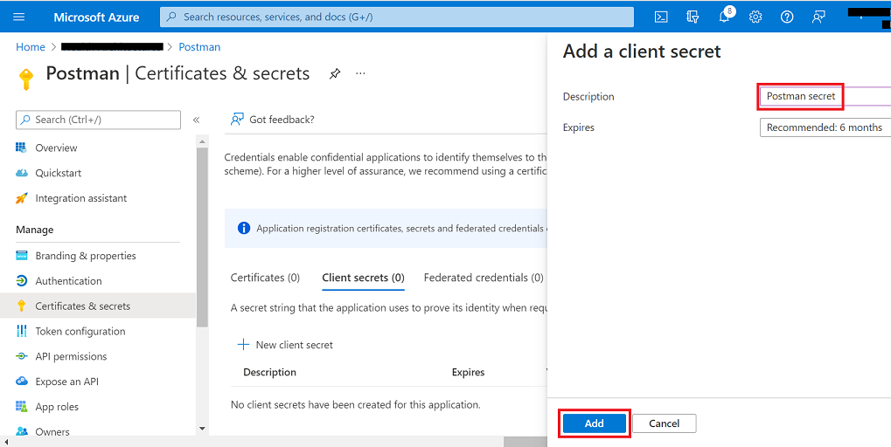
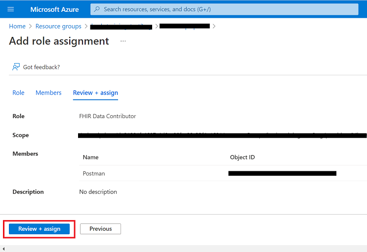
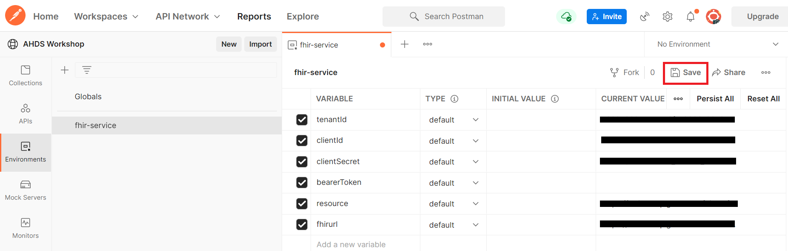
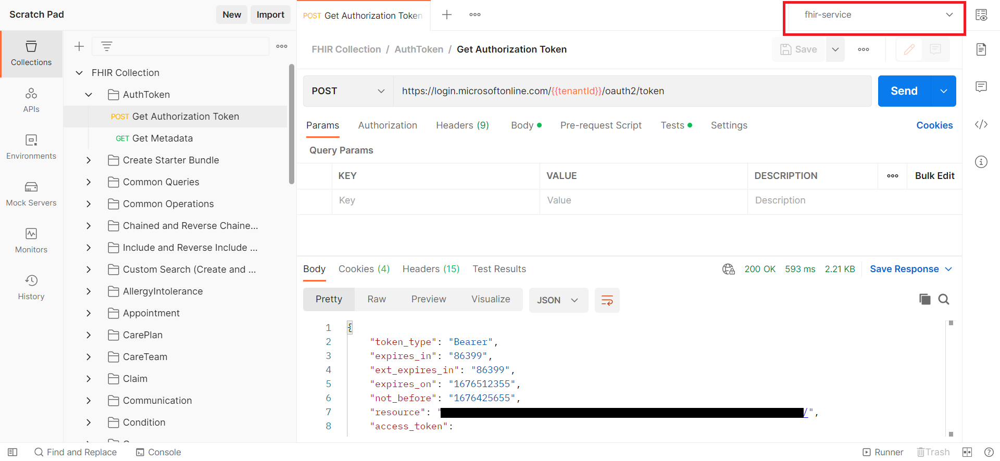
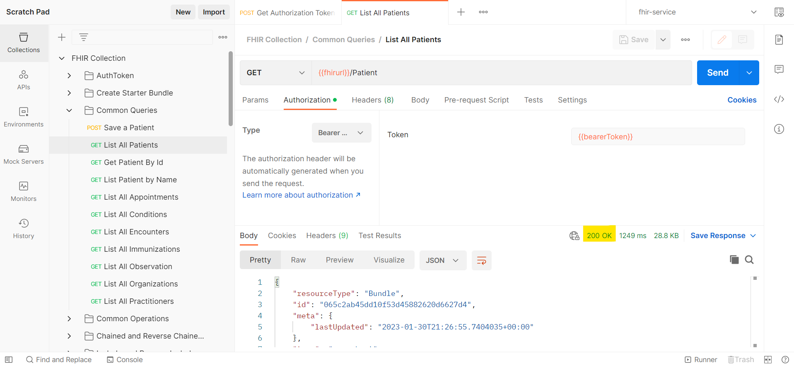

# Postman collection of FHIR queries 

This sample includes collection of FHIR queries which would be helpful to build better understanding for using FHIR service to query for FHIR resources.

The collection could be downloaded and imported into postman.

The queries are categorised into folders below:
- AuthToken (Request to create an authentication token which is used in all other queries)
- Create Starter Bundle (Here we create a multiple resources in one bundle, these resources would be used in queries further)
- Common Queries (This folder has some of the most frequently used queries)
- Common Operations (This folder has queries for operations like convert, valicate, export and import)
- Chained and Reverse Chained Search (This folder has queries to use chaining and reverse chaining for fetching resources, more details about chaining could be found [here](https://learn.microsoft.com/en-us/azure/healthcare-apis/fhir/overview-of-search#chained--reverse-chained-searching).)
- Include and Reverse Include Search (This folder has queries with _include and _revinclude parameters, more details about [here](https://www.hl7.org/fhir/search.html#return).)
- Custom Search (Create and Use SearchParameter) (This folder has queries related to custom search, here we create new SearchParameter, run reindex and usethe newly create SearchParameter. More details about custom search could be found [here](https://learn.microsoft.com/en-us/azure/healthcare-apis/azure-api-for-fhir/how-to-do-custom-search).)
- List of alphabetically sorted resource specific folders for resource specific queries for CRUD operations

## Prerequisites
+ [User Access Administrator](https://docs.microsoft.com/en-us/azure/role-based-access-control/built-in-roles#user-access-administrator) role in your FHIR service resource group or Azure subscription 
+ **FHIR service** deployed. Information about FHIR service can be found [here](https://docs.microsoft.com/en-us/azure/healthcare-apis/fhir/overview).
+ **Postman** installed - desktop or web client. Information about installing Postman is available [here](https://www.getpostman.com/). 
+ **PowerShell** Information about installing Powershell as available [here](https://learn.microsoft.com/en-us/powershell/scripting/install/installing-powershell-on-windows?WT.mc_id=THOMASMAURER-blog-thmaure&view=powershell-7.3&viewFallbackFrom=powershell-7)
 

## Getting started
To set up Postman for testing FHIR service, we'll walk through these steps:

**Step 1:** Create an App Registration for Postman in AAD  
**Step 2:** Assign FHIR Data Contributor role in Azure for Postman service client  
**Step 3:** Import environment template and collection files into Postman  
**Step 4:** Enter parameter values for the Postman environment  
**Step 5:** Get an authorization token from AAD  
**Step 6:** Test FHIR service with Postman  

## Step 1 - Create an App Registration for Postman in AAD 

Before you can use Postman to make API calls to FHIR service, you will need to create a registered [client application](https://docs.microsoft.com/en-us/azure/healthcare-apis/register-application) to represent Postman in Azure Active Directory.

1. In Azure Portal, go to **Azure Active Directory** -> **App registrations** and click **New registration**. 


2. Type in a name for your Postman service client app in the **Name** field.

3. Scroll down to **Redirect URI (optional)**, select **Web**, and enter `https://oauth.pstmn.io/v1/callback` as shown. Then click **Register**. 
    + **Note:** this redirect URI is needed for the Consent Opt-Out auth flow in Challenge-07.


4. Now you will be taken to the **Overview** blade for your Postman client app in AAD.  
  

5. Click on **Certificates and secrets**. Click **+New client secret**. 


6. Under **Add a client secret**, enter a name for the secret in the **Description** field. Click **Add**. 


7. Copy the secret **Value** and securely store it somewhere (you will need this when you configure your Postman environment). 


For more information on registering client applications in AAD for Azure Health Data Services, please see the [Authentication and Authorization for Azure Health Data Services](https://docs.microsoft.com/azure/healthcare-apis/authentication-authorization) documentation. 

## Step 2 - Assign FHIR Data Contributor role in Azure for Postman service client

1. In Azure Portal, go to the resource group containing your FHIR service instance. When in the resource group **Overview**, click on your FHIR service name in the list. 


2. Go to the **Access Control (IAM)** blade. Click on **+Add** -> **Add role assignment**. 


3. In **Add role assignment** under the **Role** tab, scroll down in the list and select **FHIR Data Contributor**. Then click **Next**. 


4. Under the **Members** tab, click on **+Select members**. Type in the name of your Postman service client app in the **Select** field on the right. Highlight the name and click **Select**. Then click **Next**. 


5. Under the **Review + assign** tab, click **Review + assign**. 


6. When back in the **Access Control (IAM)** blade, click **+Add** -> **Add role assignment** (again). 


7. In **Add role assignment** under the **Role** tab, select **FHIR Data Contributor** (again) and click **Next**. 


8. Under the **Members** tab, click on **+Select members**. Type in your name or username in the **Select** field on the right. Highlight your name, click **Select**, and then click **Next**. 


9. Under the **Review + assign** tab, click **Review + assign**. 


For more information on assigning user/app roles, see [Configure Azure RBAC for Azure Health Data Services](https://docs.microsoft.com/azure/healthcare-apis/configure-azure-rbac).

## Step 3 - Import environment and collection files into Postman

1. Access the Postman environment template for FHIR service [here](./fhir-service.postman_environment.json). Save the file locally (click on **Raw** and then do a **Save as** from your browser). 

2. In Postman, create a new [Workspace](https://www.postman.com/product/workspaces/) (or select an existing one if already created).

3. Find the **Environments** tab on the left and click the **Import** button next to the workspace name. 


4. Import the ```fhir-service.postman_environment.json``` file that you just saved locally.
    + Add the file to Postman using the **Upload Files** button. Then click **Import**. 


5. Now, access the ```FHIR Collection.postman-collection.json``` file available in this repo [here](./FHIR-Collection.postman_collection.json) and save the file locally. Then import the file into Postman.
    + Add the file to Postman using the **Upload Files** button. Then click **Import**. 


## Step 4 - Configure Postman environment
Now you will configure your Postman environment (`fhir-service`). 

1. For the `fhir-service` Postman environment, you will need to retrieve the following values: 

- `tenantId` - AAD tenant ID (go to **AAD** -> **Overview** -> **Tenant ID**)
- `clientId` - Application (client) ID for Postman service client app (go to **AAD** -> **App registrations** -> `<postman-service-client-name>` -> **Overview** -> **Application (client) ID**) 
- `clientSecret` - Client secret stored for Postman (see Step 1 #7 above) 
- `fhirurl` - FHIR service endpoint - e.g. `https://<workspace-name>-<fhir-service-name>.fhir.azurehealthcareapis.com` (go to **Resource Group** -> **Overview** -> `<fhir-service-name>` -> **FHIR metadata endpoint** and copy *without* "/metadata" on the end)
- `resource` - FHIR service endpoint - e.g. `https://<workspace-name>-<fhir-service-name>.fhir.azurehealthcareapis.com` (same as `fhirurl`)

Populate the above parameter values in your `fhir-service` Postman environment as shown below. Input the values in the **CURRENT VALUE** column. Leave `bearerToken` blank. Make sure to click **Save** to retain the `fhir-service` environment values.  



## Step 5 - Get an access token from AAD
In order to connect to FHIR service, you will need to get an access token first. To obtain an access token from AAD via Postman, you can send a ```POST Get Authorization Token``` request. The ```POST Get Authorization Token``` call comes pre-configured as part of the `FHIR Collection` collection that you imported earlier. 

In Postman, click on **Collections** on the left, select the `FHIR Collection` collection, and then select `POST Get Authorization Token`. Press **Send** on the right.

__IMPORTANT:__ Be sure to make the `fhir-service` environment active by selecting from the dropdown menu above the **Send** button. In the image below, `fhir-service` is shown as the active environment.



On clicking **Send**, you should receive a response in the **Body** tab like shown below. The `access_token` value is automatically saved to the ```bearerToken``` variable in the Postman environment. 

```
{
    "token_type": "Bearer",
    "expires_in": "3599",
    "ext_expires_in": "3599",
    "expires_on": "XXXXXXXXXX",
    "not_before": "XXXXXXXXXX",
    "resource": "XXXXXXX-XXXX-XXXX-XXXX-XXXXXXXXXXXX",
    "access_token": "XXXXXXXXXXXX..."
}
```

You now have a valid access token in your Postman environment and can use the token in subsequent API calls to your FHIR service. For more information about access tokens in AAD, see [Microsoft identity platform access tokens](https://docs.microsoft.com/en-us/azure/active-directory/develop/access-tokens).

__Note:__ Access tokens expire after 60 minutes. To obtain a token refresh, simply make another ```POST Get Authorization Token``` call and you will receive a new token valid for another 60 minutes.

## Step 6 - Test FHIR service with Postman 

1. In Postman, click on **Collections** on the left, select the `FHIR Collection` collection, and then select the `GET List Metadata` call. Your Postman interface should look something like this: 


2. Click **Send** to test that FHIR service is functioning on a basic level. The `GET List Metadata` call returns the FHIR service's [Capability Statement](https://www.hl7.org/fhir/capabilitystatement.html). If you receive an error, there should be information in the response indicating the cause of the error. If you receive a response like shown below, this means your setup has passed the first test. 


3. Click on `POST Save a Patient` in the `FHIR Collection` collection and press **Send**. If you get a response like shown below, this means you succeeded in creating a `Patient` Resource in FHIR service. This indicates that your setup is functioning properly. 


4. Try `GET List All Patients` in the `FHIR CALLS` collection and press **Send**. If the response is as shown below, this means you successfully obtained a list of every `Patient` Resource stored in the FHIR service database. This means your setup is fully functional.



5. Now we will create a bunch of resources by posting a bundle to FHIR service. Click on "POST Create Resources Bundle (Multiple resources)" in `FHIR Collection` and press **Send**. If The response is as shown below, this means you successfully created multiple resources included in a bundle.
This bundle contains `Patient`, `Practitioner`, `Organization`, `Location`, `PractitionerRole`, `Encounter`, `Observation`, `Condition`, `Procedure`, `Group`, `Device`, `RelatedPerson` and `ServiceRequest`. We would use these resources 


6. Explore the resource specific queries (Create/Update/Get/Delete) in resource specific folders. 


- In `Get` queries, there are intermediate level queries that combine multiple search parameters and queries to fetch list of resources with multiple IDs. Examples are shown below:


7. In `FHIR Collection`, folder `Chained and Reverse Chained Search` Contains queries which search resources using chained and reverse chained search. More details are available [here](https://learn.microsoft.com/en-us/azure/healthcare-apis/fhir/overview-of-search#chained--reverse-chained-searching).

8. In `FHIR Collection`, folder `Include and Reverse Include Search` Contains queries which search resources using include and reverse include. More details are available [here](https://learn.microsoft.com/en-us/azure/healthcare-apis/fhir/overview-of-search#search-parameters) and in section `3.1.1.5.4 Including other resources in result` [here](https://www.hl7.org/fhir/search.html).

9. In `FHIR Collection`, folder `Common Operations` Contains queries for operations: 
- [validate](https://learn.microsoft.com/en-us/azure/healthcare-apis/fhir/validation-against-profiles), Make sure the profiles are loaded into fhir service for validation, more details [here](https://learn.microsoft.com/en-us/azure/healthcare-apis/fhir/store-profiles-in-fhir)
- [convert](https://learn.microsoft.com/en-us/azure/healthcare-apis/fhir/convert-data)
- [import](https://learn.microsoft.com/en-us/azure/healthcare-apis/fhir/import-data), Please make sure that  the cofiguration settings for import are done before running import, more details for configurations are available [here](https://learn.microsoft.com/en-us/azure/healthcare-apis/fhir/configure-import-data)
- [export](https://learn.microsoft.com/en-us/azure/healthcare-apis/fhir/export-data), Please make sure that  the cofiguration settings for export are done before running export, more details for configurations are available [here](https://learn.microsoft.com/en-us/azure/healthcare-apis/fhir/configure-export-data)
 
10. In `FHIR Collection`, folder `Custom Search (Create and Use SearchParameter)` Contains queries to create create and use custom search parameter. More details are available [here](https://learn.microsoft.com/en-us/azure/healthcare-apis/fhir/overview-of-search#chained--reverse-chained-searching).
- Once you create new search parameter, reindexing should be done to be able to use new search parameter.
- To prform reindexing, use `POST Reindex` request, once you run reindex, it takes some time to finish, `POST Reindex` request returns reindex task Id which is used to check status of reindex task.


- Keep checking the status of reindex task with `GET Get Status on Reindex Job` request or with below command, run the command in powershell(requires powershell 7 or higher and Az module installed).


`az rest --resource {{fhirurl}} --url {{fhirurl}}/_operations/reindex/{{ReindexTaskId}}`


- Once reindex is completed, new search parameter is ready to use.


11. Now you can experiment with other sample calls Or create your own FHIR API calls by following the examples.

### Resources 

A tutorial for using Postman with FHIR service is available on [docs.microsoft.com](https://docs.microsoft.com/azure/healthcare-apis/fhir/use-postman).
 
### FAQ's / Issues 

- Error with ```POST AuthorizeGetToken```: Ensure you selected your `fhir-service` environment from the dropdown menu.
- 403 - Unauthorized:  Check the Azure RBAC for Azure Health Data Services documentation ([link](https://docs.microsoft.com/azure/healthcare-apis/configure-azure-rbac)).