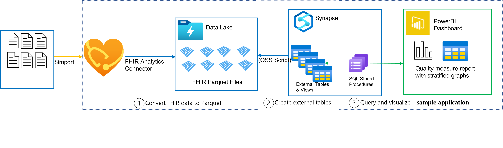

# Analytics pipeline visualization: PowerBI dashboard from parquet files in Azure Data Lake sample

This sample will focus on how to visualize FHIR data that **has already been converted to parquet files in Azure Data Lake**. Converting to parquet files makes it easier to unlock a variety of analytics use cases. This sample creates a PowerBI dashboard from parquet files in an Azure Data Lake storage account via a Synapse workspace.

## End-to-end pipeline
The end-to-end pipeline is shown in the diagram below, starting with FHIR data in a FHIR server. 

- In **Stage 1: Convert FHIR data to Parquet**, FHIR data in a FHIR server is converted to Parquet files (to help facilitate easier data analysis) and stored in Data Lake. This is done with the [OSS FHIR to Synapse Sync Agent](https://github.com/microsoft/FHIR-Analytics-Pipelines/blob/main/FhirToDataLake/docs/Deploy-FhirToDatalake.md) tool, or the analytics connector private preview. 
- In **Stage 2: Create external tables**, external tables and views of that Parquet files are made in Synapse.
- In **Stage 3: Query and Visualize**, Stored Procedures query the data to visualize in a PowerBI dashboard. This sample mainly focuses on Stage 3, but pointers will be provided for Stage 1 and 2. 

For each of the stages, two option paths are provided depending on what data you would like to use. If you have your own sample data and used/want to use the [OSS FHIR to Synapse Sync Agent](https://github.com/microsoft/FHIR-Analytics-Pipelines/blob/main/FhirToDataLake/docs/Deploy-FhirToDatalake.md) tool or analytics connector private preview, follow Option A. If you want to follow this tutorial from scratch with provided sample data, follow Option B. 

# Stage 1: Convert FHIR data to Parquet
First, convert your FHIR data into Parquet files and store them in Azure Data Lake. Converting FHIR data into Parquet files makes it easier to facilitate data analysis later on.
## Option A: Using your own sample data + FHIR to Synapse Sync Agent or analytics connector private preview
- If you have your own sample FHIR data that needs to be converted into Parquet files, please use the OSS tool [FHIR to Synapse Sync Agent](https://github.com/microsoft/FHIR-Analytics-Pipelines/blob/main/FhirToDataLake/docs/Deploy-FhirToDatalake.md) and follow steps 1 - 3. Once you are finished, move on to "Stage 2: Create external tables and views". 
- If you have already converted your FHIR data into Parquet files with the [FHIR to Synapse Sync Agent OSS tool](https://github.com/microsoft/FHIR-Analytics-Pipelines/blob/main/FhirToDataLake/docs/Deploy-FhirToDatalake.md), or you are coming from the analytics connector private preview, please move on to "Stage 2: Create external tables and views".

## Option B: Using provided sample data
If you do not have your own sample FHIR data, or you would like to use our provided sample data parquet files, follow steps in the "Stage 1" section in the [Appendix](https://github.com/Azure-Samples/azure-health-data-services-samples/blob/main/samples/analytics-visualization/docs/Appendix.md#stage-1-convert-fhir-data-to-parquet-option-b-using-provided-sample-data) to create a Data Lake and copy our sample Parquet files inside. Please note that this only copies over sample Parquet files into Data Lake and is only used to quickly deploy this sample.

# Stage 2: Create external tables and views
Next, create external tables and views from the Parquet files. 
## Option A: Using your own sample data + FHIR to Synapse Sync Agent or analytics connector private preview
If you have already used the [FHIR to Synapse Sync Agent OSS tool](https://github.com/microsoft/FHIR-Analytics-Pipelines/blob/main/FhirToDataLake/docs/Deploy-FhirToDatalake.md) or the analytics connector private preview to convert FHIR data to Parquet files, please follow steps 4 - 7 [here](https://github.com/microsoft/FHIR-Analytics-Pipelines/blob/main/FhirToDataLake/docs/Deploy-FhirToDatalake.md) to create the external tables and views. Note that if you do not already have a Synapse workspace, you will need to create a Synapse workspace in Azure Portal before proceeding. Once you have completed those steps, please move on to "Stage 3: Query and Visualize".

## Option B: Using provided sample data 
If you are using provided Parquet sample files to run this sample, please follow steps in "Stage 2" section in the [Appendix](https://github.com/Azure-Samples/azure-health-data-services-samples/blob/main/samples/analytics-visualization/docs/Appendix.md#stage-2-create-external-tables-and-views-option-b-using-provided-sample-data)

# Stage 3: Query and Visualize
At this point, you should have external tables of data ready to be queried and visualized. In this stage, we will create SQL stored procedures to query the external tables, and visualize that data in PowerBI. This example PowerBI visualizes the percentage of women 50-70 years of age who had a mammogram to screen for breast cancer in the 48 months prior to the end of the measurement period. 

Note: This is a simple, basic example to demonstrate capabilities of the FHIR analytics pipeline and data visualization with Power BI, and does not meet requirements of any standard quality measures. This sample uses Synthea data.

### Prerequisites needed
1.	Microsoft work or school account
2.	Azure Synapse Workspace with Serverless SQL Endpoint.
	-	The Serverless SQL Endpoint will be used to connect to Database from Power BI Desktop Application to create Power BI Dashboard/reports.
3.	[Power BI](https://www.microsoft.com/en-us/download/details.aspx?id=58494) Desktop application
4.	Power BI service account and workspace
5.	[Microsoft SQL Server Management Studio](https://learn.microsoft.com/en-us/sql/ssms/download-sql-server-management-studio-ssms?view=sql-server-ver16)

## Query: Setting up Database from SQL Server Management Studio

### Option A: Using your own sample data + FHIR to Synapse Sync Agent or analytics connector private preview
If you used the [FHIR to Synapse Sync Agent OSS tool](https://github.com/microsoft/FHIR-Analytics-Pipelines/blob/main/FhirToDataLake/docs/Deploy-FhirToDatalake.md) or the analytics connector private preview to convert FHIR data to Parquet files, upload the stored procedures file (..azure-health-data-services-samples/samples/analytics-visualization/scripts/sql/Stored_Procedure) to your database in Microsoft SQL Server Management Studio. 

More detailed instructions on how to use Microsoft SQL Server Management Studio and uploading the stored procedures can be found in the [Appendix](https://github.com/Azure-Samples/azure-health-data-services-samples/blob/main/samples/analytics-visualization/docs/Appendix.md#uploading-stored-procedures-for-querying)
 

###  Option B: Using provided sample data 
If you are using provided Parquet sample files to run this sample, the stored procedure was already created from the Bicep template and is available in the database.

If you would like to explore (view/edit) the stored procedure in Microsoft SQL Server Management Studio, detailed instructions can be found in the [Appendix](https://github.com/Azure-Samples/azure-health-data-services-samples/blob/main/samples/analytics-visualization/docs/Appendix.md#connecting-to-microsoft-sql-server-management-studio) to connect to the database using the “Serverless SQL endpoint”.

## Visualize: Checking and editing the dashboard in Power BI desktop application

1. Open the “BCS_Compliance_Dashboard.pbix” file at (../azure-health-data-services-samples/samples/analytics-visualization/powerbiReport)in Power BI Desktop application. 

2. The charts get data from the "ComplianceData" table. See the [Appendix](https://github.com/Azure-Samples/azure-health-data-services-samples/blob/main/samples/analytics-visualization/docs/Appendix.md#navigating-the-compliancedata-table) for more details on navigating the ComplianceData table. 

### Change the serverless SQL endpoint to your endpoint
This example PowerBI is currently connected to an example endpoint. In this step, you will change the endpoint to your serverless SQL endpoint that you created above.
1.	In the “Model” section,  click “More Options” button (Three dots in top right corner of the table  
), then click on “Edit Query”.

2.	A new “Power Query Editor” window will open, click on the "expand" arrow to see the full query. Change the serverless SQL pool URL (blacked out part below) to the URL of your Serverless SQL endpoint. You may be asked to edit your credentials to connect to the Serverless SQL endpoint.

### Editing the query to change measurement period date range in parameters
In this query editor, you can also change the measurement period date range. If you'd like detailed instructions on how to do this, follow the Appendix [here](https://github.com/Azure-Samples/azure-health-data-services-samples/blob/main/samples/analytics-visualization/docs/Appendix.md#editing-the-query-to-change-measurement-period-date-range-in-parameters).

### Publish the dashboard in Power BI Service
Finally, publish the dashboard to PowerBI service and view. For detailed instructions, follow the Appendix [here](https://github.com/Azure-Samples/azure-health-data-services-samples/blob/main/samples/analytics-visualization/docs/Appendix.md#publish-the-dashboard-in-powerbi-service).
