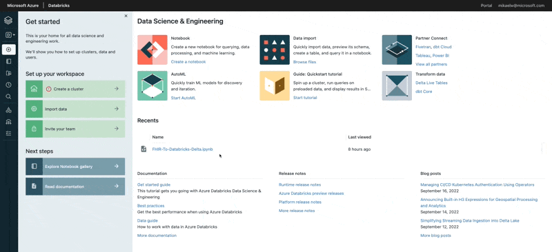
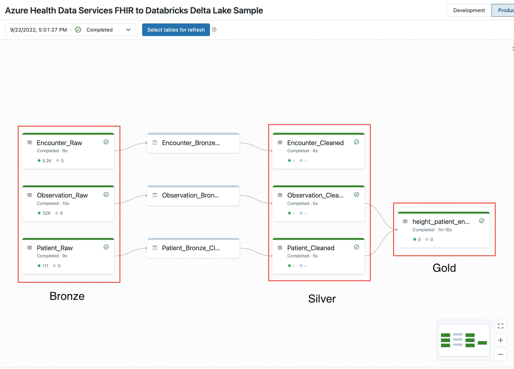
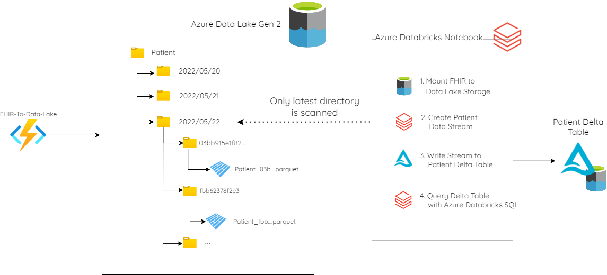
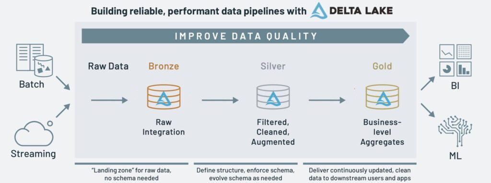
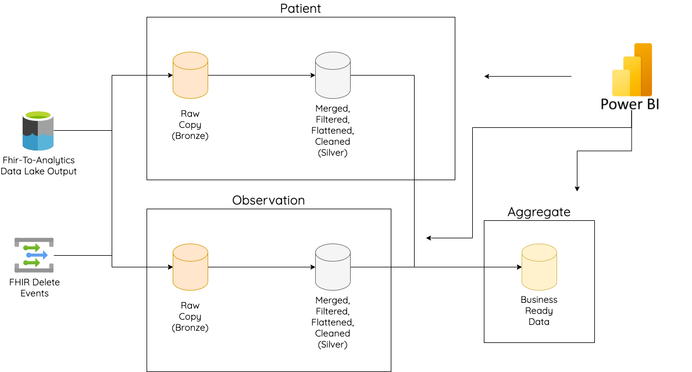

# FHIR Service Analytics with Azure Databricks Delta Lake Analytics

## Overview

Data Lakehouse is an open data architecture that combines existing features from traditional data lakes and data warehouses. Delta Lake has emerged as the leading storage framework that enables building a Lakehouse architecture on top of existing data lake technologies. Azure Health Data Services enables Lakehouse architectures by exporting parquet files of FHIR data which align to the open [SQL on FHIR](https://github.com/FHIR/sql-on-fhir/blob/master/sql-on-fhir.md) standard.

Building a Lakehouse for FHIR data has these advantages:

- Combining your FHIR data with other datasets.
- Having a consistent location of enterprise ready data enabling more self-service across your organization.
- Metadata management and versioning of data simplifing data that is often updated.

## Scenario Overview

For this sample, we will be building a simple Lakehouse exploring a single use case: a hospital admission report. Here, we've been asked to provide some simple data to enable trend analysis for hospital admissions. We'll only focus on Patient, Encounter, and Observation information, but the same approach can be expanded for other entities.

## Deploy the sample

Click the button below to launch Azure and deploy this sample. Open it in a new tab so you can keep referencing this readme.

## Looking around at what we deployed

This sample will deploy the following components:

- Azure Health Data Services Workspace
- FHIR Service
- Azure Data Lake Storage Gen 2
- Azure Function with [FHIR to Data Lake Pipeline](https://github.com/microsoft/FHIR-Analytics-Pipelines/tree/main/FhirToDataLake)
- Managed identity for deployment scripts
- Role assignments
- Script to setup Azure Databricks with the sample
  - Including a [notebook](./notebooks/FHIR-To-Databricks-Delta.ipynb) to run the pipeline
- Script to load sample data into the FHIR Service from Synthea

## Watch data flow through the sample

To test out this sample, launch the Azure Databricks workspace you just deployed. Go to the Delta Live Tables area of Azure Databricks and start the pipeline there. The pipeline will take about 5 minutes to spin up a cluster and execute

## Explain the sample

This sample touches on one small, core area that you would need to repeat for other entities in your data. The core concepts are:

### Delta Live Tables 

Delta Live Tables is a framework for building reliable, maintainable, and testable data processing pipelines. You define the transformations to perform on your data, and Delta Live Tables manages task orchestration, cluster management, monitoring, data quality, and error handling. Here, Delta Live tables enable you to easily create a Delta Lake with your data from the FHIR Service. We use the Delta Live Tables library in our notebook to simplify moving data between medallion layers.

### Auto Loader

Auto Loader simplifies connecting the output of the FHIR To Data Lake pipeline to our Delta Lake in Azure Databricks. We can simply point Auto Loader at the output from the FHIR Service and it will *automatically* watch the directory for new files and automatically process these for streaming pipelines or keep track of what needs to be processed for on-demand pipelines.

### Medallion Architecture

A medallion architecture is a data design pattern used to logically organize data in a lakehouse, with the goal of incrementally and progressively improving the structure and quality of data as it flows through each layer of the architecture (from Bronze ⇒ Silver ⇒ Gold layer tables).

*Source: [Databricks](https://www.databricks.com/glossary/medallion-architecture)*

### Bronze Layer

For FHIR data in our sample, the bronze layer is a copy of files extracted from FHIR with the FHIR to Data Lake Azure Function. The bronze layer is a landing zone and should be as close to the format of your source systems as possible. Once this data is moved successfully to bronze and you are confident in your Delta Lake deployment, you can begin to delete the data in this Data Lake path once it is moved to bronze.

You can see more details about the initial copy to bronze [in this notebook](./notebooks/Creating%20a%20Patient%20Delta%20Table%20with%20Auto%20Loader.ipynb)

### Silver Layer

The silver layer is a collection of entity based tables that are transformed from bronze into core tables that apply across your business. These are called "cleansed and conformed" tables. We recommend that you flatten the data in these tables as much as you can to simplify connecting downstream applications directly to your silver layer (like PowerBI). FHIR data is heavily nested and it's best to incur the complexity of this transformation once in your data platform. More than flattening, your silver layer should have data elements that map to your business entities. For example, you may have column for your EMPI (enterprise master patient id) that is a flattened, filtered result from the identifier element on the patient resource.

### Gold Layer

Finally, the gold layer should house use-case specific, curated business-level tables. These are generally created per each application or application group and are targeted specifically at the query and data access patterns. The data here is generally de-normalized and optimized for reads. Applications can also pull data from the silver layer when it makes sense, but if this logic gets too complex or you are computing aggregates, a gold level table may be right for the scenario. Generally the gold layer data has a loss of record level fidelity from the silver layer.

## Using this in your own environment

To use this sample in your own production environment, we recommend that you look into Databricks best practices, especially around testing your code, extracing common functionality, CI/CD, monitoring, and alerting. For more details, please check out the links below.

- [Software engineering best practices for notebooks](https://learn.microsoft.com/azure/databricks/notebooks/best-practices)
- [Azure Databricks Best Practices](https://github.com/Azure/AzureDatabricksBestPractices/blob/master/toc.md)
- [Sample Enterprise Databricks Environment](https://github.com/Azure-Samples/modern-data-warehouse-dataops/tree/main/single_tech_samples/databricks/sample2_enterprise_azure_databricks_environment)
