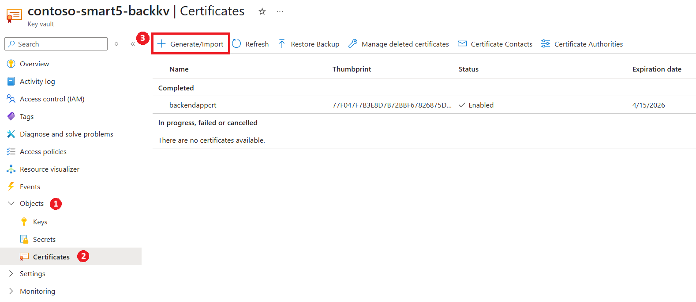
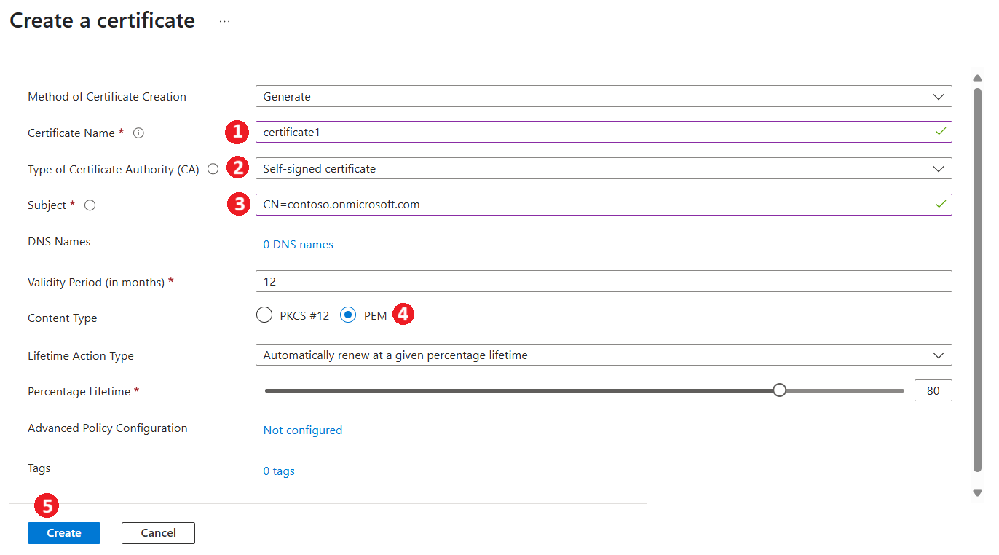
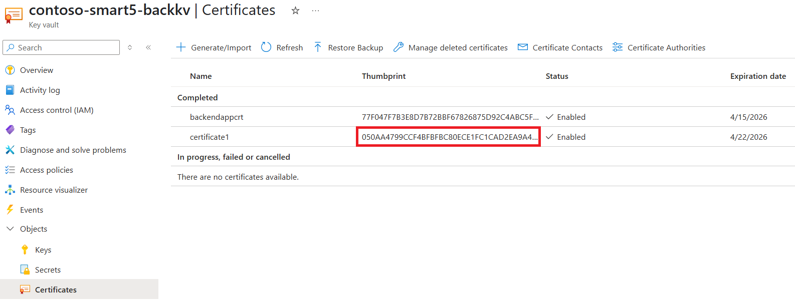
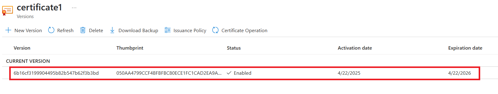
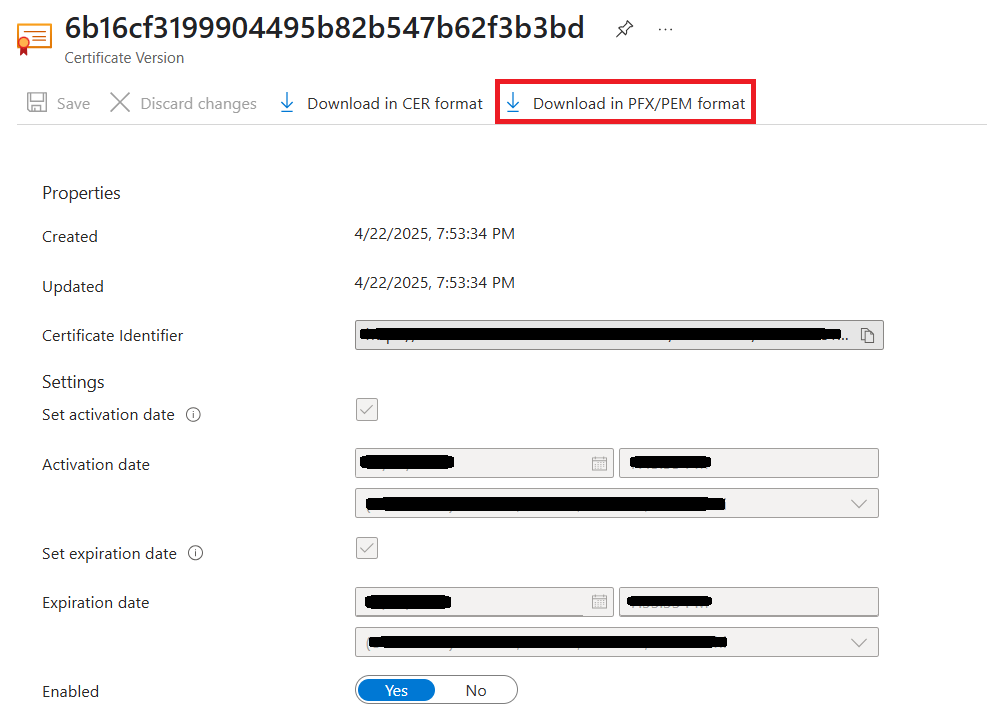

# Client Assertion Generator

This sample guides you through generating a client assertion and corresponding JWK (JSON Web Key) using a self-signed certificate from Azure Key Vault. The output can be used for OAuth2 flows such as client credentials with a secure certificate-based authentication mechanism.

## Prerequisites

- Azure subscription
- Access to Azure Key Vault
- Azure AD App Registration (with Client ID and Tenant ID)
- Visual Studio (for running the provided solution)

## Step 1: Generate a Self-Signed Certificate in Azure Key Vault

1. **Create or Use an Existing Key Vault**
   - Ensure you have the required permissions to create/manage certificates:
     - If **RBAC (Role-Based Access Control)** is used, assign the **Key Vault Administrator** role to your user account.
     - If **Vault access policy** is used, ensure your user account is assigned an access policy with **all certificate permissions**.

2. **Navigate to the Key Vault**
   - Go to the **Certificates** section under **Objects**.
   - Click on **Generate/Import**.

3. **Configure Certificate Details**
   - **Name:** Provide a name for your certificate.
   - **Certificate Authority:** Select `Self-Signed certificate`.
   - **Subject:** Use the format `CN=<domain name>`, e.g. `CN=contoso.onmicrosoft.com`.
   - **Content Type:** Choose `PEM`.

4. **Create the Certificate**
   - Click on **Create**.
   - After creation, **copy and save the certificate thumbprint**. This will be used in the client assertion step.
   
 

Click to expand and see screenshots.

## Step 2: Download Certificate Files

1. Select the newly created certificate in Azure Key Vault.
2. Click on the **current version** of the certificate.
3. Download the certificate in **PEM format**.
4. Save the downloaded `.pem` file in a separate folder, as it contains both the **private key** and **public key**.

 

Click to expand and see screenshots.

## Step 3: Generate Client Assertion and JWK

A Visual Studio solution is provided under the `samples/client-assertion-generator` directory. This solution includes a simple console application that generates a signed JWT (client assertion) and JWK based on user input.

### Running the Utility

1. Clone this repo and navigate to the `samples/client-assertion-generator` folder.
1. Open the `ClientAssertionUtility.sln` file in **Visual Studio**.
1. Build and run the project.

### Input Parameters

On running the project, the console will prompt you to enter the following inputs:

- **Client ID** of your Azure AD App Registration
    > **Note:** For [patientandpopulationservices-smartonfhir-oncg10](../patientandpopulationservices-smartonfhir-oncg10/) sample use Client ID of Backend App Registration.
- **Tenant ID**
- **Thumbprint** of the certificate
- **Path to PEM folder** (where your `.pem` file with private/public key is stored)
- **Audience URL**

    > **Note:** For the [patientandpopulationservices-smartonfhir-oncg10](../patientandpopulationservices-smartonfhir-oncg10/) sample use Audience URL as `<APIM-URL>/auth/token`.

### Output

- The tool will display the generated **client assertion token** and the **JWK** in the console.
- Manually **copy and save** the values for further use in your authentication flow.

 

Click to expand and see screenshots.

