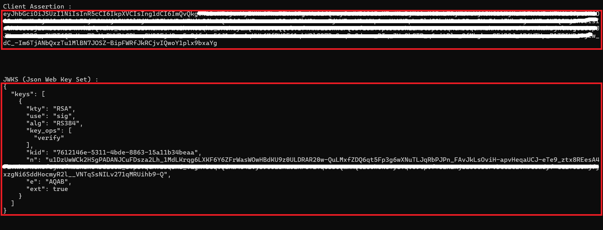

# Client Assertion Generator

This sample guides you through generating a client assertion and corresponding JWKS (JSON Web Key Set) using a self-signed certificate from Azure Key Vault. The output can be used for OAuth2 flows such as client credentials with a secure certificate-based authentication mechanism.

## Prerequisites

- An active **Azure subscription**
- A **self-signed certificate** with:
  - The **thumbprint**
  - A `.PEM` file containing both the private and public keys
- An **Azure AD App Registration** acting as a Backend Client, including:
  - **Client ID**
  - **Tenant ID**
- **Visual Studio** (for running the provided solution)
- **.NET SDK version 8.0 or later** installed (for building and running the sample)

## Generate Client Assertion and JWKS

A Visual Studio solution is provided under the [client-assertion-generator](.) directory. This solution includes a simple console application that generates a signed JWT (client assertion) and JWKS based on user input.

### Running the Utility

1. Clone this repo and navigate to the `samples/client-assertion-generator` folder.
1. Open the `ClientAssertionUtility.sln` file in **Visual Studio**.
1. Build and run the project.

### Input Parameters

On running the project, the console will prompt you to enter the following inputs:

- **Client ID** of your Azure AD App Registration
    > **Note:** If you are deploying **SMART on FHIR ONC g10**, use the **Client ID of the Backend App Registration**.
- **Tenant ID** of Microsoft Entra ID
- **Thumbprint** of the certificate
- **Path to PEM folder** (where your `.pem` file with private/public key is stored)
- **Audience URL**

    > **Note:** If you are deploying **SMART on FHIR ONC g10**, use: `<APIM-URL>/auth/token`.

### Output

- The tool will display the generated **client assertion token** and the **JWKS** in the console.
- Manually **copy and save** the values for further use in your authentication flow.
 

Click to expand and see screenshots.

