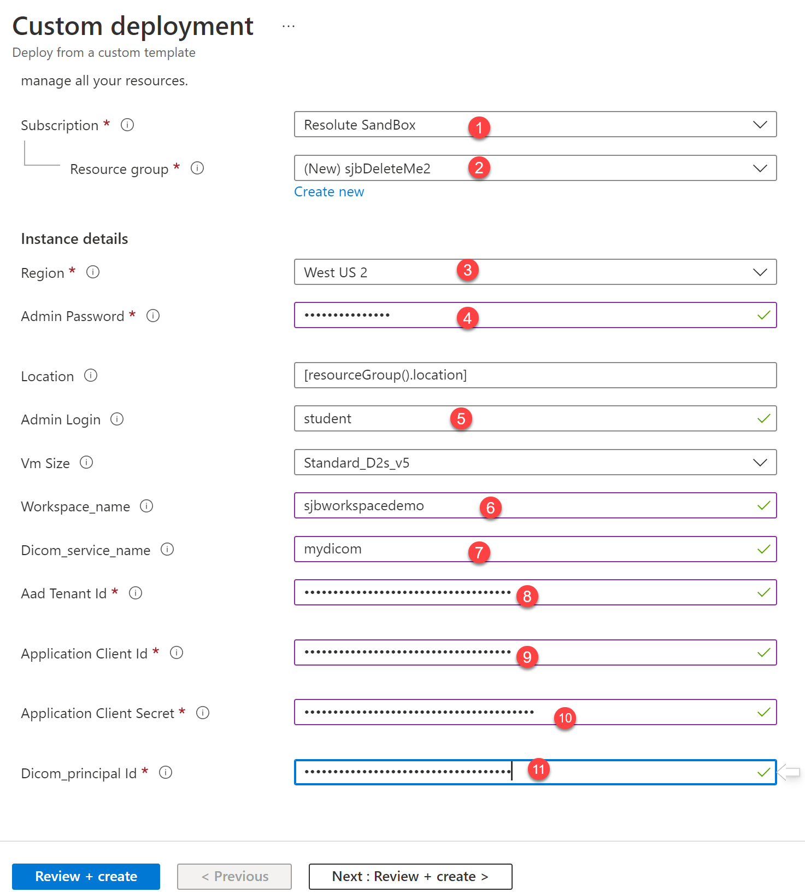

# Medical Imaging Network Demo Environment
Getting your medical imaging data to the cloud shouldn't be difficult, and can be done incrementally, safely, and without major disruptions to existing workflows.

This hands-on lab / demo highlights how an organization with existing on-prem radiology infrastructure can take the first steps to intelligently moving their data to the cloud, _without_ disruptions to the current workflow. 

## Overview
This sample contains the deployment templates to automatically provision a full end-to-end demo environment in an Azure resource group and the full instructions to configure and run the demo.  The deployment includes:
- A simulated on-prem network containing: 
    - A PACS (Orthanc)
    - An X-ray modality (simulated)
    - A user's personal computer
- An instance of Azure Health Data Services DICOM service 
- The medDream zero-footprint viewer, hosted in Azure
- The Qvera QIE intelligent DICOM router 

## The Setup
There are a few core steps that need to be accomplished prior to deploying the infrastructure.

### App Registration
To allow Azure Active Directory to be used as an identity provider to secure access to the DICOM service, you must create an App Registration. The App Registration tells Azure AD about the application that will be speaking to the DICOM service and needs to use Azure AD. In this case, the App Registration will be re-used by two different applications: Qvera QIE and the Softneta medDream viewer. In a production environment, you'll likely want two different app registrations so access can be fine-tuned by application.

To create an App Registration, follow the steps here: [Add App Registration](add-app-reg.md)

You should now have several key pieces of data which will be used in the upcoming steps:
- Application (client) ID
- Directory (tenant) ID
- Client secret
- Principal Object ID of the App Registration

### Deploying the infrastructure
Creating the cloud and on-prem environments in Azure can be done in one of two ways. You can use the Bicep command line, which is easiest if you are running this repo multiple times for development. Or you can use the Azure Portal user experience, which is easiest for a one-off deployment. Both create identical environments.

#### Deploy using the Azure Portal
To use reasonable default values, simply click 

Fill in required information in the template: 

1. Select an Azure subscription
2. Create a new Resource Group
3. Select an Azure region 
4. Choose a complex administrator password that will be used in key places in the demo script
5. Provide a user login name. (_student_ is used in the demo script.)
6. Provide a globally unique name for the AHDS workspace (which will be part of the DICOM URL)
7. Provide a DICOM service name (which need only be locally unique, but cannot be simply 'dicom')
8. Enter the Directory (tenant) ID you captured earlier
9. Enter the Application (client) ID you captured earlier
10. Enter the App Client Secret you captured earlier
11. Enter the Principal Object ID of the App Registration you captured earlier
12. Click the `Review and Create` button

### Retrieving a Qvera QIE license
The Qvera QIE DICOM router requires a license key to run. A 90-day trial license is easily available at https://www.qvera.com/hl7-interface-engine/#get-started-section. Scroll down to click the **Start a Free 90-day Trial** button, enter some information, and a key will be emailed immediately to your account.

## Running the Demo
Check out the [demo instructions](demo-instructions.md) for detailed steps to configure and try out the environment.  

### A note on costs
Note, the demo environment includes several VMs and other resources that can incur notable costs, on the order of $1/hour.  Stopping VMs while the demo is not in use is a way to reduce costs to a few dollars per day.  