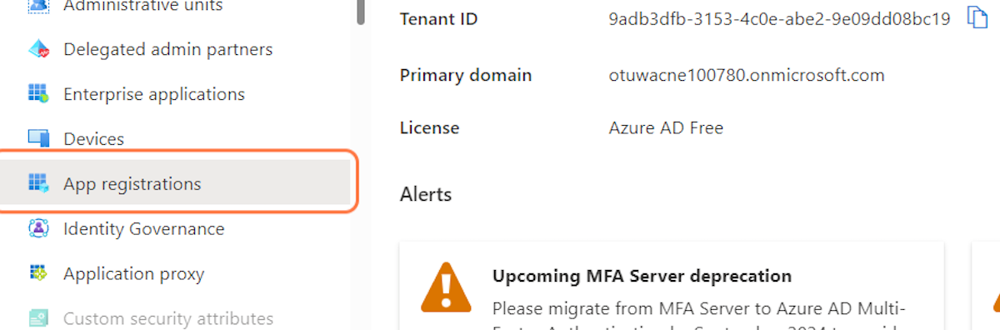

# Add an App Registration through the Azure Portal

## Register a new application
1. Go to the [Azure portal](https://portal.azure.com/#home)

2. Select Show portal menu

3. Select Azure Active Directory

4. Select App registrations

5. Select + New registration

6. Type a name for the application in the Name field, for example, "rsnaAppReg"

7. Select Register

8. Copy Application (client) ID to clipboard; save it in a text file

9. Copy Directory (tenant) ID to clipboard; save it in a text file

10. Select Certificates & secrets

11. Select + New client secret

12. Type a description for the secret, for example, "rsnaSecret"

13. Select the Expires dropdown field

14. Select 3 months

15. Select Add

16. Copy the secret Value to clipboard; save it in a text file

17. Select Home

## Get the Principal Object ID of the App Registration
1. Open a Command Line interface with Azure CLI support, or use the Cloud Shell in the Azure portal.
2. Type `az login` and log in with the appropriate user.
3. Type `az ad sp list --filter "displayName eq 'your_app_name'"` to get the pricipal object ID of the managed identity that underlies the app registration.
4. In the resulting JSON output copy the ID to a secure place that can be referred to later. 