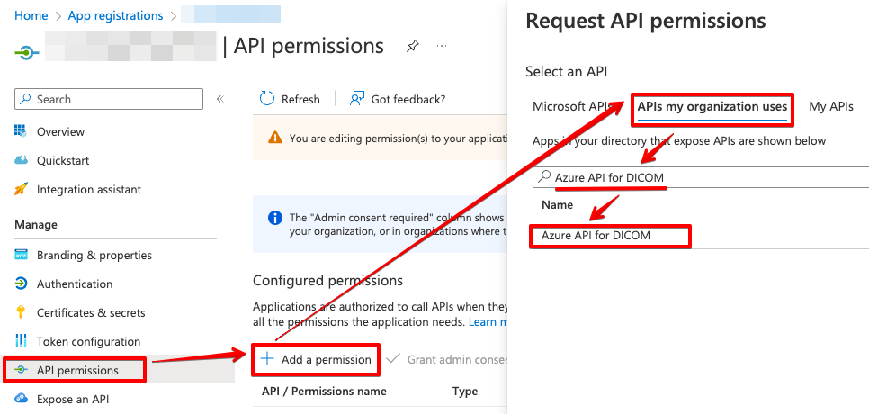

# Azure Health Data Service - DICOM service demo environment

_This guide is intended to be used after deploying the demo environment to Azure.  See the instructions in the [README](README.md#deploying-the-infrastructure)._

This demo environment is used to simulate a sample hospital imaging network and demonstrate how such a network could be connected to the Azure Health Data Services DICOM service.

## 🧭 Get oriented with the demo infrastructure
If this is your first time using this demo environment, it's a good idea to get acquianted with the main components of the simulated on-prem infrastructure.  There are several interesting components as shown in the following diagram: 

First, note the two dashed-line boxes - these areas show the components running in the two portions of the simulated infrastructure: On-prem and Cloud.

### 🏥 On-prem infrastructure
The simulated on-prem infrastructure is a greatly simplified example of a hospital's radiology IT infrastructure, including the following systems:

1. **A PACS system containing sample DICOM images**.  [Orthanc](https://www.orthanc-server.com/), is the sample PACS system, with imaging data pre-loaded from the National Cancer Institute’s [Imaging Data Commons](https://portal.imaging.datacommons.cancer.gov/).  The Azure container named `contoso-orthanc-containergroup` is where the Orthanc server is running.
2. **A DICOM router to route imaging data**.  [Qvera Interface Engine (QIE)](https://www.qvera.com/hl7-interface-engine/) is the DICOM router used in this demo environment.  The Azure container named `contoso-qvera-containergroup` is where the QIE router is running.
3. **A Simulated Modality**.  A set of scripts will be used to "generate" new DICOM images, simulated those coming from a CT, MRI, X-ray, etc.
4. **A Jump VM connected to the on-prem network** _(not pictured)_.  This virtual machine is used to access and configure the PACS system and the DICOM router.  This machine also hosts the scripts used to simulate new DICOM images coming from a modality.

### ☁️ Cloud infrastructure
The cloud infrastructure contains two additional systems that interact with the on-prem infrastructure:

1. **DICOM service**.  The DICOM service is deployed in an Health Data Services (HDS) workspace and will be used to store DICOM images sent from the on-prem environment.  The Health Data Services workspace will have a name in the format `workspace{randomsuffix}` and the corresponding DICOM service will be similarly named `dicom{randomsuffix}`. 
2. **Zero Footprint (ZFP) viewer**.  The ZFP viewer is a web-based DICOM viewer that allows users to view images in their browser without installing anything on their local machine.  [MedDream](https://www.softneta.com/products/meddream-dicom-viewer/) is the ZFP viewer used in this demo environment.  The Azure container named `meddreamContainerGroup` is where the MedDream viewer is running.

## 🩻 View images in the PACS
1. Open the Edge browser and navigate to http://portal.azure.com.  
2. Select **Resource Groups** from the Azure services menu.  
3. Select the resource group that you selected in the deployment template.  
4. The overview page lists all resources in the resource group.  Note the container instances for the applications listed above as well as additional storage and networking components needed to simulate the network. 

5. Select the **jump-vm** virtual machine.  You will connect to this virtual machine to simulate viewing the PACS from within the network.
6. Download the Remote Desktop RDP file.
    1. Select **Connect** under the Settings section.
    2. Change the **Port number** to **4545** and select **Download RDP file**.
    
    3. When the download is complete, open the **jump-vm.rdp** file to connect to the virtual machine.
7. Log in to the virtual machine.
    1. In the Remote Desktop Connection dialog, dismiss any warnings and click **Connect**.
    2. When prompted to log in, select **More choices** then **Use a different account** to type your own credentials.
    3. In the email section, enter "**student**" and then enter the resource group **admin password** entered during the deployment.  
    4. If prompted with a certificate warning, select **Yes** to connect.
    5. Select **Accept** to accept the default privacy settings.
    6. Select **Yes** on the Network flyout to allow the machine to be discoverable on the virtual network.
8. Populate the PACS with sample data.
    1. On the desktop, locate the file named `1-preload-orthanc` and double-click to run the script.  This script copies sample DICOM data to Orthanc and will preload eight total studies for eight different patients.
9. Log in to the PACS.  
    1. Open the Edge browser and navigate to http://10.0.2.4:8042/ or use the **Orthanc** shortcut on the desktop.  This is the local network address for Orthanc.
    2. Enter "**student**" for both the username and password.
10.	Browse to a series
    1. Select **All studies** to see the list of studies available in the PACS (Orthanc).
    
    2. Select a study from the list to view the study details.
    
    3. Select a series from the list to view the series details.
    
11. Select the **Osimis Web Viewer** option to see the image.

    

## 🌟 Simulate a new study from a modality
To simulate modalities that are producing new imaging studies, we will use a local script that sends DICOM data to the PACS.  These new studies are from November 2022.
1. On the desktop, locate the file named `2-modality-pushing-to-orthanc`.
2. Double-click the file to run the script and send the new study to the PACS.
3. Browse to the **All Patients** view in Orthanc to see the changes.  Three patients will now have two studies, the latest of which is dated November 2022.

## 🌐 Add a DICOM router to the network
Connecting the DICOM service to the existing network requires the configuration of a DICOM router and this demo uses Qvera Interface Engine (QIE).  The configuration will send new imaging from modalities to the DICOM router which will then send that data to both the PACS and the DICOM service.  
1. Navigate to http://10.0.1.4:80 or use the **QveraInterfaceEngine** shortcut on the desktop.  This is the local address for QIE.
2. When prompted to log in to QIE, use the default admin credentials and select **Login**.
3. When prompted, change the password to one you can remember.  
4. After chaging the password, you will need to enter your license ID.  If you do not have one already, you can [get a trial license from Qvera](https://www.qvera.com/qie-registration-ent/).  
5. When prompted, input the **License ID** and the **Activation code** and select **Get License**.
    
6. Select **Save** on the License dialog and select **OK** on the About screen.
7. Import the router configuration.  This configuration contains the default routing rules for the simulated network and some functions specific to the DICOM service.  
    1. From the top menu bar, select **Application `>` Import Configuration**.
    
    2. In the Open QIE Configuration File dialog, use the ellipsis (…) button to select the configuration file.  Browse to the desktop and select `qie_MicrosoftDICOM_20221123.qie`.  Select **Open** to open the config file.
    3. In the Import Configuration dialog, select the **checkbox next to the MicrosoftDICOM** zone to import all channels.
    4. Select the **Import Sample Messages** option and select **Import**.
    
8. Before QIE can connect to the DICOM service, you will need to [register a client application with AAD](https://learn.microsoft.com/azure/healthcare-apis/dicom/dicom-register-application).  
    1. Go to the App registrations, add find the Azure API for DICOM. 
    2. Select DICOM.ReadWrite permissions and click Add permissions. 
    > Make note of the **application ID** and **client secret** when registering the client application.
    > 
    > Also, note the authorization URL from the **Endpoints** pane on the Overview page.  You'll need the **OAuth 2.0 token endpoint (v1)**

9. Configure the web service connection.  This enables the router to communicate with the DICOM service.  
    1. Select the **MicrosoftDICOM** zone to expand the zone details.
    
    2. Select **Web Service Connections** and then **MicrosoftDICOMWeb**.
    
    3. The following fields must be updated: **Endpoint URL**, **Username**, **Password**, and **Auth URL**.

        

    4. In the Qvera **Endpoint URL** box, enter the Azure DICOM **Service URL**. You can find the URL in the Azure portal by browsing to **Resource Groups `>` _your resource group_ `>` DICOM Service `>` Overview `>` Service URL**.
       > The service URL will be in a format like, https://myws-mydicom.dicom.azurehealthcareapis.com
        
    5. In the Qvera **Username** box, enter the Azure **Application (client) ID** from the Azure Active Directory app registration process.
          
    6. In the Qvera **Password** box, enter the Azure **Client secret Value** from the app registration process.  This is the client secret that is used to generate authentication tokens.
   
       > This should have been saved previously.  If unknown, a new client secret may need to be created.
   
    7. In the Qvera **Auth URL** box, enter the Azure **OAuth 2.0 token endpoint (v1)** for the DICOM service.
        
       > The auth URL should be in a format like, https://login.microsoftonline.com/0a0a0a0a-20ac-4545-9999-6ef19807994e/oauth2/token
       
        
    8. From the menu bar, select **Save** to save the web service connection.
    9. Test the connection by selecting the **Test OAuth** button (you may need to scroll down).  

        
    
        > In the test log, you should see a 200 OK response and “Bearer” token returned by the service.

        

10. Test the connection to the PACS system (Orthanc).  This ensures the connection from the router to the PACS system is working correctly.
    1. Select **DICOM connections** from the MicrosoftDICOM zone.
    2. Select **ORTHANC** from the list of connections.
    3. Select **Test Connection**.  Click **OK** in the Caling AE Title dialog to run the test. You should see a "Connection Successful" message.

        

11. Select the **Channels** view from the MicrosoftDICOM zone.  This view displays the channels that define the rules for how to route data between the modalities, PACS, and DICOM service.  
    1. Select the **DIMSE to DICOMWEB** and select **Start**.  This channel maps the DIMSE CFIND and CMOVE commands and translates them into the appropriate DICOMWeb WADO and STOW commands.  

        
    2. Select **DIMSE C-MOVE Processor** and select **Start**.  This channel supports CMOVE operations.  
    3. Select **DICOM Router** and select **Start**.  This channel supports sending data from modalities to both the PACS and the DICOM service.

## 📨 Send a study from the PACS to the DICOM service
With the router configuration complete, the routing capability can be used to send studies from the PACS to the DICOM service.  

1. Open the Edge browser and navigate to Orthanc, http://10.0.2.4:8042/
2. Select **All studies** to see the list of studies.
3. Find a study for the patient named "**Jule**" and select it from the list to view the study details.
4. Select **Send to DICOM modality** action.

    

5. In the list of targets, select **QIETOAZURE** to send the study to the router, which will send to the DICOM service.

    

6. After sending the study, a message about the queued job will be should be shown in Orthanc.  A success message will be shown in the “general information” section.
7. Navigate to QIE
8. Select the **Channels** view and then select the **DIMSE to DICOMWEB** channel. 
9. In the **Status** tab you will see a summary of the send operation.  The number of completed items will match the number of instances in the study sent to the DICOM service.  Any errors will also be listed.  Selecting a box will allow the detailed messages to be viewed.

    

## 🩻 View a study in the DICOM service using a ZFP viewer
To view the studies sent to the DICOM service, you can use a zero footprint (ZFP) viewer.  For this workshop, the MedDream viewer has already been configured for you. 

1. **Minimize** the Remote Desktop connection to the VM.  This will allow you to test accessing the images outside of the simulated on-prem network.  

    

2. Navigate to MedDream.
    1. Open the Edge browser and navigate to http://portal.azure.com.  
    2. Browse to the resource group matching your student number.
    3. Select the **meddreamContainerGroup** from the list of resources.
    4. On the Overview page, copy the **IP address (Public)**.
    5. Open a new browser tab and paste in the IP address, adding "**:8080**" to the end of the address.
3.	Login using "**student**" as the username and password.
4.	In the default view, all studies available in the DICOM service are listed.  Find the study sent from the PACS and **select** it to view on the web.  

    

5. **Select** a series from the left menu or drag to the viewport to view it.

    

## 🌟 Simulate a new study from a modality, view it on the cloud
Now that the DICOM router is configured, another simulation of a new study from a modality can be performed.  This time, the study will be routed to both the PACS and the DICOM service.

1. On the desktop, locate the file named "**3-modality-pushing-to-qie**".
2. Double-click the file to run the script and send three new studies to the DICOM router.
3. Browse to one of the three new studies in Orthanc to see the changes were sent to the PACS.
4. Minimize the Remote Desktop connection to the VM.
5. Navigate to MedDream again and you should see the new studies in the list, demonstrating that they were also sent to the DICOM service.

## 🔍 Search the cloud for historical priors
Connecting the DICOM service to an on-prem PACS system provides value beyond just the ability to store imaging data in the cloud for backup and archival purposes.  In this section, you will learn how the DICOM service can act as an extension of the PACS.  To demonstrate this, we have pre-loaded the DICOM service with some historical patient data.

### 📦 Migrate historical priors from the archive
1. On the desktop, locate the file named "**5-migrate-archive**".
2. Double-click the file to run the script and send eight studies to the DICOM service.
3. Minimize the Remote Desktop connection to the VM.
4. Navigate to medDream again and you should see the new studies in the list.  You can choose a patient (i.e. "Jule") and see there should be two studies available in medDream (dates of 1994 and 2011) which differs from the studies available in Orthanc (dates of 2011 and 2022).

### 🔍 Retrieve historical priors in the PACS 
1. Open the Edge browser and navigate to Orthanc, http://10.0.2.4:8042/
2. Select the **Query/Retrieve** option from the upper right menu bar.

    

3. Ensure QIETOAZURE is selected in the DICOM server box and select **Search studies**.  You can also narrow down your search by selecting a field of interest and entering in a value to search – for example, use the patient "Jule" again.

    

4. Every sample patient has a prior that’s been preloaded into the DICOM service – **select the arrow** to the right of any of these studies.  For "Jule" select the study from 1994.

    

5. Keep ORTHANC as the target and select **Retrieve**.
6. Go back to the Orthanc home screen (select the **Lookup** option from the menu bar) and perform a local search to see the study is now available locally.  If you retrieved the study for Jule, there should now be three studies – the original available in the PACS (2011), the study created by the simulated modality (2022), and the prior retrieved from the DICOM service (1994).

## ❌ Simulate outages
A cloud-based medical imaging archive like the DICOM service provides unmatched availability and resiliency.  Even still, there may be situations where access to the cloud is unavailable.  In this section, you’ll see how imaging data availability is boosted by the DICOM service.

### 🌐 Simulated internet connectivity outage

1. Open the Edge browser and navigate to QIE, http://10.0.1.4:80
2. Stop the channels processing DICOM DIMSE events. Under the MicrosoftDICOM zone, select **Channels**.  Select the two active channels (**DIMSE to DICOMWEB**, **DIMSE C-Move Processor**) and select **Stop** for each.
    

3. Navigate to Orthanc, http://10.0.2.4:8042/
4. Select the **Query/Retrieve** option from the upper right menu bar.
    
5. Select **Search studies** to retrieve studies from the DICOM service.  The operation should result in an error as the C-FIND operation is unable to access the DICOM service.  This is expected in the outage scenario.
6. Return to the Orthanc home screen and perform a local search to see that studies are still available locally.

### ❌ Simulated PACS outage
In the event of an outage to a local system, such as the PACS, the DICOM service will provide access to imaging data that's been stored there.

1. **Minimize** the Remote Desktop connection to the VM.  This will allow you to test accessing the images outside of the simulated on-prem network.  

2. Navigate to the Azure portal, to https://portal.azure.com
3. Browse to the resource group containing the demo environment.
4. In the resource group, select the container that is running Orthanc, **contoso-orthanc-containergroup**.

5. Select **Stop** to stop the container instance that is running Orthanc.  You can optionally reconnect to the VM to validate that Orthanc is no longer running.

6. Navigate to medDream.
7. In the default view, all studies available in the DICOM service are listed.  Find a study and **select** it to view on the web.  

## 📃 Summary
As a quick recap, you learned the following:
- How to use the DICOM service immediately with your organization’s data
- The basics of deploying and configuring:
    - an Azure Health Data Services DICOM service,
    - an on-premises DICOM router for transferring images to the cloud e.g. QIE DICOM router
- How to access imaging studies stored on the cloud
- How the cloud supports your organization’s operational integrity in the event of an outage
- The broader benefits of moving imaging data estates to the cloud

### 🕵️ Further explorations
The demo environment can be used to explore further, for example:
- Uploading new imaging data (CTs, MRIs, videos, etc.) to the PACS system and then having the DICOM router send them to the DICOM service for viewing the ZFP viewer.
- Customizing the routing configurations to send specific DICOM data to the DICOM service (or a second instance of the DICOM service, say for research purposes).

Make a note that the steps to stop the Orthanc container and the QIE router will need to be reversed in order to do these types of explorations.
