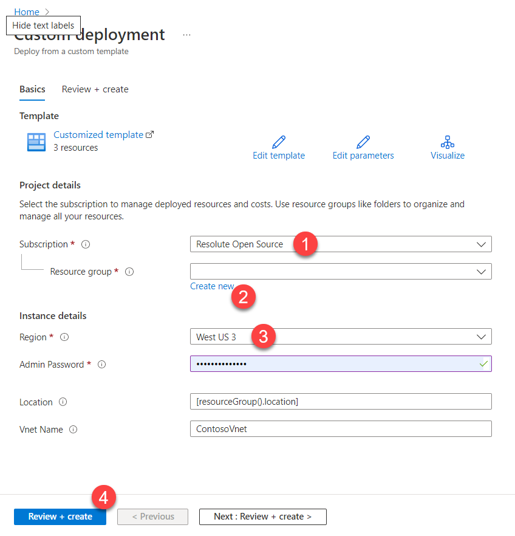
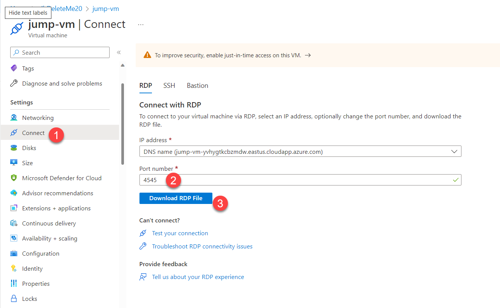

# Deploy RSNA demo infrastructure
This demo script deploys a simulated on-premises infrastructure that includes a PACS (Orthanc), simulated modalities (TBD), and a DICOM router (Qvera QIE).

| Using the All Up deployment which includes both Cloud and On-Prem deployments is the preferred approach. However, this individual script can be used, if only the on-prem deployment is needed.

## Prerequisites
- Azure CLI that includes Bicep support, if using CLI instead of Portal to deploy infrastructure
- Qvera QIE license
  - A 90-day trial license is easily available at https://www.qvera.com/hl7-interface-engine/#get-started-section. Scroll down to click the **Start a Free 90-day Trial** button, enter some information, and a key will be emailed immediately to your account.

## Steps
- Create the Azure environment. This can be done in one of two ways. You can use the Bicep command line, which is easiest if you are running this repo multiple times for development. Or you can use the Azure Portal user experience, which is easiest for a one-off deployment. Both create identical environments.
  - Azure Portal
    - To use reasonable default values, simply click 
      - (To customize deployment, click  instead.)
    - Fill in required information
      - Select an Azure subscription
      - Create a new Resource Group
      - Select an Azure region 
      - Enter a complex password to be used to log into the Jump-VM virtual machine later
      - Click *Review + create*
      - Click *Create*
      - .
  - ACI command line with Bicep
    - Clone this repo
    - Open a command line that has Azure CLI support and navigate to this folder (`./ahds_dicom_service_demos/demos/rsna)
    - Type the following commands:
      - `az login`
      - `az account set -s "<desired Azure Subscription Name>"  `
      - `az group create --location eastus --name yourUniqueResourceGroupName `
      - `az deployment group create --template-file .\deploy-rsna-demo-on-prem.bicep --resource-group yourUniqueResourceGroupName`
    - Enter a complex password that will be used later to log into the Jump-VM virtual machine that will be created
    - Wait until you have a successful deployment
- Open https://portal.azure.com and navigate to the Overview section of resource group you just created.
- In the list of created resources, click on the *jump-vm* virtual machine.
- Download the Remote Desktop RDP file
  - In the VM settings blad (to the left), click *Connect* (in the Settings section)
  - Change the Port Number from 3389 to 4545, and click *Download RDP File*
  - .
- The jump-vm.rdp file will appear in your downloads. Open that file.
- Log into the Jump-VM virtual machine
  - In the resulting dialog, dismiss any warnings and click *Connect*
  - When prompted to log in, click *more choices* the *Choose a different account* to type your own credentials.
  - In the email section, enter `.\student` and then enter the password you created above (when you ran the Bicep file).
  - If prompted with a warning, click "Yes" to connect.
- Configure Jump-VM
  - Click *Accept* for default privacy settings.
  - Click *Yes* to allow the VM to be discoverable to other devices on the network.
- Configure Edge browser
  - Open the Edge browser (link on Desktop)
  - Click on *Start without this data* to ignore logging in with your personal information
  - Click *Continue without this data* to ignore signing in with Google
  - Click *Confirm and start browsing*
  - Click "Skip" to not join MS rewards
  - Click *Next* to use default theme
  - Click *Finish* to complete configuration
- Connect to Qvera
  - Using Edge, navigate to `http://10.0.1.4:80` 
  - When prompted with the QIE login, click *Login*
  - When prompted to change your password, choose one you can remember.
  - When prompted to enter your License, refer to the email you received when you signed up for an account. Enter both the License ID and the Activation Code, and click *Get License*
- Connect to Orthanc
  - Using Edge, navigate to `http://10.0.2.4:8042` 
  - Enter `orthanc` as username and `orthanc` as password.