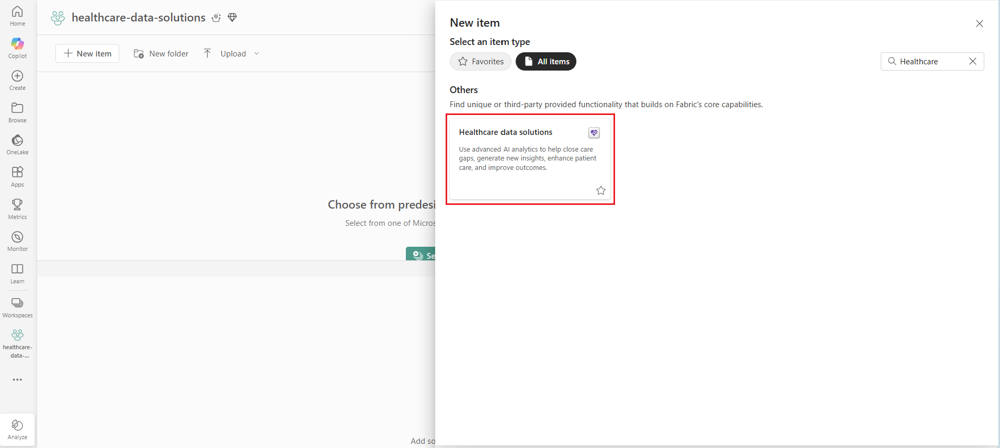
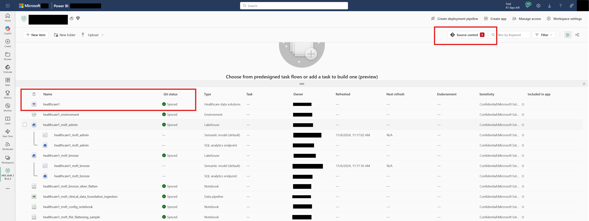
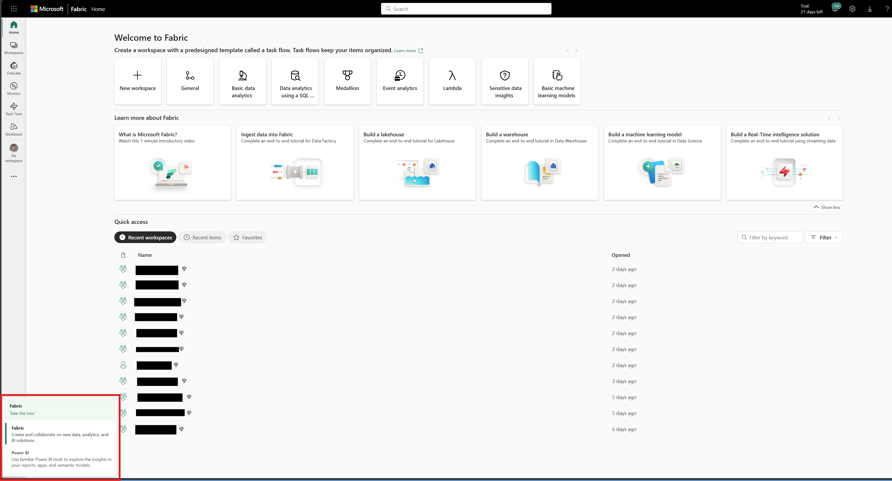
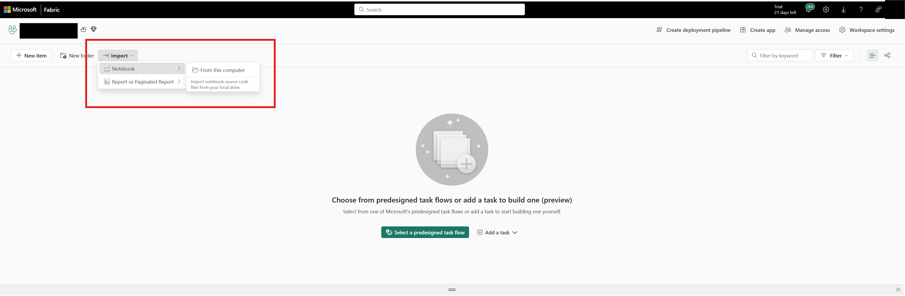
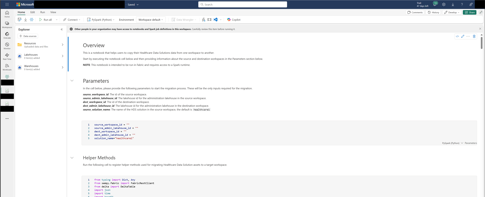

## Healthcare data solutions in Microsoft Fabric ALM Helper

## Overview 

Healthcare data solutions in Microsoft Fabric help you accelerate time to value by addressing the critical need to efficiently transform healthcare data into a suitable format for analysis. With these solutions, you can conduct exploratory analysis, run large-scale analytics, and power generative AI with your healthcare data. More information about Healthcare data solutions on Fabric can be found [here](https://learn.microsoft.com/en-us/industry/healthcare/healthcare-data-solutions/overview).

This sample provides a notebook for customers who have already deployed their Healthcare data solutions item in Fabric and want to take advantage of Application Lifecycle Management (ALM). ALM allows developers who are developing in Fabric to apply the capabilities of familiar source control tools to manage Fabric items.

There are some additional, manual steps to be able to run Helathcare data solutions capabilities after syncing a workspace with ALM. The `hds_alm_helper` notebook attempts to streamline these manual steps. 

## Prerequisites

There are a few prerequisites before running the sample `hds_alm_helper` notebook.

### Healthcare data solutions is deployed in source workspace

First, it is required that you have already deployed an instance of Healthcare data solutions and one or more capabilities following [these steps](https://learn.microsoft.com/en-us/industry/healthcare/healthcare-data-solutions/deploy?toc=%2Findustry%2Fhealthcare%2Ftoc.json&bc=%2Findustry%2Fbreadcrumb%2Ftoc.json).

### Source workspace is synchronized

Second, it is required that you have connected a source Workspace to Git and/or are using deployment pipelines to move the Healthcare data solution item to a destination workspace. A guide for onboarding to Git Integration can be found [here](https://learn.microsoft.com/en-us/fabric/cicd/git-integration/git-get-started?tabs=azure-devops%2CAzure%2Ccommit-to-git). More information on deployment pipelines can be found [here](https://learn.microsoft.com/en-us/fabric/cicd/deployment-pipelines/get-started-with-deployment-pipelines?tabs=from-fabric%2Cnew%2Cstage-settings-new).

### A new destination Workspace is created and synchronized

Finally, it is required that you [create a new destination workspace](https://learn.microsoft.com/en-us/fabric/get-started/create-workspaces) and synchronize your Healthcare data solution item dependencies. After creating the destination workspace and [updating from the git repo](https://learn.microsoft.com/en-us/fabric/cicd/git-integration/git-get-started?tabs=azure-devops%2CAzure%2Ccommit-to-git#update-workspace-from-git) or using a deployment pipeline.

If using Git, confirm destination workspace successfully synchronized:

You are ready to run the sample notebook!

## What does the sample notebook do?

The `hds_alm_helper` notebook helps copy important system configuration files, creates folders and tables, and updates metadata of other Fabric items in your workspace. This saves an immense amount of time and allows you to quickly start managing your healthcare data.

## Getting Started

If you meet the criteria defined in the scenario overview above, all you need to do to run the `hds_alm_helper` notebook is import it into the **_source_** Fabric workspace, open the notebook, and run through the cells.

### Importing the Notebook

Start by selecting the icon located in the bottom left corner and make sure Fabric is selected.

In the synchronized workspace, import the notebook from your local machine.

### Running the Notebook

After importing the notebook, you can open it and start the migration procress. The notebook will require information about the source and destination workspace but should not require any additional modification. Additional guidance is included in the notebook.

