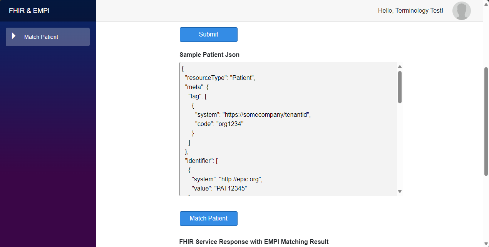
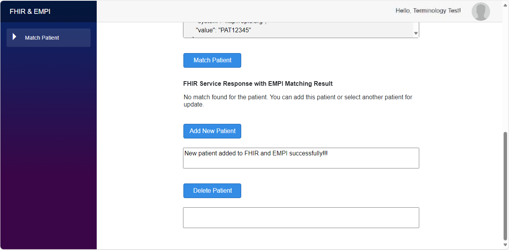
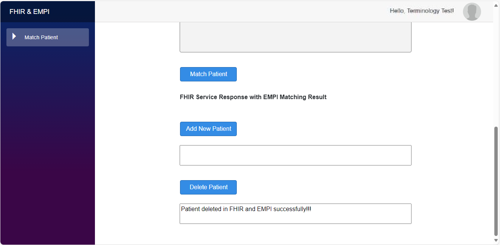

# External Enterprise Master Patient Index (EMPI) Service integration with AHDS FHIR service

Sample shows how an external EMPI service can be used in conjunction with the AHDS FHIR service by providing a unified endpoint for AHDS FHIR service as well as EMPI Operations.

## Architecture
This architecture explains how a web application communicates with a EMPI service and FHIR service via an EMPI Connector (Azure Function App).

## The Architecture components
- **Static Web App**: Blazor UI Application for $match and CRUD operations for patient on FHIR service ad EMPI service
- **Event Hub**: It can process and store events, data and telemetry produced by FHIR Service.
- **Events**: Events allow you to subscribe to and receive notifications of changes to health data in the FHIR service
- **EMPI Connector App**: It executes $match operation and handles Events triggered.
- **EMPI service**: This is a sample service for demonstration of patient matching that contains demographic data for sample patients.
- **AHDS FHIR service**: AHDS FHIR Service, contains healthcare data including patients

## Operation Sequence

The Sequence diagram show the the order of communication among the components for Match, Add, update and Delete patient operations.

### Match and Add Patient

### Match and Update/Delete Patient

## Prerequisites

 * An Azure account with an active subscription.
	- You need access to create resource groups, resources, and role assignments in Azure

 * AHDS FHIR service deployed in Azure. For information about how to deploy the FHIR service, see [Deploy a FHIR service](https://learn.microsoft.com/en-us/azure/healthcare-apis/fhir/fhir-portal-quickstart).

 * Postman installed locally. For more information about Postman, see [Get Started with Postman](https://www.getpostman.com/).
 
 * Knowledge of how to access the FHIR service using Postman, including [registering the client application to access the FHIR service](https://github.com/microsoft/azure-health-data-services-workshop/blob/main/resources/docs/Postman_FHIR_service_README.md#step-1---create-an-app-registration-for-postman-in-aad) and granting [FHIR Data Contributor](https://github.com/microsoft/azure-health-data-services-workshop/blob/main/resources/docs/Postman_FHIR_service_README.md#step-2---assign-fhir-data-contributor-role-in-azure-for-postman-service-client) permissions. In case you don't have postman setup to access FHIR Service, Please follow this tutorial: [Access using Postman | Microsoft Learn](https://learn.microsoft.com/en-us/azure/healthcare-apis/fhir/use-postman).

 * Working External EMPI Service URL and authentication details.

 * [.NET 8.0](https://dotnet.microsoft.com/download)

 * [Azure Command-Line Interface (CLI)](https://docs.microsoft.com/cli/azure/install-azure-cli)

 * [Azure Developer CLI](https://docs.microsoft.com/azure/developer/azure-developer-cli/get-started?tabs=bare-metal%2Cwindows&pivots=programming-language-csharp#prerequisites)

 * Clone this repo.

 ### Prerequisite check

- In a terminal or command window, run `dotnet --version` to check that the .NET SDK is version 8.0 or later.
- Run `az --version` and `azd version` to check that you have the appropriate Azure command-line tools installed.
- Login to the Azure CLI
- Launch Postman app.

> **_NOTE:_** 
> For this sample we have used [Azure AI Search](https://learn.microsoft.com/en-us/azure/search/search-what-is-azure-search) service as an external EMPI service. In case you are using different external EMPI service, The code may have to be updated as per the authentication requirements for the external EMPI service.

### Static Web App (UI) and Postman queries

UI application and Postman queries use common endpoint for EMPI service operations and FHIR service Operations.

The UI application demonstrates $match and CRUD operations for patient, those operations are routed to external EMPI service by EMPI Connector app. 

### Postman Queries
The postman queries to demonstrate EMPI API call for $match operation is available in `FHIR Collection` postman collection [samples](https://github.com/Azure-Samples/azure-health-data-services-samples/tree/main/samples/sample-postman-queries) repo.

## Setting up application locally 
### Visual Studio

#### EMPI UI APP
* Clone the repo, under path *\samples\fhir-empi-integration\ui-app, Open the `FhirBlaze.sln` project in Visual Studio.
* This application is based on sample app [here](https://github.com/microsoft/azure-health-data-services-workshop/tree/main/Challenge-10%20-%20Optional%20-%20FhirBlaze%20(Blazor%20app%20dev%20%2B%20FHIR)), please refer Readme file for configuration of project. Follow step 1 & 3 only, skip step 2.
* Set FhirBlaze project as StartUpProject
* Run FhirBlaze Application.

#### EMPI Connector APP
* Navigate to *\samples\fhir-empi-integration\empi-connector, Open the `EMPIShim.sln` project in Visual Studio.
* Create `local.settings.json` file inside EMPIShim folder.
* Add the following name and value:
    - `AzureWebJobsStorage` : `UseDevelopmentStorage=true`
	- `EMPIFHIRSystemId` : FHIR Service Url 
	- `EMPIProvider` : `EMPIShim.NextGateEMPIProvider`
	- `evconnect` : Connection-String of Event Hub you created earlier
	- `FS_CLIENT_ID` : EMPI Connector App Registration Client ID you create earlier
	- `FS_ISMSI` : true/false
	- `FS_RESOURCE` : `https://<Expose-API-App-Registration-Name>.<primary-domain-of-tenant>`
	- `FS_SECRET` : EMPI Connector App Registration Secret you created earlier 
	- `FS_TENANT_NAME` : Tenant ID
	- `FS_URL` : FHIR Service URL
	- `SEARCH_API_KEY` : Azure AI Search service key
	- `SEARCH_ENDPOINT` : Azure AI Search service URL
	- `SEARCH_INDEX` : Azure AI Search service index name
	-`FUNCTIONS_WORKER_RUNTIME` : `dotnet`
* Set EMPIShim project as StartUpProject
* Run EMPIShim Application.

## Deploying the Sample on Azure:

In order to deploy the EMPI Sample on Azure portal you will need to clone the repository, create certain resources, app registrations manually and later publish the application from Visual Studio:

1. Create FHIR Service: Follow this [link](https://learn.microsoft.com/en-us/azure/healthcare-apis/fhir/deploy-azure-portal) to create FHIR Service.
	- Add `FHIR Data Contributor` role to the test user.
1. Create Event Hub: Follow this [link](https://learn.microsoft.com/en-us/azure/event-hubs/event-hubs-create) to create Event Hub
1. Create Events for FHIR Service: Follow this [link](https://learn.microsoft.com/en-us/azure/healthcare-apis/events/events-deploy-portal) to create Events for FHIR Service.
1. Create App Registration for EMPI Connector App:
	- Go to `App Registrations`
    - Create a new application. 
    - Click `Register` (ignore redirect URI).
	- Go to `Certificates & secrets` and add new secret.
	- Save the secret and client id of this application.
	- Assign `FHIR Data Contributor` role to this application on FHIR Service.
1. Create App Registration to Expose API:
	- Go to `App Registrations`
	- Create a new application. 
    - Click `Register` (ignore redirect URI).
	- Go to `Expose an API`, add Application ID URI
	- Add the following URI `https://<Expose-API-App-Registration-Name>.<primary-domain-of-tenant>` and click save.
	- Click on Add a scope
	- Enter the following values
		- Scope name = user_impersonation
		- Who can consent = Admins and users
		- Admin consent display name = Access Azure Healthcare APIs
		- Admin consent description = Allow the application to access Azure Healthcare APIs on behalf of the signed-in user.
		- state = enabled
	- click save.
1. Enable CORS and Update FHIR Service Audience:
	- Navigate to FHIR Service you created earlier
	- Go to `CORS`
	- Add `*` inside Origins and Headers
	- Select all the methods and
	- Go to `Authentication`
	- Replace the value for Audience with `https://<Expose-API-App-Registration-Name>.<primary-domain-of-tenant>`
	- click save.
1. Steps to Publish EMPI Connector App:
	- Navigate to `empi-connector` folder in the cloned repo and open the `EMPIShim.sln` solution using Visual Studio.
	- Navigate to `EMPIUpdate.cs` file update the value `empievents` with the name of Event Hub you created earlier.
	- Follow this [link](https://learn.microsoft.com/en-us/azure/azure-functions/functions-develop-vs?pivots=isolated#publish-to-azure) to publish EMPI Connector App to Azure portal.
	
	Note: While creating the function app select Consumption as plan type and Linux as operating system. 

1. Enable CORS and Setup configuration for EMPI Connector App:
	- Go to the EMPI Connector Function App on Azure Portal which you created earlier.
	- Go to `CORS`, add `*` inside allowed Origins and click save.
	- Go to `Environment variables` and add the following name and value:
	    - `AzureWebJobsStorage` : Storage Account Connection string 
		- `EMPIFHIRSystemId` : FHIR Service Url 
		- `EMPIProvider` : `EMPIShim.NextGateEMPIProvider`
		- `evconnect` : Connection-String of Event Hub you created earlier
		- `FS_CLIENT_ID` : EMPI Connector App Registration Client ID you create earlier
		- `FS_ISMSI` : true/false
		- `FS_RESOURCE` : `https://<Expose-API-App-Registration-Name>.<primary-domain-of-tenant>`
		- `FS_SECRET` : EMPI Connector App Registration Secret you created earlier 
		- `FS_TENANT_NAME` : Tenant ID
		- `FS_URL` : FHIR Service URL
		- `NEXTGATE_URL` : EMPI Server URL
	        - `NEXTGATE_USERNAME` : EMPI Server User's Username
	        - `NEXTGATE_PASSWORD` : EMPI Server User's Password
	    - `FUNCTIONS_WORKER_RUNTIME` : `dotnet`

Note: If you are using azure for deployment use EMPIShim.AzureSearchEMPIShim instead of EMPIShim.NextGateEMPIProvider as EMPIProvider

1. Create App Registration for EMPI UI App:
	- Go to `App Registrations`
	- Create a new application
	- Select single-page application (SPA) and add the redirect URL `https://localhost:5004/authentication/login-callback`
		- Localhost is useful for debugging - we will add the Azure redirect URI after deploying EMPI UI App.
	- Go to `API Permissions` and add the `user_impersonation` scope from your Expose API application.
    - Click `Add a Permission` then `APIs my organization uses`.
    - Select the Expose API application you created earlier.
    - Choose `Delegated permissions` then `user_impersonation`.
    - Finally, click `Add permission` to save.
	- Save the client id of this application.
1. Setup configuration for EMPI UI App:
	- Navigate to `ui-app` folder in the cloned repo and open the `FhirBlaze.sln` solution using Visual Studio.
	- Open the `appsettings.json` file from FhirBlaze/wwwroot folder.
	- Replace the values for following:
		- [clientId] : Client ID of the EMPI UI App Registration
		- [scope] : `https://<Expose-API-App-Registration-Name>.<primary-domain-of-tenant>/user_impersonation`
		- [fhir-url] : FHIR Service URL
		- [empi-connector-url] : Function App's url which you published earlier
		- [empi-connector-api-key] : add the App keys present in the Function App which you published earlier.
	- Add `https://<Expose-API-App-Registration-Name>.<tenant-name>.onmicrosoft.com/user_impersonation` along with openid and offline_access inside the GraphScopes.
1. Steps to Publish EMPI UI App:
	- Follow this [link](https://learn.microsoft.com/en-us/aspnet/core/blazor/host-and-deploy/webassembly/azure-static-web-apps?view=aspnetcore-8.0) to publish EMPI UI App.
	- Add the redirect URL `https://{{empi-ui-app-url}}/authentication/login-callback` within your EMPI UI App Registration.

Note: If you are facing any issues while deployment, refer to [troubleshooting](./TROUBLESHOOTING.md)

## UI Application Walkthrough:

1. After launching UI application user will be redirected to below landing page, Click on login, select/enter username and password.

    

2. On successful login, user can see the username in top right corner.

	

3. Submit form to find Sample Patient.

	

4. If there is a match for above Patient then the Sample Patient Json box is populated with Patient Json.

	

5. If there is no match for above Patient then the Sample Patient Json box is populated with No Patient Found.

	
6. Click the Match Patient button to match Patient from the FHIR Service. If no matches are found then you can add that patient to FHIR Service.

	

7. Click Add New Patient button to add the Patient to FHIR Service. You can see the result inside the textbox below the Add New Patient button.

	

8. If there is a Match for Patient then the list of matched patient will be displayed below in tabular format.

	

9. Select the particular patient which you want to update or delete using the button in the Actions column.

	

10. Enter the value inside the Update Patient Json form. You can update patient's last name, phone number and birth date. You can see the update result inside the textbox by clicking the Update Patient button.

	

11. Select the patient using the button from Actions column to delete the patient. On clicking Delete Patient button you will get a pop-up confirmation for deletion.

	

12. You can find the delete result inside the textbox below Delete Patient button.

	
