# External Terminology Service integration with AHDS FHIR service

Sample shows how an external terminology service can be used in conjunction with the AHDS FHIR service by providing a unified endpoint for AHDS FHIR service as well as Terminology Operations.

## Architecture
This architecture explains how a web application communicates with a terminology service and FHIR service via an Azure API management service (APIM).

## The Architecture components
- Static Web App: Blaze UI Application for lookup and translating the codes
- API Management service (APIM): The call from the UI (Static Web Apps) hits the APIM and diverts the call as per the request to terminology server and FHIR service.
  - Terminology server : It contains terminology server codes
  - AHDS FHIR service : It contains the FHIR Data

## Prerequisites

 * An Azure account with an active subscription.
	- You need access to create resource groups, resources, and role assignments in Azure

 * AHDS FHIR service deployed in Azure. For information about how to deploy the FHIR service, see [Deploy a FHIR service](https://learn.microsoft.com/en-us/azure/healthcare-apis/fhir/fhir-portal-quickstart).
 
 * Knowledge of how to access the FHIR service using Postman, including [registering the client application to access the FHIR service](https://github.com/microsoft/azure-health-data-services-workshop/blob/main/resources/docs/Postman_FHIR_service_README.md#step-1---create-an-app-registration-for-postman-in-aad) and granting proper [FHIR Data Contributor](https://github.com/microsoft/azure-health-data-services-workshop/blob/main/resources/docs/Postman_FHIR_service_README.md#step-2---assign-fhir-data-contributor-role-in-azure-for-postman-service-client) permissions. In case you don't have postman setup to access FHIR Service, Please follow this tutorial: [Access using Postman | Microsoft Learn](https://learn.microsoft.com/en-us/azure/healthcare-apis/fhir/use-postman).

 * Working External Terminology Service URL and authentication details.

 * [.NET 6.0](https://dotnet.microsoft.com/download)

 * [Azure Command-Line Interface (CLI)](https://docs.microsoft.com/cli/azure/install-azure-cli)

 * [Azure Developer CLI](https://docs.microsoft.com/azure/developer/azure-developer-cli/get-started?tabs=bare-metal%2Cwindows&pivots=programming-language-csharp#prerequisites)
	  
 * Postman installed locally. For more information about Postman, see [Get Started with Postman](https://www.getpostman.com/).
 * Clone the repo.

### Prerequisite check

- In a terminal or command window, run `dotnet --version` to check that the .NET SDK is version 6.0 or later.
- Run `az --version` and `azd version` to check that you have the appropriate Azure command-line tools installed.
- Login to the Azure CLI

## Overview

This sample uses an Azure APIM which acts as Common Endpoint Application for External Terminology Service (Third Party Terminology Service) and AHDS FHIR Service along with a UI application and Postman scripts.

- **Azure API Management Service**

	The APIM handles the routing and authentication part for external terminology service and AHDS FHIR service.

	The APIM routes $validate-code, $lookup, $translate, $expand, $find-matches, $subsumes and $closure operations to a third party terminology service and routes Search Observation and Save Observation operations to AHDS FHIR Service.

	- Useful links for APIM:
		1. [About Azure APIM](https://learn.microsoft.com/en-us/azure/api-management/api-management-key-concepts)
		2. [Useful APIM terminologies](https://learn.microsoft.com/en-us/azure/api-management/api-management-terminology)
		3. [Azure APIM backends](https://learn.microsoft.com/en-us/azure/api-management/backends?tabs=bicep)
		4. How to add [API](https://learn.microsoft.com/en-us/azure/api-management/add-api-manually) in Azure APIM instance.
		5. Azure APIM [Policies](https://learn.microsoft.com/en-us/azure/api-management/policies/)
		6. How to configure [authentication and authorization](https://learn.microsoft.com/en-us/azure/api-management/authentication-authorization-overview) in APIM.

	__Note:__ In this sample, The APIM uses client Id and client secret for authenticating calls to external third party terminology service. APIM will need changes in case external third party  terminology service uses different kind of authentication.

## Azure APIM sample details:
Here we will go through high level steps to create an Azure APIM instance with Backend, Policies and APIs, somilar to the one used for this sample.

1. Create Azure APIM Instance
Create an Azure APIM instance following steps [here](https://learn.microsoft.com/en-us/azure/api-management/get-started-create-service-instance) and come back for next step.
2. Create APIs:
	
	a. In the cloned repo, go to at location (../samples/fhir-terminology-service-integration/apim)
	b. Open file "FHIR Terminology.openapi+json.json" in Editor.
	c. Add your fhir service url for backend at hoghlighted place and save the file.
		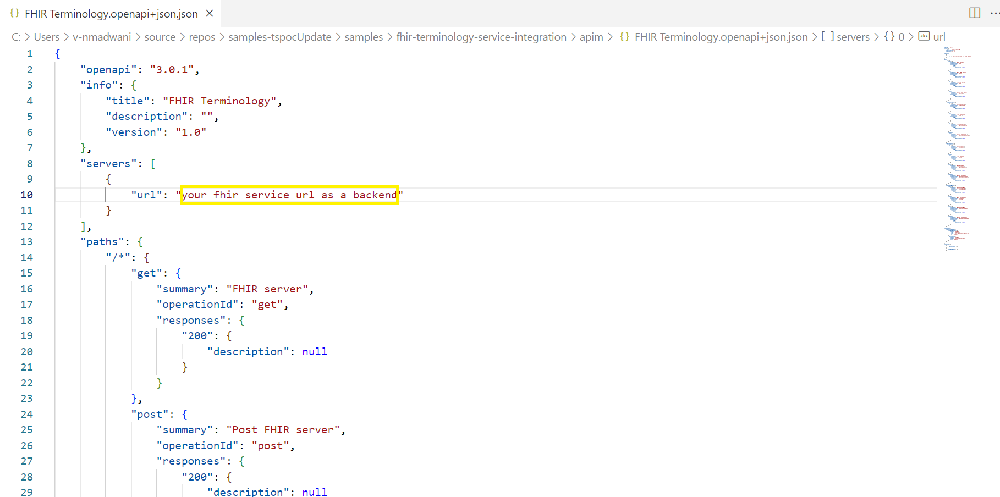
	d. Go to "APIs" tab, click on "Add API" and select "OpenAPI" from "Create from definition" section as highlighted below:
		
		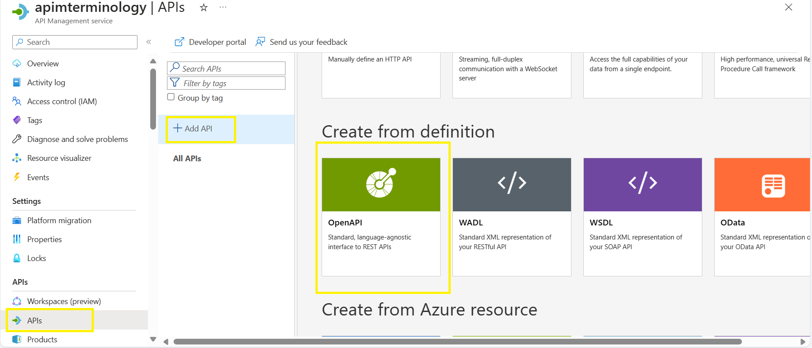
		
	e. In the new popup window, click on "Select a file" and browse file "FHIR Terminology.openapi+json.json" at loaction (../samples/fhir-terminology-service-integration/apim).
		
		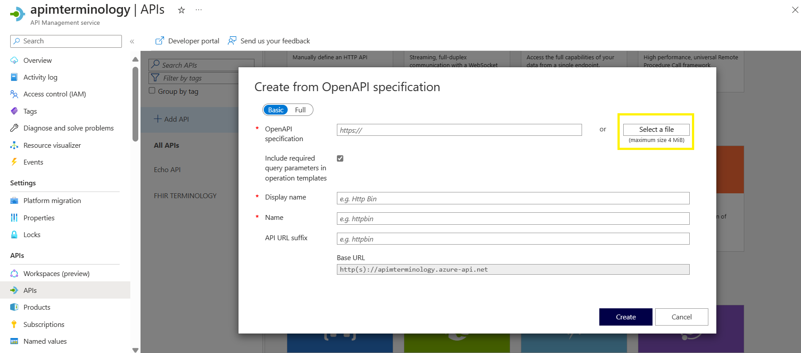
		
	f. After you select the file, fileds will be filled with values as shown below, you can change values of "Display Name" and "Name" fileds. Click on "Create".
		
		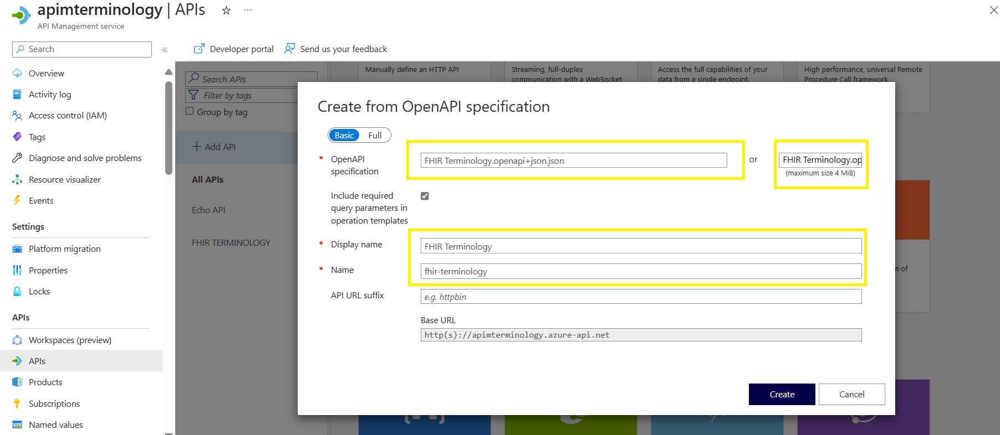
		
	g. As shown below, API willget created with list of operations and backend is fhir service url for all operations.
		
		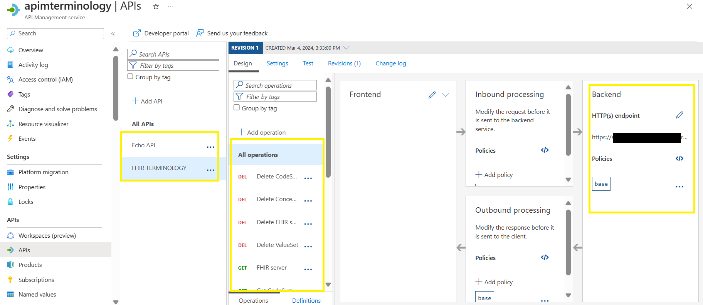

	
3. Create Policy Fragment:
	a. In the cloned repo, go to at location (../samples/fhir-terminology-service-integration/apim)
	b. Open file "PolicyFragments.xml file" in editor and update the values for highlighted fields as per your 3P teminology service requirements.
		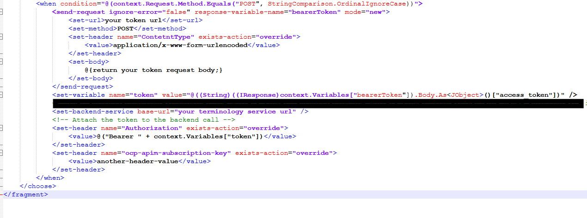
	c. After you are done editing save the changes and copy all the text.
	d. Go back to your APIM instance and go to "Polict Fragments" tab, click on "Create", new popup will open, Enter polict name, description and add copied text for policy and click in "Create".
		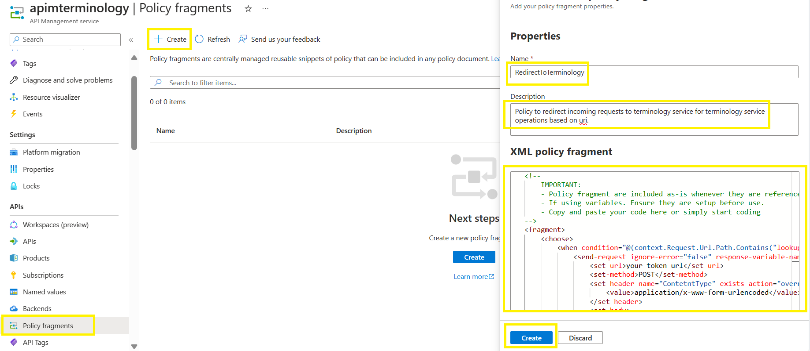
	d. Once policy is successfully created, you can see it in "Polict Fragments" tab.
		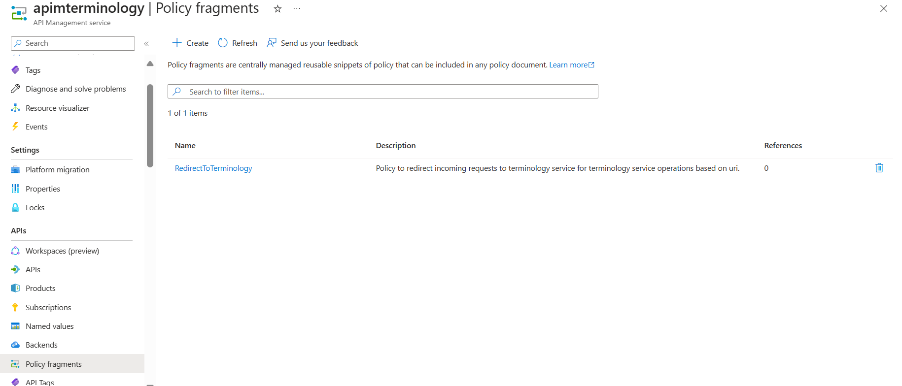

4. Add Policy to API operations:
	a. Go to "APIs" tab select "FHIR Terminology" select an operation to apply the policy and click on "Add Policy" in "inbound processing" section as shown below:
		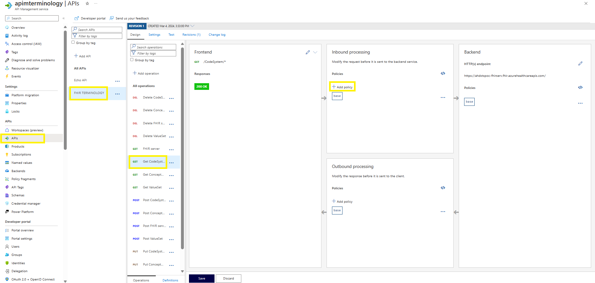
	b. Select Other policies option as highlighted:
		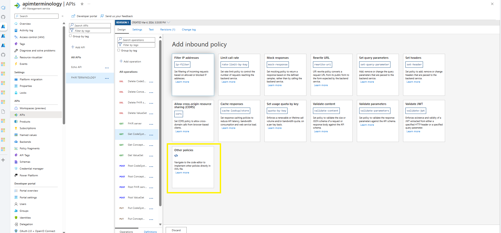
	c. In xml, Add a code fragment to include policy fragment "RedirectToterminology", as shown and click on "Save":
		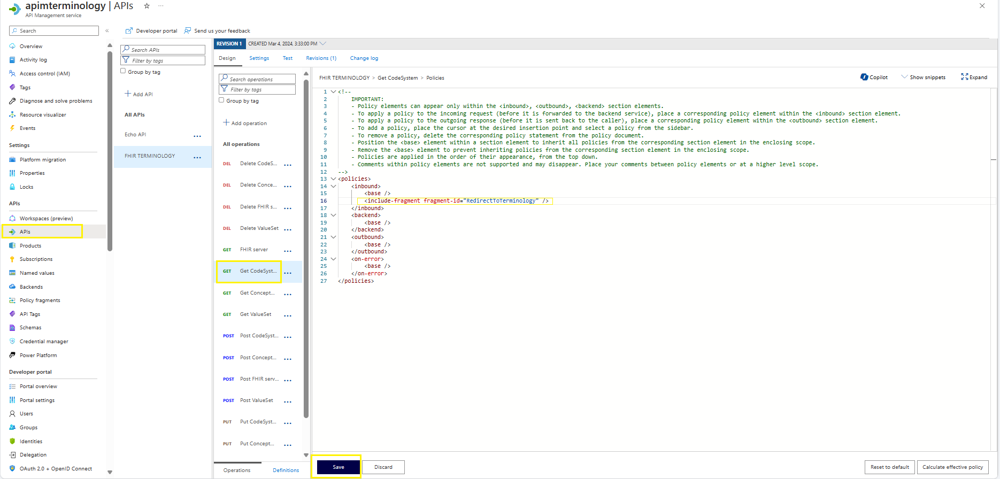
	d. Policy is added to API operation in inbound processing as shown:
		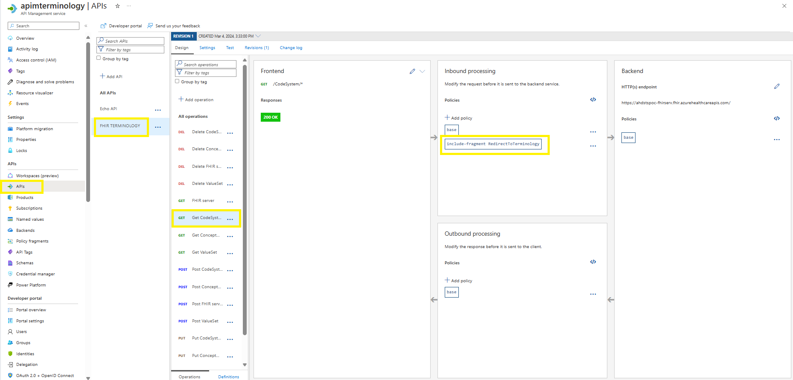

Following the above steps and sample templates users can create more APIs, Operations and Policies as needed.

- **Static Web App (UI) and Postman queries**

	UI application and Postman queries use common APIM endpoint for termonology service operations and FHIR service Operations.

	The UI application demonstartes $lookup and $translate operations, those operations are routed to external terminology service by APIM. 

	The UI Application also demonstartes operations for searching Observation resources from FHIR service and saving translated Observation resources to FHIR service, the search and save operations are routed to AHDS FHIR Service by APIM.

	- **Postman Queries**

	The postman queries to demonstare Common Endpoint Application (APIM) routing calls to external terminology service and AHDS FHIR Service via single endpoint are available under `FHIR & Terminology Service Integration` folder in `Fhir Collection` postman collection available in [samples](https://github.com/Azure-Samples/azure-health-data-services-samples/tree/main/samples/sample-postman-queries) repo. For Queries in this folder, we are using APIM URL as our base URL and auth token of FHIR service to authenticate requests.

## Setting up application locally 
### Visual Studio

* Clone the repo, under path *\samples\fhir-terminology-service-integration\ui-app, Open the `FhirBlaze.sln` project in Visual Studio.
* This application is based on sample app [here](https://github.com/microsoft/azure-health-data-services-workshop/tree/main/Challenge-10%20-%20Optional%20-%20FhirBlaze%20(Blazor%20app%20dev%20%2B%20FHIR)), please refer Readme file for configuration of project. Follow step 1 & 3 only, skip step 2.
* Set FhirBlaze project as StartUpProject
* Run FhirBlaze Application.

## UI Application Walkthrough:

1. After launching UI application user will be redirected to below landing page, Click on login, select/enter username and password.

	

2. On successful login, user can see the username in top right corner as highlighted.

	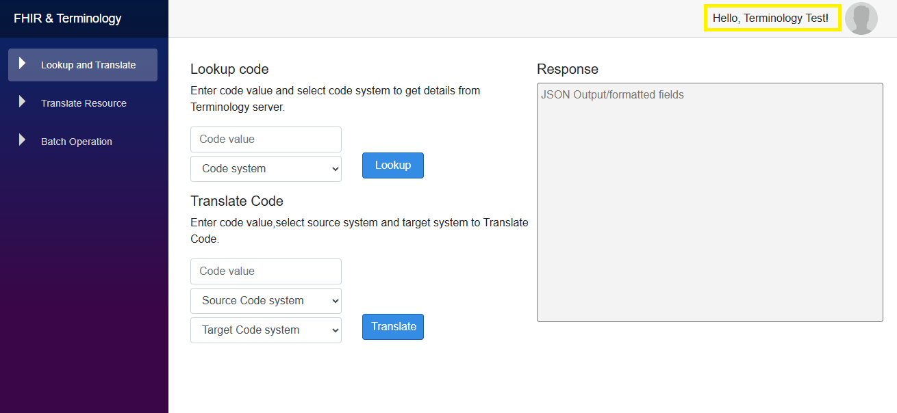

3. First/Landing page is "Lookup and Translate". It allows user to perform lookup and translate operations on terminology service.

4. For Lookup, Enter code & select code system, Click on lookup button to get the�code details from terminology service.

	

	The reponse json is shown in "Response" text area and some important details from response are also shown in table at bottom of the page for easy readability.

5. For Translate, Enter code, select source system & target system, Click on�Translate button to get the default Terminology mappings between source code and target code.

	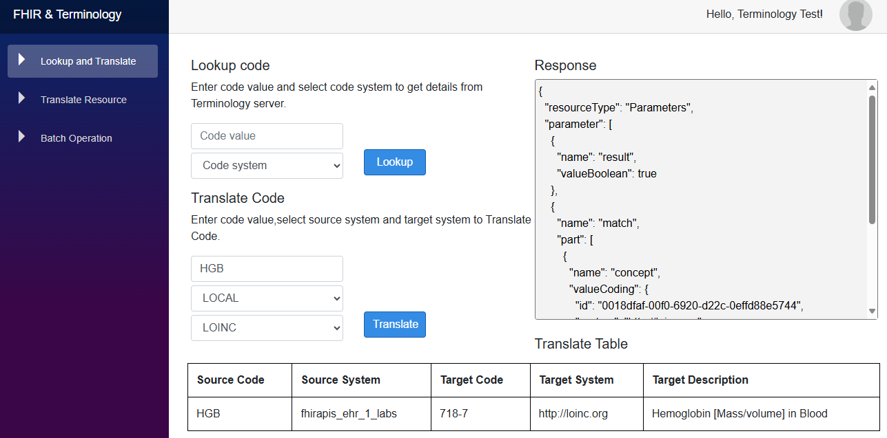

6. Second page is "Translate Resource". It allows user to search for an `Oservation` resource using patient name, user can translate the code in `Observation` resource with Translate and save the translated `Observation` resource to AHDS FHIR Service. Reset operation is also available which will restore the `Observation` resources to original state as it was prior to translate.

7. Navigate to "Translate Resource" page, enter the first or last name of `Patient`, Click on the Search button to fetch latest `Observation` for the `Patient`.

	
	
	The left hand side of text area show the `Observation` resource fetched from AHDS FHIR Service.

8. Click on Translate Resource Button to check the translated resources.

	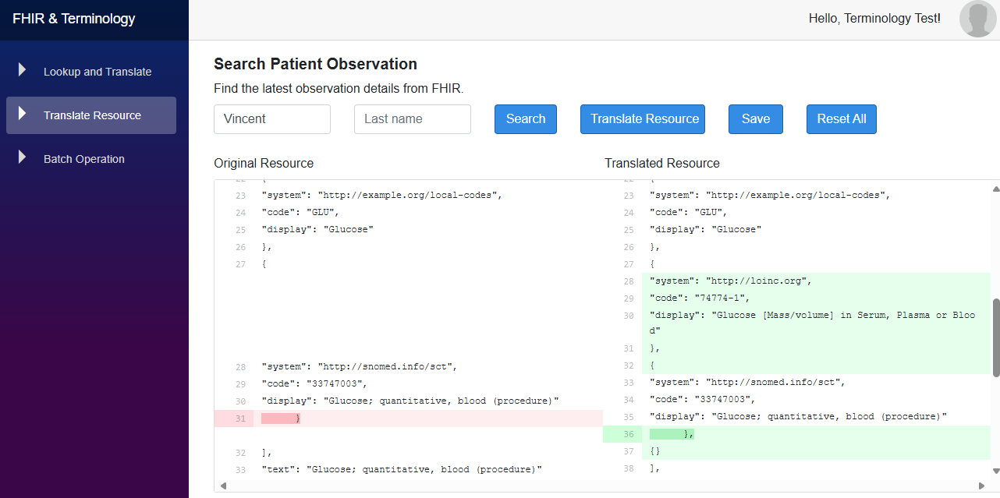

	The right hand side of text area show the Translated `Observation` resource, it will also highlight the difference between original `Observation` resource and translated `Observation` resource

9. Click on Save button to Update the Translated Resource to the FHIR Server.

	

	Once the the translated `Observation` resource is saved user can see the updated version Id in reponse as highlitghted.

10. Click on Reset All button to Update the Translated Resource to the FHIR Server.

	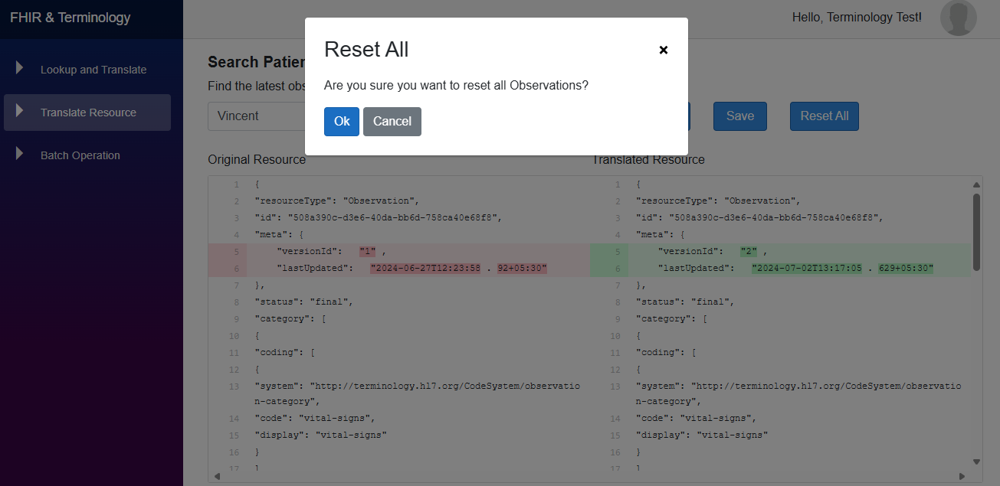

11. A success message will be shown once the reset is done.

	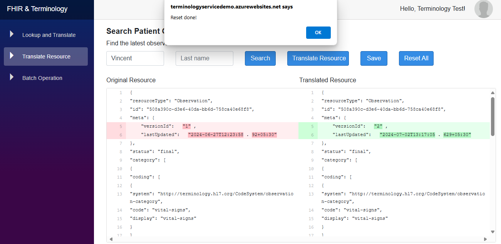

	On reset the version Id of the `Observation` resource will be incremented.

12. Click on the search button again to verify reset of `Observation` resource.

	
	
