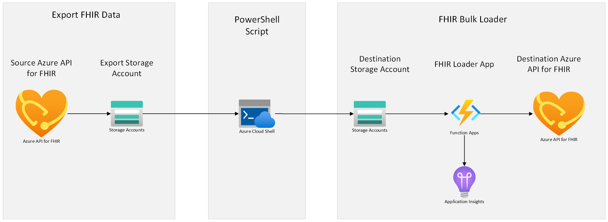

# Copying Data from one Azure API for FHIR server to another Azure API for FHIR server

This sample will focus on how to copy FHIR data from one Azure API for FHIR server to another Azure API for FHIR server. This sample app utilizes [$export](https://learn.microsoft.com/en-us/azure/healthcare-apis/azure-api-for-fhir/export-data) (which allows you to filter and export certain data according to your [query](https://learn.microsoft.com/en-us/azure/healthcare-apis/azure-api-for-fhir/export-data#query-parameters)) to export data from a source Azure API for FHIR server, and [FHIR Loader](https://github.com/microsoft/fhir-loader) to import to the destination Azure API for FHIR server. 
Note: This tutorial is only for Azure API for FHIR and does not apply for the new Azure Health Data Services FHIR service. For more information on the different FHIR capabilities from Microsoft, see [here](https://learn.microsoft.com/en-us/azure/healthcare-apis/fhir/overview#fhir-platforms-from-microsoft).

## Architecture Overview



# Prerequisites needed
1.	Microsoft work or school account
2.	Two Azure API for FHIR instances.
	-	**Source**: One instance from where the data will be exported from.
		- Get the Azure API for FHIR server URL:
			```PowerShell
			https://<<SOURCE_ACCOUNT_NAME>>.azurehealthcareapis.com/
			```
	-	**Destination**: Second instance where the data will be imported to.
		- Get the Azure API for FHIR server URL:
			```PowerShell
			https://<<DESTINATION_ACCOUNT_NAME>>.azurehealthcareapis.com/
			```
## Deployment
1. Deploy the FHIR Bulk Loader. Go to [FHIR Bulk Loader](https://github.com/microsoft/fhir-loader) and follow the [deployment steps](https://github.com/microsoft/fhir-loader#deployment).

	**NOTE**: Pass the **destination** Azure API for FHIR server details while deploying the FHIR Bulk Loader
	
	Once FHIR loader is deployed, it will create the following resources:
	- Resource Group
	- Storage Account (container/queues)
	- App Service Plan
	- Function App
	- Event Grid
	- Key Vault
	- Application Insight
	
	The FHIR Bulk Loader will be linked to the **destination** Azure API for FHIR server on which the data will be imported.

2. Export data from the **source** Azure API for FHIR server.
	1. If you want to use single storage account in data movement process, use the storage account created above from FHIR Bulk Loader deployment and upgrade it to ADLS Gen2 following [steps](https://learn.microsoft.com/en-us/azure/storage/blobs/upgrade-to-data-lake-storage-gen2-how-to?tabs=azure-portal). 
		- Now use the upgraded storage account in next step configuration.
	2. Follow steps [here](https://learn.microsoft.com/en-us/azure/healthcare-apis/azure-api-for-fhir/configure-export-data) to configure export on Azure API for FHIR server.
	3. Once the export configuration is setup, run the export command on Azure API for FHIR server.
	Follow the [steps](https://learn.microsoft.com/en-us/azure/healthcare-apis/azure-api-for-fhir/export-data) to run the export command.
		- The GET commands can be run on Postman.
		**Examples**:  
			If you'd like to run a system export:
			``` PowerShell
			GET https://<<Source FHIR Server URL>>/$export?_container=<<CONTAINER NAME>>
			```
			If you'd like to export per resource:
			``` PowerShell
			GET https://<<Source FHIR Server URL>>/$export?_container=<<CONTAINER NAME>>&_type=<<RESOURCE TYPE>>
			```
			**NOTE** : Specify the container name where the export of the resources will be done. If the container is not present in storage account export command will create it.

	4. If you export per resource, you will need to manually run the above command once per resource type. Execute the export jobs in parallel to minimize wait times, and note down the job IDs to check the execution status for each export job. 
	
	5. You can check the $export operation status through the URL in the Content-Location header (these are Job IDs) that is returned in the FHIR service response.

		**Examples**:
		```PowerShell
		GET https://<<SOURCE_ACCOUNT_NAME>>.azurehealthcareapis.com/_operations/export/<<JOB_ID>>
		```
		It will give type, URL and count of the resources exported. Note down the exported FHIR resource count as it will be useful in data movement verification step later.
	6. The instructions also list [query parameters](https://learn.microsoft.com/en-us/azure/healthcare-apis/azure-api-for-fhir/export-data#query-parameters) that can be used to filter what data gets exported.
	7. The exported data will be in the format of NDJSON files that are stored in a new container which was created during the export configuration process.

3. Provide privilege to your account.
	You must provide the following roles to your account to run the PowerShell script in the next step.
	- In the Storage Accounts (Source/Destination) created during the above steps, select the Access Control (IAM) and assign the **Storage Blob Data Contributor** role to your account.

4. Using FHIR Loader to import data

	 - Running the PowerShell script will do the following process:

		1. Copy the NDJSON files from the source storage account container to the destination storage account container ('ndjson' container) which is linked to FHIR Bulk Loader.
		2. Once the data is copied to the destination storage container the FHIR Bulk Loader will start importing the data to linked Azure API for FHIR server.

	- To run the PowerShell Script, perform the following steps:

		1. [Open Azure Cloud Shell](https://shell.azure.com) - you can also access this from [Azure Portal](https://portal.azure.com).\
		More details on how to setup [Azure Cloud Shell](https://learn.microsoft.com/en-us/azure/cloud-shell/overview)

			- Once Azure Cloud Shell is setup. Select PowerShell for the environment 
			- Clone this repo
				```azurecli
				git clone https://github.com/Azure-Samples/azure-health-data-services-samples.git
				```
			- Change working directory to the repo directory
				```azurecli-interactive
				cd $HOME/azure-health-data-services-samples/samples/fhir-to-fhir
				```
		2. Sign into your Azure account
			``` PowerShell
			az account set -s 'xxxx-xxxx-xxxx-xxxx-xxxxxx'
			```
			where 'xxxx-xxxx-xxxx-xxxx-xxxxxx' is your subscription ID.

		3. Login to Azcopy with tenant id using below command
			```Powershell
			azcopy login --tenant-id 'xxxx-xxxx-xxxx-xxxx'  
			```
		4. Browse to the scripts folder under this path (..\fhir-to-fhir\api-for-fhir-to-api-for-fhir\scripts).

		5. Run the following PowerShell script. 
			```Powershell
			./CopyFiles.ps1 -src '<Source NDJSON files container link>'-dest '<Destination NDJson files container link>' 
			```
			|Parameter   | Description   |
			|---|---|
			| src | HTTP link of the source container where the data from source Azure API for FHIR is exported. |
			| dest | HTTP link of the destination container which is connected to FHIR Bulk Loader. 

			Example:
			``` PowerShell
			./CopyFiles.ps1 -src "https://<Source_Storage_Name>.blob.core.windows.net/<Container_Name>/<Sub_Directory>/*" -dest "https://<Destination_Storage_Name>.blob.core.windows.net/ndjson/"
			```
	- Logging
		- During the PowerShell script execution, log files will be created under the location : 
			- ..\fhir-to-fhir\api-for-fhir-to-api-for-fhir\scripts\logfiles.
		- It logs the output of copy operation performed during script execution.
		- For every execution of PowerShell script new logs will be created under the folder "api-for-fhir-to-api-for-fhir\scripts\logfiles".


## Destination FHIR server and FHIR Bulk Loader App configuration.

To move data from one FHIR server to another, we can configure settings for destination FHIR server as per the data we need to move, for example the number of RUs and nodes needed for the FHIR server.

We can configure settings for the FHIR Loader application according to the data it needs to process, such as number of resources per bundle files or App service plan and instance nodes required during process.

To make FHIR server and FHIR Bulk Loader App setting configurations, please follow these [steps](docs/Server_%26_App_Config.md).


## Error handling

During the data movement, errors might occur. It can be during exporting data or copying the data to destination account, or errors while importing data in FHIR Bulk Loader.

To handle errors that occurr during the process, please follow these [steps](docs/Error_Handling.md).

## Data Movement Verification

If you'd like to verify that all of your exported FHIR data was successfully imported into the new FHIR server, follow these steps. This verification will only work if the destination Azure API for FHIR server was initially empty. 

All files should be processed from 'bundles' and 'ndjson' containers in the storage account linked to the FHIR bulk loader once loader completes the process.
	
- Get the count of each exported FHIR resource count. You have noted the value in step 5 of : **Export data from the **source** Azure API for FHIR server.**
- Now run below command to check the resource count on destination Azure API for FHIR server.
	```PowerShell
	GET https://<<DESTINATION_ACCOUNT_NAME>>.azurehealthcareapis.com/<<RESOURCE_NAME>>?_summary=count
	```
- Compare the count with exported FHIR resource count to make sure that they match.

**NOTE** : Destination FHIR Server should not be used by any other applications OR users till the FHIR loader completes process as it will lead to miscount of the resources. 

## Resource Cleanup

If you'd like to delete the resources that were successfully copied over from the old FHIR server as well as from the intermediate storage containers that were created during this process, follow these steps:
- Note: Please verify that all your data moved over (See above section "Data Movement Verification" before deleting the old resources. 
	- Delete the Source Azure API for FHIR server once the data movement is verified.
	- Delete the container where the export is done.
	- Delete the copied data to the destination storage account.

	Run the below command on Azure Cloud Shell to delete all blob from specific container.
	```PowerShell
	az storage blob delete-batch --source "<<CONTAINER_NAME>>" --account-name "<<STORAGE_ACCOUNT_NAME>>" --pattern *
	```
	|Parameter   | Description   |
	|---|---|
	| CONTAINER_NAME | Container Name from where the data need to be removed. |
	| STORAGE_ACCOUNT_NAME | Storage account name where the Container is present. 
