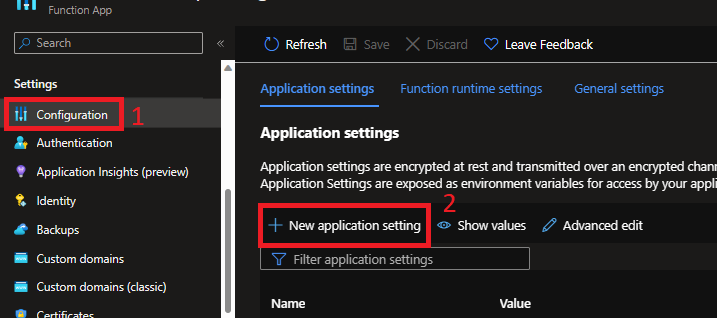
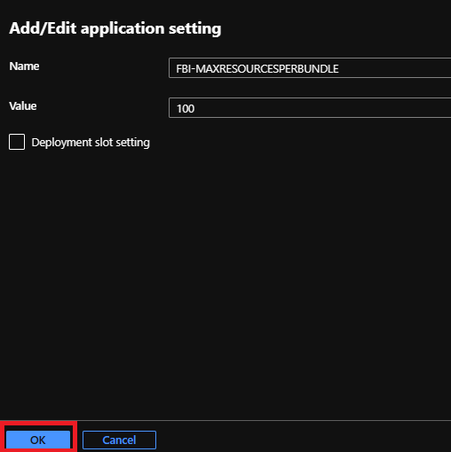
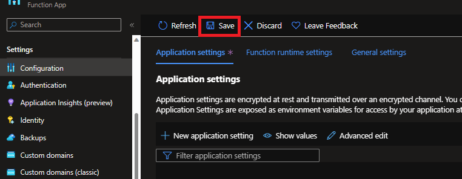

# Destination FHIR Server and FHIR Bulk Loader App configuration

This appendix will focus on how to configure destination FHIR server and FHIR Bulk Loader Application settings.

# Destination FHIR server.

1. Configure Number of RU’s for throughput
    - Please follow [link](https://learn.microsoft.com/en-us/azure/healthcare-apis/azure-api-for-fhir/configure-database) to configure the database RU's as per the data size. 

     **NOTE** : If requirement for RU's is more than 100k, please open an Azure support ticket.

2. Enable Auto scale for throughput
    - Please follow [link](https://learn.microsoft.com/en-us/azure/healthcare-apis/azure-api-for-fhir/autoscale-azure-api-fhir) to enable autoscaling and to estimate throughput RUs required.

    **NOTE** : You will need to open an Azure support ticket to enable autoscaling for RU's. 

3. Number of Nodes.
    - Default number of nodes per FHIR server is 2. 
    - This will auto scale as per the load on FHIR server.
    
    **NOTE** : You can request an increase in the default number of node per FHIR server by opening Azure support ticket. 

4. Throttling Concurrency Limit.
    - Default limit is 15.
    - If you are getting more errors for 429's(Throttled) while importing data to FHIR server, you can increase the throttling concurrency limit by opening the Azure support ticket. You may include request for RU, nodes, and throttling limits on the same ticket. 

### Tested Configuration
Below configration tested on 02/2023 for 800 GB NDJson data
1. Enable Autoscaling for RUs
2. RUs range from 100k to 1M
3. Fixed Number of Nodes : 10 (Autoscale happen as per the load).
4. Throttling concurrency limit to 45.

The Process took 16 hours to import the NDJSON data.

# FHIR Bulk Loader Application.
1. App Service Plan
    - By default, B2 service plan is deployed for the FHIR Bulk Loader.
    - User can [scale up](https://learn.microsoft.com/en-us/azure/app-service/manage-scale-up) App Plan as per their requirement.
2. Number of instances
    - By default, 2 instances are deployed for FHIR Bulk Loader.
    - User can [scale out](https://learn.microsoft.com/en-us/azure/azure-monitor/autoscale/autoscale-get-started) the instance counts manually or auto scaling. 
3. Number of FHIR resources per bundle file.
    - By default, 200 FHIR resources are creating per bundle file during NDJSON file processing.
    - This number can be adjusted as per the user requirement.
    - Following are the steps to configure this setting.
        1. Open the configuration section in FHIR Bulk Loader azure function.
        2. Click on New application setting.

        

        3. Add the FBI-MAXRESOURCESPERBUNDLE name and value as per the requirement in the setting and click ok.

        

        4.Once the above steps are done click save.

        

    **NOTE**: When you change this configuration, the number of bundle files will be created accordingly and you can manage the size of each bundle using this setting.

### Tested Configuration
Below configration tested on 02/2023 for 800 GB NDJson data
1. App Service Plan : P2
2. Number of Instance : 20
3. Number of resources per bundle file : 100\
FBI-MAXRESOURCESPERBUNDLE : 100

The Process took 16 hours to import the NDJSON data.