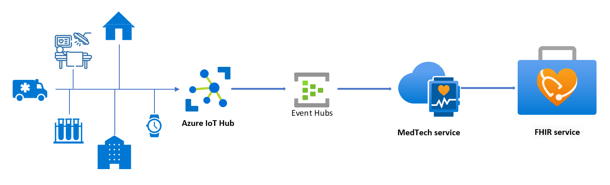

# README

## Scenario

This sample shows how the MedTech service can take a device message routed through an Azure IoT Hub and transform measurements in the device message into separate FHIR resources as defined in the IotJsonPathContent templates.



In this scenario, we set up a single device to emit exercise data to the MedTech service:

- Heart rate
- Heart rate variability
- Respiratory rate
- Body temperature
- Blood pressure

## Overview of the test device message

During an exercise session, device data is submitted the IoT hub. The sample device message looks like this when it arrives at the IoT hub:

```json
{
    "PatientId": "patient1",
    "HeartRate": 78,
    "HeartRateVariability": 30,
    "RespiratoryRate": 12,
    "BodyTemperature": 98.6,
    "BloodPressure": {
        "Systolic": 120,
        "Diastolic": 80
    }
}
```

The IoT hub enriches and routes the device message to the event hub before the MedTech service reads the device message from the event hub:

```json
{
    "Body": {
        "PatientId": "patient1",
        "HeartRate": 78,
        "HeartRateVariability": 30,
        "RespiratoryRate": 12,
        "BodyTemperature": 98.6,
        "BloodPressure": {
            "Systolic": 120,
            "Diastolic": 80
        }
    },
    "SystemProperties": {
        "iothub-enqueuedtime": "2023-07-25T19:33:13.087Z",
        "iothub-connection-device-id": "sampleDeviceId"
    },
    "Properties": {
        "iothub-creation-time-utc": "2023-07-25T19:33:13.087Z"
    }
}  
```

## Creating the templates

We use `IotJsonPathContent` templates which allow us to match each measurement within the device data.

```json
{
    "templateType": "IotJsonPathContent",
    "template": {
        "typeName": "HeartRate",
        "typeMatchExpression": "$..[?(@Body.HeartRate)]",
        "patientIdExpression": "$.Body.PatientId",
        "values": [
            {
                "required": true,
                "valueExpression": "$.Body.HeartRate",
                "valueName": "HeartRate"
            }
        ]
    }
},
...
```

The JsonPath matches on device messages produced by the device. Data is then extracted/normalized from this device data based on the remaining `IotJsonPathContent` templates within the device mapping. This produces the following normalized data:

```json
[
    {
        "type": "HeartRate",
        "occurrenceTimeUtc": "2023-07-25T19:33:13.087Z",
        "deviceId": "sampleDeviceId",
        "patientId": "patient1",
        "properties": [
            {
                "name": "HeartRate",
                "value": "78"
            }
        ]
    },
    {
        "type": "HeartRateVariability",
        "occurrenceTimeUtc": "2023-07-25T19:33:13.087Z",
        "deviceId": "sampleDeviceId",
        "patientId": "patient1",
        "properties": [
            {
                "name": "HeartRateVariability",
                "value": "30"
            }
        ]
    },
    {
        "type": "RespiratoryRate",
        "occurrenceTimeUtc": "2023-07-25T19:33:13.087Z",
        "deviceId": "sampleDeviceId",
        "patientId": "patient1",
        "properties": [
            {
                "name": "RespiratoryRate",
                "value": "12"
            }
        ]
    },
    {
        "type": "BodyTemperature",
        "occurrenceTimeUtc": "2023-07-25T19:33:13.087Z",
        "deviceId": "sampleDeviceId",
        "patientId": "patient1",
        "properties": [
            {
                "name": "BodyTemperature",
                "value": "98.6"
            }
        ]
    },
    {
        "type": "BloodPressure",
        "occurrenceTimeUtc": "2023-07-25T19:33:13.087Z",
        "deviceId": "sampleDeviceId",
        "patientId": "patient1",
        "properties": [
            {
                "name": "Systolic",
                "value": "120"
            },
            {
                "name": "Diastolic",
                "value": "80"
            }
        ]
    }
]
```

To learn about using IotJsonPathContent templates, see [How to use IotJsonPathContent templates with the MedTech service device mapping](https://learn.microsoft.com/azure/healthcare-apis/iot/how-to-use-iotjsonpathcontent-templates).

For a tutorial on deploying a MedTech service including an Azure IoT Hub with message routing enabled, see [Receive device messages through Azure IoT Hub](https://learn.microsoft.com/azure/healthcare-apis/iot/device-messages-through-iot-hub).

To learn about the Mapping debugger, see [How to use the MedTech service Mapping debugger](https://learn.microsoft.com/azure/healthcare-apis/iot/how-to-use-mapping-debugger).
