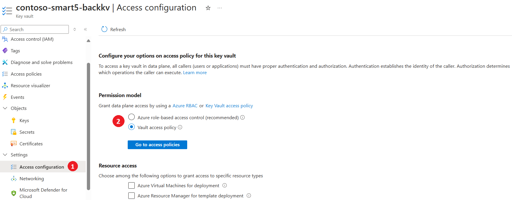
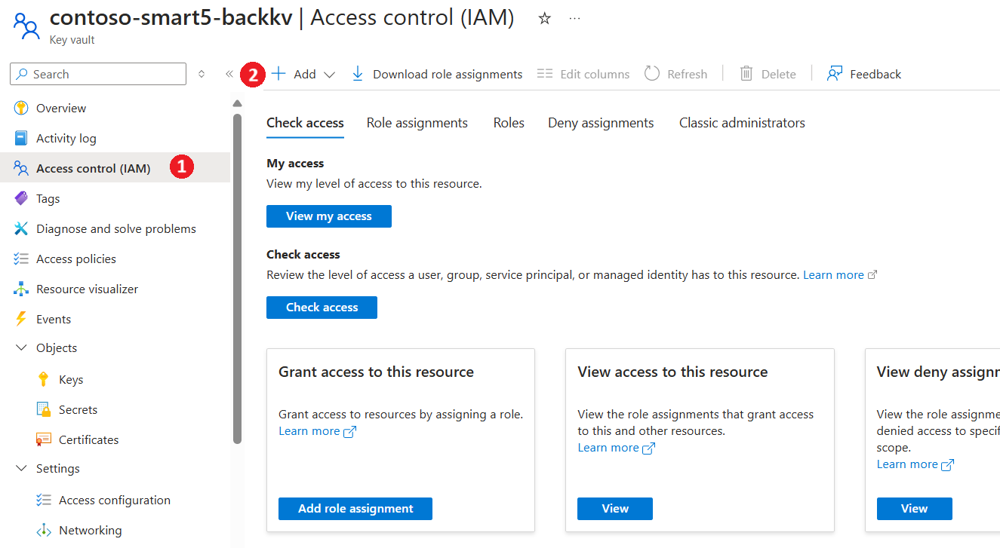
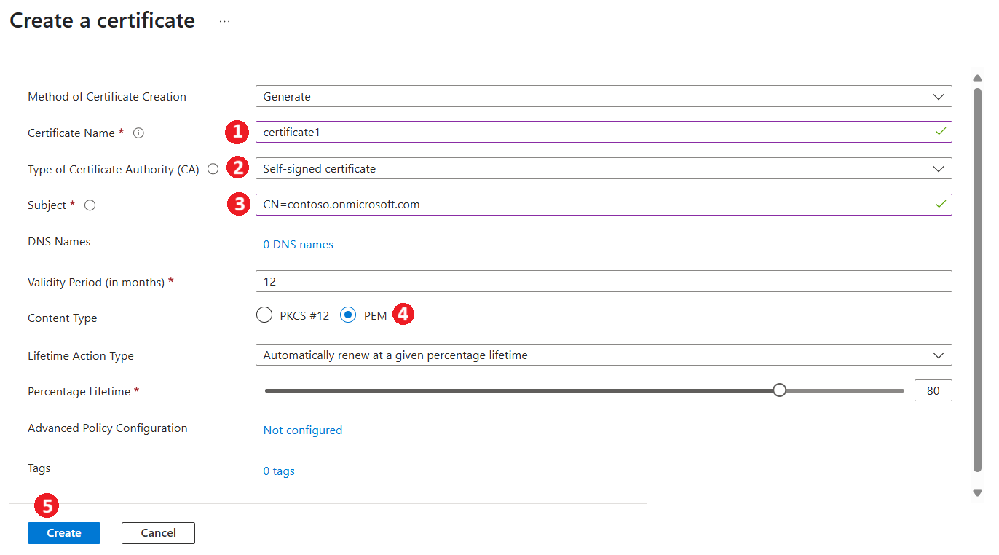
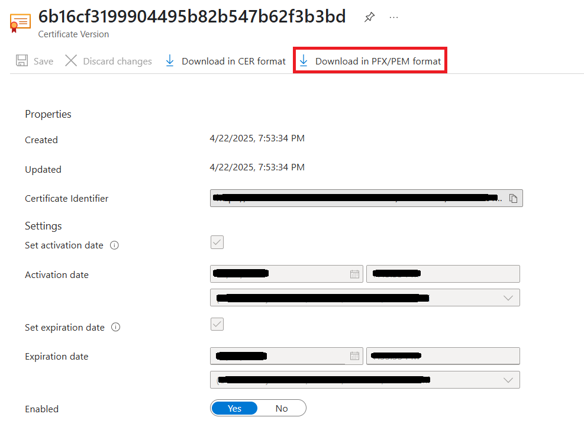
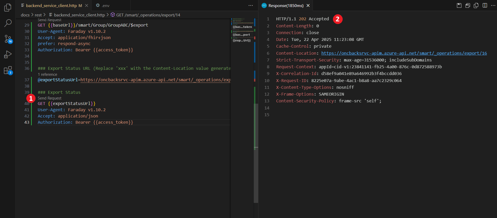
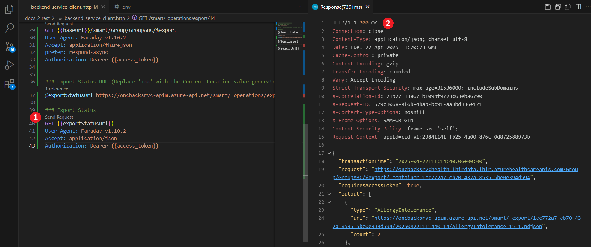

# SMART on FHIR Backend Service Setup and Manual Testing
This document outlines the complete setup and manual testing flow for a **SMART on FHIR Backend Service**. This guide walks you through generating a self-signed certificate in Azure Key Vault, registering a confidential client application, generating a client assertion and JWKS, and configuring Azure API Management. Finally, it demonstrates how to trigger and monitor a **FHIR Bulk Export** operation using a REST client setup in Visual Studio Code.

**Note:** For demonstration purposes, we are using a self-signed certificate generated via Azure Key Vault. However, users may choose their own preferred method for certificate generation.

## 1: Generate a Self-Signed Certificate in Azure Key Vault

1. **Create or Use an Existing Key Vault**

    Ensure you have the required permissions to create/manage certificates:
    - First, check the **Permission model** by navigating to:
        - **Key Vault** → **Settings** → **Access configuration**  
    - If **Vault access policy** is used:
        - Go to **Access policies** → Select your **User** → **Edit**
        - Under **Certificate permissions**, ensure the required permissions are granted
    - If **RBAC (Role-Based Access Control)** is used:
        - Go to **Access control (IAM)** → **+ Add**
        - Assign the **Key Vault Administrator** role to your user account  

    <br /><details><summary>Click to expand and see screenshots.</summary>
    
    
    
    </details>

2. **Navigate to the Key Vault**
   - Go to the **Certificates** section under **Objects**.
   - Click on **Generate/Import**.

3. **Configure Certificate Details**
   - **Name:** Provide a name for your certificate.
   - **Certificate Authority:** Select `Self-Signed certificate`.
   - **Subject:** Use the format `CN=<domain name>`, e.g. `CN=contoso.onmicrosoft.com`.
   - **Content Type:** Choose `PEM`.

4. **Create the Certificate**
   - Click on **Create**.
   - After creation, **copy and save the certificate thumbprint**. This will be used in the client assertion step.
   
<br /><details><summary>Click to expand and see screenshots.</summary>



</details>

## 2: Download Certificate Files

1. Select the newly created certificate in Azure Key Vault.
2. Click on the **current version** of the certificate.
3. Download the certificate in **PEM format**.
4. Save the downloaded `.pem` file in a separate folder, as it contains both the **private key** and **public key**.

<br /><details><summary>Click to expand and see screenshots.</summary>


</details>

## 3. Create a Backend Registration App and Store the Secret in Key Vault
Please follow the steps(1-5) from the provided [link](./inferno-test-app-registration.md/#backend-service-client-application)
at the section titled  `Backend Service Client Application` to create backend app registration.

After registration:
1. In the resource group that matches your environment, open the KeyVault with the suffix `backkv`.
1. Add a new secret that corresponds to the Application you just generated. 
    - Name: Application ID/Client ID of the application
    - Secret: The secret you generated for the application
    - Tags: Make sure to add the tag `jwks_url`with the value: `{apim-url}/smart/.well-known/jwks.json`
1. Save the client id for the next step.
<br /><details><summary>Click to expand and see screenshots.</summary>


</details>

## 4. Generate Client assertion using the Client Assertion utility

Use the **Client Assertion Utility** to generate both a client assertion and a JWKS (JSON Web Key Set).

Follow the [Client Assertion Utility documentation](../../../client-assertion-generator/README.md) for detailed instructions on how to:

- Generate a **Client Assertion**
- Generate the corresponding **JWKS**

Once generated, copy and store the **Client Assertion** and the **JWKS** for use in the subsequent steps.


## 5. Update the JWKS in Azure API Management
To ensure Azure API Management returns the correct JWKS (JSON Web Key Set), you need to update the named value that references the JWKS endpoint. Follow the steps below to complete the update:
1. Open the API Management service with the suffix `apim`.
1. Navigate to **APIs** → **Named values**.
1. Select the named value `JWKS`.
1. Replace `xxx` with the `JWKS` generated from the previous step.
<br /><details><summary>Click to expand and see screenshots.</summary>


</details>

## 6. Bulk Export Operation

> **Prerequisites**: You need to install **REST Client** Extension in Visual Studio Code to execute the following HTTP requests.

1. Open the [backend_service_client.http](../rest/backend_service_client.http) file in VS code. 
1. In the [rest](../rest/) folder, create a new `.env` file and add the following environment variable:
    
    ```env
    BASE_URL = {apim-url}
    ```
1. Replace `{apim-url}` with your Azure API Management Service url.
1. Please save the file.

### 1.	Get access token using the client assertion.

1. Insert the client assertion generated from the *Client Assertion Utility* into the variable `@client_assertion` in the `backend_service_client.http` file.
1. Click **Send Request** for the **Token Endpoint Operation**.
1. Copy the access token from the response body and assign it to the variable `@access_token`.
1. Please save the file.
<br /><details><summary>Click to expand and see screenshots.</summary>

</details>

### 2. Execute Group Export

1. Click **Send Request** for the **Group Export Operation**.
1. Copy the **Content-Location** from the response headers and assign it to the variable `@exportStatusUrl`.
1. Please save the file.
<br /><details><summary>Click to expand and see screenshots.</summary>

</details>

### 3. Get Export Status 

1. Click **Send Request** for the **Export Status Operation**.
1. Monitor the response:
   - A `200 OK` response indicates the export is complete, with resource count details in the response body.
   - A `202 Accepted` response means the export is still in progress.
<br /><details><summary>Click to expand and see screenshots.</summary>


</details>


