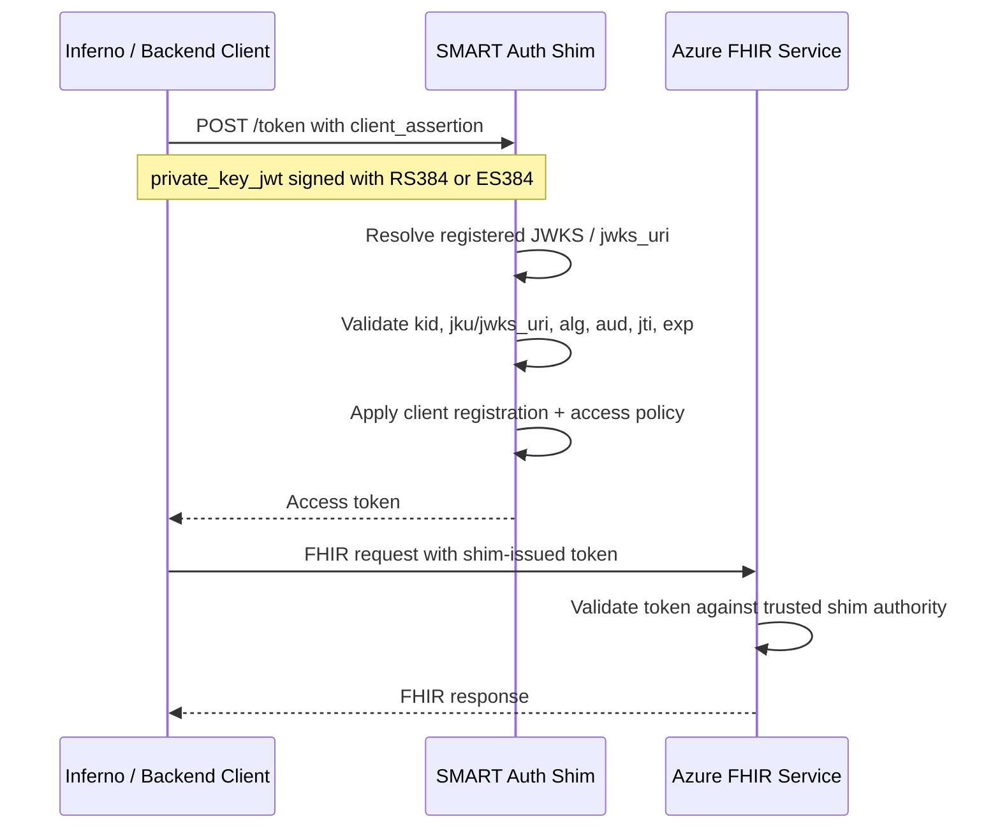

# Possible approach: shim IdP trusted directly by FHIR

## Goal

Provide a path for SMART on FHIR asymmetric client authentication that:

- works with Inferno's `jwks_uri` / `private_key_jwt` model,
- avoids forcing Inferno into native Entra certificate semantics,
- and avoids the current Entra client-secret exchange pattern for backend services.

This option uses a **shim identity provider / authorization component** as the SMART-aware front door, and has the FHIR service trust that shim **directly**.

## Why this option exists

The investigation showed:

- SMART allows manual client public-key registration through **JWKS URL** or **JWKS directly**
- Inferno uses the SMART asymmetric client profile (`jwks_uri`, `RS384` / `ES384`)
- Entra can store uploaded certs, but it did **not** accept Inferno's actual assertion after uploading a certificate derived from Inferno's RSA JWKS

So the mismatch is not only registration. The mismatch is that:

- **SMART** expects JWKS-based client trust and `private_key_jwt` validation
- **Entra** expects certificate-based app credential validation

This makes a SMART-aware shim a more natural place to handle Inferno-style client authentication.

## Target architecture

## High-level design

The shim becomes the **authorization server for backend-services auth**. It is responsible for:

1. **Client registration**
   - store `client_id`
   - store `jwks_uri` or JWKS
   - store allowed scopes / allowed data actions
   - optionally store tenant or environment metadata

2. **Asymmetric client authentication**
   - accept SMART `private_key_jwt`
   - support `RS384` and `ES384`
   - validate `kid`
   - validate `jku` against the registration-time whitelist when present
   - dereference `jwks_uri` or use stored JWKS when `jku` is absent
   - validate `iss`, `sub`, `aud`, `exp`, `jti`

3. **Token issuance**
   - issue an access token that the FHIR service trusts directly
   - shape claims to match what Azure FHIR expects from a trusted external identity provider

4. **Key rotation handling**
   - respect the client's JWKS cache headers
   - refresh key material on rotation without manual re-registration when a stable `jwks_uri` is used

## Where the existing test IDP shim helps

The script at:

`../fhir-paas/tools/scripts/Create-TestThirdPartyToken.ps1`

already provides useful building blocks:

- mock OIDC issuer hosting
- JWKS publication
- token signing
- deployable App Service footprint

It is **not** sufficient as-is, because it currently behaves like a simple external token issuer and not a SMART backend authorization server.

## What would need to change in the shim

### Required additions

1. **SMART-style `/token` endpoint**
   - accept `grant_type=client_credentials`
   - accept `client_assertion_type`
   - accept `client_assertion`
   - return SMART-compatible OAuth error responses such as `invalid_client`

2. **Registration store**
   - persistent store for registered backend clients
   - manual registration UI/script/process is acceptable
   - should support:
     - `client_id`
     - `jwks_uri`
     - fallback JWKS
     - allowed scopes
     - optional metadata like environment, contact, expiry

3. **SMART asymmetric validation**
   - verify `RS384` and `ES384`
   - enforce `aud = token endpoint`
   - enforce one-time `jti`
   - support `jku` whitelist checks
   - support dereferencing JWKS at runtime

4. **Token issuance aligned to FHIR**
   - issue JWTs from the shim's own authority
   - publish shim OIDC metadata and JWKS
   - ensure FHIR is configured to trust the shim authority
   - include claims that FHIR expects for direct trust

### Likely claim requirements to satisfy FHIR

The exact token shape should be validated in a prototype, but the shim-issued token will likely need to include:

- `iss` = shim issuer URL
- `aud` = FHIR audience configured for the trusted identity provider
- `azp` or `appid` = registered backend client identifier
- `scp` = allowed SMART/backend scopes

If Azure FHIR requires more than this for app-only flows, that gap should be validated early in the prototype.

## FHIR integration model

This option assumes the FHIR service is configured to trust the shim as an **external OIDC identity provider**.

That means the shim must expose:

- `/.well-known/openid-configuration`
- `jwks_uri`
- stable signing keys with rotation support

And the FHIR service must be configured with:

- shim `authority`
- shim application/client mapping
- shim `audience`
- allowed data actions

## Benefits of this approach

1. **Matches SMART more naturally**
   - JWKS registration and `private_key_jwt` validation live in a SMART-aware component

2. **Supports Inferno's model**
   - `jwks_uri`
   - `RS384` / `ES384`
   - runtime key resolution

3. **Decouples client auth from Entra limitations**
   - no need to coerce Inferno into Entra's cert identity model

4. **Eliminates the current secret exchange pattern**
   - no per-client Entra secret retrieval from Key Vault

## Risks and open questions

1. **FHIR claim compatibility**
   - the shim can issue its own JWTs, but we still need to prove the exact claim shape Azure FHIR accepts

2. **Operational ownership**
   - this introduces a new auth component that must be operated, monitored, and secured

3. **Replay protection and token security**
   - `jti` replay detection and signing-key hygiene become the shim's responsibility

4. **Conformance and discovery**
   - the SMART discovery metadata served through APIM must accurately describe the shim-backed token endpoint

## Recommended prototype plan

### Phase 1: minimal proof

Build a small shim that:

1. hosts OIDC metadata and JWKS,
2. supports one manually registered backend client,
3. validates `RS384` Inferno-style assertions,
4. issues a signed access token with the expected FHIR claims,
5. calls FHIR directly with that token.

Success criteria:

- Inferno client assertion is accepted by the shim
- shim-issued token is accepted by FHIR
- no Entra client-secret exchange is involved

### Phase 2: Inferno end-to-end

Wire Inferno to the shim `/token` endpoint and prove:

- registration with `jwks_uri`
- successful token issuance
- successful FHIR access
- relevant Inferno backend-services tests pass

## Suggested implementation boundary

The cleanest boundary is:

- keep Entra for user-facing interactive auth where it already works well
- use the shim only for backend-services asymmetric auth

That minimizes blast radius while solving the specific mismatch uncovered in this investigation.

## Bottom line

This is the most plausible path if the requirement is:

> Support Inferno and SMART asymmetric backend-services auth without relying on the current Entra secret-exchange workaround.

It does **not** remove custom auth logic entirely, but it moves that logic into a component whose trust model matches SMART much better than native Entra client authentication does.
