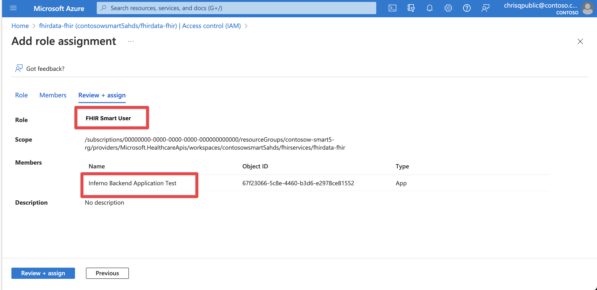
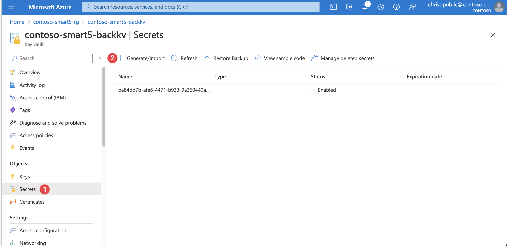

> [!TIP]
> *If you encounter any issues during configuration, deployment, or testing, please refer to the [Trouble Shooting Document](../troubleshooting.md)*

> Note - Throughout this document, the term `FHIR Server` refers to either AHDS FHIR service or Azure API for FHIR, depending on the configuration or user preference.

# Inferno Test Applications 

To successfully test ONC (g)(10) with Inferno, you will need to create four separate application registrations to represent the different access scenarios addressed by this test. This method of setting up application registrations is applicable to real SMART on FHIR applications too.

## Patient Standalone Confidential Client / Public Client Applications

The Patient Standalone Launch application is a standard confidential client application which represents an application that can protect a secret (section 1 & 2 of the test). The public client represents an application that cannot protect a secret (section 9 of the test). You will need to follow these instructions twice - once for the confidential client (web) and once for the public client (spa). 

1. Create a new application in Microsoft Entra ID. Make sure to select platform (Note : You need one application with platform - Web and SPA respectively) and add the redirect URL for Inferno (`https://inferno.healthit.gov/suites/custom/smart/redirect`).
1. In API Permissions for this new application, add the below:
    - Your FHIR Resource API (Delegated)

| Common Scope        | `.rs` Scope                         | `.read` Scope                               | Microsoft Graph Scope |
|---------------------|-------------------------------------|---------------------------------------------|------------------------|
| `fhirUser`          | `patient.AllergyIntolerance.rs`     | `patient.AllergyIntolerance.read`           | `openid`               |
| `launch.patient`    | `patient.CarePlan.rs`               | `patient.CarePlan.read`                     | `offline_access`       |
|                     | `patient.CareTeam.rs`               | `patient.CareTeam.read`                     |                        |
|                     | `patient.Condition.rs`              | `patient.Condition.read`                    |                        |
|                     | `patient.Device.rs`                 | `patient.Device.read`                       |                        |
|                     | `patient.DiagnosticReport.rs`       | `patient.DiagnosticReport.read`             |                        |
|                     | `patient.DocumentReference.rs`      | `patient.DocumentReference.read`            |                        |
|                     | `patient.Encounter.rs`              | `patient.Encounter.read`                    |                        |
|                     | `patient.Goal.rs`                   | `patient.Goal.read`                         |                        |
|                     | `patient.Immunization.rs`           | `patient.Immunization.read`                 |                        |
|                     | `patient.Location.rs`               | `patient.Location.read`                     |                        |
|                     | `patient.MedicationRequest.rs`      | `patient.MedicationRequest.read`            |                        |
|                     | `patient.Medication.rs`             | `patient.Medication.read`                   |                        |
|                     | `patient.Observation.rs`            | `patient.Observation.read`                  |                        |
|                     | `patient.Organization.rs`           | `patient.Organization.read`                 |                        |
|                     | `patient.Patient.rs`                | `patient.Patient.read`                      |                        |
|                     | `patient.Practitioner.rs`           | `patient.Practitioner.read`                 |                        |
|                     | `patient.PractitionerRole.rs`       | `patient.PractitionerRole.read`             |                        |
|                     | `patient.Procedure.rs`              | `patient.Procedure.read`                    |                        |
|                     | `patient.Provenance.rs`             | `patient.Provenance.read`                   |                        |

1. Generate a secret for this application. Save this and the client id for testing Inferno *1. Standalone Patient App* and *2. Limited Access App*.
1. Follow all instructions on [this page](./set-fhir-user-mapping.md) to enable mapping the `fhirUser` to the identity token.
 

Click to expand and see screenshots.

## EHR Launch Confidential Client Application

The EHR launch confidential client application is a standard confidential client application which represents an application that can protect a secret (section 3 of the test).

1. Create a new application in Microsoft Entra ID. Make sure to select `Web` as the platform and add the redirect URL for Inferno (`https://inferno.healthit.gov/suites/custom/smart/redirect`).
1. In API Permissions for this new application, add the below:
    - Your FHIR Resource Application (Delegated)
    
| Common Scope        | `.rs` Scope                         | `.read` Scope                               | Microsoft Graph Scope |
|---------------------|-------------------------------------|---------------------------------------------|------------------------|
| `fhirUser`          | `user.AllergyIntolerance.rs`        | `user.AllergyIntolerance.read`              | `openid`               |
| `launch.patient`    | `user.CarePlan.rs`                  | `user.CarePlan.read`                        | `offline_access`       |
|                     | `user.CareTeam.rs`                  | `user.CareTeam.read`                        |                        |
|                     | `user.Condition.rs`                 | `user.Condition.read`                       |                        |
|                     | `user.Device.rs`                    | `user.Device.read`                          |                        |
|                     | `user.DiagnosticReport.rs`          | `user.DiagnosticReport.read`                |                        |
|                     | `user.DocumentReference.rs`         | `user.DocumentReference.read`               |                        |
|                     | `user.Encounter.rs`                 | `user.Encounter.read`                       |                        |
|                     | `user.Goal.rs`                      | `user.Goal.read`                            |                        |
|                     | `user.Immunization.rs`              | `user.Immunization.read`                    |                        |
|                     | `user.Location.rs`                  | `user.Location.read`                        |                        |
|                     | `user.MedicationRequest.rs`         | `user.MedicationRequest.read`               |                        |
|                     | `user.Medication.rs`                | `user.Medication.read`                      |                        |
|                     | `user.Observation.rs`               | `user.Observation.read`                     |                        |
|                     | `user.Organization.rs`              | `user.Organization.read`                    |                        |
|                     | `user.Patient.rs`                   | `user.Patient.read`                         |                        |
|                     | `user.Practitioner.rs`              | `user.Practitioner.read`                    |                        |
|                     | `user.PractitionerRole.rs`          | `user.PractitionerRole.read`                |                        |
|                     | `user.Procedure.rs`                 | `user.Procedure.read`                       |                        |
|                     | `user.Provenance.rs`                | `user.Provenance.read`                      |                        |

1. Generate a secret for this application. Save this and the client id for testing Inferno *3. EHR Practitioner App*.
 

Click to expand and see screenshots.

## Backend Service Client Application

Microsoft Entra ID does not support RSA384 and/or ES384 which is required by the SMART on FHIR implementation guide. In order to provide this capability, custom code is required to validate the JWT assertion and return a bearer token generated for the client with the corresponding client secret in an Azure KeyVault.

1. Create a new application in Microsoft Entra ID. No platform or redirect URL is needed.
1. Grant this application `FHIR SMART User` and `FHIR Exporter` role in your FHIR Service.
1. In API Permissions for this new application, add the below:
    - Your FHIR Resource API (Application)
        - user.all.read
1. Grant admin consent for your Application on the API Permission page-->
1. Generate a secret for this application. Save this and the client id.
1. In the resource group that matches your environment, open the KeyVault with the suffix `backkv`.
1. Add a new secret that corresponds to the Application you just generated. 
    - Name: Application ID/Client ID of the application
    - Secret: The secret you generated for the application
    - Tags: Make sure to add the tag `jwks_url` with the backend service JWKS URL. For Inferno testing, this is: https://inferno.healthit.gov/suites/custom/g10_certification/.well-known/jwks.json
1. Save the client id for later testing.
 

Click to expand and see screenshots.

## Asymmetric Client Standalone Application

Microsoft Entra ID does not support RSA384 and/or ES384 which is required by the SMART on FHIR implementation guide for [Client Authentication: Asymmetric (public key)](https://hl7.org/fhir/smart-app-launch/client-confidential-asymmetric.html). In order to provide this capability, custom code is required to validate the JWT assertion and return a bearer token generated for the client with the corresponding client secret in an Azure KeyVault.

1. Create a new application in Microsoft Entra ID. Make sure to select `Web` as the platform and add the redirect URL for Inferno (`https://inferno.healthit.gov/suites/custom/smart/redirect`).
1. In API Permissions for this new application, add the below:
    - Your FHIR Resource Application (Delegated)
    
| Common Scope        | `.rs` Scope                         | `.read` Scope                               | Microsoft Graph Scope |
|---------------------|-------------------------------------|---------------------------------------------|------------------------|
| `fhirUser`          | `patient.AllergyIntolerance.rs`     | `patient.AllergyIntolerance.read`           | `openid`               |
| `launch.patient`    | `patient.CarePlan.rs`               | `patient.CarePlan.read`                     | `offline_access`       |
|                     | `patient.CareTeam.rs`               | `patient.CareTeam.read`                     |                        |
|                     | `patient.Condition.rs`              | `patient.Condition.read`                    |                        |
|                     | `patient.Device.rs`                 | `patient.Device.read`                       |                        |
|                     | `patient.DiagnosticReport.rs`       | `patient.DiagnosticReport.read`             |                        |
|                     | `patient.DocumentReference.rs`      | `patient.DocumentReference.read`            |                        |
|                     | `patient.Encounter.rs`              | `patient.Encounter.read`                    |                        |
|                     | `patient.Goal.rs`                   | `patient.Goal.read`                         |                        |
|                     | `patient.Immunization.rs`           | `patient.Immunization.read`                 |                        |
|                     | `patient.Location.rs`               | `patient.Location.read`                     |                        |
|                     | `patient.MedicationRequest.rs`      | `patient.MedicationRequest.read`            |                        |
|                     | `patient.Medication.rs`             | `patient.Medication.read`                   |                        |
|                     | `patient.Observation.rs`            | `patient.Observation.read`                  |                        |
|                     | `patient.Organization.rs`           | `patient.Organization.read`                 |                        |
|                     | `patient.Patient.rs`                | `patient.Patient.read`                      |                        |
|                     | `patient.Practitioner.rs`           | `patient.Practitioner.read`                 |                        |
|                     | `patient.PractitionerRole.rs`       | `patient.PractitionerRole.read`             |                        |
|                     | `patient.Procedure.rs`              | `patient.Procedure.read`                    |                        |
|                     | `patient.Provenance.rs`             | `patient.Provenance.read`                   |                        |

1. Generate a secret for this application. Save this and the client id.
1. In the resource group that matches your environment, open the KeyVault with the suffix `backkv`.
1. Add a new secret that corresponds to the Application you just generated. 
    - Name: Application ID/Client ID of the application
    - Secret: The secret you generated for the application
    - Tags: Make sure to add the tag `jwks_url` with the backend service JWKS URL. For Inferno testing, this is: https://inferno.healthit.gov/suites/custom/g10_certification/.well-known/jwks.json
1. Save the client id for later testing.

## Inferno Public Service Base URL

This repository contains a sample code to validate conformance to the HTI-1 rule from the API Condition and Maintenance of Certification. The test suite, known as **Service Base URL Test Suite**, ensures that Certified API Developers with patient-facing apps publish their service base URLs and related organizational details in the specified format. Specifically, it checks that the service base URLs are publicly accessible and formatted according to the FHIR 4.0.1 standard, and that the necessary organizational details are correctly referenced and bundled. This sample provides a public endpoint to pass the test suite.

Before executing the test, follow these steps to configure your environment:

1. **Create Secrets in Key Vault**:
    - In the resource group that matches your environment, open the KeyVault with the suffix `backkv`.
    - Add the following secrets along with their values for the Endpoint resource:
        - `status` = active
        - `connectionType` = http://terminology.hl7.org/CodeSystem/endpoint-connection-type
        - `address` = Your Fhir Service URL without /metadata
    - Add the following secrets along with their values for the Organization resource:
        - `active` = true
        - `name` = Health Intersections CarePlan Hub
        - `location` = USA
        - `identifier` = http://hl7.org/fhir/sid/us-npi
    - Ensure that the names of the secrets are exactly as provided above with no uppercase letters or alterations.

2. **Sample Endpoint**:
    - Use the following URL `{apim-url}/smart/service-base` to test Service Base URL Test Suite. 
    - Replace `{apim-url}` with your deployed APIM service url in the resource group.

**[Back to Previous Page](../deployment.md#7-create-inferno-test-applications)**