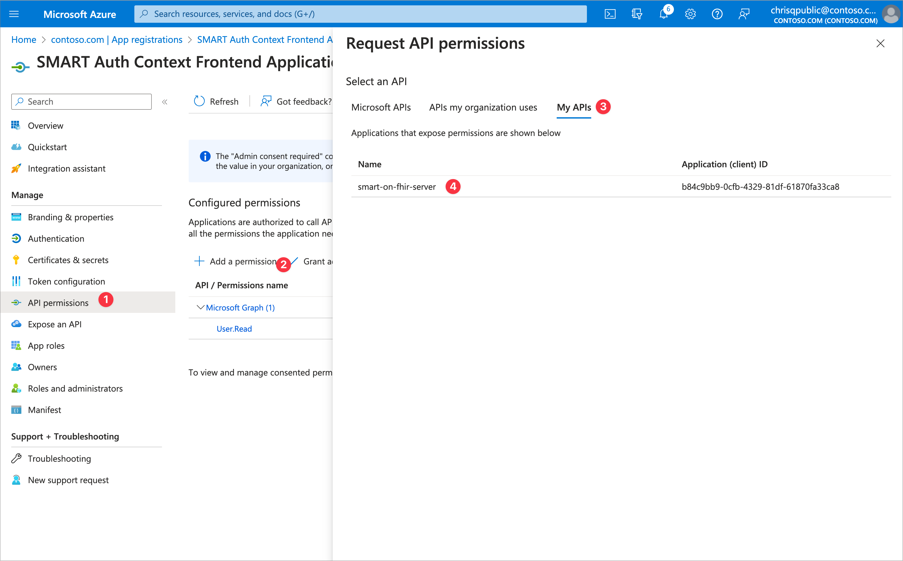
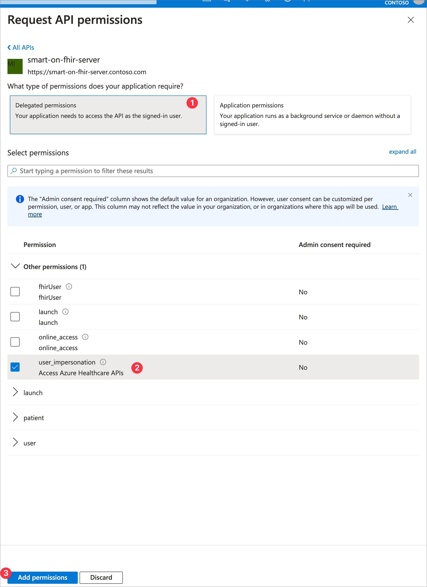

# Auth Context Frontend App Registration

The Auth Context Frontend Application is a sample React single-page application which enables both patient session-based scope selection and EHR launch context. Session-based scope selection allows patients to select which scopes they want to consent to for SMART on FHIR applications, even allowing removal of scopes during the login flow after they have been consented. Azure Active Directory does not support session based scoping, so this app removes the consent records for the user so they must re-consent on login. EHR launch requires the storage of session state during the authentication flow. This application will save of the launch parameter before login for later integration into the token. You will need to create an application regristation to represent the single-page application. You will need to save the `Client ID` and `Tenant ID` values from this application for later configuration.

## Deployment (manual)

1. Open Azure Active Directory and create a new application registration.
1. Leave the application as a single tenant application. Add a single-page application (SPA) redirict URI of `http://localhost:3000`.
    - Localhost is useful for debugging - we will add the Azure redirect URI after deployment.
1. After registering the application, Under `Token Configuration` add optional claim for ID token type. Select `login_hint` claim and click on Add.
1. Go to `API Permissions` and add the `user_impersonation` scope from your FHIR resource application.
    - Click `Add a Permission` then `My APIs`.
    - Select the FHIR Resource applicatin you created earlier.
    - Choose `Delegated permissions` then `user_impersonation`.
    - Finally, click `Add permission` to save.
1. Inform your Azure Developer CLI environment of this application with:
    ```
    azd env set ContextAppClientId <context app id>
    ```

<br />
<details>
<summary>Click to expand and see screenshots.</summary>




</details>