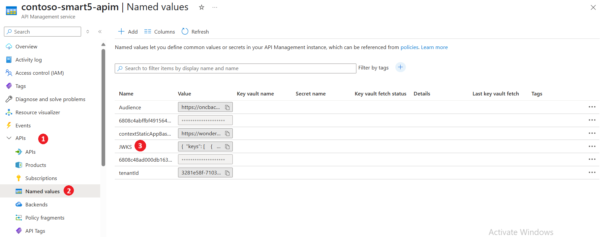
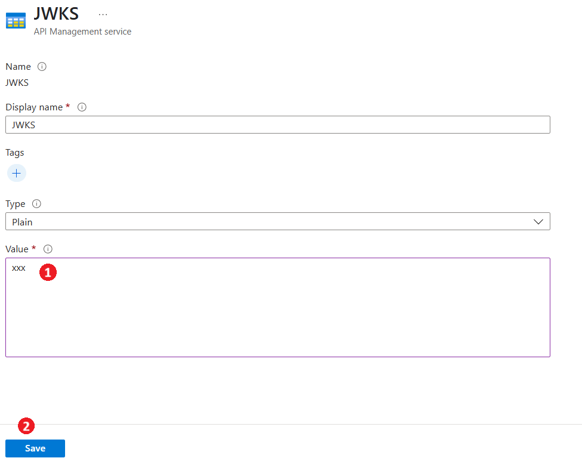
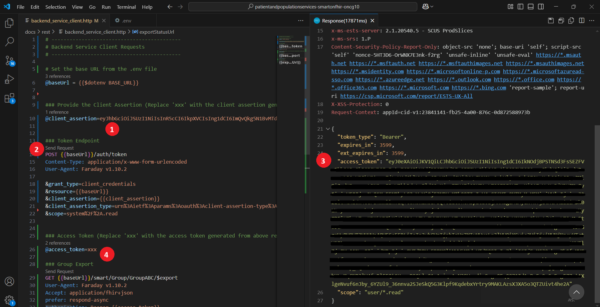
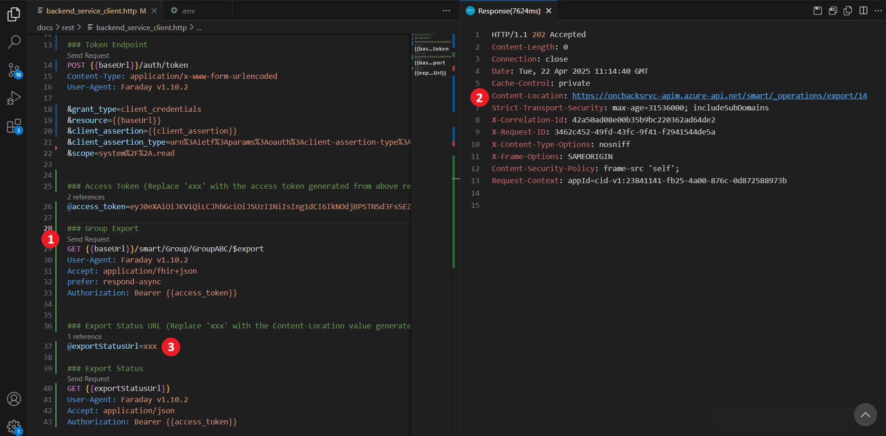
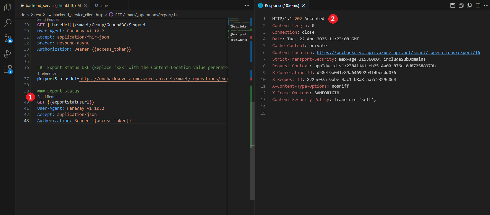
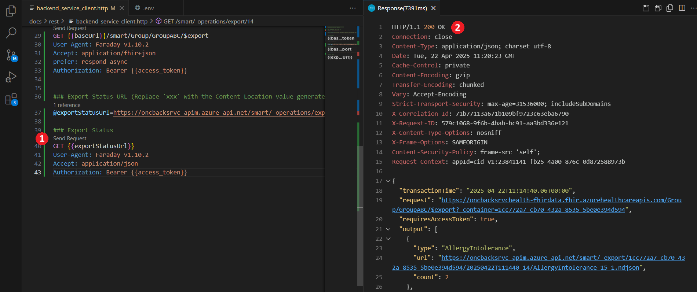

# **Backend Service Client**

## 1. Create a Backend Registration App and Store the Secret in Key Vault
Please follow the steps(1-5) from the provided [link](./inferno-test-app-registration.md/#backend-service-client-application)
at the section titled  `Backend Service Client Application` to create backend app registration.

After registration:
1. In the resource group that matches your environment, open the KeyVault with the suffix `backkv`.
1. Add a new secret that corresponds to the Application you just generated. 
    - Name: Application ID/Client ID of the application
    - Secret: The secret you generated for the application
    - Tags: Make sure to add the tag `jwks_url`with the value: `{apim-url}/.well-known/jwks.json`
1. Save the client id for the next step.
<br /><details><summary>Click to expand and see screenshots.</summary>


</details>

## 2. Generate Client assertion using the Client Assertion utility

Use the **Client Assertion Utility** to generate both a client assertion and a JWKS (JSON Web Key Set).

Follow the [Client Assertion Utility documentation](../../../client-assertion-generator/README.md) for detailed instructions on how to:

- Generate a **Client Assertion**
- Generate the corresponding **JWKS**

Once generated, copy and store the **Client Assertion** and the **JWKS** for use in the subsequent steps.


## 3. Update the JWKS in Azure API Management
To ensure Azure API Management returns the correct JWKS (JSON Web Key Set), you need to update the named value that references the JWKS endpoint. Follow the steps below to complete the update:
1. Open the API Management service with the suffix `apim`.
1. Navigate to **APIs** → **Named values**.
1. Select the named value `JWKS`.
1. Replace `xxx` with the `JWKS` generated from the previous step.
<br /><details><summary>Click to expand and see screenshots.</summary>


</details>

## 4. Bulk Export Operation

> **Prerequisites**: You need to install **REST Client** Extension in Visual Studio Code to execute the following HTTP requests.

1. Open the [backend_service_client.http](https://github.com/Azure-Samples/azure-health-data-and-ai-samples/blob/personal/gkuber/Manual_Backend_service_test_support/samples/patientandpopulationservices-smartonfhir-oncg10/docs/rest/backend_service_client.http) file in VS code. 
1. In the [rest](../rest/) folder, create a new `.env` file and add the following environment variable:
    
    ```env
    BASE_URL = {apim-url}
    ```
1. Replace `{apim-url}` with your Azure API Management Service url.

### 1.	Get access token using the client assertion.

1. Insert the client assertion generated from the *Client Assertion Utility* into the variable `@client_assertion` in the `backend_service_client.http` file.
1. Click **Send Request** for the **Token Endpoint Operation**.
1. Copy the access token from the response body and assign it to the variable `@access_token`.
<br /><details><summary>Click to expand and see screenshots.</summary>

</details>

### 2. Execute Group Export

1. Click **Send Request** for the **Group Export Operation**.
1. Copy the **Content-Location** from the response headers and assign it to the variable `@exportStatusUrl`.
<br /><details><summary>Click to expand and see screenshots.</summary>

</details>

### 3. Get Export Status 

1. Click **Send Request** for the **Export Status Operation**.
1. Monitor the response:
   - A `200 OK` response indicates the export is complete, with resource count details in the response body.
   - A `202 Accepted` response means the export is still in progress.
<br /><details><summary>Click to expand and see screenshots.</summary>


</details>


