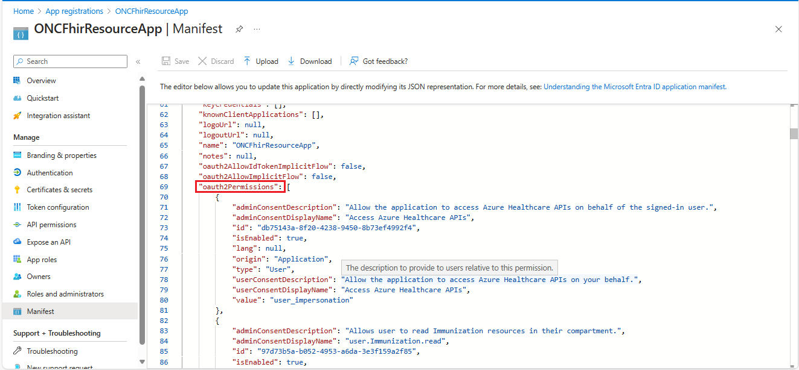

> [!TIP]
> *If you encounter any issues during configuration, deployment, or testing, please refer to the [Trouble Shooting Document](../troubleshooting.md)*

# FHIR Resource App Registration

This application registration is used to customize the access token sent to the FHIR Service. The SMART on FHIR logic inside Azure Health Data Services relies on the `fhirUser` claim inside the access token to restrict user access to their own compartment (e.g. patient can access their own data but not others). Microsoft is unable to allow custom claims mapping on the first-party Healthcare APIs application as it creates a [security hole for malicious applications](https://learn.microsoft.com/en-us/entra/identity-platform/reference-app-manifest#acceptmappedclaims-attribute). We must then create a custom application registration to protect the FHIR Service and change the audience in the FHIR Service to validate tokens against the custom application.

## Deployment (manual)

1. Create a FHIR Resource Application Registration
    - Go to `App Registrations`
    - Create a new application. You can name the App Registration to either match your Azure Developer CLI environment name or use a custom name. 
        - If you choose a custom name, make sure it does not contain any whitespace. 
        - For reference on the environment name, see step [2.3](../deployment.md/#2-prepare-and-deploy-environment/).
    - Click `Register` (ignore redirect URI).

1. Inform your Azure Developer CLI environment of this application with:
    ```
    azd env set FhirResourceAppId <FHIR Resource App Id>
    ```
1. Run below command to configure a FHIR Resource Application Registration.
    
    Windows:
    ```powershell
    powershell ./scripts/Configure-FhirResourceAppRegistration.ps1
    ```
    
    Mac/Linux
    ```bash
    pwsh ./scripts/Configure-FhirResourceAppRegistration.ps1
    ```
1. Create a Microsoft Graph Directory Extension to hold the `fhirUser` information for users.
    
    Windows:
    ```powershell
    powershell ./scripts/Create-FhirUserDirectoryExtension.ps1
    ```
    
    Mac/Linux
    ```bash
    pwsh ./scripts/Create-FhirUserDirectoryExtension.ps1
    ```
1. Follow the steps in **Set fhirUser Claims Mapping** section in [this page](./set-fhir-user-mapping.md) to enable mapping the `fhirUser` to the access token.

<br /><details><summary>Click to expand and see screenshots.</summary>



</details>

**[Back to Previous Page](../deployment.md#2-prepare-and-deploy-environment)**