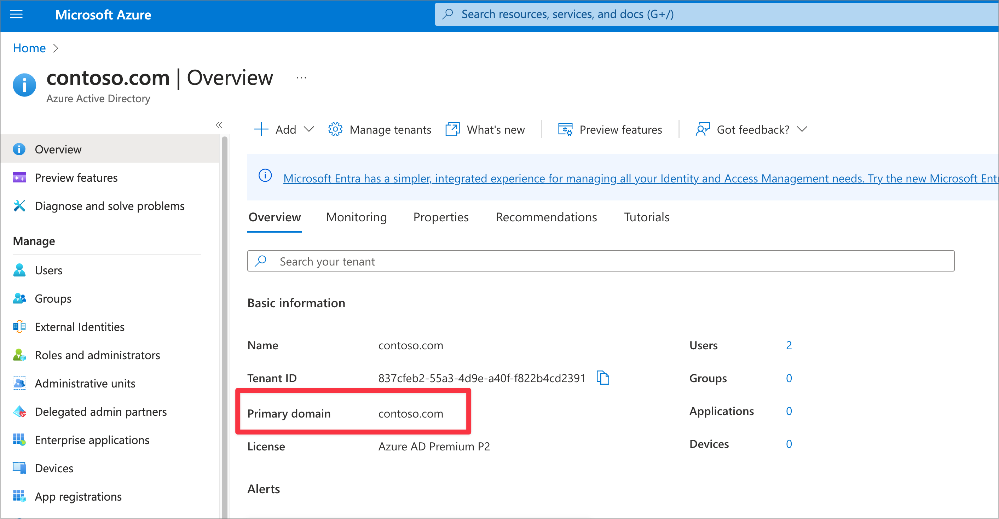

# FHIR Resource App Registration

This application registration is used to customize the access token sent to the FHIR Service. The SMART on FHIR logic inside Azure Health Data Services relies on the `fhirUser` claim inside the access token to restrict user access to their own compartment (e.g. patient can access their own data but not others). Microsoft is unable to allow custom claims mapping on the first-party Healthcare APIs application as it creates a [security hole for malicious applications](https://learn.microsoft.com/azure/active-directory/develop/reference-app-manifest#acceptmappedclaims-attribute). We must then create a custom application registration to protect the FHIR Service and change the audience in the FHIR Service to validate tokens against the custom application.

## Deployment (manual)

1. Find your Primary Domain in Azure Active Directory
    - Open Azure AD in the Azure Portal
    - Note your `Primary Domain` in the Overview blade of Azure AD.
1. Create a FHIR Resource Application Registration
    - Go to `App Registrations`
    - Create a new application. It's easiest if this matches the name of your Azure Developer CLI environment.
    - Click `Register` (ignore redirect URI).
1. Set the application URL
    - Go to `Expose an API` blade.
    - Set the application URL to https://<app-registration-name>.<Azure AD Primary Domain>.
        - For example `https://my-app-1.mytenant.onmicrosoft.com`.
        - Save the `Application URL` for later.
1. Add all the applicable FHIR Scopes.
    - Go to the Manifest blade for your application.
    - Change `acceptMappedClaims` from null to true.
    - Copy the `appRoles` JSON element from [fhir-app-manifest.json](./fhir-app-manifest.json) to the `appRoles` JSON element in your application manifest.
    - Copy the `oauth2Permissions` JSON element from [fhir-app-manifest.json](./fhir-app-manifest.json) to the `oauth2Permissions` JSON element in your application manifest.
1. Inform your Azure Developer CLI environment of this application with:
    ```
    azd env set FhirAudience <FHIR Resource Application ID URI>
    azd env set FhirResourceAppId <FHIR Resource App Id>
    ```
1. Create a Microsoft Graph Directory Extension to hold the `fhirUser` information for users.
    
    Windows:
    ```powershell
    powershell ./scripts/Create-FhirUserDirectoryExtension.ps1
    ```
    
    Mac/Linux
    ```bash
    pwsh ./scripts/Create-FhirUserDirectoryExtension.ps1
    ```
1. Follow the **Configure fhirUser mapping to token** section in [this page](./set-fhir-user-mapping.md) to enable mapping the `fhirUser` to the access token.

<br />
<details>
<summary>Click to expand and see screenshots.</summary>




</details>

