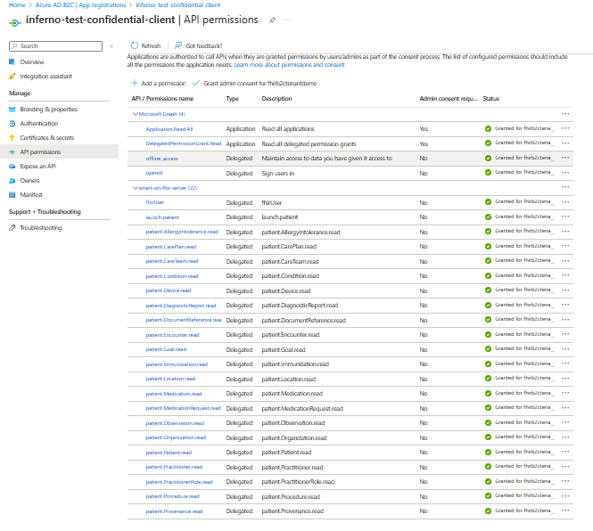
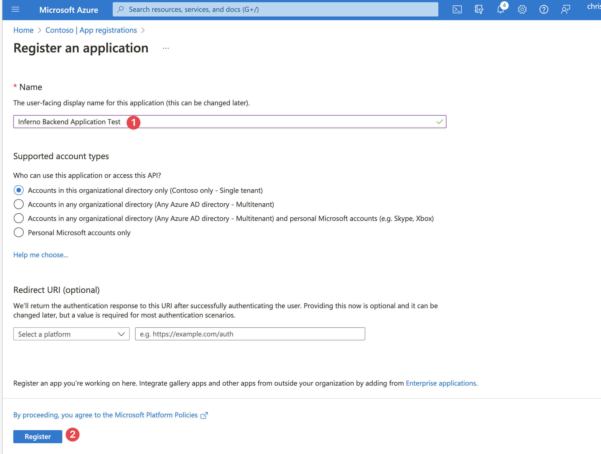
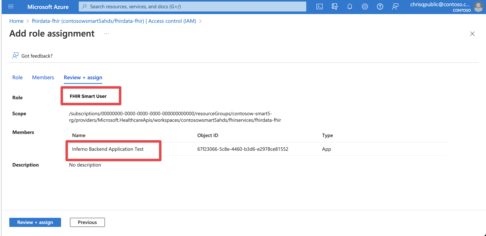
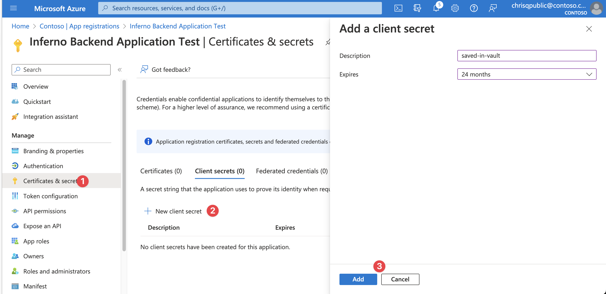
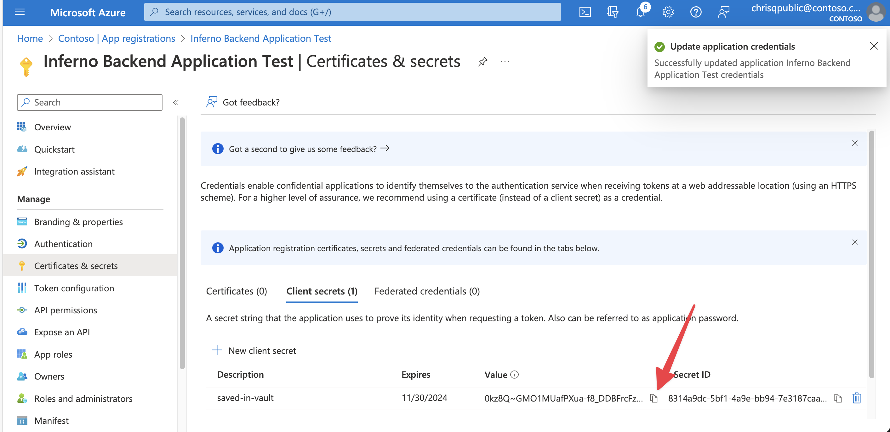
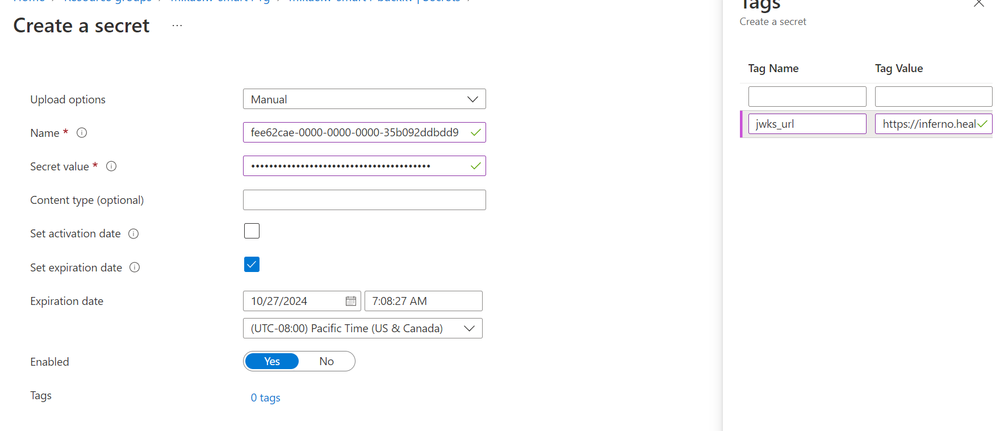
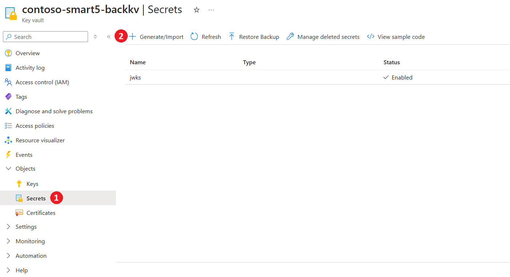
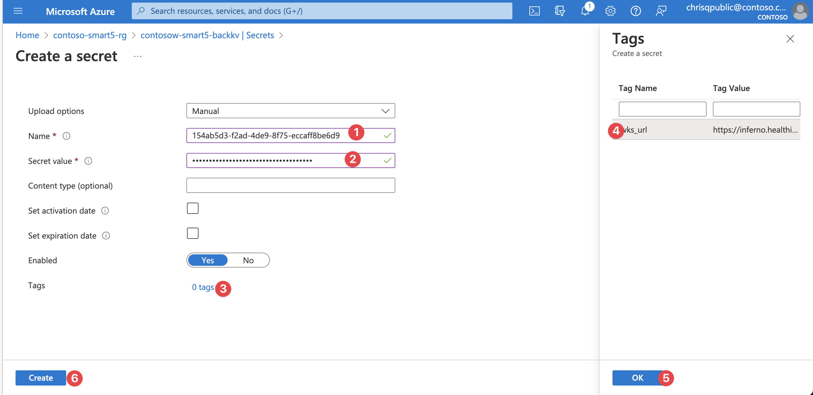

# Inferno Test Applications 

To successfully test ONC (g)(10) with Inferno, you will need to create four separate application registrations to represent the different access scenarios addressed by this test. This method of setting up application registrations is applicable to real SMART on FHIR applications too.

## Patient Standalone Confidential Client / Public Client Applications

The Patient Standalone Launch application is a standard confidential client application which represents an application that can protect a secret (section 1 & 2 of the test). The public client represents an application that cannot protect a secret (section 9 of the test). You will need to follow these instructions twice - once for the confidential client (web) and once for the public client (spa). 

1. If you have opted for Microsoft Entra ID, create a new application registration in the Microsoft Entra ID tenant. Otherwise for B2C, create it in the B2C tenant. Make sure to select platform (Note : You need one application with platform - Web and SPA respectively) and add the redirect URL for Inferno (`https://inferno.healthit.gov/suites/custom/smart/redirect`).
1. In API Permissions for this new application, add the below:
    - Your FHIR Resource API (Delegated)
        - fhirUser
        - launch.patient
        - patient.AllergyIntolerance.read
        - patient.CarePlan.read
        - patient.CareTeam.read
        - patient.Condition.read
        - patient.Device.read
        - patient.DiagnosticReport.read
        - patient.DocumentReference.read
        - patient.Encounter.read
        - patient.Goal.read
        - patient.Immunization.read
        - patient.Location.read
        - patient.MedicationRequest.read
        - patient.Medication.read
        - patient.Observation.read
        - patient.Organization.read
        - patient.Patient.read
        - patient.Practitioner.read
        - patient.PractitionerRole.read
        - patient.Procedure.read
        - patient.Provenance.read
    - Microsoft Graph (Delegated)
        - openid
        - offline_access
    - Microsoft Graph (Application) - Applicable only for B2C.
        - Application.Read.All
        - DelegatedPermissionGrant.ReadWrite.All 
1. Grant admin consent for app permissions.
1. Generate a secret for this application. Save this secret and the client id for testing *1. Standalone Patient App*.

 

Click to expand and see screenshots for Microsoft Entra ID Reference.

                
        
    

 

Click to expand and see screenshots for B2C Reference.

        
        
    

## EHR Launch Confidential Client Application

The EHR launch confidential client application is a standard confidential client application which represents an application that can protect a secret (section 3 of the test).

1. If you have opted for Microsoft Entra ID, create a new application registration in the Microsoft Entra ID tenant. Otherwise for B2C, create it in the B2C tenant. Make sure to select `Web` as the platform and add the redirect URL for Inferno (`https://inferno.healthit.gov/suites/custom/smart/redirect`).
1. In API Permissions for this new application, add the below:
    - Your FHIR Resource Application (Delegated)
        - fhirUser
        - launch
        - user.AllergyIntolerance.read
        - user.CarePlan.read
        - user.CareTeam.read
        - user.Condition.read
        - user.Device.read
        - user.DiagnosticReport.read
        - user.DocumentReference.read
        - user.Encounter.read
        - user.Goal.read
        - user.Immunization.read
        - user.Location.read
        - user.MedicationRequest.read
        - user.Medication.read
        - user.Observation.read
        - user.Organization.read
        - user.Patient.read
        - user.Practitioner.read
        - user.PractitionerRole.read
        - user.Procedure.read
        - user.Provenance.read
    - Microsoft Graph (Delegated)
        - openid
        - offline_access
1. Generate a secret for this application. Save this and the client id for testing Inferno *3. EHR Practitioner App*.
1. Follow all instructions on [this page](./set-fhir-user-mapping.md) to enable mapping the `fhirUser` to the identity token.
 

Click to expand and see screenshots.

    

    
    

## Backend Service Client Application

Microsoft Entra ID does not support RSA384 and/or ES384 which is required by the SMART on FHIR implementation guide. In order to provide this capability, custom code is required to validate the JWT assertion and return a bearer token generated for the client with the corresponding client secret in an Azure KeyVault.

1. If you have opted for Microsoft Entra ID, create a new application registration in the Microsoft Entra ID tenant. Otherwise for B2C, create it in the B2C tenant. No platform or redirect URL is needed.
1. Grant this application `FHIR SMART User` and `FHIR Exporter` role in your FHIR Service.
1. In API Permissions for this new application, add the below:
    - Your FHIR Resource API (Application)
        - user.all.read
1. Grant admin consent for your Application on the API Permission page-->
1. Generate a secret for this application. Save this and the client id.
1. In the resource group that matches your environment, open the KeyVault with the suffix `backkv`.
1. Add a new secret that corresponds to the Application you just generated. 
    - Name: Application ID/Client ID of the application
    - Secret: The secret you generated for the application
    - Tags: Make sure to add the tag `jwks_url` with the backend service JWKS URL. For Inferno testing, this is: https://inferno.healthit.gov/suites/custom/g10_certification/.well-known/jwks.json
1. Save the client id for later testing.
 

Click to expand and see screenshots.

    

    

    

    

    

    

    

    
    
