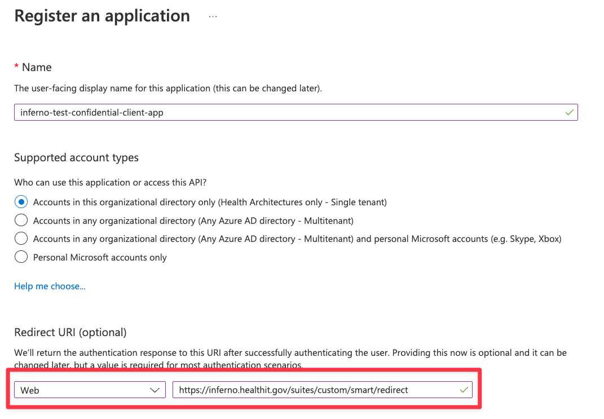
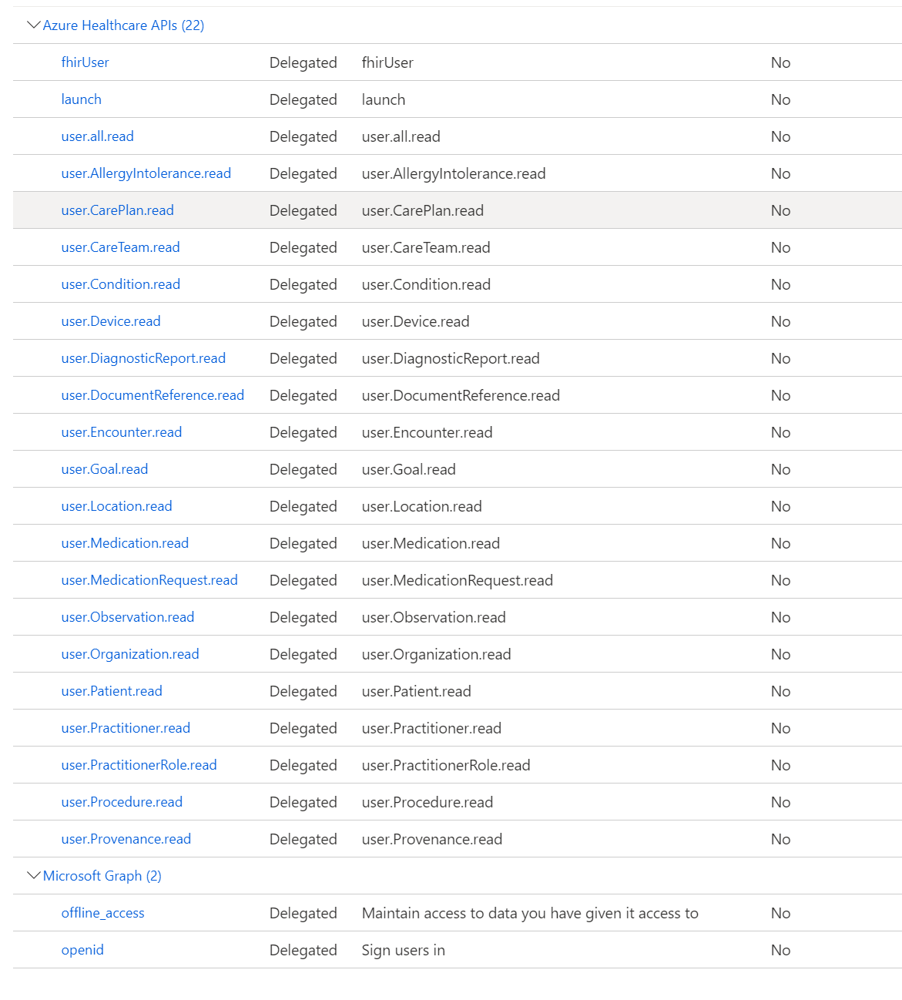
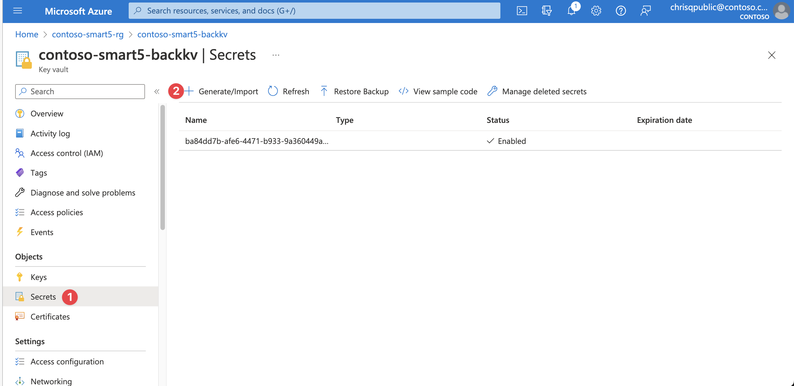

> [!TIP]
> *If you encounter any issues during configuration, deployment, or testing, please refer to the [Trouble Shooting Document](../troubleshooting.md)*

# Inferno Test Applications 

To successfully test ONC (g)(10) with Inferno, you will need to create four separate application registrations to represent the different access scenarios addressed by this test. This method of setting up application registrations is applicable to real SMART on FHIR applications too.

## Patient Standalone Confidential Client / Public Client Applications

The Patient Standalone Launch application consists of two types of client applications:
1. **Confidential Client (Web):** This application can protect a secret and is used for sections 1 & 2 of the test.
1. **Public Client (SPA):** This application cannot protect a secret and is used for section 9 of the test.

1. Create a new application in Microsoft Entra ID. Make sure to select platform (Note : Create Confidential Client application with Web platform and Public Client application with SPA platform) and add the redirect URL for Inferno (`https://inferno.healthit.gov/suites/custom/smart/redirect`).
1. In API Permissions for this new application, add the below:
    - Your FHIR Resource API (Delegated)
        - fhirUser
        - launch.patient
        - patient.AllergyIntolerance.read
        - patient.CarePlan.read
        - patient.CareTeam.read
        - patient.Condition.read
        - patient.Device.read
        - patient.DiagnosticReport.read
        - patient.DocumentReference.read
        - patient.Encounter.read
        - patient.Goal.read
        - patient.Immunization.read
        - patient.Location.read
        - patient.MedicationRequest.read
        - patient.Medication.read
        - patient.Observation.read
        - patient.Organization.read
        - patient.Patient.read
        - patient.Practitioner.read
        - patient.PractitionerRole.read
        - patient.Procedure.read
        - patient.Provenance.read
    - Microsoft Graph (Delegated)
        - openid
        - offline_access
1. Generate a secret for this application(only for Confidential Client). Save this and the client id for testing Inferno *1. Standalone Patient App* and *2. Limited Access App*.
1. Follow all instructions on [this page](./set-fhir-user-mapping.md) to enable mapping the `fhirUser` to the identity token.
 

Click to expand and see screenshots.

## EHR Launch Confidential Client Application

The EHR launch confidential client application is a standard confidential client application which represents an application that can protect a secret (section 3 of the test).

1. Create a new application in Microsoft Entra ID. Make sure to select `Web` as the platform and add the redirect URL for Inferno (`https://inferno.healthit.gov/suites/custom/smart/redirect`).
1. In API Permissions for this new application, add the below:
    - Your FHIR Resource Application (Delegated)
        - fhirUser
        - launch
        - user.AllergyIntolerance.read
        - user.CarePlan.read
        - user.CareTeam.read
        - user.Condition.read
        - user.Device.read
        - user.DiagnosticReport.read
        - user.DocumentReference.read
        - user.Encounter.read
        - user.Goal.read
        - user.Immunization.read
        - user.Location.read
        - user.MedicationRequest.read
        - user.Medication.read
        - user.Observation.read
        - user.Organization.read
        - user.Patient.read
        - user.Practitioner.read
        - user.PractitionerRole.read
        - user.Procedure.read
        - user.Provenance.read
    - Microsoft Graph (Delegated)
        - openid
        - offline_access
1. Generate a secret for this application. Save this and the client id for testing Inferno *3. EHR Practitioner App*.
1. Follow all instructions on [this page](./set-fhir-user-mapping.md) to enable mapping the `fhirUser` to the identity token.
 

Click to expand and see screenshots.

Click here to learn how to simulate an EHR Launch manually: [Simulate EHR Launch (Inferno Setup)](./smart-ehr-launch-Inferno-Setup.md)

## Backend Service Client Application

Microsoft Entra ID does not support RSA384 and/or ES384 which is required by the SMART on FHIR implementation guide. In order to provide this capability, custom code is required to validate the JWT assertion and return a bearer token generated for the client with the corresponding client secret in an Azure KeyVault.

1. Create a new application registration in the Microsoft Entra ID tenant. No platform or redirect URL is needed.
1. In API Permissions for this new application, add the below:
    - Your FHIR Resource API (Application)
        - user.all.read
1. Grant admin consent for your Application on the API Permission page.
1. Generate a secret for this application. Save this and the client id.
1. Grant this application `FHIR SMART User` and `FHIR Data Exporter` role in your FHIR Service or Azure API for FHIR.
1. Open the KeyVault from the {env_name}-rg resource group, or with the name of the existing resource group you specified. The Key Vault will have a suffix of `backkv`.
1. Add a new secret that corresponds to the Application you just generated. 
    - Name: Application ID/Client ID of the application
    - Secret: The secret you generated for the application
    - Tags: Make sure to add the tag `jwks_url` with the backend service JWKS URL. For Inferno testing, this is: https://inferno.healthit.gov/suites/custom/g10_certification/.well-known/jwks.json
1. Save the client id for later testing.
 

Click to expand and see screenshots.

## Inferno Public Service Base URL

This repository contains a sample code to validate conformance to the HTI-1 rule from the API Condition and Maintenance of Certification. The test suite, known as **Service Base URL Test Suite**, ensures that Certified API Developers with patient-facing apps publish their service base URLs and related organizational details in the specified format. Specifically, it checks that the service base URLs are publicly accessible and formatted according to the FHIR 4.0.1 standard, and that the necessary organizational details are correctly referenced and bundled. This sample provides a public endpoint to pass the test suite.

Before executing the test, follow these steps to configure your environment:

1. **Create Secrets in Key Vault**:
    - In the resource group that matches your environment, open the KeyVault with the suffix `backkv`.
    - Add the following secrets along with their values for the Endpoint resource:
        - `status` = active
        - `connectionType` = http://terminology.hl7.org/CodeSystem/endpoint-connection-type
        - `address` = Your Fhir Service or Azure API for FHIR URL without /metadata
    - Add the following secrets along with their values for the Organization resource:
        - `active` = true
        - `name` = Health Intersections CarePlan Hub
        - `location` = USA
        - `identifier` = http://hl7.org/fhir/sid/us-npi
    - Ensure that the names of the secrets are exactly as provided above with no uppercase letters or alterations.

2. **Sample Endpoint**:
    - Use the following URL `{apim-url}/smart/service-base` to test Service Base URL Test Suite. 
    - Replace `{apim-url}` with your deployed APIM service url in the resource group.

    **[Back to Previous Page](../deployment.md#7-create-inferno-test-applications)**