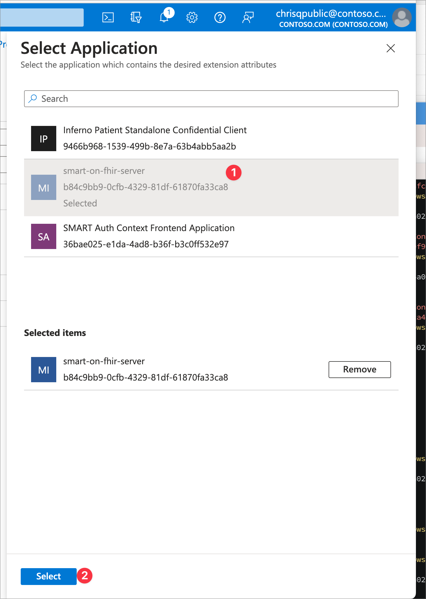
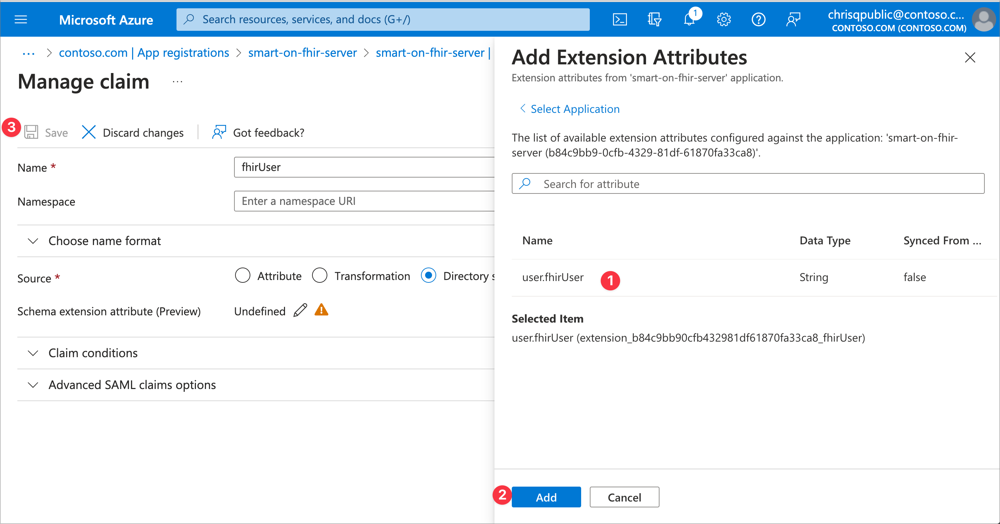

> [!TIP]
> *If you encounter any issues during configuration, deployment, or testing, please refer to the [Trouble Shooting Document](../troubleshooting.md)*

# Set fhirUser Claims Mapping

The fhirUser claim mapping informs the calling application of the user's FHIR id through the identity token and it informs the FHIR Service or Azure API for FHIR the user's id through the access token. This claims mapping needs to be setup for the FHIR Resource application *and* each SMART client application that will be getting an identity token and expecting the `fhirUser` claim.

### Configure fhirUser mapping to token

In the Azure Portal under Microsoft Entra ID, select Enterprise Applications. Search for the target application created previously. You also can find the enterprise application by clicking the `Managed application in local directory` link from the App Registrations page. Once you are in the enterprise application, select the **Single Sign-On** option in the left-hand menu and open the **Attributes & Claims** section.

The following steps will assign a static fhirUser custom attribute for the Confidential Client application:

1. In the Azure Portal, on the **Attributes & Claims** section, select **Edit**
2. Click **Add New Claim**
3. Name the claim **fhirUser**
4. Select **Directory schema extension** for Source
5. Select your FHIR Resource Application. Choose the `user.fhirUser` attribute.
6. Click **Add** then **Save**.

Click to expand and see screenshots.

 

 

### Modify Application Manifest

For the Application Registration to allow custom claims, the *acceptMappedClaims* value must be set to **true** (*if it is already true, you can skip this step*). To update your application manifest:

1. In the Azure Portal in Microsoft Entra ID, select **App registrations**
2. Select your App registration from the list
3. Select **Manifest** from the left-hand menu
4. Find *acceptMappedClaims* in the JSON block and change it's value from *null* to **true**, click **Save**.

Click to expand and see screenshots.

 

