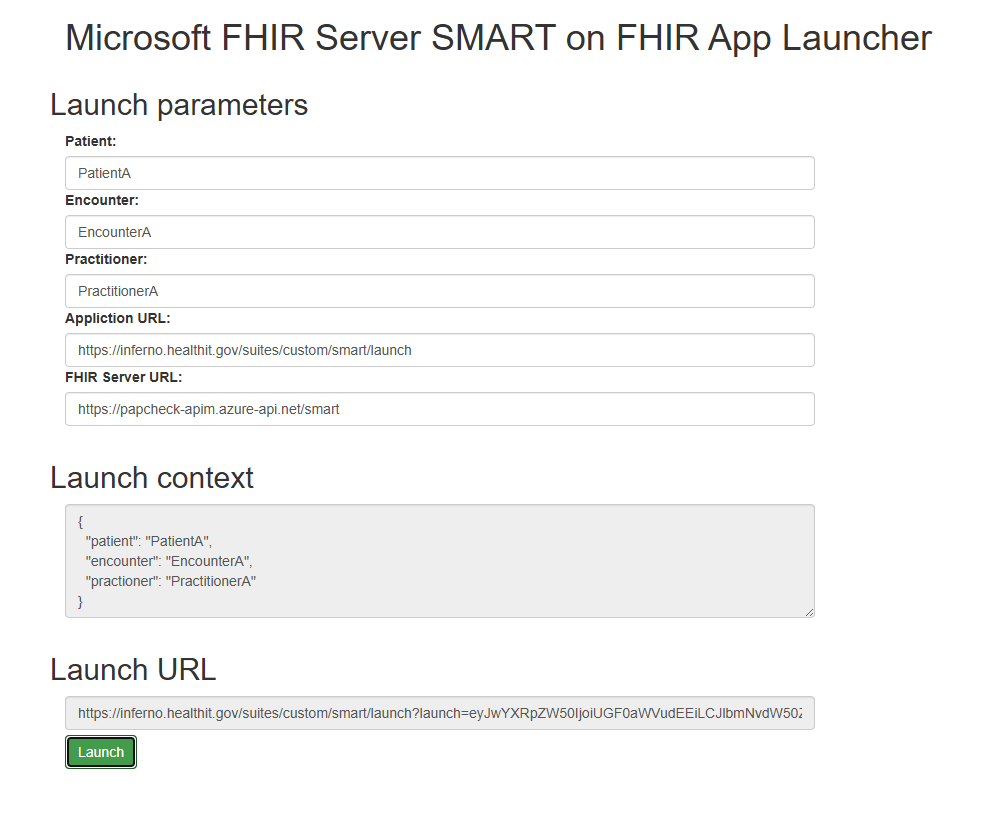

> Note - Throughout this document, the term `FHIR Server` refers to either AHDS FHIR service or Azure API for FHIR, depending on the configuration or user preference.

#  EHR Practitioner App Testing with Inferno
This guide outlines the steps to test the EHR Practitioner App Launch Workflow using the **Inferno** testing tool in combination with the SMART on FHIR app launcher. 

The primary objective is to simulate an EHR launch scenario as part of the **ONC §170.315(g)(10) certification testing**. Inferno evaluates SMART on FHIR compliance by executing a series of test cases against a FHIR endpoint. For the Practitioner App flow, the suite includes a manual launch step that mimics an external EHR initiating a SMART app launch.

To facilitate this, Microsoft provides a sample SMART launcher tool that helps generate the necessary launch context (e.g., launch and iss parameters) required by Inferno. The open-source [FHIR Server for Azure repository](https://github.com/Microsoft/fhir-server) includes a simple SMART on FHIR app launcher, use this SMART on FHIR app launcher locally to test the setup.


## Steps to Simulate EHR Launch ##
**1. Clone the Microsoft FHIR Server**

```
git clone https://github.com/microsoft/fhir-server-samples.git
```
Navigate to the following path:
```
cd fhir-server-samples/SmartLauncher
```
**2. Run the Smart Launcher Locally**

- Open the ```SmartLauncher.csproj``` project in Visual Studio or run directly via command line:

```bash
dotnet run
```
Once the application starts, it will open in your default browser (typically at http://localhost:5000 or similar) where you should see the folowwing


---

**3. Fill in Parameters**

- On the launch page, enter the following values:

- **Patient :** Enter a valid Patient ID from your test dataset.
- **Encounter:** Enter a corresponding Encounter ID from your sample data.
- **Practitioner:** nter a valid Practitioner ID from your sample data.
- **Application URL :** This should be the launch URL provided by Inferno during testing.    
     Example:```https://inferno.healthit.gov/suites/custom/smart/launch```
- **FHIR Service URL**: Enter your smart app URL. Example: ```https://<APIM URL>/smart```

After you enter all these information, you notice that the **Launch context** is updated. When you're using the FHIR Server, the launch context is simply a JSON document that contains information about patient, practitioner, and more. This launch context is base64 encoded and passed to the SMART on FHIR app as the launch query parameter.

**Example:**
```https://inferno.healthit.gov/suites/custom/smart/launch?launch=eyJwYXRpZW50IjoiUGF0aWVudEEifQ%3D%3D&iss=https%3A%2F%2Fyour-fhir-service.azure-api.net%2Fsmart```

- Click **Launch** to continue. This will continue the inferno test to run with the appropriate ```launch``` and ```iss``` parameters.


