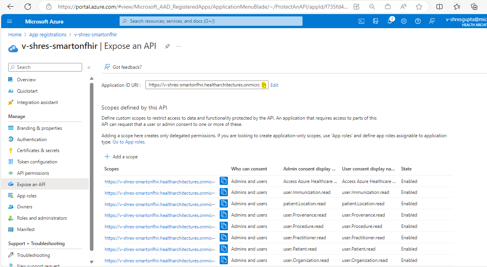
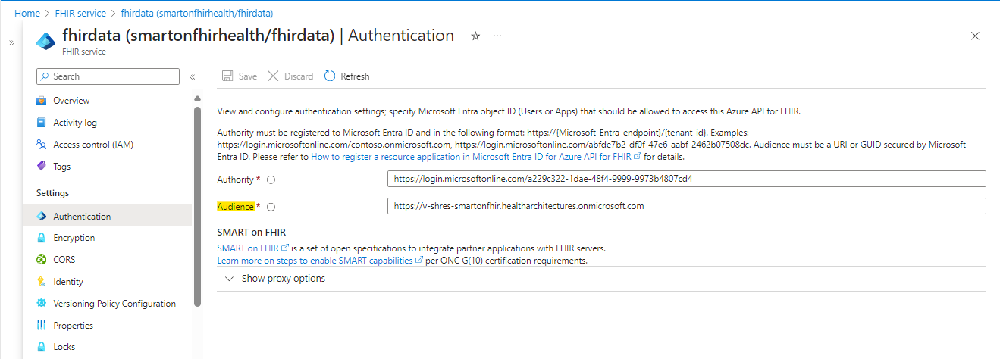
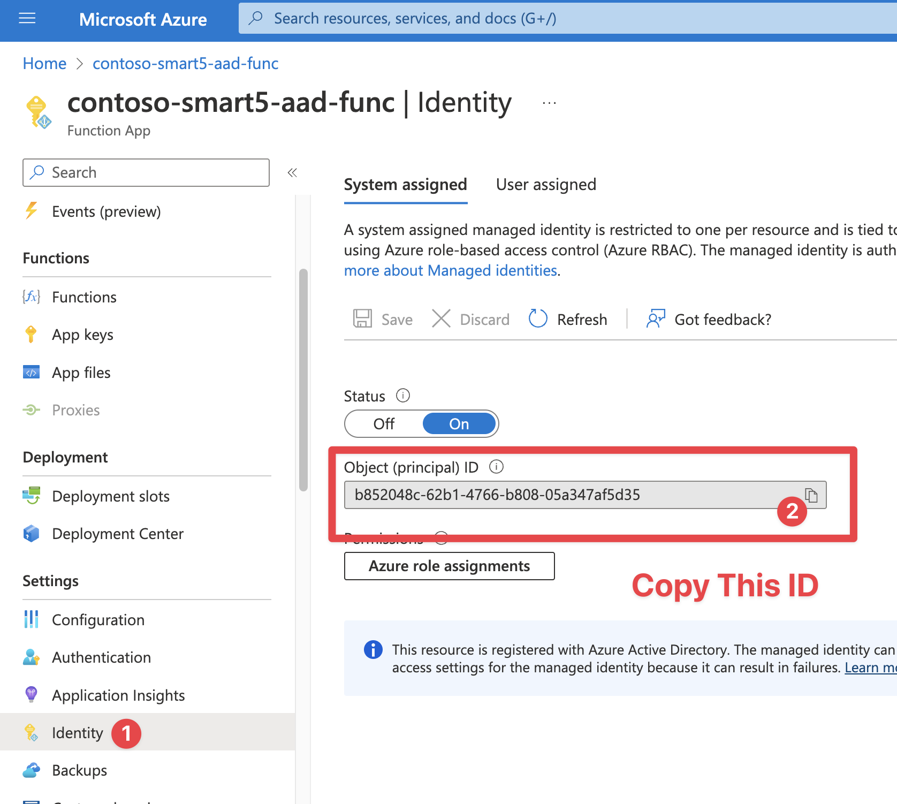
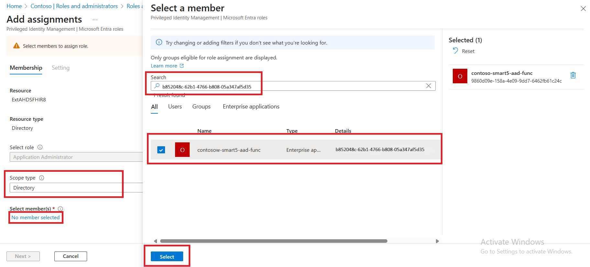
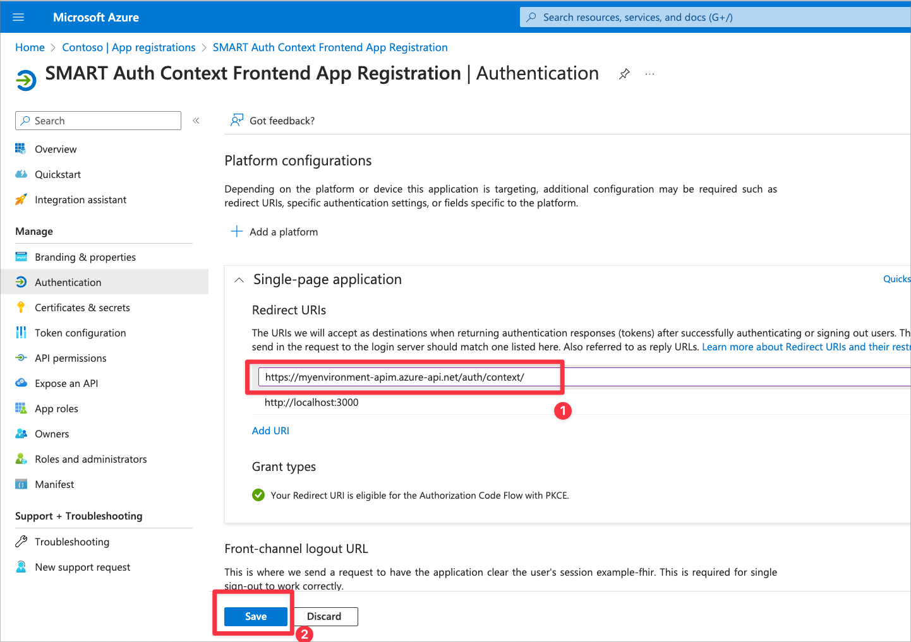

# Sample Deployment: Azure Health Data Services ONC (g)(10) & SMART on FHIR

This document guides you through the steps needed to deploy this sample. This sample deploys Azure components, custom code, and Microsoft Entra ID configuration.

*Note:* This sample is not automated and on average will require at least a couple of hours to deploy end to end.

## 1. Prerequisites

In order to deploy this sample, you will need to install some Azure tools, ensure the proper administrator access to an Azure subscription / tenant, and have test user accounts for impersonating the patient and practitioner personas.

Make sure you have the pre-requisites listed below
- **Installation:**
  - [Git](https://git-scm.com/) to access the files in this repository.
  - [Azure CLI Version 2.51.0 or Greater](https://learn.microsoft.com/cli/azure/install-azure-cli) to run scripts that interact with Azure.
  - [Azure Developer CLI Version 1.2.0 or Greater](https://learn.microsoft.com/azure/developer/azure-developer-cli/install-azd?tabs=baremetal%2Cwindows) to deploy the infrastructure and code for this sample.
  - [Visual Studio](https://visualstudio.microsoft.com/), [Visual Studio Code](https://code.visualstudio.com/), or another development environment (for changing configuration debugging the sample code).
  - [Node Version 18.17.1/ NPM Version 10.2.0](https://docs.npmjs.com/downloading-and-installing-node-js-and-npm) for building the frontend application and installing the US Core FHIR Profile.
  - [.NET SDK Version 8+](https://learn.microsoft.com/dotnet/core/sdk) installed (for building the sample).
  - [PowerShell Version 5.1.22621.2428 or Greater](https://learn.microsoft.com/powershell/scripting/install/installing-powershell) installed for running scripts (works for Mac and Linux too!).

- **Access:**
  - Access to an Azure Subscription where you can create resources and add role assignments.
  - Elevated access in Microsoft Entra ID (AD) and Microsoft Graph to create Application Registrations, assign Microsoft Entra ID roles, and add custom data to user accounts.

- **Test Accounts:**
  - Microsoft Entra ID test account to represent Patient persona. Make sure you have the object id of the user from Microsoft Entra ID.
  - Microsoft Entra ID test account to represent Provider persona. Make sure you have the object id of the user from Microsoft Entra ID.

## 2. Prepare and deploy environment

Next you will need to clone this repository and prepare your environment for deployment by creating two required Azure App Registrations and configuring your environment to use them.

1. Use the terminal or your git client to clone this repo. Open a terminal to the `patientandpopulationservices-smartonfhir-oncg10` folder.
1. Login with the Azure Developer CLI. Specify the tenant if you have more than one. `azd auth login` or `azd auth login --tenant-id <tenant-id>`. Also login with the Azure CLI using `az login`.
1. Run `azd env new` to create a new deployment environment, keeping below points in mind.
    - Environment name must not exceed 18 characters in length.
    - Deployment fails if Environment name contains UpperCase Letters.
    - Use numbers and lower-case letters only for Environment name.
    - Environment name will be the prefix for all of your resources.
1. [Create the FHIR Resource App Registration. Use the instructions here](./ad-apps/fhir-resource-app-registration.md). Record the application id for later.   
1. [Create the Auth Context Frontend App Registration. Use the instructions here](./ad-apps/auth-context-frontend-app-registration.md). Record the application id for later.   
1. Set your deployment environment configuration.
    ```
    azd env set ApiPublisherName "Your Name"
    azd env set ApiPublisherEmail "Your Email"
    ```
1. Start the deployment of your environment by running the 'azd' command. This action will provision the infrastructure as well as deploy the code, which is expected to take about an hour.
     ```
    azd up
    ```
    - When running this command, you must select the `subscription name` and `location` from the drop-down menus to specify the deployment location for all resources. 
    - Please be aware that this sample can only be deployed in the EastUS2, WestUS2, or CentralUS regions. Make sure you choose one of these regions during the deployment process.
    - The azd provision command will prompt users to enter values for the `existingResourceGroupName`, `fhirid` and `enableVNetSupport` parameters. Users can provide values based on their requirements as below
        - `existingResourceGroupName` : This parameter allows you to decide whether to deploy this sample in an existing resource group or to create a new resource group and deploy the sample. Leaving this parameter empty will create a new resource group named '{env_name}-rg' and deploy the sample. If you provide an existing resource group, the sample will be deployed in that resource group.
          - Note: If you are using an existing resource group, make sure that it does not already have a SMART on FHIR resource already deployed, because multiple samples in the same resource group are not supported.
          - Note: SMART on FHIR will need to be deployed in the same resource group as the associated FHIR server. 
        - `fhirid`: This parameter allows you to decide whether to use an existing FHIR service or create a new one. Leaving this parameter empty will create a new FHIR service. If you wish to use an existing FHIR server, input the FHIR instance ID. Below are steps to retrieve the FHIR instance ID: 
            1. Navigate to your FHIR service in Azure Portal.
            2. Click on properties in the left menu.
            3. Copy the "Id" field under the "Essentials" group.
        - `enableVNetSupport`: This parameter accepts a boolean (true/false) value, enabling integration of Virtual Network and Private Link in the deployed sample. When set to true, the following resources are deployed in the Standard/Premium tier to enable private endpoint creation necessary for Virtual Network Support:
          1. API Management (APIM): Deployed in the Premium tier.
          2. App Service Plan and Static Web App: Deployed in the Standard tier.
          3. Function Apps and App Service Plan: Utilizes Windows as the operating system. 
    - Some important considerations when using an existing FHIR service instance:
        - The FHIR server instance and SMART on FHIR resources are expected to be deployed in the same resource group, so enter the same resource group name in the `existingResourceGroupName` parameter.
        - Enable the system-assigned status in the existing FHIR service, Follow the below steps:
            1. Navigate to your existing FHIR Service.
            2. Proceed to the identity blade.
            3. Enable the status.
            4. Click on save.
            <br /><details><summary>Click to expand and see screenshots.</summary>
            
            </details>
         - If you are creating a new FHIR server as part of the SMART on FHIR deployment, you can skip this step. However, if you are using an existing FHIR server, you will need to complete this step:  
            The SMART on FHIR sample requires the FHIR server Audience URL to match the FHIR Resource Application Registration ID URL (which you created in Step 4 above). When you deploy the SMART on FHIR sample with a new FHIR server, the sample will automatically change the FHIR server Audience URL for you. If you use an existing FHIR server, you will need to do this step manually. 
            1. Navigate to your FHIR Resource App Registration.
            2. Proceed to the "Expose an API" blade and copy the Application ID URI. 
            3. Go to your existing FHIR Service.
            4. Proceed to the authentication blade. 
            5. Paste the URL into the Audience field.
        <br /><details><summary>Click to expand and see screenshots.</summary>
        
        
        </details>
> [!IMPORTANT]  
> If you are using an existing FHIR server, please note that in the above step, you needed to change the FHIR server Audience URL to the new Application Registration ID URL. If you have downstream apps that were using the previous FHIR server Audience URL, you will need to update those to point to the new URL.  


*NOTE:* This will take around 15 minutes to deploy. You can continue the setup below. 

## 3. Complete Setup of FHIR Resource and Auth Context Frontend Applications

### Assign Microsoft Entra ID Permissions for the Auth Custom Operation API

As part of the scope selection flow, the Auth Custom Operation Azure Function will modify user permissions for the signed in user. This requires granting the Azure Managed Identity behind Azure Functions Application Administrator (or similar access).

1. Open the Azure Function for the SMART Auth Custom Operations. It will be suffixed by `aad-func`. Copy the Managed Identity for the next steps.
1. Open Microsoft Entra ID and navigate to `Roles and Administrators`. Open the `Application Administrator` role.
1. Add the Azure Function Managed Identity to this Microsoft Entra ID role.

<br />
<details>
<summary>Click to expand and see screenshots.</summary>




</details>
<br />

### Set the Auth User Input Redirect URL

1. Open the resource group created by step 3. Find the Azure API Management instance.
1. Copy the Gateway URL for the API Management instance.
1. Open your Application Registration for the Auth Context Frontend you created before deployment. Add `<gatewayURL>/auth/context/` as a sinple-page application redirect URI. Make sure to add the last slash.
    - For example: `https://myenv-apim.azure-api.net/auth/context/`

<br />
<details>
<summary>Click to expand and see screenshots.</summary>


</details>
<br />

## 4. Create Inferno Test Applications in Microsoft Entra ID

We will need to create four separate Microsoft Entra ID Applications to run the Inferno (g)(10) test suite. It's best practice to register an Azure Application for each client application that will need to access your FHIR Service. This will allow for granular control of data access per application for the tenant administrator and the users. For more information about best practices for Microsoft Entra ID applications, [read this](https://learn.microsoft.com/en-us/entra/identity-platform/security-best-practices-for-app-registration).

Follow the directions on the [Inferno Test App Registration Page](./ad-apps/inferno-test-app-registration.md) for instructions on registering the needed Azure Applications for the Inferno (g)(10) tests.
- Standalone Patient App (Confidential Client)
- EHR Practitioner App (Confidential Client)
- Backend Service Client
- Standalone Patient App (Public Client)

## 6. Add sample data and US Core resources

To successfully run the Inferno ONC (g)(10) test suite, both the US Core FHIR package and applicable data need to be loaded. 

To quickly load the needed data to your FHIR Service, make sure your user account has FHIR Data Contributor role on the FHIR Service. Then execute this script:

Windows:
```powershell
powershell ./scripts/Load-ProfilesData.ps1
```

Mac/Linux:
```bash
pwsh ./scripts/Load-ProfilesData.ps1
```

To learn more about the sample data, read [sample data](./sample-data.md).
