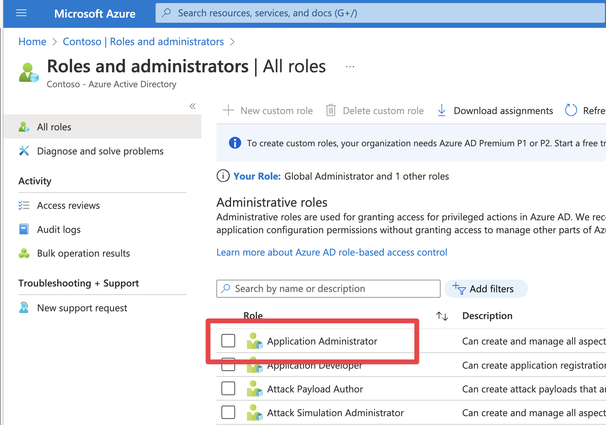

# Sample Deployment: Azure Health Data Services ONC (g)(10) & SMART on FHIR

This document guides you through the steps needed to deploy this sample. This sample deploys Azure components, custom code, and Azure Active Directory configuration.

*Note:* This sample is not automated and on average will require at least a couple of hours to deploy end to end.

## 1. Prerequisites

In order to deploy this sample, you will need to install some Azure tools, ensure the proper administrator access to an Azure subscription / tenant, and have test user accounts for impersonating the patient and practitioner personas.

Make sure you have the pre-requisites listed below
- **Installation:**
  - [Git](https://git-scm.com/) to access the files in this repository.
  - [Azure CLI](https://learn.microsoft.com/cli/azure/install-azure-cli) to run scripts that interact with Azure.
  - [Azure Developer CLI](https://learn.microsoft.com/azure/developer/azure-developer-cli/install-azd?tabs=baremetal%2Cwindows) to deploy the infrastructure and code for this sample.
  - [Visual Studio](https://visualstudio.microsoft.com/), [Visual Studio Code](https://code.visualstudio.com/), or another development environment (for changing configuration debugging the sample code).
  - [Node / NPM](https://docs.npmjs.com/downloading-and-installing-node-js-and-npm) for building the frontend application and installing the US Core FHIR Profile.
  - [.NET SDK 6+](https://learn.microsoft.com/dotnet/core/sdk) installed (for building the sample).
  - [PowerShell](https://learn.microsoft.com/powershell/scripting/install/installing-powershell) installed for running scripts (works for Mac and Linux too!)

- **Access:**
  - Access to an Azure Subscription where you can create resources and add role assignments.
  - Elevated access in Azure Active Directory (AD) and Microsoft Graph to create Application Registrations, assign Azure Active Directory roles, and add custom data to user accounts.

- **Test Accounts:**
  - Azure Active Directory test account to represent Patient persona. Make sure you have the object id of the user from Azure Active Directory.
  - Azure Active Directory test account to represent Provider persona. Make sure you have the object id of the user from Azure Active Directory.

## 2. Prepare and deploy environment

Next you will need to clone this repository and prepare your environment for deployment by creating two required Azure App Registrations and configuring your environment to use them.

1. Use the terminal or your git client to clone this repo. Open a terminal to the `Patient and Population Services G10` folder.
1. Login with the Azure Developer CLI. Specify the tenant if you have more than one. `azd login` or `azd login --tenant-id <tenant-id>`.
1. Run `azd env new` to create a new deployment environment.
    - *NOTE:* Environment name will be the prefix for all of your resources.
1. [Create the FHIR Resource App Registration. Use the instructions here](./ad-apps/fhir-resource-app-registration.md). Record the application id and application url for later.
    - Make sure to tell azd about this application with `azd env set FhirAudience <FHIR Resource App Audience>`.
1. [Create the Auth Context Frontend App Registration. Use the instructions here](./ad-apps/auth-context-frontend-app-registration.md). Record the application id and application url for later.
    - Make sure to tell azd about this application with `azd env set ContextAppClientId <context app id>`.
1. Set your deployment environment configuration.
    ```
    azd env set ApiPublisherName "Your Name"
    azd env set ApiPublisherEmail "Your Email"
    azd env set FhirAudience "FHIR Resource Application URL (like http://appname.tenant.onmicrosoft.com)"
    azd env set ContextAppClientId "Auth Context Frontend App Application ID"
    ```
1. Finally, deploy your environment by running azd. This command will provision infrastructure and deploy code. It will take about an hour - you can continue the setup below. 
    ```
    azd up
    ```

*NOTE:* This will take around 15 minutes to deploy.

## 3. Complete Setup of FHIR Resource and Auth Context Frontend Applications

### Assign Azure AD Permissions for the Auth Custom Operation API

As part of the scope selection flow, the Auth Custom Operation Azure Function will modify user permissions for the signed in user. This requires granting the Azure Managed Identity behind Azure Functions Application Administrator (or similar access).

1. Open the Azure Function for the SMART Auth Custom Operations. It will be suffixed by `aad-func`. Copy the Managed Identity for the next steps.
1. Open Azure Active Directory and navigate to `Roles and Administrators`. Open the `Application Administrator` role.
1. Add the Azure Function Managed Identity to this AAD role.

<br />
<details>
<summary>Click to expand and see screenshots.</summary>




</details>
<br />

### Set the Auth User Input Redirect URL

1. Open the resource group created by step 3. Find the Azure API Management instance.
1. Copy the Gateway URL for the API Management instance.
1. Open your Application Registration for the Auth Context Frontend you created before deployment. Add `<gatewayURL>/auth/context/` as a sinple-page application redirect URI. Make sure to add the last slash.
    - For example: `https://myenv-apim.azure-api.net/auth/context/`

<br />
<details>
<summary>Click to expand and see screenshots.</summary>


</details>
<br />

## 4. Create Inferno Test Applications in Azure Active Directory

We will need to create four separate Azure AD Applications to run the Inferno (g)(10) test suite. It's best practice to register an Azure Application for each client application that will need to access your FHIR Service. This will allow for granular control of data access per application for the tenant administrator and the users. For more information about best practices for Azure Active Directory applications, [read this](https://learn.microsoft.com/azure/active-directory/develop/security-best-practices-for-app-registration).

Follow the directions on the [Inferno Test App Registration Page](./ad-apps/inferno-test-app-registration.md) for instructions on registering the needed Azure Applications for the Inferno (g)(10) tests.
- Standalone Patient App (Confidential Client)
- EHR Practitioner App (Confidential Client)
- Backend Service Client
- Standalone Patient App (Public Client)

## 6. Add sample data and US Core resources

To successfully run the Inferno ONC (g)(10) test suite, both the US Core FHIR package and applicable data need to be loaded. 

To quickly load the needed data to your FHIR Service, make sure your user account has FHIR Data Contributor role on the FHIR Service. Then execute this script:

Windows:
```powershell
powershell ./scripts/Load-ProfilesData.ps1
```

Mac/Linux:
```bash
pwsh ./scripts/Load-ProfilesData.ps1
```

To learn more about the sample data, read [sample data](./sample-data.md).