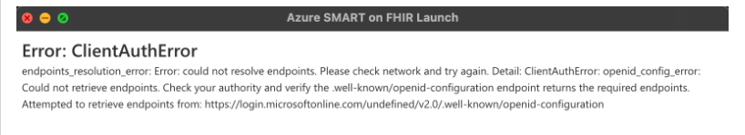
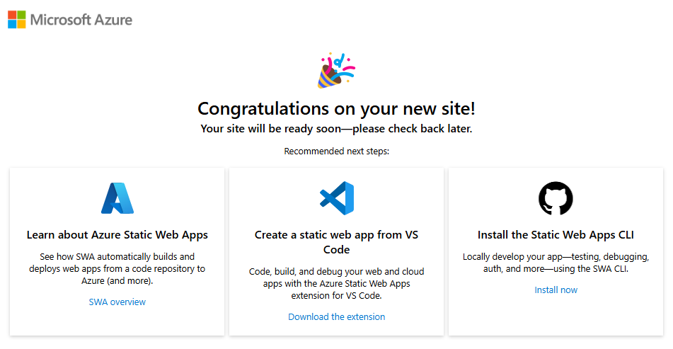

# Troubleshooting

## Application Insights

This sample deploys Application Insights. This will collect information from both Azure API Management and the Azure Functions in this sample. This is the best place to look if you are seeing any HTTP errors at all. This will give you insights into configuration and request information as well as any changes you may need for your own environment.

## Browser Console

For the Authorize Input Application, the browser console is the best place to start. Often you will see configuration issues here because requests are going to a different API than you expect.

## Common Issues

### Microsoft Entra ID Issues

This sample makes some assumptions about Microsoft Entra ID configuration. You may run into errors if your Microsoft Entra ID is not setup with the following:

- Allowing users to consent to scopes (this is needed for them to choose and store scopes).
- Allowing developers to register applications.
- Your account needs elevated permissions to setup the context application.

### Azure Configuration Issues

Some common Azure issues that you need to watch out for are:

- Not enough permissions in Azure
- Resource Providers for applications are not registered. If the deployment fails

### Deployment Issues with the Azure Developer CLI

The Azure Developer CLI creates a deployment in Azure as part of the `azd up` command. To get additional details about deployment issues, it's best to find the newly created resource group in Azure and look at the deployments in the resource group for more information. A single `azd up` command will spawn off multiple child deployments, so make sure to click into the failing deployment for more details.

### Powershell Script Issues

If you encounter an error while attempting to run the PowerShell scripts with the below message:

```
Script cannot be loaded. The script is not digitally signed. You cannot run this script on the current system. 
```

To resolve this issue, you can temporarily change the script execution policy to bypass the digital signature requirement by running the following command in your PowerShell session:

```
Set-ExecutionPolicy -Scope Process -ExecutionPolicy Bypass
```

This command allows you to run the script without altering the execution policy permanently. For more information on PowerShell execution policies, refer to the documentation at [about_Execution_Policies](https://learn.microsoft.com/en-us/powershell/module/microsoft.powershell.core/about/about_execution_policies?view=powershell-7.4).

### Not getting correct scopes

If you are getting more scopes assigned to your token, make sure you HAVE NOT applied admin consent for any scopes. Any admin consent that you apply will override user selected scopes.

### Unauthorized Errors

If you encounter Unauthorized(401) or Forbidden(403) errors while accessing resources or during authentication, please check the following:
- User Configuration:
  - `FHIR SMART User` Role is assigned to the Test User.
  - Test User is mapped with appropriate `fhirUser` claim.
  - Required scopes were selected during authentication.
  - To identify `fhirUser` and `scope` claim value decode obtained token using [jwt.ms](https://jwt.ms/).
- Postman Configuration:
  - All the environment variables contain proper values.
  - Specifically, `resource` environment variable match the FHIR Server audience.
- Backend Services Configuration:
  - You have an invalid JWKS
  - You don't have the correct configuration in KeyVault for your client
  - You didn't give your client the proper role assignments to your FHIR Service or Azure API for FHIR.

### Not Found Errors for API Requests

This is usually an issue with Azure API Management. Either an API configuration in Azure API Management is setup correctly or your testing tool is pointed at the wrong API Management Issue.

To find out more, information, check out:

- The request information and trace logs in Azure Application Insights. 
- This could be an issue with the Authorize User Input static app. Check the browser developer tools for more details.
- Ensure your Azure Deployment of the sample was successful.

### Getting ClientAuthError on launching the sample app for the first time

- This error occurs while launching the sample app for the first time, it arises when some files are not properly copied over or some configuration variables are not properly set when deploying the sample.
- To resolve this issue, simply rerun the `azd up` command in the terminal where the app was initially deployed. No additional steps are required.
- The error is displayed in the screenshot below.

<br /><details><summary>Click to expand and see screenshots.</summary>

</details>

### Unexpected Screen Displayed Instead of Login Screen
- When accessing the frontend application, you may encounter an unexpected screen shown below instead of the login page.
- This issue typically occurs if the frontend build deployment to Azure Static Web Apps is still in progress. The app remains in the **Waiting for Deployment** state instead of transitioning to the **Ready** state.
- Follow below steps to resolve this issue
  - Wait for the `azd up` command to complete, as the deployment may still be processing.
  - If the deployment appears to be stuck, you can rerun the `azd up` command in the terminal where the app was originally deployed.

<br /><details><summary>Click to expand and see screenshots.</summary>

</details>