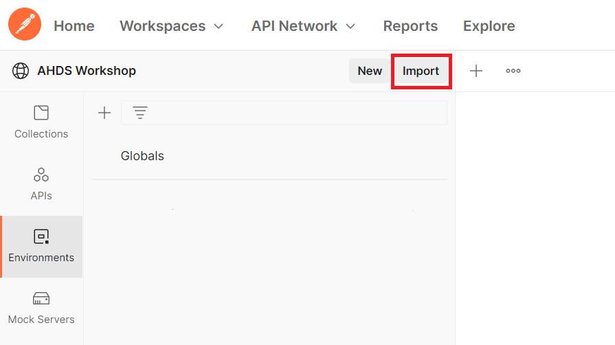
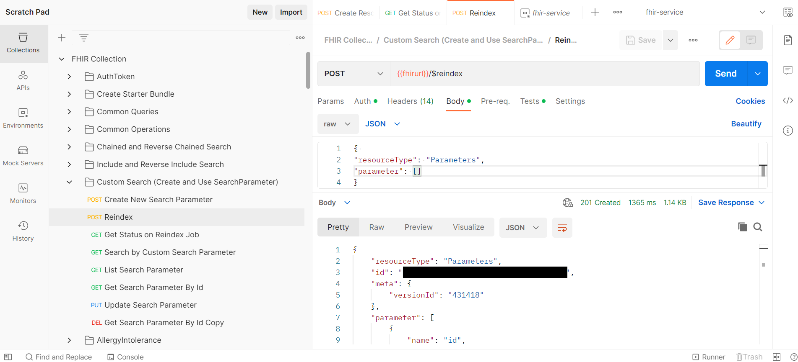

# Postman FHIR queries starter collection

To interact with FHIR data, you can utilize Postman to write FHIR queries to query resources. This sample includes a large starter Postman collection that can help you quickly learn and get started with querying/accessing the FHIR service. This starter Postman collection includes many common FHIR queries, including FHIR searches, CRUD (create, read, update, and delete) requests for FHIR resources, and other operations. 

## Prerequisites

* Please follow this tutorial first prior to starting this sample: [Access using Postman | Microsoft Learn](https://learn.microsoft.com/en-us/azure/healthcare-apis/fhir/use-postman).
  * If you already have knowledge of how to access the FHIR server using Postman, including [registering the client application to access the FHIR service](https://github.com/microsoft/azure-health-data-services-workshop/blob/main/resources/docs/Postman_FHIR_service_README.md#step-1---create-an-app-registration-for-postman-in-aad) and granting proper [FHIR Data Contributor](https://github.com/microsoft/azure-health-data-services-workshop/blob/main/resources/docs/Postman_FHIR_service_README.md#step-2---assign-fhir-data-contributor-role-in-azure-for-postman-service-client) permissions, you can skip this.
* Postman installed locally. For more information about Postman, see [Get Started with Postman](https://www.getpostman.com/).
* FHIR service deployed in Azure. For information about how to deploy the FHIR service, see [Deploy a FHIR service](https://learn.microsoft.com/en-us/azure/healthcare-apis/fhir/fhir-portal-quickstart).

## Collection Details
The queries in this collection are categorized into folders as below:
- `AuthToken` - Request to create an authentication token which is used in all other queries.
- `Create Starter Bundle` - Here we create multiple resources in one bundle, these resources will be used or referenced in other queries in this tutorial.
- `Common Queries` - This folder has a set of frequently used queries.
- `Common Operations` - This folder has queries for FHIR operations like convert, validate, export and import.
- `Chained and Reverse Chained Search` - This folder has queries to use chaining and reverse chaining for fetching resources based on related (referenced) resources, more details about chaining can be found [here](https://learn.microsoft.com/en-us/azure/healthcare-apis/fhir/overview-of-search#chained--reverse-chained-searching).
- `Include and Reverse Include Search` - This folder has queries with `_include` and `_revinclude` parameters, to fetch resources related to the search results (e.g., `Patient` resources associated with an `Encounter` search). More details on inclusions can be found on the [FHIR Search Page](https://www.hl7.org/fhir/search.html#return).
- `Custom Search (Create and Use custom SearchParameter)`  - This folder has queries related to custom search, here we create a new `SearchParameter` resource, run the reindex operation (`$reindex`), and use the newly created `SearchParameter`. More details about custom search could be found in [Microsoft Learn](https://learn.microsoft.com/en-us/azure/healthcare-apis/azure-api-for-fhir/how-to-do-custom-search).
- List of alphabetically sorted, resource specific folders for resource specific queries for CRUD operations.


 

## Getting started
To set up Postman for testing FHIR service, we'll walk through these steps:

**Step 1:** Import environment template and collection files into Postman  
**Step 2:** Enter parameter values for the Postman environment  
**Step 3:** Get an authorization token from AAD  
**Step 4:** Test FHIR service with Postman  

## Step 1 - Import environment and collection files into Postman

1. Access the Postman environment template for FHIR service [here](./fhir-service.postman_environment.json). Save the file locally (click on **Raw** and then do a **Save as** from your browser). 

2. In Postman, create a new [Workspace](https://www.postman.com/product/workspaces/) (or select an existing one if already created).

3. Find the **Environments** tab on the left and click the **Import** button next to the workspace name. 


4. Import the ```fhir-service.postman_environment.json``` file that you just saved locally.
    + Add the file to Postman using the **Upload Files** button. Then click **Import**. 


5. Now, access the ```FHIR Collection.postman-collection.json``` file available in this repo [here](./FHIR-Collection.postman_collection.json) and save the file locally. Then import the file into Postman.
    + Add the file to Postman using the **Upload Files** button. Then click **Import**. 


## Step 2 - Configure Postman environment
Now you will configure your Postman environment (`fhir-service`). 

1. For the `fhir-service` Postman environment, fill out the following values in the **CURRENT VALUE** column:

  - `tenantId` - AAD tenant ID (go to **Azure Active Directory** -> **Overview** -> **Tenant ID**)
  - `clientId` - Application (client) ID for Postman service client app (go to **Azure Active Directory** -> **App registrations** -> `<postman-service-client-name>` -> **Overview** -> **Application (client) ID**) 
  - `clientSecret` - Client secret stored for Postman that was created when you registered the app in Azure Active Directory. More information [here](https://github.com/microsoft/azure-health-data-services-workshop/blob/main/resources/docs/Postman_FHIR_service_README.md#step-1---create-an-app-registration-for-postman-in-aad) 
  - `fhirurl` - FHIR service endpoint - e.g. `https://<workspace-name>-<fhir-service-name>.fhir.azurehealthcareapis.com` (go to **Resource Group** -> **Overview** -> `<fhir-service-name>` -> **FHIR metadata endpoint** and copy *without* "/metadata" on the end)
  - `resource` - FHIR service endpoint - (**same as `fhirurl`**) e.g. `https://<workspace-name>-<fhir-service-name>.fhir.azurehealthcareapis.com` 

  Populate the above parameter values in your `fhir-service` Postman environment as shown below. Input the values in the **CURRENT VALUE** column. Leave `bearerToken` blank. Make sure to click **Save** to retain the `fhir-service` environment values.  

  

## Step 3 - Get an access token from AAD
To obtain an access token from AAD via Postman, you would typically follow steps outlined [here](https://learn.microsoft.com/en-us/azure/healthcare-apis/fhir/use-postman#get-azure-ad-access-token), however, for the purposes of this starter collection, we have included the  ```POST Get Authorization Token``` call pre-configured.

In Postman, click on **Collections** on the left, select the `FHIR Collection` collection, open the first folder titled `AuthToken`, and then select `POST Get Authorization Token`. Press **Send** on the right.

__IMPORTANT:__ Be sure to make the `fhir-service` environment active by selecting from the dropdown menu above the **Send** button. In the image below, `fhir-service` is shown as the active environment.


On clicking **Send**, you should receive a response in the **Body** tab like shown below. The `access_token` value is automatically saved to the ```bearerToken``` variable in the Postman environment. 

```
{
    "token_type": "Bearer",
    "expires_in": "3599",
    "ext_expires_in": "3599",
    "expires_on": "XXXXXXXXXX",
    "not_before": "XXXXXXXXXX",
    "resource": "XXXXXXX-XXXX-XXXX-XXXX-XXXXXXXXXXXX",
    "access_token": "XXXXXXXXXXXX..."
}
```

You now have a valid access token in your Postman environment and can use the token in subsequent API calls to your FHIR service. For more information about access tokens in AAD, see [Microsoft identity platform access tokens](https://docs.microsoft.com/en-us/azure/active-directory/develop/access-tokens).

__Note:__ Access tokens expire after 60 minutes. To obtain a token refresh, simply make another ```POST Get Authorization Token``` call and you will receive a new token valid for another 60 minutes.

## Step 4 - Query FHIR service with Postman 

1. Try `GET List All Patients` under `Common Queries` folder in the `FHIR Collection` collection and press **Send**. If the response is as shown below, with status "200 Ok" and resourceType as "Bundle", this means you successfully obtained a list of all `Patient` resources stored in the FHIR service database.

If there aren't any `Patient` resources in Fhir service, you will get and empty bundle in response as shown below.


If there are `Patient` resources in Fhir service, you will see Bundle with an array named "entry" in response with list of `Patient` resources as shown in two images below. 


Any of the above response means that your setup is functional.

2. Now we will create a [bundle](https://www.hl7.org/fhir/bundle.html) of resources by posting a `Bundle` to the FHIR service. Under the `Create Starter Bundle` folder, click on ```POST Create Resources Bundle (Multiple resources)``` and press **Send**. If the response matches the following, this means you successfully created multiple resources included in a bundle.
This bundle contains `Patient`, `Practitioner`, `Organization`, `Location`, `PractitionerRole`, `Encounter`, `Observation`, `Condition`, `Procedure`, `Group`, `Device`, `RelatedPerson` and `ServiceRequest`. These resources will be used as references for creating other resources in the later steps of this tutorial which depend on them. The environment variables for Ids of these resources will be updated.


The following instructions will go through the various folders of the collection in order. 

3. `Common Operations` contains folders for queries of operations as detailed in the below named folders:  
  - [validate](https://learn.microsoft.com/en-us/azure/healthcare-apis/fhir/validation-against-profiles): ensure that a FHIR resource conforms to the base resource requirements or a specified profile using the `$validate` operation.
    - This folder includes samples for posting and fetching the StructureDefinitions for resource/extensions and samples for validating resource. 
    - Examples in this folder include uploading Structure Definitions for `Patient` and `Extensions` (race, ethnicity and birthsex).The Structure Definition of `Patient` refers to three extensions (race, ethnicity and birthsex). To validate a Patient resource with an extension, the Structure Definitions for extensions also have to be uploaded to FHIR.
    - To learn more about StructureDefinitions of US core profiles/extensions visit [US Core Implementation Guide](http://hl7.org/fhir/us/core/STU5.0.1/profiles-and-extensions.html)
  - [convert](https://learn.microsoft.com/en-us/azure/healthcare-apis/fhir/convert-data): convert data from various formats to FHIR using the `$convert-data` operation
    - This folder includes samples for converting HL7v2, raw JSON, and C-CDA data formats to FHIR
  - [import](https://learn.microsoft.com/en-us/azure/healthcare-apis/fhir/import-data): bulk-import FHIR resources into the FHIR Server at high throughput using the `$import` operation.
    - Please make sure that the configuration settings for import are set before running import, more details for configurations are available [here](https://learn.microsoft.com/en-us/azure/healthcare-apis/fhir/configure-import-data)
  - [export](https://learn.microsoft.com/en-us/azure/healthcare-apis/fhir/export-data): bulk-export data using the `$export` operation, as described in the [FHIR Bulk Data Access IG](https://hl7.org/fhir/uv/bulkdata/export/index.html).
    - Please make sure that the configuration settings for export are set before running export, more details for configurations are available [here](https://learn.microsoft.com/en-us/azure/healthcare-apis/fhir/configure-export-data)
    - Below is a sample response from export. In response headers we receive 'Content-Location' header with a url value, this url is used to get status of the export job.  
      - Export:
        '
      - Export Status: 
      
  - `Delete & Conditional Delete`: The Azure Health Data Services FHIR service supports soft deletes, hard deletes and conditional deletes for resources:
    - Soft deletes maintain the history of the resource which can used to recreate the resource if needed. 
    - Hard deletes will delete resource along with history so you won't be able to recover. 
    - With conditional delete you can specify the conditions for delete. Resources satisfying the condition will be deleted. By default, delete count is one and it can go up to 100, you can specify count of resources that should be deleted with _count parameter, which can go up to 100. Hard delete can also be used with conditional delete. For more details see [Delete and Conditional Delete](https://learn.microsoft.com/en-us/azure/healthcare-apis/azure-api-for-fhir/fhir-rest-api-capabilities#delete-and-conditional-delete)

4. `Chained and Reverse Chained Search` contains queries which search resources using chained and reverse chained search. More details are available on [Microsoft Learn](https://learn.microsoft.com/en-us/azure/healthcare-apis/fhir/overview-of-search#chained--reverse-chained-searching) and the [FHIR Search Page](https://hl7.org/fhir/search.html#chaining).

5. `Include and Reverse Include Search` contains queries which search resources using include and reverse include. More details are available on [Microsoft Learn](https://learn.microsoft.com/en-us/azure/healthcare-apis/fhir/overview-of-search#search-parameters) and the [FHIR Search Page](https://hl7.org/fhir/search.html#revinclude).

6. `Custom Search (Create and Use SearchParameter)` contains queries to create and use custom search parameters. More details are available on [Microsoft Learn](https://learn.microsoft.com/en-us/azure/healthcare-apis/fhir/how-to-do-custom-search).
  - Once you create a new search parameter, reindexing must be done before the new search parameter is available.  More information is available at [Test new search Parameters](https://learn.microsoft.com/en-us/azure/healthcare-apis/fhir/how-to-do-custom-search#test-new-search-parameters).
  - To perform reindexing, use the `POST Reindex` request.  The reindex operation takes some time to finish - the `POST Reindex` request returns a reindex task Id, which can be used to check status of reindex task.

  

  - Keep checking the status of the reindex task with the `GET Get Status on Reindex Job` request.

  

  - Once the reindex is completed, your new search parameter is ready to use.

  


7. Explore the resource specific queries (Create/Update/Get/Delete) in resource specific folders (by resource type in alphabetical order). 

  

  - In `FHIR Collection`, the `Get` folder under each resource contains intermediate level queries that combine multiple search parameters and queries to fetch list of resources with multiple IDs. Some examples are shown below:

  

  

8. `Everything` operation for Patient resources
  - The `$everything` operation for Patient resources returns a patient and related resources. More details are available on the Microsoft Learn page for the [Patient Everything operation](https://learn.microsoft.com/en-us/azure/healthcare-apis/fhir/patient-everything). Details about response order are available [here](https://learn.microsoft.com/en-us/azure/healthcare-apis/fhir/patient-everything#patient-everything-response-order).

  - `GET $everything Patient by Id` will return a response with `Bundle` having type `searchset`. A successful match returns a bundle with the requested `Patient` resource, one or more related resources, and, if there are more resources to retrieve, a `link` with a `relation` of `next` with the URL for the next set of records as shown in the image below.

  

  - If you click the `next` URL in Postman, a new request will be opened.  Before sending the request, you need to add the authorization token to it - in the `Auth` tab, select `Bearer Token`.  After clicking on send, the response will be a `Bundle` with the type `searchset`. It will contain one or more resources related to the requested patient, and may contain another link to more results (a `link` with a `relation` of `next`), as shown in the image below.

  


9. Please check other sample calls or create your own FHIR API calls by following the examples.

 
### FAQ's / Issues

- Error with ```POST AuthorizeGetToken```: Ensure you selected your `fhir-service` environment from the dropdown menu.
- 403 - Unauthorized:  Check the Azure RBAC for Azure Health Data Services documentation ([link](https://docs.microsoft.com/azure/healthcare-apis/configure-azure-rbac)).

### Resources
For further learning, check out:
- [Access using Postman](https://learn.microsoft.com/en-us/azure/healthcare-apis/fhir/use-postman)
- [Postman setup for FHIR service + sample Postman collections](https://github.com/microsoft/azure-health-data-services-workshop/blob/main/resources/docs/Postman_FHIR_service_README.md#step-1---create-an-app-registration-for-postman-in-aad)
- [Azure Health Data Services Workshop: Query and Search FHIR](https://github.com/microsoft/azure-health-data-services-workshop/tree/main/Challenge-04%20-%20Query%20and%20Search%20FHIR)
