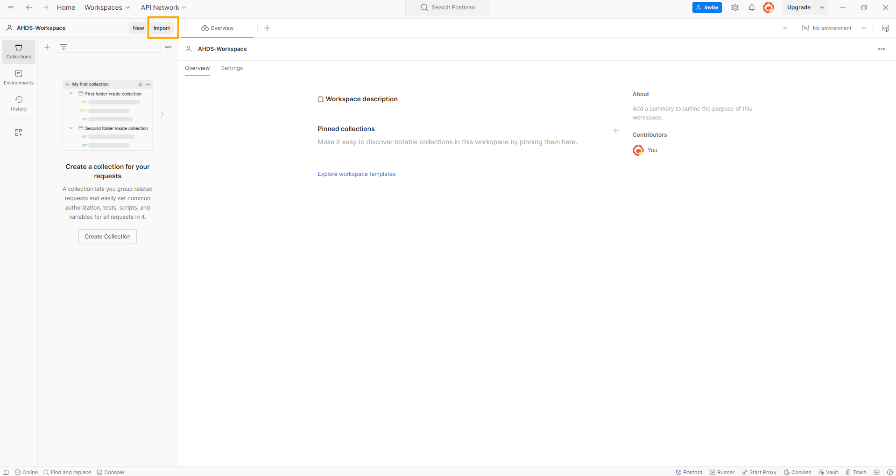

# Postman FHIR queries starter collection

To interact with FHIR data, you can utilize Postman to write FHIR queries to query resources. This sample includes a large starter Postman collection that can help you quickly learn and get started with querying/accessing the FHIR service. This starter Postman collection includes many common FHIR queries, including FHIR searches, CRUD (create, read, update, and delete) requests for FHIR resources, and other operations. 

## Prerequisites

* Postman installed locally. For more information about Postman, see [Get Started with Postman](https://www.getpostman.com/).
* FHIR service deployed in Azure. For information about how to deploy the FHIR service, see [Deploy a FHIR service](https://learn.microsoft.com/en-us/azure/healthcare-apis/fhir/fhir-portal-quickstart).
* **User Access Administrator** role for you to be able to do role assignments.

## Setup Steps
  Below are 3 major steps that we will perform to access **FHIR Service** from **Postman**.

A. Register a client application(App Registration) in Microsoft Entra ID.

B. Assign **FHIR Data Contributor** role in Azure.

C. Set up **Environment** and **Collection** in Postman.

## Step A: Register a client application in Microsoft Entra ID

1. In the [Azure portal](https://ms.portal.azure.com), select Microsoft Entra ID.
<p>

</p>

2. Select **App registrations** under **Manage** section.
<p>

</p>

3. Select new **App registrations**.

4. Enter a name for app registration. For Supported account types, select **Accounts in this organization directory only**. Leave the other options as is.
<p>

</p>

5. Select **Register**.

## Application ID (client ID)
After registering a new application, you can find the application (client) ID and Directory (tenant) ID from the overview menu option. **Make a note of the values for use later(you will need these when you configure your Postman environment)**.
<p>

</p>

<p>

</p>

## Authentication setting: confidential vs. public
Select Authentication to review the settings. The default value for Allow public client flows is "No".

If you keep this default value, the application registration is a confidential client application and a certificate or secret is required.
<p>

</p>

If you change the default value to "Yes" for the "Allow public client flows" option in the advanced setting, the application registration is a public client application and a certificate or secret isn't required. The "Yes" value is useful when you want to use the client application in your mobile app or a JavaScript app where you don't want to store any secrets.

For tools that require a redirect URL, select Add a platform to configure the platform.
<p>

</p>

For Postman, select Mobile and desktop applications. Enter "https://www.getpostman.com/oauth2/callback" in the Custom redirect URIs section. Select the Configure button to save the setting.
<p>

</p>

## Certificates & secrets
Select **Certificates & Secrets** and select **New Client Secret**. Select Recommended 6 months in the Expires field. This new secret will be valid for six months. You can also choose different values such as:

* 03 months
* 12 months
* 24 months
* Custom start date and end date.

>[!NOTE]
>It is important that you save the secret value, not the secret ID.

Click on **Certificates and secrets**. Click **+New client secret**.

<p>

</p>

Under **Add a client secret**, enter a name for the secret in the **Description** field. Click **Add**.

<p>

</p>

Copy the secret **Value** and securely store it somewhere (you will need this when you configure your Postman environment).

<p>

</p>

>[!NOTE]
>Use  grant_type of client_credentials when trying to obtain an access token for the FHIR service using tools such as Postman or REST Client. 

## Step B: Assign FHIR Data Contributor role in Azure
This section shows the steps to assign **FHIR Data Contruibutor** role to a registered application for the FHIR® service in Azure Health Data Services.

1. In Azure Portal, go to the resource group containing your FHIR service instance. When in the resource group Overview, click on your FHIR service name in the list.
<p>

</p>

2. Go to the Access Control (IAM) blade. Click on +Add -> Add role assignment.
<p>

</p>

3. In **Add** role assignment under the **Role** tab, scroll down in the list and select **FHIR Data Contributor**. Then click **Next**.
<p>

</p>

4. Under the **Members** tab, click on **+Select members**. Type in the name of your Postman service client app in the **Select** field on the right. Select the app.
<p>

</p>

<p>

</p>

5. In same way, Type in the name of your username in the **Select**. Select your user so it is added to list along with app registration and click **Select**. Then click **Next**.

<p>

</p>

<p>

</p>

5. Under the **Review + assign** tab, click **Review + assign**.

<p>

</p>


## Step C: Set up Environment and Collection in Postman

### Save collection file and environment file

1. Access the Postman environment template for FHIR service [here](./fhir-service.postman_environment.json). Save the file locally (click on **Raw** and then do a **Save as** from your browser).

2. Now, access the ```FHIR-Collection.postman-collection.json``` file available in this repo [here](./FHIR-Collection.postman_collection.json) and save the file locally. 


### Create a workspace, Import collection and environment
Follow these steps to create a workspace, Import collection and environment.

Postman introduces the workspace concept to enable you and your team to share APIs, collections, environments, and other components. You can use the default My workspace or Team workspace or create a new workspace for you or your team.

1. Launch the postman app and select **Create Workspace** option from **Workspaces** menu, Select **Blank workpace** and click on **Next**.
<p>

</p>

2. Enter Workspace name in **Name** field and select suitable access level from list and click on **Create**.
<p>

</p>

3. Your workpace is created.
<p>

</p>

4. Click **Import** button to import collection.
<p>

</p>

5. Click on **files** link and browse to the location where are saved and select the collection file ```FHIR Collection.postman-collection.json``` to import collection in Postman.
<p>

</p>

<p>
    
</p>

6. Collection **FHIR Collection** is imported in workspace.
<p>

</p>

7. Select **Environments** blade, Select **Import**.
<p>

</p>

8. Select **files** blade.
<p>

</p>

9. Browse to the location where files are saved and select environment file ```fhir-service.postman_environment.json```.
<p>

</p>

10. **fhir-service** environment is imported into postman workspace.
<p>

</p>

## Update the evironment values

Set the values for highlighted fields in **Current value** in the environment and save it.
<p align="center">

</p>

## Collection overview
The queries in this collection are categorized into the folders listed below:
- `AuthToken` - Request to create an authentication token which is used in all other queries.
- `Create Starter Bundle` - Here we create multiple resources in one bundle, these resources will be used or referenced in other queries in this tutorial.
- `Common Queries` - This folder has a set of frequently used queries.
- `Common Operations` - This folder has queries for FHIR operations like convert, validate, export and import.
- `Chained and Reverse Chained Search` - This folder has queries to use chaining and reverse chaining for fetching resources based on related (referenced) resources, more details about chaining can be found [here](https://learn.microsoft.com/en-us/azure/healthcare-apis/fhir/overview-of-search#chained--reverse-chained-searching).
- `Include and Reverse Include Search` - This folder has queries with `_include` and `_revinclude` parameters, to fetch resources related to the search results (e.g., `Patient` resources associated with an `Encounter` search). More details on inclusions can be found on the [FHIR Search Page](https://www.hl7.org/fhir/search.html#return).
- `Custom Search (Create and Use custom SearchParameter)`  - This folder has queries related to custom search, here we create a new `SearchParameter` resource, run the reindex operation (`$reindex`), and use the newly created `SearchParameter`. More details about custom search could be found in [Microsoft Learn](https://learn.microsoft.com/en-us/azure/healthcare-apis/azure-api-for-fhir/how-to-do-custom-search).
- List of alphabetically sorted, resource specific folders for resource specific queries for CRUD operations.
- For resource search, we have included search queries with multiple IDs, and combinations of multiple search parameters to find matching resources.
- Below example search parameters that are supported in US Core profile are available under specific resource folders:
  - CareTeam - Role
  - Encounter - DischargeDisposition
  - Condition - AssertedDate
  - Patient - GenderIdentity
  - Goal - Description
  - ServiceRequest - Authored
 - Examples of a few search parameter combinations from US Core/IPS(International Patient Summary)/IPA(International Patient Access) as listed below:
    - Careplan - patient+category+status+date 
    - Encounter - patient+location, date+patient, patient+status
    - Condition - patient+category+encounter, patient+recorded-date, patient+onset-date, patient+category+clinical-status
    - Patient - race & ethnicity, family+gender, birthdate+family, birthdate+name, gender+name
    - Allergy Intolerance – patient+clinical-status 
    - Observation - patient+category+status, patient+code+date 
    - Procedure - patient+code+date
    - MedicationRequest - patient+code+date
    - DiagnosticReport - patient+category+date, patient+code+date 
    - Goal - patient+target-date, patient+lifecycle-status 
    - Service Request - patient+category+authored, patient+status, patient+category 
 - `FHIR & Terminology Service Integration`  - This folder has queries for FHIR and terminology service operations like $lookup, $translate, $validate, $expand, $subsumes, $find-matches and $closure. User need to set up APIM and use APIM url for these queries, please refer [fhir-terminology-service-integration](https://github.com/Azure-Samples/azure-health-data-services-samples/tree/main/samples/fhir-terminology-service-integration) sample.

# Getting started
Now we have set up Postman for accessing FHIR service, we'll walk through these steps:

## Step 1 - Get an access token from AAD

In Postman, click on **Collections** on the left, select the `FHIR Collection` collection, open the first folder titled `AuthToken`, and then select `POST Get Authorization Token`. Press **Send** on the right.

__IMPORTANT:__ Be sure to make the `fhir-service` environment active by selecting from the dropdown menu above the **Send** button. In the image below, `fhir-service` is shown as the active environment.
<p>

</p>

On clicking **Send**, you should receive a response in the **Body** tab like shown below. The `access_token` value is automatically saved to the ```bearerToken``` variable in the Postman environment. 

```
{
    "token_type": "Bearer",
    "expires_in": "3599",
    "ext_expires_in": "3599",
    "expires_on": "XXXXXXXXXX",
    "not_before": "XXXXXXXXXX",
    "resource": "XXXXXXX-XXXX-XXXX-XXXX-XXXXXXXXXXXX",
    "access_token": "XXXXXXXXXXXX..."
}
```

You now have a valid access token in your Postman environment and can use the token in subsequent API calls to your FHIR service. For more information about access tokens in AAD, see [Microsoft identity platform access tokens](https://docs.microsoft.com/en-us/azure/active-directory/develop/access-tokens).

__Note:__ Access tokens expire after 60 minutes. To obtain a token refresh, simply make another ```POST Get Authorization Token``` call and you will receive a new token valid for another 60 minutes.

## Step 2 - Query FHIR service with Postman 

1. Try `GET List All Patients` under `Common Queries` folder in the `FHIR Collection` collection and press **Send**. If the response is as shown below, with status "200 Ok" and resourceType as "Bundle", this means you successfully obtained a list of all `Patient` resources stored in the FHIR service database.

If there aren't any `Patient` resources in Fhir service, you will get and empty bundle in response as shown below.
<p>

</p>

If there are `Patient` resources in Fhir service, you will see Bundle with an array named "entry" in response with list of `Patient` resources as shown in two images below. 

<p>


</p>

Any of the above response means that your setup is functional.

2. Now we will create a [bundle](https://www.hl7.org/fhir/bundle.html) of resources by posting a `Bundle` to the FHIR service. Under the `Create Starter Bundle` folder, click on ```POST Create Resources Bundle (Multiple resources)``` and press **Send**. If the response matches the following, this means you successfully created multiple resources included in a bundle.
This bundle contains `Patient`, `Practitioner`, `Organization`, `Location`, `PractitionerRole`, `Encounter`, `Observation`, `Condition`, `Procedure`, `Group`, `Device`, `RelatedPerson` and `ServiceRequest`. These resources will be used as references for creating other resources in the later steps of this tutorial which depend on them. The environment variables for Ids of these resources will be updated.

<p>

</p>

The following instructions will go through the various folders of the collection in order. 

3. `Common Operations` contains folders for queries of operations as detailed in the below named folders:  
  - [validate](https://learn.microsoft.com/en-us/azure/healthcare-apis/fhir/validation-against-profiles): ensure that a FHIR resource conforms to the base resource requirements or a specified profile using the `$validate` operation.
    - This folder includes samples for posting and fetching the StructureDefinitions for resource/extensions and samples for validating resource. 
    - Examples in this folder include uploading Structure Definitions for `Patient` and `Extensions` (race, ethnicity and birthsex).The Structure Definition of `Patient` refers to three extensions (race, ethnicity and birthsex). To validate a Patient resource with an extension, the Structure Definitions for extensions also have to be uploaded to FHIR.
    - To learn more about StructureDefinitions of US core profiles/extensions visit [US Core Implementation Guide](http://hl7.org/fhir/us/core/STU5.0.1/profiles-and-extensions.html)
  - [convert](https://learn.microsoft.com/en-us/azure/healthcare-apis/fhir/convert-data): convert data from various formats to FHIR using the `$convert-data` operation
    - This folder includes samples for converting HL7v2, raw JSON, and C-CDA data formats to FHIR
  - [import](https://learn.microsoft.com/en-us/azure/healthcare-apis/fhir/import-data): bulk-import FHIR resources into the FHIR Server at high throughput using the `$import` operation.
    - Please make sure that the configuration settings for import are set before running import, more details for configurations are available [here](https://learn.microsoft.com/en-us/azure/healthcare-apis/fhir/configure-import-data)
  - [export](https://learn.microsoft.com/en-us/azure/healthcare-apis/fhir/export-data): bulk-export data using the `$export` operation, as described in the [FHIR Bulk Data Access IG](https://hl7.org/fhir/uv/bulkdata/export/index.html).
    - Please make sure that the configuration settings for export are set before running export, more details for configurations are available [here](https://learn.microsoft.com/en-us/azure/healthcare-apis/fhir/configure-export-data)
    - Below is a sample response from export. In response headers we receive 'Content-Location' header with a url value, this url is used to get status of the export job.  
      - Export:
      <p>
      
      </p>

      - Export Status: 
      <p>
      
      </p>

  - `Delete & Conditional Delete`: The Azure Health Data Services FHIR service supports soft deletes, hard deletes and conditional deletes for resources:
    - Soft deletes maintain the history of the resource which can used to recreate the resource if needed. 
    - Hard deletes will delete resource along with history so you won't be able to recover. 
    - With conditional delete you can specify the conditions for delete. Resources satisfying the condition will be deleted. By default, delete count is one and it can go up to 100, you can specify count of resources that should be deleted with _count parameter, which can go up to 100. Hard delete can also be used with conditional delete. For more details see [Delete and Conditional Delete](https://learn.microsoft.com/en-us/azure/healthcare-apis/azure-api-for-fhir/fhir-rest-api-capabilities#delete-and-conditional-delete)

4. `Chained and Reverse Chained Search` contains queries which search resources using chained and reverse chained search. More details are available on [Microsoft Learn](https://learn.microsoft.com/en-us/azure/healthcare-apis/fhir/overview-of-search#chained--reverse-chained-searching) and the [FHIR Search Page](https://hl7.org/fhir/search.html#chaining).

5. `Include and Reverse Include Search` contains queries which search resources using include and reverse include. More details are available on [Microsoft Learn](https://learn.microsoft.com/en-us/azure/healthcare-apis/fhir/overview-of-search#search-parameters) and the [FHIR Search Page](https://hl7.org/fhir/search.html#revinclude).

6. `Custom Search (Create and Use SearchParameter)` contains queries to create and use custom search parameters. More details are available on [Microsoft Learn](https://learn.microsoft.com/en-us/azure/healthcare-apis/fhir/how-to-do-custom-search).
  - Once you create a new search parameter, reindexing must be done before the new search parameter is available.  More information is available at [Test new search Parameters](https://learn.microsoft.com/en-us/azure/healthcare-apis/fhir/how-to-do-custom-search#test-new-search-parameters).
  - To perform reindexing, use the `POST Reindex` request.  The reindex operation takes some time to finish - the `POST Reindex` request returns a reindex task Id, which can be used to check status of reindex task.

  <p>
  
  </p>

  - Keep checking the status of the reindex task with the `GET Get Status on Reindex Job` request.

  <p>
  
  </p>

  - Once the reindex is completed, your new search parameter is ready to use.
  <p>
  
  </p>

7. Explore the resource specific queries (Create/Update/Get/Delete) in resource specific folders (by resource type in alphabetical order). 

  <p>
  
  </p>

  - In `FHIR Collection`, the `Get` folder under each resource contains intermediate level queries that combine multiple search parameters and queries to fetch list of resources with multiple IDs. Some examples are shown below:

  <p>
  
  </p>

  <p>
  
  </p>

8. `Everything` operation for Patient resources
  - The `$everything` operation for Patient resources returns a patient and related resources. More details are available on the Microsoft Learn page for the [Patient Everything operation](https://learn.microsoft.com/en-us/azure/healthcare-apis/fhir/patient-everything). Details about response order are available [here](https://learn.microsoft.com/en-us/azure/healthcare-apis/fhir/patient-everything#patient-everything-response-order).

  - `GET $everything Patient by Id` will return a response with `Bundle` having type `searchset`. A successful match returns a bundle with the requested `Patient` resource, one or more related resources, and, if there are more resources to retrieve, a `link` with a `relation` of `next` with the URL for the next set of records as shown in the image below.
  
  <p>
  
  </p>

  - If you click the `next` URL in Postman, a new request will be opened.  Before sending the request, you need to add the authorization token to it - in the `Auth` tab, select `Bearer Token`.  After clicking on send, the response will be a `Bundle` with the type `searchset`. It will contain one or more resources related to the requested patient, and may contain another link to more results (a `link` with a `relation` of `next`), as shown in the image below.

  <p>
  
  </p>

9. Please check other sample calls or create your own FHIR API calls by following the examples.

 
## FAQ

- Error with ```POST AuthorizeGetToken```: Ensure you selected your `fhir-service` environment from the dropdown menu.
- 403 - Unauthorized:  Check the Azure RBAC for Azure Health Data Services documentation ([link](https://docs.microsoft.com/azure/healthcare-apis/configure-azure-rbac)).

## Resources
For further learning, check out:
- [Access using Postman](https://learn.microsoft.com/en-us/azure/healthcare-apis/fhir/use-postman)
- [Postman setup for FHIR service + sample Postman collections](https://github.com/microsoft/azure-health-data-services-workshop/blob/main/resources/docs/Postman_FHIR_service_README.md#step-1---create-an-app-registration-for-postman-in-aad)
- [Azure Health Data Services Workshop: Query and Search FHIR](https://github.com/microsoft/azure-health-data-services-workshop/tree/main/Challenge-04%20-%20Query%20and%20Search%20FHIR)
