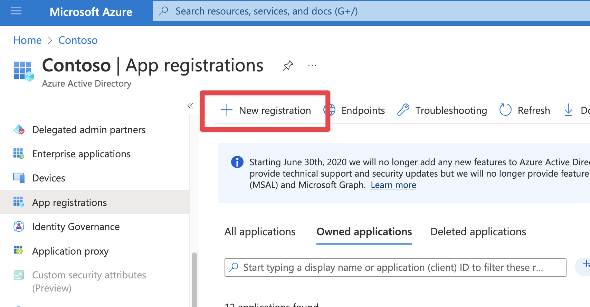
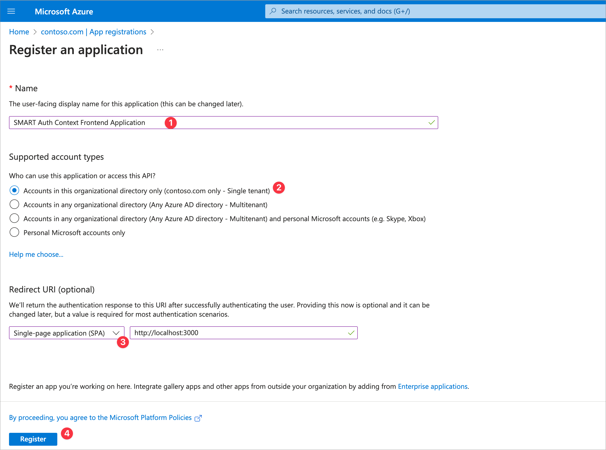
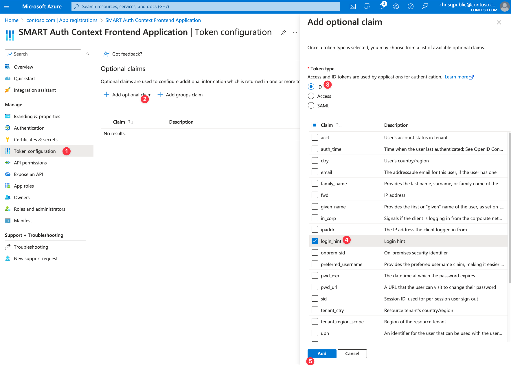
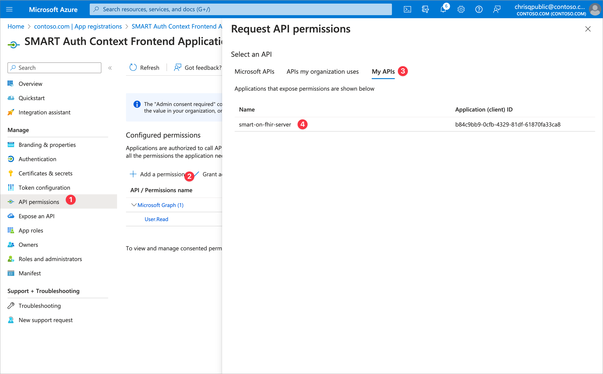
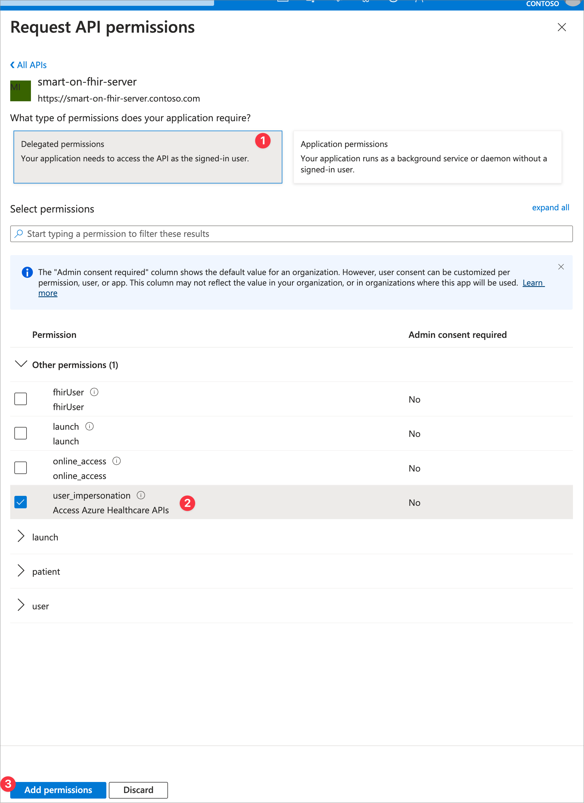
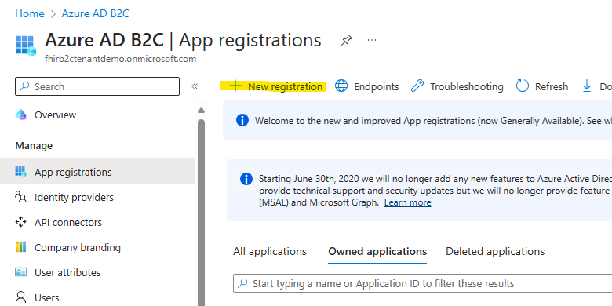
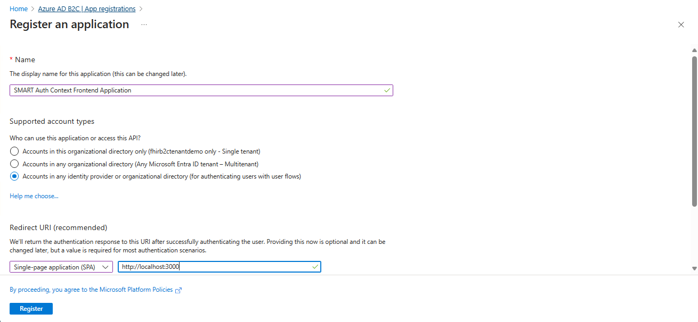
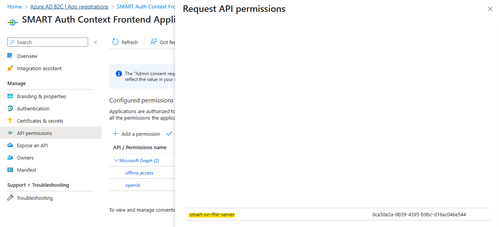
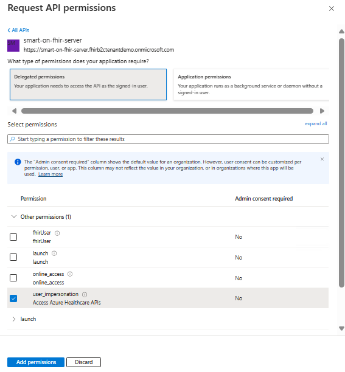

# Auth Context Frontend App Registration

The Auth Context Frontend Application is a sample React single-page app that enables patient session-based scope selection and EHR launch context. It allows patients to choose which permissions (scopes) to consent for SMART on FHIR apps and even remove scopes during the login process. Since Microsoft Entra ID and Azure AD B2C do not support session-based scoping, the app clears consent records so users must re-consent upon login. Additionally, it stores the launch parameters before login for later use in the token. You will need to register the application and save the `Client ID` and `Tenant ID` for future configuration.

## Deployment (manual)

1. If you are using Microsoft Entra ID, create a new application registration in the Microsoft Entra ID tenant. If you are using B2C, create the registration in the B2C tenant.
1. Add a single-page application (SPA) redirect URI of `http://localhost:3000`.
    - Localhost is useful for debugging - we will add the Azure redirect URI after deployment.
1. After registering the application, include the following configuration only if you are using Microsoft Entra ID. **If you are implementing SMART on FHIR with B2C, you can skip this step.**
    - Navigate to `Token Configuration`. 
    - Add optional claim for ID token type.
    - Select `login_hint` claim.  
    - Click on Add.    
1. Go to `API Permissions` and add the `user_impersonation` scope from your FHIR resource application.
    - Click `Add a Permission` then `APIs my organization uses`.
    - Select the FHIR Resource application you created earlier.
    - Choose `Delegated permissions` then `user_impersonation`.
    - Finally, click `Add permission` to save.
1. Grant admin consent only if you are implementing SMART on FHIR with B2C. **Do not grant admin consent if you are using Microsoft Entra ID.**
1. Inform your Azure Developer CLI environment of this application with:
    ```
    azd env set ContextAppClientId <context app id>
    ```

<br />
<details>
<summary>Click to expand and see screenshots for Microsoft Entra ID Reference.</summary>






</details>

<br />
<details>
<summary>Click to expand and see screenshots for B2C Reference.</summary>





</details>