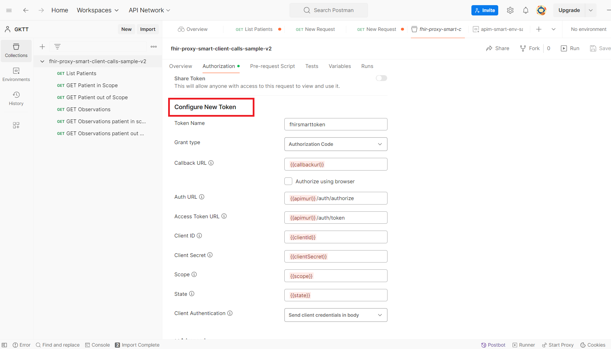

> [!TIP]
> *If you encounter any issues during configuration, deployment, or testing, please refer to the [Trouble Shooting Document](../troubleshooting.md)*

# Access SMART on FHIR using Postman

In this article, we'll walk through the steps of accessing the Azure Health Data Services (hereafter called FHIR service) via SMART on FHIR with [Postman](https://www.getpostman.com/).

## Prerequisites

* SMART on FHIR sample deployed in Azure.
* A registered client application to access the SMART on FHIR sample. For information about how to register a client application, see [Register a service client application in Microsoft Entra ID](./register-application.md). 
* Postman installed locally. For more information about Postman, see [Get Started with Postman](https://www.getpostman.com/).

## Using Postman: create workspace, collection, and environment

You can use the default “My workspace” or “Team workspace” or create a new workspace for you or your team.

Import the collection [fhir-proxy-smart-client-calls-sample-v2.postman_collection.json](./postman-collection/fhir-proxy-smart-client-calls-sample-v2.postman_collection.json) and environment [apim-smart-env-sample.postman_environment.json](./postman-collection/apim-smart-env-sample.postman_environment.json) files in Postman. For more information, see [the Postman documentation](https://learning.postman.com/docs/getting-started/importing-and-exporting-data/).

## Update environment variables

While you can use the full URL in the request, it's recommended that you store the URL and other data in variables and use them.

1. To access the FHIR resource via SMART on FHIR, we'll need to update the following variables.

    * **tenantId** – Azure tenant where the SMART on FHIR sample is deployed in. 
    * **clientId** – Application client registration ID.
    * **clientSecret** – Application client registration secret.
    * **bearerToken** – The variable to store the Microsoft Entra access token in the script. Leave it blank.
    * **fhirurl** – APIM url ends with /smart. For example, `https://XXXXX-apim.azure-api.net/smart`.
    * **scope** – Required scopes. For example, `openid offline_access fhirUser launch/patient patient/Patient.read patient/Condition.read` 
    * **apimurl** – APIM url. For example, `https://XXXXX-apim.azure-api.net`.
    * **state** – Some unique identifier value.
    * **callbackurl** – `https://oauth.pstmn.io/v1/callback`.
    * **resource** – FHIR server audience.

1. In the postman, select the **Authorization** tab of a 'fhir-proxy-smart-client-calls-sample-v2' collection or a specific REST call, and then select **Type** as OAuth 2.0. Under **Configure New Token**, values will be pre-populated as shown below

1. Choose **Get New Access Token** at the bottom of the page.
1. The system asks for user sign-in credentials. Provide credentials of test user created for patient/practitioner based on test case. 
1. When you receive the token, choose **Use Token**.
1. Ensure the token is in the Authorization Header of the REST call.
1. Use this token to access FHIR resources based on the scopes specified in the environment variable.

**[Back to Previous Page](../deployment.md#6-use-postman-to-access-fhir-resource-via-smart-on-fhir-sample)**