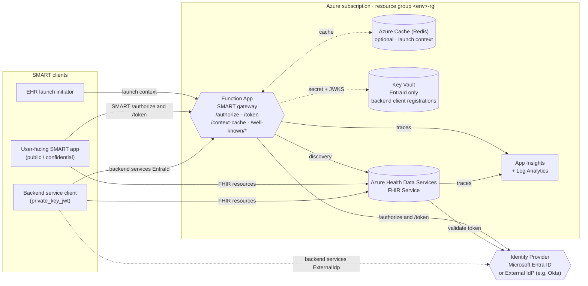

# SMART on FHIR v2 — Native IdP-Agnostic Sample

This sample adds **SMART on FHIR v2** application launch and authorization on top of the **Azure Health Data Services FHIR Service**, using either **Microsoft Entra ID** or an **External Identity Provider** (e.g. Okta) as the upstream authorization server.

It is *IdP-agnostic*: the same gateway, infrastructure, and deployment flow support both modes — the choice is a single configuration switch (`IdpType`). There is **no API Management**, **no Static Web App**, and **no scope-selector frontend**. A single Azure Function App acts as the SMART gateway, and the FHIR Service is the source of truth for SMART discovery.

---

## Why this sample?

The Azure Health Data Services FHIR Service understands **SMART scopes natively** (e.g. `patient/Observation.rs`, `user/*.read`) and enforces resource access using the `fhirUser` claim and SMART scopes inside the access token.

What it does **not** do on its own:

- It does not host a SMART `/authorize` or `/token` endpoint.
- It does not issue or enrich tokens with SMART launch context (`patient`, `encounter`, `launch`, `fhirUser`).
- It does not advertise a SMART discovery document tailored to the deployment.

This sample fills those gaps by introducing a thin **SMART gateway Function App** that:

1. Translates SMART concepts (scopes, launch parameters, PKCE flows) into terms the configured Identity Provider understands.
2. Enriches token responses with SMART launch context (cached during EHR launch).
3. Publishes a SMART discovery document and capability statement transformations consistent with SMART v2.
4. Provides **SMART v2 Backend Services** support (`client_credentials` + `private_key_jwt`) where the IdP cannot do this natively.

### Why the gateway is needed per IdP

| Concern | Microsoft Entra ID | External IdP (e.g. Okta) |
| --- | --- | --- |
| **SMART scope syntax** (`patient/*.rs`) | Not understood by Entra — gateway translates to/from Entra application scopes. | Understood natively by SMART-capable IdPs. Gateway only forwards. |
| **SMART launch context** (`patient`, `encounter`, `launch`) | Not issued by Entra — gateway injects on token response from Redis cache. | Same — gateway injects from Redis cache. |
| **Backend Services (`private_key_jwt` + JWKS URL)** | Entra does not accept the SMART self-published-JWKS confidential-client model. Gateway validates the SMART `client_assertion` (ES384 / RS384) against the client's registered JWKS, then swaps to a Key Vault-stored Entra client secret. | Handled natively by the IdP. Backend service clients call the IdP token endpoint **directly**; the gateway is bypassed. |
| **Discovery (`.well-known/smart-configuration`)** | Built by the gateway, anchored on the FHIR Service. | Built by the gateway, anchored on the FHIR Service. |

The Entra path therefore requires more gateway logic and a small Key Vault. The External-IdP path is intentionally minimal.

---

## Supported flows (SMART App Launch v2)

- EHR Launch
- Standalone Launch — Public Client (PKCE)
- Standalone Launch — Confidential Client (symmetric secret)
- Backend Services (`client_credentials` + `private_key_jwt`, ES384 / RS384)

---

## Components deployed

The same Azure components are deployed for both IdP modes, with one mode-specific addition for Entra ID.

| Component | EntraId | ExternalIdp | Purpose |
| --- | :---: | :---: | --- |
| Azure Health Data Services FHIR Service | ✓ | ✓ | Stores FHIR resources, evaluates SMART scopes, sources SMART discovery |
| Azure Function App (SMART gateway) | ✓ | ✓ | Hosts `/authorize`, `/token`, `/context-cache`, `/.well-known/*` proxy |
| App Service Plan (Linux, dotnet-isolated 8) | ✓ | ✓ | Hosts the Function App |
| Storage Account | ✓ | ✓ | Function App runtime storage |
| Application Insights + Log Analytics | ✓ | ✓ | Observability and tracing |
| Azure Cache for Redis (optional) | opt | opt | Stores EHR launch context across multiple Function App instances. If not configured, context is kept in the gateway's local memory (works for a single instance only). |
| Backend Services Key Vault | ✓ | — | Stores backend service client registrations (Entra secret + `jwks_url` tag) |

> The Key Vault is only deployed when `IdpType=EntraId` because backend services on External IdPs talk to the IdP directly and never touch the gateway.

---

## Architecture

A high-level component view: clients call the gateway for SMART endpoints, the gateway resolves the upstream IdP token endpoint from the FHIR Service's `.well-known/smart-configuration`, and the FHIR Service validates access tokens directly against the configured authority/audience.

For the per-flow sequence diagrams (EHR launch, standalone, backend services) see the [Technical Guide](docs/technical-guide.md).

---

## Prerequisites

- An Azure subscription with permission to create resources.
- The following tools installed locally:
  - [Git](https://git-scm.com/)
  - [Azure CLI 2.51+](https://learn.microsoft.com/cli/azure/install-azure-cli)
  - [Azure Developer CLI 1.9+](https://learn.microsoft.com/azure/developer/azure-developer-cli/install-azd)
  - [.NET 8 SDK](https://learn.microsoft.com/dotnet/core/sdk)
  - [PowerShell 7+](https://learn.microsoft.com/powershell/scripting/install/installing-powershell)
- Identity Provider access:
  - **Microsoft Entra ID**: tenant admin to create app registrations and Microsoft Graph directory extensions.
  - **External IdP (Okta)**: an Okta Authorization Server with admin access to register applications and configure SMART claim mappings.
- Two test user accounts in the chosen IdP (one *Patient* persona, one *Practitioner* persona).

Detailed prerequisites are listed in the per-IdP deployment guides.

---

## Get started

Pick the deployment guide that matches your identity provider.

- **[Deployment Overview](docs/deployment.md)** — start here to choose an IdP path
- **[Deploy with Microsoft Entra ID](docs/deployment-entra.md)**
- **[Deploy with External IdP (Okta)](docs/deployment-okta.md)**

Reference material:

- **[Technical Guide](docs/technical-guide.md)** — endpoint behaviors, sequence diagrams per flow, and the role of the gateway in each mode
- **[Troubleshooting](docs/troubleshooting.md)**
- **[Sample Data](docs/sample-data.md)**

---

## Project layout

| Path | Purpose |
| --- | --- |
| `src/SMARTCustomOperations.AzureAuth/` | Function App source (.NET 8 isolated worker) |
| `infra/main.bicep` | Subscription-scope deployment entry point |
| `infra/core/` | Reusable modules (FHIR, monitoring, function host, key vault, redis) |
| `infra/app/authCustomOperation.bicep` | Function App resource and configuration |
| `scripts/` | PowerShell utilities (data load, app registration, claim mapping) |
| `docs/` | Documentation set (this file's siblings) |

---

