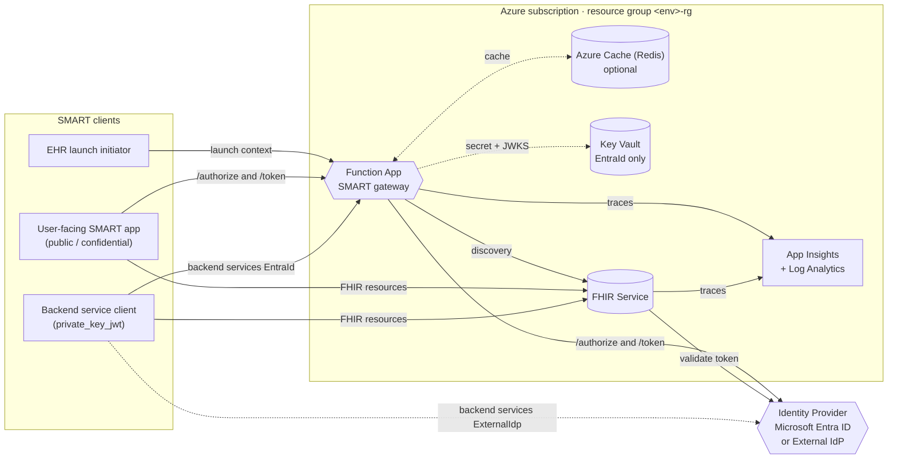
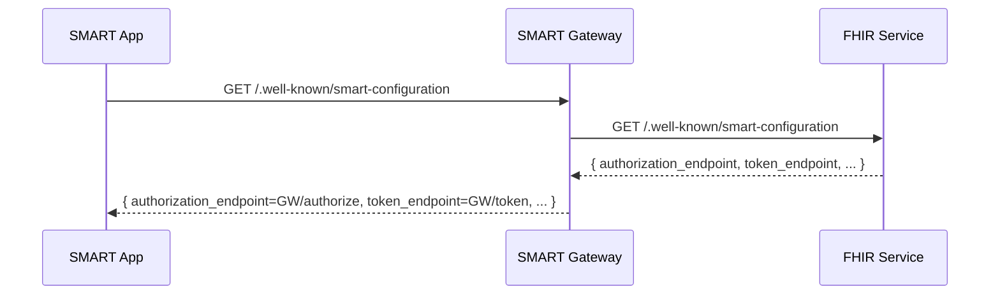
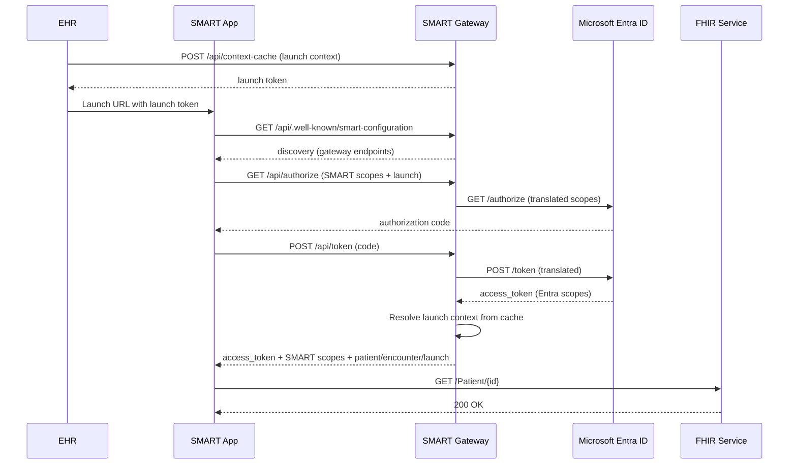
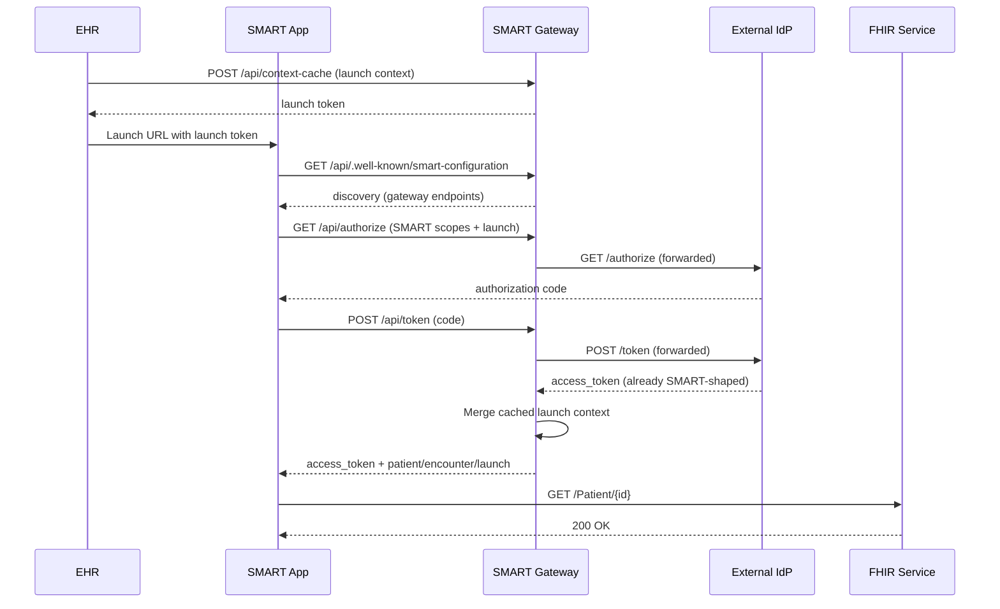
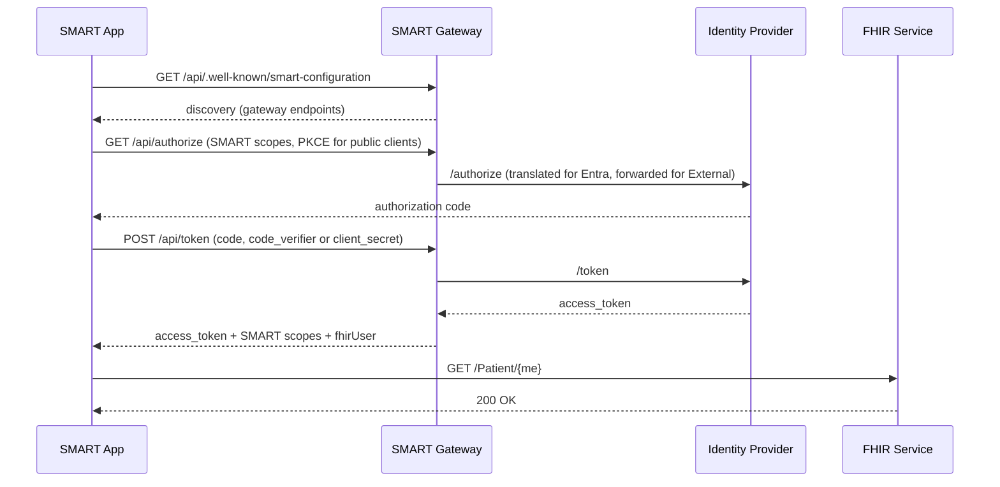
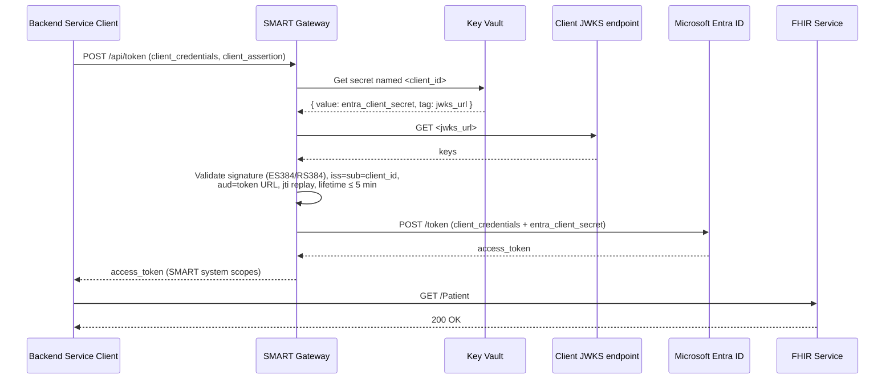
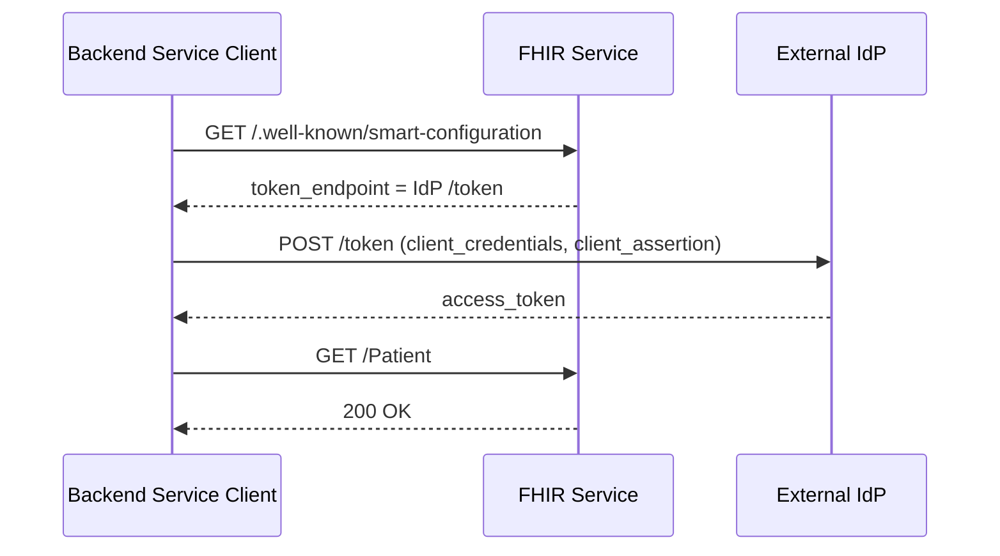

# Technical Guide

This document explains how the SMART on FHIR v2 native IdP-agnostic sample works on top of Azure Health Data Services. It covers the deployed components, the role of the gateway in each Identity Provider mode, the discovery mechanism, and the four supported SMART flows.

For step-by-step deployment, see the per-IdP guides:

- [Deploy with Microsoft Entra ID](./deployment-entra.md)
- [Deploy with External IdP (Okta)](./deployment-okta.md)

---

## 1. Architecture overview

| Component | Purpose |
| --- | --- |
| **Azure Health Data Services FHIR Service** | Stores FHIR resources, evaluates SMART scopes natively, and acts as the source of truth for SMART discovery. Validates incoming access tokens against the configured authority and audience. |
| **Azure Function App (SMART gateway)** | Hosts SMART endpoints (`/authorize`, `/token`, `/context-cache`, `/.well-known/*`) and translates SMART concepts into terms the configured IdP understands. The Function App uses a **system-assigned managed identity** for outbound access (FHIR, Key Vault). |
| **Storage Account, App Service Plan** | Function App runtime dependencies (Linux, dotnet-isolated 8). |
| **Application Insights + Log Analytics** | Observability and tracing for both the gateway and the FHIR Service. |
| **Azure Cache (Redis-compatible, optional)** | Distributed EHR launch context cache. When absent, the gateway falls back to in-memory caching (single-instance only). |
| **Backend Services Key Vault** *(EntraId only)* | Stores SMART backend service client registrations as secrets keyed by `client_id`. |

The same components are deployed for both IdP modes; the Key Vault is provisioned only when `IdpType=EntraId`.

---

## 2. Why a gateway is needed

The FHIR Service understands SMART scopes natively (e.g. `patient/Observation.rs`, `user/*.read`) and enforces compartment access using the `fhirUser` claim. It does **not**:

- Host `/authorize` or `/token` endpoints.
- Issue or enrich tokens with SMART launch context (`patient`, `encounter`, `launch`, `fhirUser`).
- Publish a SMART discovery document tailored to the deployment's IdP.

The gateway provides exactly those capabilities. The mechanics of the gateway differ per IdP:

| Concern | Microsoft Entra ID | External IdP (e.g. Okta) |
| --- | --- | --- |
| **SMART scope syntax** | Entra does not understand `patient/*.rs` or `user/*.read`. The gateway translates SMART scopes into Entra application scopes on the way out and re-injects SMART scopes on the way back. | The IdP issues SMART scopes natively. The gateway forwards. |
| **Launch context** (`patient`, `encounter`, `launch`) | Not issued by Entra. The gateway caches launch context during EHR launch and merges it into the token response. | Same — gateway merges from cache. |
| **Backend Services** (`private_key_jwt` + JWKS URL) | Entra does not accept the SMART self-published-JWKS confidential-client model — its asymmetric option is uploaded certificates, not `jwks_url`. The gateway validates the SMART `client_assertion` (ES384 / RS384) against the client's registered JWKS, then exchanges it for an Entra access token using a Key Vault-stored Entra client secret. | Backend services flow **directly to the IdP**. The gateway is bypassed. |
| **Discovery** (`.well-known/smart-configuration`) | Built by the gateway, anchored on the FHIR Service. | Built by the gateway, anchored on the FHIR Service. |

---

## 3. Discovery — the source of truth

There are two discovery endpoints in SMART on FHIR:

- `/.well-known/smart-configuration` — SMART-specific authorization metadata.
- `/metadata` — the FHIR capability statement.

In this sample, the FHIR Service's `.well-known/smart-configuration` is the **single source of truth** for upstream IdP endpoints. The gateway proxies it through `<FunctionBaseUrl>/.well-known/smart-configuration`, rewriting `authorization_endpoint` and `token_endpoint` to itself for the flows that need to be intercepted.

The gateway also caches the upstream discovery document so per-request token forwarding does not pay the discovery latency.

---

## 4. Endpoints reference

| Endpoint | Method | Purpose | Mode |
| --- | --- | --- | --- |
| `/api/.well-known/smart-configuration` | GET | SMART discovery (proxied + rewritten) | both |
| `/api/.well-known/openid-configuration` | GET | OIDC discovery (proxied) | both |
| `/api/authorize` | GET | Begins SMART authorization. Translates SMART scopes/launch parameters into the upstream IdP's authorize request and redirects. | both |
| `/api/token` | POST | Exchanges authorization code or client credentials for an access token. Enriches the response with SMART launch context. | both |
| `/api/context-cache` | POST | Accepts launch context from EHR launch initiators and stores it in Redis (or in-memory) keyed by an opaque `launch` token. | both |

---

## 5. Configuration reference

Application settings on the Function App (set automatically by Bicep):

| Setting | Required | Description |
| --- | :---: | --- |
| `AZURE_IdpType` | ✓ | `EntraId` or `ExternalIdp`. |
| `AZURE_TenantId` | EntraId | Microsoft Entra tenant id. |
| `AZURE_Authority_URL` | optional | External IdP authority URL. If blank in External mode, auto-discovered from FHIR `.well-known/smart-configuration`. |
| `AZURE_FhirServerUrl` | ✓ | Base URL of the FHIR Service. |
| `AZURE_FhirAudience` | ✓ | Expected token audience. Defaults to `FhirServerUrl`. |
| `AZURE_FhirResourceAppId` | EntraId | Client ID of the FHIR Resource App registration. |
| `AZURE_ContextAppClientId` | optional | Client ID of the Auth Context Frontend App; when set, restricts callers of `/api/context-cache`. |
| `AZURE_CacheConnectionString` | optional | Redis-compatible connection string. Blank = in-memory cache. |
| `AZURE_BackendServiceKeyVaultStore` | EntraId backend services | Key Vault name (or vault URI) hosting backend client registrations. Empty disables backend services on the gateway. |

---

## 6. Flow — EHR Launch

EHR launch begins inside an EHR session. The EHR posts launch context (selected patient, encounter, etc.) to the gateway, which caches it under an opaque `launch` token and returns that token to the EHR. The EHR redirects the SMART app to its launch URL with the `launch` token; the SMART app discovers the gateway's authorize endpoint, authenticates the user via the configured IdP, and exchanges its code for an access token. The gateway looks up the cached context and merges it into the token response.

### EntraId mode

### ExternalIdp mode

---

## 7. Flow — Standalone Launch

Standalone launch is for applications launched outside an EHR session — typically patient-facing apps. There is no pre-cached launch context, so the gateway relies on the IdP's claim mappings (and the user's selection where applicable) to populate `patient`, `fhirUser`, and similar context.

The same endpoint handles both **public clients** (PKCE, no secret) and **confidential clients with a symmetric secret**. The choice is driven by the request body (presence of `code_verifier` vs `client_secret`). Confidential clients with `private_key_jwt` use the Backend Services flow described next.

---

## 8. Flow — Backend Services

SMART v2 Backend Services use `grant_type=client_credentials` with a `client_assertion` signed by an asymmetric key the client publishes via JWKS. The two IdP modes diverge here:

### EntraId mode — gateway validates and swaps

Entra does not accept arbitrary client-published JWKS as a credential model. The gateway therefore does the SMART-side validation itself, then exchanges to Entra using a stored client secret.

### ExternalIdp mode — direct to the IdP

SMART-capable IdPs implement Backend Services natively. The client calls the IdP token endpoint **directly**, using the `token_endpoint` advertised in the FHIR Service's `.well-known/smart-configuration`. The gateway is not involved.

> When pointing a backend service client at an `ExternalIdp` deployment, set the client's `BackendServices:FhirBaseUrl` (or equivalent setting) to the **FHIR Service URL**, not the gateway URL, so its discovery resolves the IdP token endpoint.

---

## 9. Resources

- [SMART App Launch v2 Implementation Guide (HL7)](https://hl7.org/fhir/smart-app-launch/)
- [SMART Backend Services](http://hl7.org/fhir/smart-app-launch/backend-services.html)
- [Azure Health Data Services FHIR Service — SMART on FHIR (proxy)](https://learn.microsoft.com/azure/healthcare-apis/fhir/smart-on-fhir)
- [Microsoft Entra ID — `acceptMappedClaims`](https://learn.microsoft.com/azure/active-directory/develop/reference-app-manifest#acceptmappedclaims-attribute)

[Back to README](../README.md)
