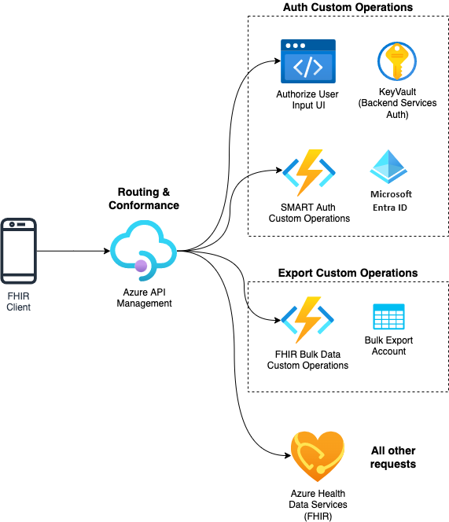

# Azure SMART on FHIR Sample 

This sample shows extending [Azure Health Data Services, FHIR service](https://learn.microsoft.com/en-us/azure/healthcare-apis/fhir/overview) with first party Azure products to enable [SMART on FHIR Implementation Guide](https://docs.smarthealthit.org/). 

As a pre-requisite to the sample deployment, you will need to have
* Azure Subscription with Owner privileges.
* Microsoft Entra ID Global Administrator privileges.
* Deployed Azure Health Data Services (FHIR Service) or Azure API for FHIR service. If you do not have one, the SMART on FHIR sample will deploy a Azure Health Data Services FHIR server for you. 

The below components will be deployed with this sample.
1. Routing and SMART Conformance is handled with [Azure API Management API Gateway](https://learn.microsoft.com/azure/api-management/api-management-gateways-overview).
2. Authorization as defined by [SMART on FHIR Implementation Guide](https://hl7.org/fhir/smart-app-launch/1.0.0/index.html) is handled by [Microsoft Entra ID]https://learn.microsoft.com/en-us/entra/fundamentals/whatis) with custom code to enable some specific requirements.

**As a next step, follow the steps listed in the [Deployment document](./docs/deployment.md). This document provides detailed deployment instructions.**

Read through [the technical guide](./docs/technical-guide.md) to understand integration of deployed components with Azure Health Data Services, FHIR service.

## Sample Support

If you are having issues with the sample, please look at the [troubleshooting document](./docs/troubleshooting.md).

If you have questions about this sample, please submit a Github issue. 

This sample is custom code you must adapt to your own environment and is not supported outside of Github issues. This sample is targeted towards developers with intermediate Azure experience.
