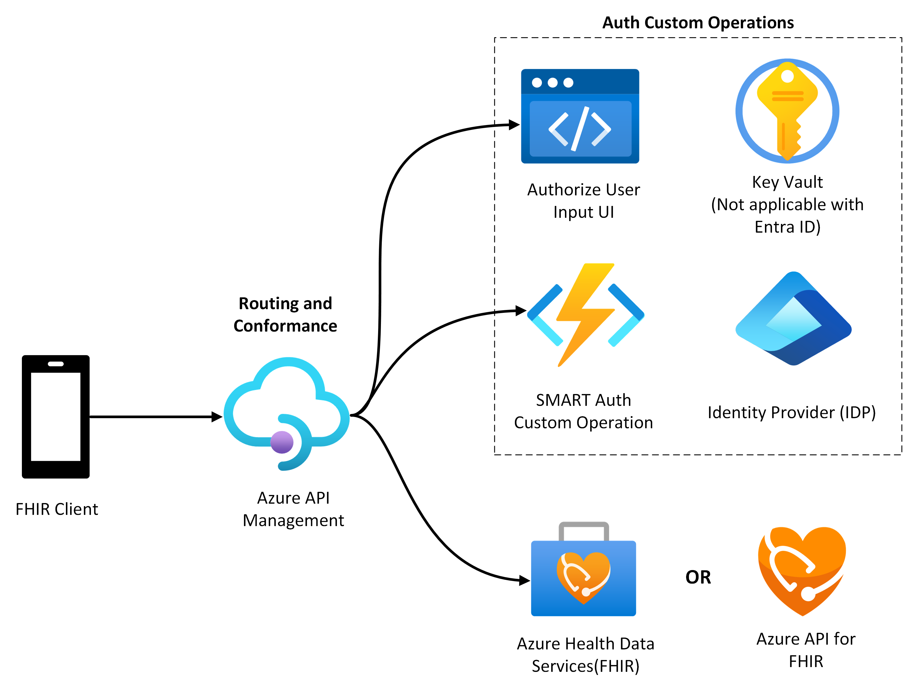

# Azure SMART on FHIR Sample 

This sample shows extending [Azure Health Data Services, FHIR service](https://learn.microsoft.com/en-us/azure/healthcare-apis/fhir/overview) with first party Azure products to enable [SMART on FHIR Implementation Guide](https://docs.smarthealthit.org/). 

As a pre-requisite to the sample deployment, you will need to have
* Azure Subscription with Owner privileges.
* Microsoft Entra ID Global Administrator privileges.
* Deployed Azure Health Data Services (FHIR Service) or Azure API for FHIR service. If you do not have one, the SMART on FHIR sample will deploy a Azure Health Data Services FHIR server for you. 

The below components will be deployed with this sample.
1. Azure Health Data Services with a FHIR Service
    - FHIR Service acts as the backend that stores and retrieves FHIR resources. It supports the integration of SMART on FHIR apps, enabling them to perform a wide range of clinical and analytical operations on health data. This includes querying patient records, updating information, and interoperating with other clinical systems—all within the security and compliance frameworks offered by Azure.
2. Azure API Management
    - APIM is a cloud-based service from Microsoft that helps businesses manage and secure their Application Programming Interfaces (APIs). APIM is used to manage the interactions between client applications and the Azure API for FHIR. It can enforce usage policies, validate tokens, provide caching, log API calls, and handle rate limiting. This ensures that the FHIR server is only accessed via secure and controlled paths.
3. Smart Auth Function App
    - This is an Azure Function which is a serverless compute platform that allows users to develop event-driven applications. The Smart Auth Function App typically handles tasks such as generating and validating tokens, managing sessions, and possibly transforming claims or other security-related operations needed to integrate SMART on FHIR apps securely with Azure Health Data Service (FHIR).
        - Needed for certain SMART operations not supported by the FHIR Service or specific to your EHR.
            - Standalone Launch Handler enables the auth flow for standalone launch scenarios.
            - EHR Launch Handler enables the auth flow for EHR launch scenarios.
4. Azure Storage Account
    - Needed for Azure Function, assorted static assets, and configuration tables.
5. Auth Context Frontend App
    - This app basically uses Web App Service to deploy UI for user Authorization. The Auth Context Frontend App facilitates the OAuth2 authorization flow. It interacts with Azure Active Directory (AAD) to authenticate users and obtain consent for the required scopes, thereby ensuring that applications receive appropriate access to health data based on user permissions.
     - Needed for the Patient Standalone authorize flow to properly handle scopes. Microsoft Entra ID does not support session based scoping.

The below components will be deployed with this sample only if Azure AD B2C is enabled.
1. Azure Key Vault
    - Azure Key Vault is a cloud-based service that allows you to securely manage keys, secrets and certificates used by cloud applications and services. It will be used to store secrets created in Azure AD B2C.
        - It stores the secret generated for the App Registration.
        - It also stores secrets required for the Service Base URL Test Suite.

Working of the sample at high level
1. User initiates Authentication by calling APIM endpoint managed by [Azure API Management API Gateway](https://learn.microsoft.com/azure/api-management/api-management-gateways-overview) which also handles routing and SMART Conformance.
2. Authorization as defined by [SMART on FHIR Implementation Guide](https://hl7.org/fhir/smart-app-launch/1.0.0/index.html) is handled by [Microsoft Entra ID](https://learn.microsoft.com/en-us/entra/fundamentals/whatis)/[Azure AD B2C](https://learn.microsoft.com/en-us/azure/active-directory-b2c/overview), so frontend app interacts with Entra ID/Azure AD B2C to authenticate the user and after successful authentication, the user provide scopes/permissions to access FHIR Service.
3. User can select the required scopes and grant consent to the selected scopes.
4. Access Token is returned after granting consent to the scope.
5. The SMART on FHIR app sends an API request to the FHIR Server via Azure API Management where the access token is attached to this request to validate the user's identity and permissions.

**As a next step, follow the steps listed in the [Deployment document](./docs/deployment.md). This document provides detailed deployment instructions.**

Read through [the technical guide](./docs/technical-guide.md) to understand integration of deployed components with Azure Health Data Services, FHIR service.

## Sample Support

If you are having issues with the sample, please look at the [troubleshooting document](./docs/troubleshooting.md).

If you have questions about this sample, please submit a Github issue. 

This sample is custom code you must adapt to your own environment and is not supported outside of Github issues. This sample is targeted towards developers with intermediate Azure experience.
