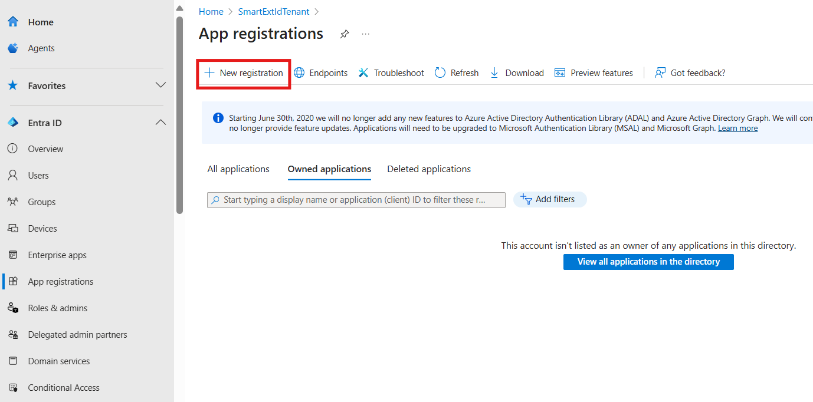
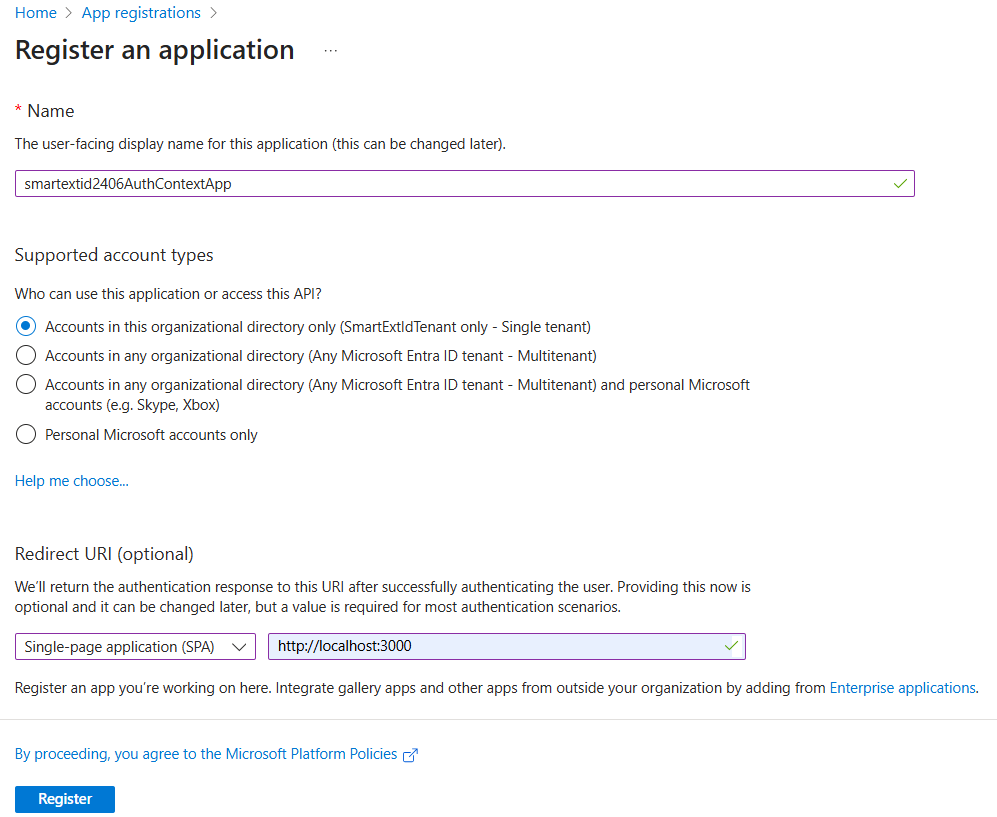
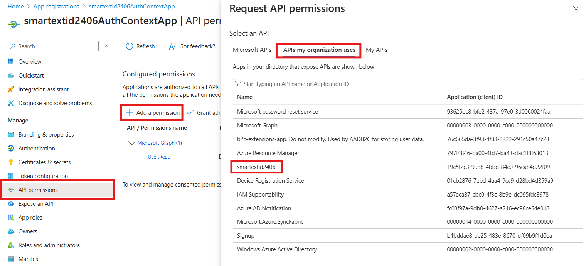
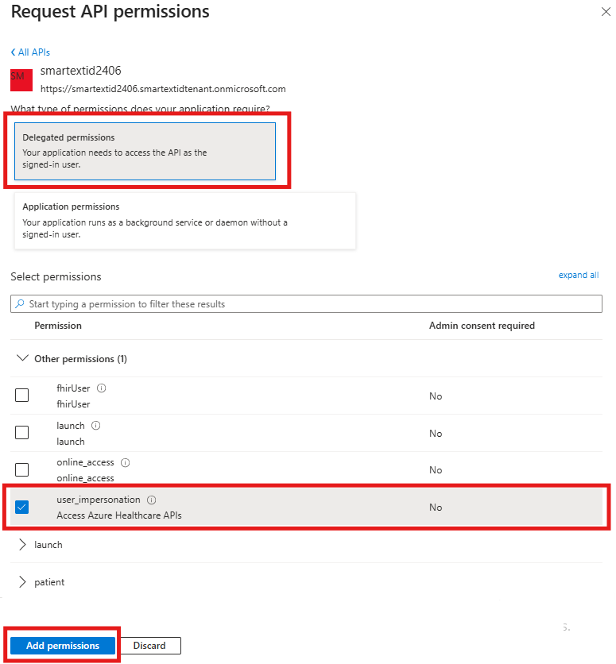
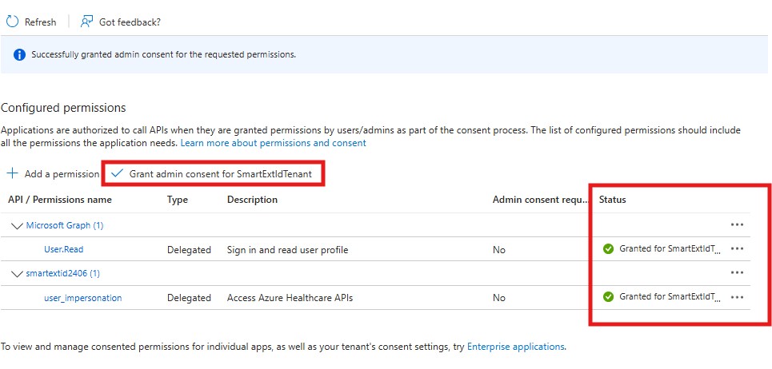

> [!TIP]
> *If you encounter any issues during configuration, deployment, or testing, please refer to the [Trouble Shooting Document](../troubleshooting.md)*

# Auth Context Frontend App Registration

The Auth Context Frontend Application is a sample React single-page app that enables patient session-based scope selection and EHR launch context. It allows patients to choose which permissions (scopes) to consent for SMART on FHIR apps and even remove scopes during the login process. Since Microsoft External Entra ID do not support session-based scoping, the app clears consent records so users must re-consent upon login. Additionally, it stores the launch parameters before login for later use in the token. You will need to register the application and save the `Client ID` and `Tenant ID` for future configuration.

## Deployment (manual)

1. Create a new application registration in the Microsoft External Entra ID tenant.
1. Add a single-page application (SPA) redirect URI of `http://localhost:3000`.
    - Localhost is useful for debugging - we will add the Azure redirect URI after deployment. 
1. Go to `API Permissions` and add the `user_impersonation` scope from your FHIR resource application.
    - Click `Add a Permission` then `APIs my organization uses`.
    - Select the FHIR Resource application you created earlier.
    - Choose `Delegated permissions` then `user_impersonation`.
    - Finally, click `Add permission` to save.
1. Grant admin consent for app permissions.
1. Inform your Azure Developer CLI environment of this application with:
    ```
    azd env set ContextAppClientId <context app id>
    ```

<br />
<details>
<summary>Click to expand and see screenshots for Reference.</summary>






</details>

**[Back to Previous Page](../deployment.md#2-prepare-and-deploy-environment)**