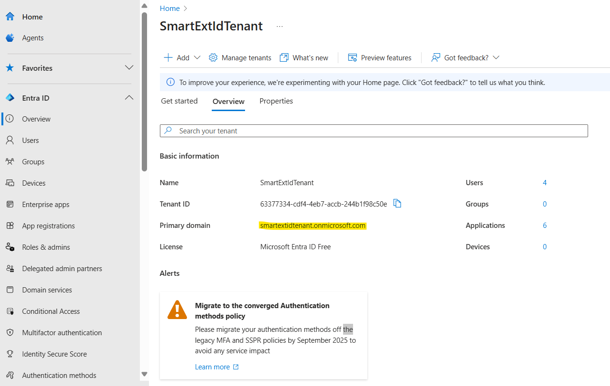
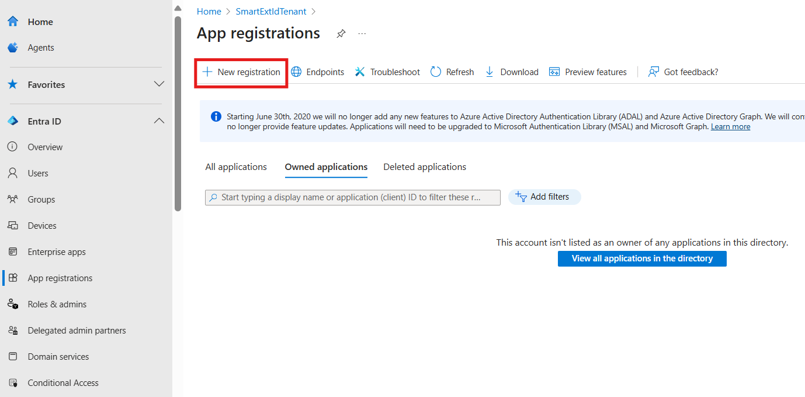
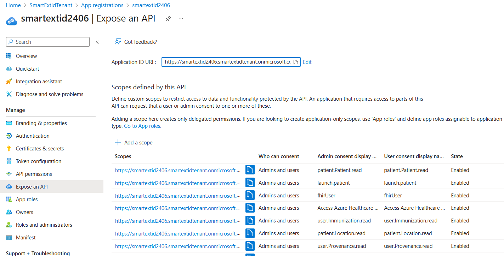
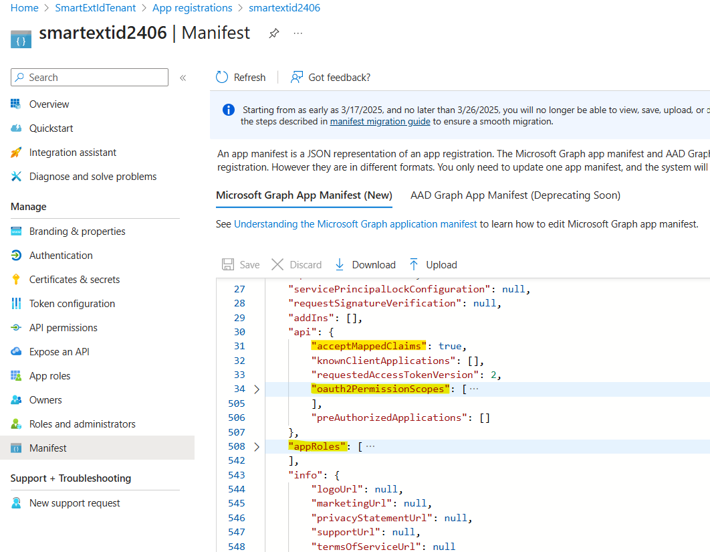

> [!TIP]
> *If you encounter any issues during configuration, deployment, or testing, please refer to the [Trouble Shooting Document](../troubleshooting.md)*

> Note - Throughout this document, the term `FHIR Server` refers to either AHDS FHIR service or Azure API for FHIR, depending on the configuration or user preference.

# FHIR Resource App Registration

This application registration is used to customize the access token sent to the FHIR Server. The SMART on FHIR logic inside FHIR Server relies on the `fhirUser` claim inside the access token to restrict user access to their own compartment (e.g. patient can access their own data but not others). Microsoft is unable to allow custom claims mapping on the first-party Healthcare APIs application as it creates a [security hole for malicious applications](https://learn.microsoft.com/azure/active-directory/develop/reference-app-manifest#acceptmappedclaims-attribute). We must then create a custom application registration to protect the FHIR Server and change the audience in the FHIR Server to validate tokens against the custom application.

## Deployment (manual)

1. Create a new application registration in the tenant of your chosen Identity Provider.
    - Go to `App Registrations`
    - Create a new application. You can name the App Registration to either match your Azure Developer CLI environment name or use a custom name. 
        - If you choose a custom name, make sure it does not contain any whitespace. 
        - For reference on the environment name, see step [2.3](../deployment.md/#2-prepare-and-deploy-environment/).
    - Click `Register` (ignore redirect URI).
1. Inform your Azure Developer CLI environment of this application with:
    ```
    azd env set FhirResourceAppId <FHIR Resource App Id>
    ```
1. Run below command to configure a FHIR Resource Application Registration.
    
    Windows:
    ```powershell
    powershell ./scripts/Configure-FhirResourceAppRegistration.ps1
    ```
    
    Mac/Linux
    ```bash
    pwsh ./scripts/Configure-FhirResourceAppRegistration.ps1
    ```
1. This step is required only if selected Identity Provider is Microsoft Entra ID. For other Identity Providers, this command can be skipped.

    Create a Microsoft Graph Directory Extension to hold the `fhirUser` information for users.
    
    Windows:
    ```powershell
    powershell ./scripts/Create-FhirUserDirectoryExtension.ps1
    ```
    
    Mac/Linux
    ```bash
    pwsh ./scripts/Create-FhirUserDirectoryExtension.ps1
    ```
1. Follow the steps in **Set fhirUser Claims Mapping** section in [this page](./set-fhir-user-mapping.md) to enable mapping the `fhirUser` to the access token. **Note: This step is not required when Azure AD B2C is the selected Identity Provider**.

<br />
<details>
<summary>Click to expand and see screenshots for Microsoft Entra ID Reference.</summary>


</details>

<br />
<details>
<summary>Click to expand and see screenshots for B2C Reference.</summary>


</details>

<br />
<details>
<summary>Click to expand and see screenshots for Microsoft Entra External ID Reference.</summary>






</details>

**[Back to Previous Page](../deployment.md#2-prepare-and-deploy-environment)**