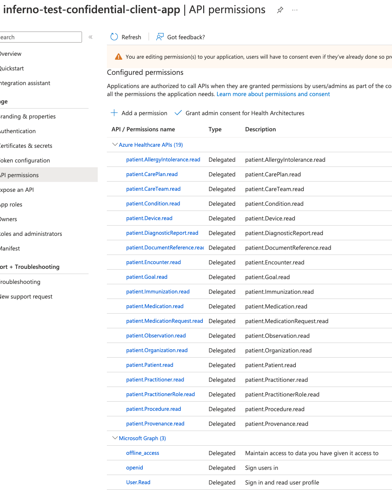

# Test Applications 

This method of setting up application registrations is applicable to real SMART on FHIR applications.

## Patient Standalone Confidential Client / Public Client Applications

The Patient Standalone Launch application is a standard confidential client application which represents an application that can protect a secret. The public client represents an application that cannot protect a secret. You will need to follow these instructions for the confidential client. 

1. If you have opted for Microsoft Entra Id, create a new application registration in the Microsoft Entra Id tenant. Otherwise, for B2C, create it in the B2C tenant. Make sure to select platform (Note : You need one application with platform - Web and SPA respectively) and add the redirect URL for Postman (`https://oauth.pstmn.io/v1/callback`).
1. In API Permissions for this new application, add the below:
    - Your FHIR Resource API (Delegated)
        - fhirUser
        - launch.patient
        - patient.AllergyIntolerance.read
        - patient.CarePlan.read
        - patient.CareTeam.read
        - patient.Condition.read
        - patient.Device.read
        - patient.DiagnosticReport.read
        - patient.DocumentReference.read
        - patient.Encounter.read
        - patient.Goal.read
        - patient.Immunization.read
        - patient.Location.read
        - patient.MedicationRequest.read
        - patient.Medication.read
        - patient.Observation.read
        - patient.Organization.read
        - patient.Patient.read
        - patient.Practitioner.read
        - patient.PractitionerRole.read
        - patient.Procedure.read
        - patient.Provenance.read
    - Microsoft Graph (Delegated)
        - openid
        - offline_access
    - Microsoft Graph (Application) - Applicable only for B2C.
        - Application.Read.All
        - DelegatedPermissionGrant.Read.All 
1. Grant admin consent for app permissions.
1. Generate a secret for this application. Save this secret and the client id for testing *1. Standalone Patient App*.

 

Click to expand and see screenshots for Microsoft Entra Id Reference.

 

Click to expand and see screenshots for B2C Reference.

