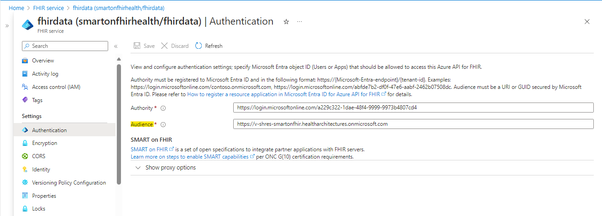

> [!TIP]
> *If you encounter any issues during configuration, deployment, or testing, please refer to the [Trouble Shooting Document](./troubleshooting.md)*

# Sample Deployment: SMART on FHIR

This document guides you through the steps needed to deploy this sample. This sample deploys Azure components, custom code, and Microsoft Entra ID or Azure AD B2C configuration.

*Note:* This sample is not automated and on average will require at least a couple of hours to deploy end to end.

## 1. Prerequisites

In order to deploy this sample, you will need to install some Azure tools, ensure the proper administrator access to an Azure subscription / tenant, and have test user accounts for impersonating the patient and practitioner personas.

Make sure you have the pre-requisites listed below
- **Installation:**
  - [Git](https://git-scm.com/) to access the files in this repository.
  - [Azure CLI Version 2.51.0 or Greater](https://learn.microsoft.com/cli/azure/install-azure-cli) to run scripts that interact with Azure.
  - [Azure Developer CLI Version 1.9.0 or Greater](https://learn.microsoft.com/azure/developer/azure-developer-cli/install-azd?tabs=baremetal%2Cwindows) to deploy the infrastructure and code for this sample.
  - [Visual Studio](https://visualstudio.microsoft.com/), [Visual Studio Code](https://code.visualstudio.com/), or another development environment (for changing configuration debugging the sample code).
  - [Node Version 18.17.1/ NPM Version 10.2.0](https://docs.npmjs.com/downloading-and-installing-node-js-and-npm) for building the frontend application and installing the US Core FHIR Profile.
  - [.NET SDK Version 8+](https://learn.microsoft.com/dotnet/core/sdk) installed (for building the sample).
  - [PowerShell Version 7 or Greater](https://learn.microsoft.com/powershell/scripting/install/installing-powershell) installed for running scripts (works for Mac and Linux too!).

- **Access:**
    The access requirements depend on the Identity Provider you choose:

    - **For Microsoft Entra ID:**
        -   Access to an Azure Subscription with Owner privileges and Microsoft Entra ID Global Administrator privileges.
        - Elevated access in Microsoft Graph and Microsoft Entra ID to create Application Registrations, assign Microsoft Entra ID roles, and add custom data to user accounts.

    -   **For Azure B2C:**
        - If an Azure AD B2C tenant has not yet been created, please use the following link to set one up.
        [Deploy an Azure AD B2C tenant by using an ARM template.](https://learn.microsoft.com/en-us/azure/healthcare-apis/fhir/azure-ad-b2c-setup?branch=main&branchFallbackFrom=pr-en-us-261649&tabs=powershell#deploy-an-azure-ad-b2c-tenant-by-using-an-arm-template)
        - Need to have admin access to an Azure B2C to create application registration, role assignments, create custom policies, create user accounts.

- **Test User Accounts:**

    To effectively test the application, you need to create two test user accounts: one for the Patient persona and another for the Provider persona. You can choose to create these user accounts in your chosen Identity Provider

    -   **For Microsoft Entra ID:**
        - Create two new test user accounts: one for the Patient persona and one for the Provider persona. Refer the [link](https://learn.microsoft.com/en-us/entra/fundamentals/how-to-create-delete-users#create-a-new-user) for steps.
        - Make sure you have the object id of both the user accounts from Microsoft Entra ID.

    -   **For Azure B2C:**
        - Create two test user accounts: one for the Patient persona and one for the Provider persona. Refer [Add a test B2C user to the Azure AD B2C tenant](https://learn.microsoft.com/en-us/azure/healthcare-apis/fhir/azure-ad-b2c-setup?branch=main&branchFallbackFrom=pr-en-us-261649&tabs=powershell#add-a-test-b2c-user-to-the-azure-ad-b2c-tenant)
        - Make sure you have the object id of both the accounts/users from Azure B2C.
  

- **Azure B2C SetUp:**
  - This setup is exclusively necessary for Smart on FHIR implementation with B2C. If you opt for Microsoft Entra ID, you can bypass this configuration.
  - Follow below mentioned steps:
    - [Create the custom user attribute in B2C tenant.](https://learn.microsoft.com/en-us/azure/healthcare-apis/fhir/azure-ad-b2c-setup?branch=main&branchFallbackFrom=pr-en-us-261649&tabs=powershell#link-a-b2c-user-with-the-fhiruser-custom-user-attribute) Refer only to the **Link a B2C user with the fhirUser custom user attribute** section.
    - Refer [Create custom user flow using custom policy](../docs/create-custom-policy.md) section to create custom user attribute.

## 2. Prepare and deploy environment

Next you will need to clone this repository and prepare your environment for deployment by creating required Azure App Registrations and configuring your environment to use them.

1. Use the terminal or your git client to clone this repo. Open a terminal to the `samples/smartonfhir` folder.
1. Login with the Azure CLI.
   - **For Microsoft Entra ID:** 
        ```
        az login --tenant <tenant-id>
        azd auth login --tenant-id <tenant-id>
        ```

   - **For Azure B2C:**
        ```
        az login --tenant <B2CTenantDomainName> --allow-no-subscriptions
        ```
1. Run `azd env new` to create a new deployment environment, keeping below points in mind.
    - Environment name must not exceed 18 characters in length.
    - Deployment fails if Environment name contains UpperCase Letters.
    - Use numbers and lower-case letters only for Environment name.
    - Environment name will be the prefix for all of your resources.
1. [Create the FHIR Resource App Registration. Use the instructions here](./ad-apps/fhir-resource-app-registration.md). Record the application id and application url for later.
1. [Create the Auth Context Frontend App Registration. Use the instructions here](./ad-apps/auth-context-frontend-app-registration.md). Record the application id and application url for later.
1. Set the deployment environment configuration as below
    - **Common configurations for all IDPs** (*Irrespective of IDP chosen*)
        ```
        azd env set ApiPublisherName "Your Name"
        azd env set ApiPublisherEmail "Your Email"
        ```
    - **For Microsoft Entra ID**
        ```
        azd env set AuthorityURL "https://login.microsoftonline.com/<Microsoft Entra ID Tenant Id>/v2.0" 
        azd env set SmartonFhirwithB2C false
        ```
    - **For Azure B2C**
        ```
        azd env set B2CTenantId <Tenant_ID_Of_B2C>
        azd env set AuthorityURL "https://<YOUR_B2C_TENANT_NAME>.b2clogin.com/<YOUR_B2C_TENANT_NAME>.onmicrosoft.com/B2C_1A_SIGNUP_SIGNIN_SMART/v2.0"
        azd env set SmartonFhirwithB2C true
        ```
1. To begin the sample deployment, you need to be logged into the appropriate tenant.

    - **For Microsoft Entra ID**: You already completed this in step 1, so you can skip this step.

    - **For Azure B2C**: Although you logged into the B2C tenant in step 1, you still need to log in to the Azure tenant using below commands. 
        ```
        az login --tenant <tenant-id>
        azd auth login --tenant-id <tenant-id>
        ```
1. Initiate the environment deployment by executing the `azd up` command. This will handle both the infrastructure provisioning and code deployment, which should take around one hour to complete.
    
    *Note*- This command requires at least `PowerShell 7`. Running it in any earlier version may result in failure.

    ```
    azd up
    ```
    *Note:- When executing the `azd up` command, you will be asked to provide several values. Below, you will find a detailed explanation of each prompt.*
    
    **Deployment Instructions**

    When running the `azd up` command, you will need to select the `subscription name` and `location` from the drop-down menus to specify where to deploy all resources. Note that this sample can only be deployed in the `EastUS2, WestUS2, or CentralUS` regions. Ensure you choose one of these regions during deployment.

    The `azd up` command will prompt you to enter values for the following parameters:   
    
    - `B2CTenantId` : 
        - Enter the Tenant ID of your B2C Tenant deployed earlier. (*If you have opted for Microsoft Entra ID you can keep this parameter blank.*)           
    
    - `enableVNetSupport`: 
     
        - This parameter accepts a boolean (true/false) value.
 
        - When set to false, the following resources are deployed with mentioned configurations. User will not be able to create private endpoints and will not be able to setup private network.
            1. API Management (APIM): Deployed in the Consumption tier.
            2. App Service Plan : Deployed in the Dynamic tier. 
            3. Static Web App: Deployed in the Free tier.
            4. Function Apps and App Service Plan: Utilizes Linux as the operating system.
        
        - When set to true, the following resources are deployed in the Standard/Premium tier to enable private endpoint creation necessary for Virtual Network Support. 
            1. API Management (APIM): Deployed in the Premium tier.
            2. App Service Plan and Static Web App: Deployed in the Standard tier.
            3. Function Apps and App Service Plan: Utilizes Windows as the operating system.
 
            *NOTE: This only allows you to create private endpoints, not set up the private network as part of the deployment. Users are responsible for setting up their own private networks. Make sure all resources are deployed under the same subscription and same resource group.*  

    - `existingResourceGroupName` : 
    
        - Choose whether to deploy the sample in an existing resource group or create a new one.
        - Leaving this parameter empty will create a new resource group named {env_name}-rg.
        - If you provide an existing resource group name, ensure it does not already contain a SMART on FHIR resources, as multiple samples in the same resource group are not supported.

            *Note:- If you plan to use an existing FHIR service or Azure API for FHIR for deployment, enter the name of the resource group where the FHIR service or Azure API for FHIR is located. The SMART on FHIR deployment must be in the same resource group as the FHIR service or Azure API for FHIR.*

    - `fhirId`: 
    
        - Decide whether to use an existing FHIR service, existing Azure API for FHIR or create a new FHIR Service.
        - Leaving this parameter empty will create a new FHIR service. To use an existing FHIR service or Azure API for FHIR, input the FHIR instance ID. Steps to retrieve the FHIR instance ID: 
            1. Navigate to your existing FHIR service or Azure API for FHIR in Azure Portal.
            2. Click on properties in the left menu.
            3. Copy the "Id" field under the "Essentials" group.  

- Some important considerations when using an existing FHIR service or Azure API for FHIR instance:
    - The FHIR server instance and SMART on FHIR resources are expected to be deployed in the same resource group, so enter the same resource group name in the `existingResourceGroupName` parameter.
    - Enable the system-assigned status in the existing FHIR service or Azure API for FHIR, Follow the below steps:
        1. Navigate to your existing FHIR Service or Azure API for FHIR.
        2. Proceed to the identity blade.
        3. Enable the status.
        4. Click on save.
        <br /><details><summary>Click to expand and see screenshots.</summary>
        
        </details>
        
    - If you are creating a new FHIR server as part of the SMART on FHIR deployment, you can skip this step. However, if you are using an existing FHIR server, you will need to complete this step:  
        The SMART on FHIR sample requires the FHIR server Audience URL to match the FHIR Resource Application Registration ID URL (which you created in Step 4 above). When you deploy the SMART on FHIR sample with a new FHIR server, the sample will automatically change the FHIR server Audience URL for you. If you use an existing FHIR server, you will need to do this step manually. 
        1. Navigate to your FHIR Resource App Registration.
        2. Proceed to the "Expose an API" blade and copy the Application ID URI. 
        3. Go to your existing FHIR Service or Azure API for FHIR.
        4. Proceed to the authentication blade. 
        5. Paste the URL into the Audience field.
    <br /><details><summary>Click to expand and see screenshots.</summary>
    
    
    </details>
> [!IMPORTANT]  
> If you are using an existing FHIR server, please note that in the above step, you needed to change the FHIR server Audience URL to the new Application Registration ID URL. If you have downstream apps that were using the previous FHIR server Audience URL, you will need to update those to point to the new URL.  

*NOTE: The deployment for Virtual Network supported environment will take approximately 60 minutes. While the deployment for Non-Virtual Network supported environment will take approximately 20 minutes. You can proceed with the setup steps outlined below once the deployment is complete. All resources will be deployed to the resource group named {env_name}-rg by default. If you provide an existing resource group name, the resources will be deployed to that group instead.*


## 3. Complete Setup of FHIR Resource and Auth Context Frontend Applications
### Assign Permissions for the Auth Custom Operation API

As part of the scope selection process, the Auth Custom Operation Azure Function modifies user permissions for the signed-in user.

- **For Microsoft Entra ID:** 
  - You will need to grant the Azure Managed Identity associated with the Azure Function appropriate permissions, such as the Application Administrator role (or similar).

    1. Open the Azure Function for SMART Auth Custom Operations from the {env_name}-rg resource group, or use the name of the existing resource group you specified. The function will have a suffix of `aad-func`. 
    1. From the left navbar open `Identity` -> `System assigned`. Copy the Object(principal) ID for the next steps.
    1. Open Microsoft Entra ID and navigate to `Roles and Administrators`. Open the `Application Administrator` role.
    1. Add the Azure Function Managed Identity to this Microsoft Entra ID role.
        <br />
        <details>
        <summary>Click to expand and see screenshots.</summary>

        
        
        
        </details>
        <br />

### Set the Auth User Input Redirect URL

1. Open the resource group named as {env_name}-rg, or with the name of the existing resource group you specified. Find the Azure API Management instance.
1. Copy the Gateway URL for the API Management instance.
1. Open your Application Registration for the Auth Context Frontend you created before deployment. 
1. The Application Registration already contains a redirect URI `http://localhost:3000` that you can use for local debugging. You should add a new redirect URI in the format `<gatewayURL>/auth/context/` as a single-page application redirect URI. Make sure to include the trailing slash.

    - For example: `https://myenv-apim.azure-api.net/auth/context/`

<br />
<details>
<summary>Click to expand and see screenshots.</summary>


</details>
<br />

*NOTE: Changes made to Application Registration in Azure B2C Tenant takes around an hour to reflect.*

## 4. Add sample data and US Core resources

To successfully run this sample using POSTMAN or with Inferno ONC (g)(10) test suite, both the US Core FHIR package and applicable data need to be loaded. 


To efficiently load the required data into your FHIR Service or Azure API for FHIR, ensure that the user account you are using to execute the script has the **FHIR Data Contributor** role assigned to the FHIR Service or Azure API for FHIR. Once confirmed, run the following script:

**For Microsoft Entra ID:**

Windows:
```powershell
powershell ./scripts/Load-ProfilesData.ps1
```

Mac/Linux:
```bash
pwsh ./scripts/Load-ProfilesData.ps1
```

**For SMART on FHIR with B2C:** 

To run the script given below, you need to pass the FHIR Server Audience parameter. To get the FHIR Server Audience, follow these steps:
- Open the resource group named as {env_name}-rg, or with the name of the existing resource group you specified. Find the FHIR Service or Azure API for FHIR instance.
- Navigate to `Settings`  -> `Authentication`.
- Copy the url value present for `Audience` field.

*Note:- Do not copy the Audience value present inside Application1.*

Windows:
```powershell
powershell ./scripts/Load-ProfilesData.ps1 -FhirAudience "<FHIR Server Audience>"
```

Mac/Linux:
```bash
pwsh ./scripts/Load-ProfilesData.ps1 -FhirAudience "<FHIR Server Audience>"
```

To learn more about the sample data, read [sample data](./sample-data.md).

## 5. Mapping test users

**Add `fhirUser` Claim to Test Users:**

-  To properly integrate with the sample data, you need to add the fhirUser claim to each of your test user accounts:
   - For the patient test user, set the `fhirUser` claim to `<Complete Fhir Url without /metadata>/Patient/PatientA`.
   - For the practitioner test user, set the `fhirUser` claim to `<Complete Fhir Url without /metadata>/Practitioner/PractitionerC1`.

   Modifying Microsoft Graph directory extensions requires API requests to Microsoft Graph. Use the command below to set the `fhirUser` claim via a helper script for your patient test user. You will need the `object id` of your patient test user. In a production environment, integrate this step into your user registration process.

    *Note - If you have chosen Smart on FHIR with B2C, log in to your B2C tenant before running the script. Refer to step [2.2](#2-prepare-and-deploy-environment) for instructions on logging into your B2C tenant.*

    Create a Microsoft Graph Directory Extension to hold the `fhirUser` information for users.
    
    Windows:
    ```powershell
    powershell ./scripts/Add-FhirUserInfoToUser.ps1 -ApplicationId "<If you opted for B2C pass B2C_EXTENSION_APP_ID otherwise for Microsoft Entra ID pass Fhir Resource Application Id>" -UserObjectId "<Patient Object Id>" -FhirUserValue "<Complete Fhir Url without /metadata>/Patient/PatientA"
    ```

    Mac/Linux:
    ```bash
    pwsh ./scripts/Add-FhirUserInfoToUser.ps1 -ApplicationId "<If you opted for B2C pass B2C_EXTENSION_APP_ID otherwise for Microsoft Entra ID pass Fhir Resource Application Id>" -UserObjectId "<Patient Object Id>" -FhirUserValue "<Complete Fhir Url without /metadata>/Patient/PatientA"
    ```
    
**Assign `FHIR SMART User` Role:**

- If you have opted for Microsoft Entra ID, then make sure your test user has the role `FHIR SMART User` assigned to your FHIR Service or Azure API for FHIR deployed as part of this sample.
- This role is necessary for enabling the SMART scope logic with your access token scopes in the FHIR Service or Azure API for FHIR.

## 6. Use Postman to access FHIR resource via SMART on FHIR sample

Follow the directions on the [Access SMART on FHIR Using Postman Page](./postman/configure-postman.md) for instructions to access FHIR resources via SMART on FHIR using postman.

## 7. Identity Provider Configuration

**For SMART on FHIR with B2C:** 

To set up SMART on FHIR with B2C, you need to provide the Application Registration details from the B2C tenant. Specifically, you will need to provide the Application Registration ID and Secret. This allows Third Party IDP Support for FHIR Service as well as resources deployed in the Azure AD tenant to access and interact with the Application Registration created in the B2C tenant. Note that resources in the Azure AD tenant cannot directly access the B2C Application Registration without these details.

- Configure Identity Provider:
    1. Open the FHIR Service from the {env_name}-rg resource group, or with the name of the existing resource group you specified.
    1. Select `Settings` -> `Authentication`
    1. In `Identity Provider 1`, within `Application 1`, enter the Client ID from the Application Registration into the `Client ID` field.
    1. Click Save.

    *Note: It would take around 10 minutes to update*
    <details>
    <summary>Click to expand and see screenshots for Reference.</summary>
    
    
    </details>
    <br />
- Create Secrets in KeyVault:
    1. Open the KeyVault from the {env_name}-rg resource group, or with the name of the existing resource group you specified. The Key Vault will have a suffix of `kv`.
    1. Add a new secret to store Client ID and Client Secret of Application Registration.
        - Name: `ExternalAppClientID`
        - Secret: Client ID of Application Registration added earlier in the FHIR Service Authentication.
        - Name: `ExternalAppClientSecret`
        - Secret: Secret generated for this App Registration.
    
    *Note: If the secrets already exist then create a new version of the secret.*

**[Back to Previous Page](../README.md)**